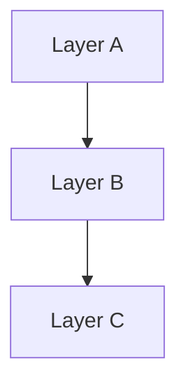

# Create PR Skill

## Instructions

### Step 1: Gather Context

1. Run `git log main..HEAD --oneline` to see all commits on the current branch.
2. Run `git diff main...HEAD --stat` to see which files changed.
3. Run `git diff main...HEAD` to read the full diff.
4. Identify the **conventional commit type** from the changes:
   - `feat` — new feature or capability
   - `fix` — bug fix
   - `refactor` — restructuring without behavior change
   - `chore` — tooling, deps, config
   - `docs` — documentation only
   - `test` — test additions or changes
5. Identify the **scope** — the primary architectural layer or package affected (e.g., `sql-runtime`, `postgres-adapter`, `contract`, `framework`, `cli`, `sql-lane`).

### Step 2: Ask for Linear Ticket

Ask the user for the Linear ticket URL (e.g., `https://linear.app/prisma-company/issue/TML-1859/pn-add-more-parameterized-types`).

Extract from the URL:
- `$TICKET_ID` — the ticket identifier (e.g., `TML-1859`)
- `$SLUG` — the trailing slug (e.g., `pn-add-more-parameterized-types`)

### Step 3: Compose the PR Title

Use conventional commits format:

```
type(scope): concise lowercase description
```

Rules:
- Keep under 60 characters total.
- Lowercase after the colon.
- No period at the end.
- Must clearly convey what changed.

Examples:
- `feat(sql-runtime): add text codec support`
- `fix(postgres-adapter): handle null in jsonb columns`
- `refactor(contract): split emission into two phases`

### Step 4: Compose the PR Description

Follow this structure exactly:

```markdown
This PR:
- closes [$TICKET_ID](https://linear.app/prisma-company/issue/$TICKET_ID/$SLUG)
- bullet point 2
- bullet point 3
- bullet point 4
- ...up to 8 bullets max

## Contract: Before vs After

**Before:**
```ts
// relevant contract builder snippet from main
```

**After:**
```ts
// relevant contract builder snippet from this branch
```

## DDL SQL: Before vs After <!-- optional -->

**Before:**
```sql
-- relevant SQL output from main
```

**After:**
```sql
-- relevant SQL output from this branch
```

## Architecture <!-- optional -->



- Brief bullet explaining the diagram
- Another bullet if needed
```

Section rules:
- **Bullet points**: 4–8 bullets. Be concise. Only elaborate on implementation when complexity warrants it.
- **Contract: Before vs After**: Always include. Show the most relevant TypeScript contract builder change. Pick the snippet that best illustrates the PR's impact.
- **DDL SQL: Before vs After**: Only include if SQL generation is affected by this PR. Omit entirely otherwise.
- **Architecture**: Only include for PRs that introduce new layers or refactor existing ones. Use a Mermaid diagram with minimal bullet-point commentary.

### Step 5: Confirm and Create

1. Present the full title and description to the user for review.
2. After approval, ensure the branch is pushed to remote (`git push -u origin HEAD` if needed).
3. Create the PR:

```bash
gh pr create --title "the title" --body "$(cat <<'EOF'
the body
EOF
)"
```

4. Return the PR URL.

## Don't Do

1. Don't include diff stats or file lists in the description — the bullet points cover the "what".
2. Don't add `## Test plan` or other sections not specified above.
3. Don't use uppercase after the colon in the title.
4. Don't create the PR without showing the user the title and description first.
5. Don't guess the Linear ticket number — always ask.
