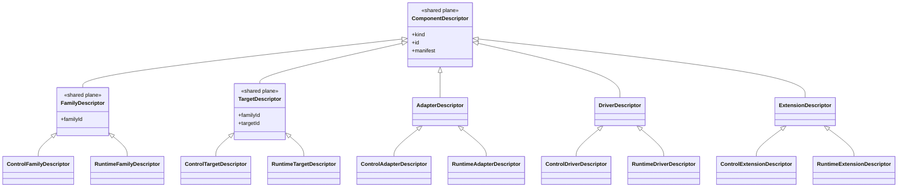

# Unify Descriptor Type Hierarchy

## Current State

Both control-plane and runtime-plane have parallel descriptor hierarchies with significant duplication:

```mermaid
classDiagram
    direction LR

    subgraph control ["Control Plane"]
        ControlFamilyDescriptor
        ControlTargetDescriptor
        ControlAdapterDescriptor
        ControlDriverDescriptor
        ControlExtensionDescriptor
    end

    subgraph runtime ["Runtime Plane"]
        RuntimeFamilyDescriptor
        RuntimeTargetDescriptor
        RuntimeAdapterDescriptor
        RuntimeDriverDescriptor
        RuntimeExtensionDescriptor
    end
```

These share common properties: `kind`, `id`, `manifest`, `familyId`, `targetId`.

## Target State

Extract a shared **component descriptor model** to the shared plane and have plane-specific descriptors extend it.Key principles:

- **Component ≠ delivery mechanism**: We use “component” terminology (family/target/adapter/driver/extension), not “pack”.
- **`kind` is extensible**: `kind` is `string`-extensible (no closed union of kinds). Built-in descriptors use literal `kind` values (`'family'`, `'target'`, ...) but we do not prevent adding new kinds later.
- **Compatibility is type-enforced**: target-bound descriptors are generic in both `TFamilyId` and `TTargetId`, and the type system should reject mis-wiring (e.g. Postgres adapter with MySQL target) by requiring matching `familyId`/`targetId` generics across composed descriptors.
- **No shared instance base**: this refactor only unifies descriptor interfaces; instance interfaces stay plane-specific.
- **Dedicated entrypoint**: expose the shared model via its own `@prisma-next/contract/*` entrypoint to make future extraction easy.



## Implementation

### 1. Add shared descriptor interfaces (shared plane, dedicated module)

Create a dedicated shared-plane module in the contract package (exact filename is flexible, but it must have its own entrypoint export):

- `packages/1-framework/1-core/shared/contract/src/framework-components.ts`
- and a corresponding exports file: `packages/1-framework/1-core/shared/contract/src/exports/framework-components.ts`

The new module defines the shared component descriptor bases (no “pack” terminology), and references the existing `ExtensionPackManifest` type (do **not** import from a non-existent `./extension-pack-manifest` module).

```typescript
/** Base descriptor for any framework component descriptor */
export interface ComponentDescriptor<Kind extends string> {
  readonly kind: Kind;
  readonly id: string;
  readonly manifest: ExtensionPackManifest;
}

export interface FamilyDescriptor<TFamilyId extends string> extends ComponentDescriptor<'family'> {
  readonly familyId: TFamilyId;
}

export interface TargetDescriptor<TFamilyId extends string, TTargetId extends string>
  extends ComponentDescriptor<'target'> {
  readonly familyId: TFamilyId;
  readonly targetId: TTargetId;
}

export interface AdapterDescriptor<TFamilyId extends string, TTargetId extends string>
  extends ComponentDescriptor<'adapter'> {
  readonly familyId: TFamilyId;
  readonly targetId: TTargetId;
}

export interface DriverDescriptor<TFamilyId extends string, TTargetId extends string>
  extends ComponentDescriptor<'driver'> {
  readonly familyId: TFamilyId;
  readonly targetId: TTargetId;
}

export interface ExtensionDescriptor<TFamilyId extends string, TTargetId extends string>
  extends ComponentDescriptor<'extension'> {
  readonly familyId: TFamilyId;
  readonly targetId: TTargetId;
}
```

Notes:

- The plan intentionally avoids adding default generic parameters like `= string` unless we have a real usage that benefits from them.
- We keep `kind` extensible by using `Kind extends string` (no closed union of kinds).

### 2. Add a dedicated entrypoint inside `@prisma-next/contract` (`framework-components`)

Add a new `@prisma-next/contract/*` export so downstream packages import the shared component descriptor model through a stable entrypoint (future package extraction becomes “change one import base”).Update:

- `packages/1-framework/1-core/shared/contract/src/exports/framework-components.ts` (re-export types from the new module)
- `packages/1-framework/1-core/shared/contract/tsup.config.ts` (add entry)
- `packages/1-framework/1-core/shared/contract/package.json` (add `exports` mapping)

Entrypoint name:

- `@prisma-next/contract/framework-components`

### 3. Update control-plane descriptors

Update [`packages/1-framework/1-core/migration/control-plane/src/types.ts`](packages/1-framework/1-core/migration/control-plane/src/types.ts):

- `ControlFamilyDescriptor` extends `FamilyDescriptor`
- `ControlTargetDescriptor` extends `TargetDescriptor<TFamilyId, TTargetId>`
- `ControlAdapterDescriptor` extends `AdapterDescriptor<TFamilyId, TTargetId>`
- `ControlDriverDescriptor` extends `DriverDescriptor<TFamilyId, TTargetId>`
- `ControlExtensionDescriptor` extends `ExtensionDescriptor<TFamilyId, TTargetId>`

Remove duplicated properties (`kind`, `id`, `manifest`, `familyId`, `targetId`) that are now inherited.Keep control-plane-specific parts in control-plane interfaces:

- `ControlFamilyDescriptor.hook`
- `ControlTargetDescriptor.migrations?`
- control-plane `create()` signatures

### 4. Update runtime-plane descriptors

Update [`packages/1-framework/1-core/runtime/execution-plane/src/types.ts`](packages/1-framework/1-core/runtime/execution-plane/src/types.ts):

- `RuntimeFamilyDescriptor` extends `FamilyDescriptor`
- `RuntimeTargetDescriptor` extends `TargetDescriptor<TFamilyId, TTargetId>`
- `RuntimeAdapterDescriptor` extends `AdapterDescriptor<TFamilyId, TTargetId>`
- `RuntimeDriverDescriptor` extends `DriverDescriptor<TFamilyId, TTargetId>`
- `RuntimeExtensionDescriptor` extends `ExtensionDescriptor<TFamilyId, TTargetId>`

Remove duplicated properties (`kind`, `id`, `manifest`, `familyId`, `targetId`) that are now inherited.Keep runtime-plane-specific parts in runtime-plane interfaces:

- runtime-plane driver factory signature (`create(options: unknown): ...`)
- runtime-plane `create()` signatures generally