# Architecture

> For a quick overview of what Prisma Next is, see the [README](./README.md).

## Motivation

Prisma's current ORM architecture tightly couples three layers — the Prisma Schema Language (PSL), the generated client, and runtime execution. This coupling introduces rigidity, rebuild cost, and conceptual opacity.

Prisma Next rethinks Prisma's data layer around a **contract-first model**, where the schema is a stable, versioned artifact describing the database structure — not fuel for codegen, but a data contract.

## Contract-First Design

### IR + Types Replace the Client as Source of Truth

- Deterministic JSON contract plus TypeScript types replace heavy runtime codegen
- Open, inspectable artifacts; no opaque generated methods
- Contract includes a `contractHash` to cryptographically tie all artifacts to a specific schema version

### Composable DSL Instead of Generated Client

- Write queries inline with a minimal DSL (`sql().from(...).select(...)`)
- Plans are verifiable and transparent; no hidden multi-query behaviors
- Only PSL to IR to types emission happens at build time — query compilation happens at runtime

### Machine-Readable by Design

- Contract JSON is consumable by tools and agents
- Hashes enable verification and drift detection
- Structured Plans include AST, referenced columns, and contract hash

### Extensible Plugin Framework

- First-class hook system for Plan lifecycle events (`beforeCompile`, `afterExecute`, `onError`)
- Composable linting, telemetry, query budgets, and policy enforcement
- Extension packs for domain-specific capabilities (vector search, geospatial, etc.)

## Architecture Model: Domains, Layers, Planes

Prisma Next organizes packages using a three-dimensional architecture.

### Domains

| Domain | Description | Location |
|--------|-------------|----------|
| Framework | Target-agnostic core (contracts, operations, runtime-executor) | `packages/framework/` |
| SQL Family | SQL-specific implementations (operations, lanes, runtime) | `packages/sql/` |
| Targets | Concrete adapters and drivers (postgres-adapter, postgres-driver) | `packages/targets/` |
| Extensions | Optional capability packs (pgvector) | `packages/extensions/` |

### Layers

Dependencies flow downward (toward core); lateral dependencies within the same layer are permitted:

```
Core → Authoring → Targets → Lanes → Runtime Core → Family Runtime → Adapters
```



```mermaid
graph LR
  Core[Core] --> Authoring
  Authoring --> Targets
  Targets --> Lanes
  Lanes --> RuntimeCore[Runtime Core]
  RuntimeCore --> FamilyRuntime[Family Runtime]
  FamilyRuntime --> Adapters

  style Core fill:#e1f5ff,stroke:#01579b,stroke-width:2px
  style Authoring fill:#f3e5f5,stroke:#4a148c,stroke-width:2px
  style Targets fill:#fff3e0,stroke:#e65100,stroke-width:2px
  style Lanes fill:#e8f5e9,stroke:#1b5e20,stroke-width:2px
  style RuntimeCore fill:#fce4ec,stroke:#880e4f,stroke-width:2px
  style FamilyRuntime fill:#fff9c4,stroke:#f57f17,stroke-width:2px
  style Adapters fill:#e0f2f1,stroke:#004d40,stroke-width:2px
```

### Planes

- **Shared**: Code usable by both migration and runtime
- **Migration**: Build-time authoring, emission, and planning (CLI, emitter, control plane)
- **Runtime**: Execution-time query building and execution (DSL, executor, adapters)

See [`architecture.config.json`](./architecture.config.json) for the complete domain/layer/plane mappings and `pnpm lint:deps` to validate boundaries.

## Package Organization

### Framework Domain (Target-Agnostic)

- **`@prisma-next/contract`** — Core contract types (`ContractBase`, `Source`)
- **`@prisma-next/plan`** — Plan helpers, diagnostics, and shared errors
- **`@prisma-next/operations`** — Target-neutral operation registry and capability helpers
- **`@prisma-next/contract-authoring`** — TS builders, canonicalization, schema DSL
- **`@prisma-next/cli`** — CLI tooling for contract emission
- **`@prisma-next/emitter`** — Contract emission engine
- **`@prisma-next/runtime-executor`** — Target-agnostic execution engine (verification, plugin lifecycle, telemetry)

### SQL Family Domain

- **`@prisma-next/sql-contract-ts`** — SQL-specific TypeScript contract authoring surface
- **`@prisma-next/sql-contract`** — SQL-specific contract types (`SqlContract`, `SqlStorage`, `SqlMappings`)
- **`@prisma-next/sql-operations`** — SQL-specific operation definitions and assembly
- **`@prisma-next/sql-contract-emitter`** — SQL emitter hook implementation
- **`@prisma-next/sql-relational-core`** — Schema and column builders, operation attachment, and AST types
- **`@prisma-next/sql-lane`** — Relational DSL and raw SQL helpers
- **`@prisma-next/sql-lane-query-builder`** — Query builder lane
- **`@prisma-next/sql-runtime`** — SQL family runtime that composes runtime-executor with SQL adapters
- **`@prisma-next/adapter-postgres`** — Postgres adapter implementation
- **`@prisma-next/driver-postgres`** — Postgres driver (low-level connection)

### Targets

- **`@prisma-next/postgres`** — Postgres target package (one-liner client entry point)

### Extensions

- **`@prisma-next/pgvector`** — pgvector extension pack for vector similarity search

## Agent-Accessible Design

Modern developer agents (Cursor, Windsurf, Claude Code) increasingly read, reason about, and modify codebases. Prisma Next is designed to be natively accessible to these tools:

1. **PSL as explicit contract** — The IR is a deterministic JSON artifact: machine-readable, diffable, and stable
2. **Stable query DSL** — Queries are typed, composable ASTs that agents can statically analyze or synthesize
3. **Runtime integration surface** — Structured hooks around compile/execute events for verification, profiling, and policy enforcement
4. **Structured plans** — Every query results in a Plan object with AST, referenced columns, and contract hash

Agents can read the schema (IR), generate valid queries (DSL), and verify them (runtime) — all through open, structured artifacts with no black-box client to reverse engineer.

## Comparison with Prisma ORM

| Feature | Prisma ORM | Prisma Next |
|---------|------------|-------------|
| Schema Model | Codegen for runtime client | Contract IR + TypeScript types |
| Code Generation | Heavy, runtime-bound | Minimal, build-time only |
| Query Interface | Generated methods | Composable DSL |
| Machine Readability | Opaque client code | Structured IR JSON |
| Verification | None | Contract hash + runtime checks |
| Extensibility | Monolithic client | Plugin and hook system |
| Migration Logic | Sequential scripts | Contract-based, deterministic |

### Workflow Comparison

**Prisma ORM:**
1. Write `schema.prisma`
2. Run `prisma generate` — generates executable client code
3. Write application code using generated methods: `prisma.user.findMany()`

**Prisma Next:**
1. Write `schema.psl`
2. Run `prisma-next contract emit` — generates lightweight types + contract JSON
3. Write application code using composable DSL: `sql().from(t.user).select(...)`

## Deep Dives

- [Architecture Overview](./docs/Architecture%20Overview.md) — High-level design principles
- [Package Layering Guide](./docs/architecture%20docs/Package-Layering.md) — Layer details and dependencies
- [ADR Index](./docs/architecture%20docs/ADR-INDEX.md) — Architecture Decision Records (140+)
- [Subsystem Specifications](./docs/architecture%20docs/subsystems/) — Detailed design docs for major components
