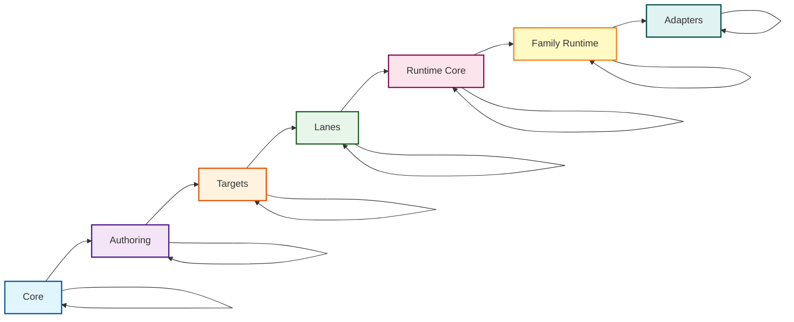

# Prisma Next Prototype

A TypeScript-based prototype demonstrating a **contract-first data layer** architecture that decomposes Prisma's ORM into modular, verifiable components.

## What Is This?

Prisma Next is a prototype of a new data access layer that replaces traditional ORMs with a "contract-first" approach. It follows a similar workflow to Prisma ORM but with key differences:

- **Defines your database schema as a verifiable contract** (not just a schema)
- **Generates lightweight types instead of heavy client code**
- **Uses a composable DSL for queries instead of generated methods**
- **Supports extension packs for domain-specific capabilities** (vector search, geospatial, etc.)
- **Works seamlessly with AI coding assistants** (machine-readable, composable APIs)

**Think of it as**: "An ORM designed for agentic workflows: with guardrails and verifications, tight feedback loops and simple, deterministic operations."

## Quick Demo

```bash
# 1. Clone and install
git clone <repo>
cd prisma-next
pnpm install && pnpm build

# 2. Start database (or however you start a local postgres DB)
docker run --name postgres -e POSTGRES_PASSWORD=postgres -p 5432:5432 -d postgres:15

# 3. Run the complete demo
cd examples/todo-app
pnpm demo  # This does everything: generate, migrate, test
```

What you'll see: Type-safe queries, contract verification, and the migration system in action.

## Why This Matters

### 1. IR + Types Replace the Client as Source of Truth
- Deterministic JSON contract plus TypeScript types replace heavy runtime codegen
- Open, inspectable artifacts; no opaque generated methods

### 2. Machine‑Readable by Design
- Contract JSON is consumable by tools/agents
- Hashes enable verification and drift detection

### 3. Composable DSL Instead of Generated Client
- Write queries inline with a minimal DSL (`sql().from(...).select(...)`)
- Plans are verifiable and transparent; no hidden multi‑query behaviors

### 4. Future‑Oriented Architecture
- Extension packs, capability gating, and plugin guardrails
- Safer migrations and runtime checks built on the contract

## Motivation

Prisma's current ORM architecture tightly couples three layers — the Prisma Schema Language (PSL), the generated client, and runtime execution. This coupling introduces rigidity, rebuild cost, and conceptual opacity.

The prototype rethinks Prisma's data layer around a **contract-first model**, where the schema is a stable, versioned artifact describing the database structure — not fuel for codegen, but a data contract.

## Agent-Accessible Design

Modern developer agents (Cursor, Windsurf, v0.dev) increasingly read, reason about, and modify codebases. For a data access layer to be truly idiomatic in this environment, it must be:

- **Machine-navigable**: Understandable through static analysis without executing code
- **Composable**: Usable as an API surface agents can call directly or generate code against
- **Predictable**: Deterministic output with no hidden side effects or black-box codegen

The existing Prisma ORM is opaque to agents because schema → client codegen hides SQL semantics and many behaviors are runtime-generated.

This prototype addresses these shortcomings:

1. **PSL as explicit contract**: The IR is a deterministic JSON artifact — machine-readable, diffable, and stable
2. **Stable query DSL**: Queries are typed, composable ASTs that agents can statically analyze or synthesize
3. **Runtime integration surface**: Structured hooks around compile/execute events for verification, profiling, and policy enforcement
4. **Structured plans**: Every query results in a Plan object with AST, referenced columns, and contract hash

Agents can read the schema (IR), generate valid queries (DSL), and verify them (runtime) — all through open, structured artifacts with no black-box client to reverse engineer.

## Core Goals

### 1. Contract-First Architecture
- PSL defines a verifiable data contract, not just a schema
- IR includes `contractHash` to cryptographically tie all artifacts to a specific schema version
- Single source of truth for query validation, policy enforcement, and compatibility

### 2. Composable Query Layer
- Replace monolithic generated client with runtime-compiled query DSL (`@prisma/sql`)
- Queries written inline in TypeScript, compiled to SQL ASTs at runtime
- Dialect-agnostic design supports multiple targets (Postgres, MySQL, SQLite) without regeneration

### 3. Modular Package Architecture
- `@prisma/relational-ir`: Schema contract definition and validation
- `@prisma/sql`: Query builder and SQL compiler
- `@prisma/runtime`: Execution engine with plugin hooks
- Each package evolves independently and composes cleanly

### 4. Runtime Query Compilation
- Only PSL → IR → Types emission happens at build time
- Query compilation at runtime enables interactive development without client regeneration
- Verifiable Plans include metadata: referenced tables, columns, dialect, and contract hash

### 5. Extensible Plugin Framework
- First-class hook system for Plan lifecycle events (`beforeCompile`, `afterExecute`, `onError`)
- Composable linting, telemetry, query budgets, and policy enforcement
- No entanglement with core runtime logic

### 6. Type-Safe Query Shapes
- Result types derived from schema IR and explicit `select()` projection
- Correct nullability handling for left joins and nullable relations
- Type system ensures queries are both safe and accurate


## Architectural Design in docs/

The `docs/` directory contains the complete architectural design for Prisma Next. Use it to understand the long‑term model (data contract, plan model, runtime plugin framework, adapters, packs, migration plane).

This repository implements a proof‑of‑concept; some details differ from the full design:

- Hashing: the prototype uses a single `contractHash`. In the design, this corresponds to `coreHash`; `profileHash` (capability pinning) is not implemented here.
- CLI: use `pnpm exec prisma-next generate schema.psl -o .prisma`. Some design docs reference different CLI verbs.
- Scope: migrations and ORM features are minimal in the prototype; the design includes richer planner/runner and extension packs.

Start with the [Architecture Overview](./docs/Architecture%20Overview.md) for a description of the design's goals and subsystems involved.

## Side‑by‑Side Comparison

| Feature | Prisma ORM | Prisma Next | Why It Matters |
|----------|-------------|------------|----------------|
| Schema Model | Codegen for runtime client | Contract IR + TypeScript types | Verifiable, inspectable schema |
| Code Generation | Heavy, runtime-bound | Minimal, build-time only | Faster iterations |
| Query Interface | Generated methods | Composable DSL | Transparent, flexible |
| Machine Readability | Opaque client code | Structured IR JSON | Tool/agent-friendly |
| Verification | None | Contract hash + runtime checks | Drift detection |
| Extensibility | Monolithic client | Plugin and hook system | Guardrails and budgets |
| Migration Logic | Sequential scripts | Contract-based, deterministic | Reproducible |

## Workflow Comparison

**Prisma ORM Workflow:**
1. Write `schema.prisma`
2. Run `prisma generate` → generates executable client code
3. Write application code using generated methods: `prisma.user.findMany()`

**Prisma Next Workflow:**
1. Write `schema.psl`
2. Run `prisma-next emit` → generates lightweight types + contract
  - Not prototyped here but this will be replaced by a Vite plugin or equivalent
3. Write application code using composable DSL: `sql().from(t.user).select(...)`

Key difference: Prisma Next emits types and a contract rather than generating an executable client.

## Clean Architecture Layers

Prisma Next follows Clean Architecture principles, organizing packages by **Domains → Layers → Planes**:

- **Domains**: Framework (target-agnostic) vs target families (SQL, document, etc.)
- **Layers**: Core → Authoring → Targets → Lanes → Runtime Core → Family Runtime → Adapters
- **Planes**: Migration (authoring, tooling, targets) vs Runtime (lanes, runtime, adapters)

### Layer Structure

Dependencies flow downward (toward core); lateral dependencies within the same layer are permitted:

```
Core → Authoring → Targets → Lanes → Runtime Core → Family Runtime → Adapters
         (lateral deps allowed within each layer)
```

### Layer Diagram



For detailed information about package layering, see:
- [ADR 140 - Package Layering & Target-Family Namespacing](docs/architecture%20docs/adrs/ADR%20140%20-%20Package%20Layering%20&%20Target-Family%20Namespacing.md)
- [Package Layering Guide](docs/architecture%20docs/Package-Layering.md)

## Packages

### Framework Domain (Target-Agnostic)

- **`@prisma-next/contract`** - Core contract types (`ContractBase`, `Source`)
- **`@prisma-next/plan`** - Plan helpers, diagnostics, and shared errors
- **`@prisma-next/operations`** - Target-neutral operation registry and capability helpers
- **`@prisma-next/contract-authoring`** - TS builders, canonicalization, schema DSL
- **`@prisma-next/cli`** - CLI tooling for contract emission
- **`@prisma-next/emitter`** - Contract emission engine
- **`@prisma-next/runtime-core`** - Target-agnostic runtime kernel (verification, plugin lifecycle, telemetry)

### SQL Target Family Domain

- **`@prisma-next/sql-contract-ts`** - SQL-specific TypeScript contract authoring surface
- **`@prisma-next/sql-contract-types`** - SQL-specific contract types (`SqlContract`, `SqlStorage`, `SqlMappings`)
- **`@prisma-next/sql-operations`** - SQL-specific operation definitions and assembly
- **`@prisma-next/sql-contract-emitter`** - SQL emitter hook implementation
- **`@prisma-next/sql-relational-core`** - Schema and column builders, operation attachment, and AST types
- **`@prisma-next/sql-lane`** - Relational DSL and raw SQL helpers
- **`@prisma-next/sql-orm-lane`** - ORM builder that compiles model-based queries to SQL lane primitives
- **`@prisma-next/sql-runtime`** - SQL family runtime that composes runtime-core with SQL adapters
- **`@prisma-next/adapter-postgres`** - Postgres adapter implementation
- **`@prisma-next/driver-postgres`** - Postgres driver (low-level connection)

### Test Packages (located in `test/` directory)

- **`@prisma-next/integration-tests`** - Integration tests that verify end-to-end flows across packages (located at `test/integration/`)
- **`@prisma-next/e2e-tests`** - End-to-end tests using the CLI to emit contracts and execute queries against a real database (located at `test/e2e/framework/`)
- **`@prisma-next/test-utils`** - Shared test utilities for all test suites (located at `test/utils/`)

## Quick Start

**First time here?** Start with the Quick Demo above, then explore the example app.

### Prerequisites
- Node.js >= 20
- pnpm 9.x
- PostgreSQL (for running the example)

### Installation & Setup

```bash
# Install dependencies and build
pnpm install && pnpm build

# Start PostgreSQL (Docker)
docker run --name postgres -e POSTGRES_PASSWORD=postgres -p 5432:5432 -d postgres:15

# Create database table
psql -h localhost -U postgres -c "CREATE TABLE \"user\" (id SERIAL PRIMARY KEY, email VARCHAR(255) UNIQUE NOT NULL, active BOOLEAN DEFAULT true, \"createdAt\" TIMESTAMP DEFAULT NOW());"

# Run the example
cd examples/todo-app
pnpm generate && pnpm start
```

## Common Commands

### All Packages

**Tests:**
- `pnpm test` - Run all tests via Turbo
- `pnpm test:all` - Run all test suites explicitly (packages → examples → integration → e2e)
- `pnpm test:packages` - Test only source packages (excludes examples and test suites)
- `pnpm test:examples` - Test only example apps
- `pnpm test:integration` - Test only integration tests
- `pnpm test:e2e` - Test only e2e tests
- `pnpm test:coverage` - Run tests with coverage
- `pnpm coverage:packages` - Coverage for packages only (excludes examples and test suites)

**Type Checking:**
- `pnpm typecheck` - Type check all packages
- `pnpm typecheck:packages` - Type check packages only
- `pnpm typecheck:examples` - Type check examples only
- `pnpm typecheck:all` - Alias for typecheck (includes examples)

**Linting:**
- `pnpm lint` - Lint all packages
- `pnpm lint:packages` - Lint packages only
- `pnpm lint:examples` - Lint examples only
- `pnpm lint:all` - Alias for lint

**Build:**
- `pnpm build` - Build all packages

### Specific Package

Run commands for a specific package using pnpm's filter:

- `pnpm --filter <package-name> test` - Test specific package
- `pnpm --filter <package-name> test:coverage` - Run tests with coverage for specific package
- `pnpm --filter <package-name> typecheck` - Typecheck specific package
- `pnpm --filter <package-name> lint` - Lint specific package

**Examples:**
```bash
pnpm --filter @prisma-next/sql-query test
pnpm --filter @prisma-next/sql-query test:coverage
pnpm --filter @prisma-next/sql-query typecheck
pnpm --filter @prisma-next/sql-query lint
```

## Usage Example

### 1. Define Schema (schema.psl)

```prisma
model User {
  id        Int        @id @default(autoincrement())
  email     String     @unique
  active    Boolean    @default(true)
  createdAt DateTime   @default(now())
}
```

### 2. Generate Contract and Types

```bash
# Using CLI (prototype)
pnpm exec prisma-next generate schema.psl -o .prisma

# Or programmatically (prototype)
import { parse } from '@prisma/psl';
import { emitContractAndTypes } from '@prisma/schema-emitter';

const ast = parse(pslContent);
const { contract, contractTypes } = await emitContractAndTypes(ast);
```

### 3. Build Type-Safe Queries

```typescript
import { sql, makeT } from '@prisma/sql';
import { createRuntime } from '@prisma/runtime';
import contract from './.prisma/contract.json' assert { type: 'json' };

// Create runtime with contract verification
const runtime = createRuntime({
  ir: contract,
  driver: postgresDriver,
  verify: 'onFirstUse'
});

// Type-safe query with Column objects
const t = makeT(contract);

const query = sql()
  .from('user')
  .where(t.user.active.eq(true))
  .select({ id: t.user.id, email: t.user.email });

// Return type is inferred as Array<{ id: number; email: string }>
const results = await runtime.execute(query);
```

### 4. Runtime Plugin System

```typescript
import { lint } from '@prisma/runtime/plugins';

// Add guardrails as composable plugins
const runtime = createRuntime({
  ir: contract,
  driver: postgresDriver,
  plugins: [
    lint({
      rules: {
        'no-select-star': 'error',
        'mutation-requires-where': 'error',
        'no-missing-limit': 'warn'
      }
    })
  ]
});
```

## Type Safety Features

### Column-Based API

The query builder uses Column objects that provide type-safe field access and automatic type inference:

```typescript
// Type-safe field access: t.user.id has type Column<number>
// Type-safe expressions: t.user.active.eq(true) returns Expression<boolean>
// Automatic type inference: Select results are typed based on Column types

const activeUsers = sql()
  .from('user')
  .where(t.user.active.eq(true))
  .select({ id: t.user.id, email: t.user.email });
// Returns: Array<{ id: number; email: string }>
```

### Generated Artifacts

The schema emitter generates:

```typescript
// Generated contract.d.ts
export interface User {
  id: number;
  email: string;
  active?: boolean;
  createdAt?: Date;
}

export const t: Tables = {
  user: {
    id: { table: 'user', name: 'id', eq: (value: number) => ... },
    email: { table: 'user', name: 'email', eq: (value: string) => ... },
    // ... other fields
  }
};
```

```json
// Generated contract.json
{
  "version": 3,
  "target": "postgres",
  "contractHash": "sha256:abc123...",
  "tables": {
    "user": {
      "columns": {
        "id": { "type": "int4", "pk": true },
        "email": { "type": "text", "unique": true },
        "active": { "type": "bool", "default": true },
        "createdAt": { "type": "timestamp", "default": "now()" }
      }
    }
  }
}
```

## Testing

```bash
# Test all packages
pnpm test

# Test specific package
cd packages/sql && pnpm test

# Example app utilities
cd examples/todo-app && pnpm test-planner
# Or run the end-to-end demo
cd examples/todo-app && pnpm demo
```

## Troubleshooting

### Build Errors
```bash
# Clean and rebuild
rm -rf node_modules packages/*/node_modules
pnpm install
pnpm build
```

### Migration Issues
```bash
# Reset everything and start fresh
cd examples/todo-app
pnpm reset-db
pnpm migrate
```

### Type Errors
```bash
# Regenerate types
cd examples/todo-app
pnpm generate
pnpm typecheck
```

Integration tests spin up PostgreSQL, create tables, execute type-safe queries, and verify return types and error handling.

## CI/CD

The repository uses GitHub Actions for continuous integration. The workflow runs on every push and pull request and includes:

- **Type checking** - TypeScript type checking for all packages and examples
- **Linting** - ESLint validation for all packages and examples
- **Build** - Builds all packages
- **Tests** - Runs unit and integration tests (requires Postgres)
- **E2E Tests** - Runs end-to-end tests (requires Postgres)
- **Coverage** - Generates and reports test coverage (requires Postgres)

All jobs run in parallel where possible for faster feedback. See `.github/workflows/ci.yml` for the complete workflow configuration.

## Development

### Project Structure

```
prisma-next/
├── packages/
│   ├── relational-ir/     # IR types and validators
│   ├── psl/               # PSL parser and CLI
│   ├── schema-emitter/    # AST → IR + TypeScript generation
│   ├── sql/               # Query builder and SQL compiler
│   └── runtime/           # Database runtime
├── examples/
│   └── todo-app/          # Example application with integration tests
```

### Available Scripts

See the [Common Commands](#common-commands) section above for a complete list of available commands for running tests, typechecks, and lints across all packages or specific packages.

Key commands:
- `pnpm build` - Build all packages
- `pnpm test` - Run all tests
- `pnpm typecheck` - Type check all packages
- `pnpm lint` - Lint all packages

## API Reference

### Query Builder

```typescript
// Create a query builder
const query = sql().from('tableName');

// Add conditions and select fields
query.where(t.table.column.eq(value))
     .select({ alias: t.table.column })
     .orderBy('column', 'ASC')
     .limit(10);

// Execute with runtime
const results = await runtime.execute(query);
```

### Column Expressions

```typescript
// Equality and comparison
t.user.id.eq(1)
t.user.id.gt(5)
t.user.id.lt(10)
t.user.email.ne('test@example.com')

// Membership
t.user.id.in([1, 2, 3])
```

### Runtime Connection

```typescript
import { createRuntime } from '@prisma/runtime';
import { createPostgresDriver } from '@prisma/runtime/drivers';

const runtime = createRuntime({
  ir: contractIR,
  driver: createPostgresDriver({
    host: 'localhost',
    port: 5432,
    database: 'postgres',
    user: 'postgres',
    password: 'postgres',
  }),
  verify: 'onFirstUse',
  plugins: [
    // Optional: add linting, telemetry, budgets, etc.
  ]
});

const results = await runtime.execute(query);
await runtime.end();
```
