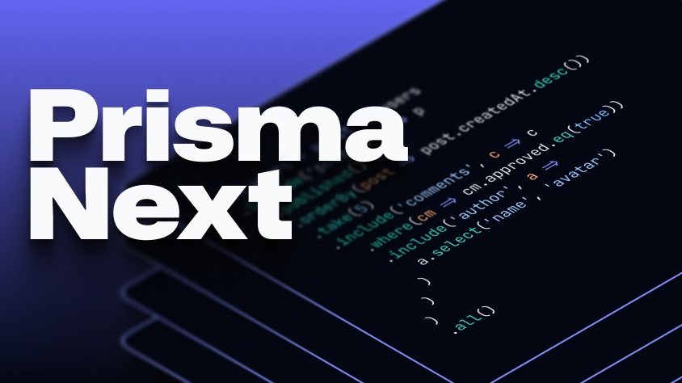

<p align="center">
  <a href="https://github.com/prisma/prisma-next">
    
  </a>
</p>

<p align="center">
  <a href="https://pris.ly/discord">Discord</a>  |  <a href="https://twitter.com/prisma">X</a>  |  <a href="https://pris.ly/pn-anouncement">Blog Post</a>  |  <a href="./ARCHITECTURE.md">Architecture</a>
</p>

---

> **In Development (Not a Product Release)**: Prisma Next is an active engineering project and a public look at where Prisma is heading. It is not ready for production yet: APIs will change, and it's not yet recommended for production use.
>
> Prisma 7 remains the recommended version of Prisma for production applications.

## Prisma Next at a glance

**Prisma Next** is a new foundation for Prisma ORM, rewritten fully in TypeScript to be **extensible** and **composable** by default.
Read the full announcement: **[The Next Evolution of Prisma ORM](https://pris.ly/pn-anouncement)**.

- **A TypeScript rewrite of Prisma ORM**: Rebuilt end-to-end to unlock new capabilities and a more composable architecture.
- **Extensible by default**: Add extension packs in `prisma-next.config.ts` to unlock new schema attributes and new query capabilities.
- **Two query APIs**:
  - **ORM Client** (`db.orm`): model collections with fluent `where/include/select` composition
  - **Query builder** (`db.sql`): type-safe SQL plan builder for when you want lower-level control
- **Designed for AI-assisted workflows**: deterministic contracts, structured plans, stable diagnostics, and guardrails that help agents (and humans) iterate safely.

## Schema as a contract

Your schema becomes a **verifiable contract**: a deterministic artifact (`contract.json` + TypeScript types) that describes which models, tables, and fields exist.

- **Verify at runtime**: detect schema drift before a query runs
- **Type your queries**: keep results and query operators fully type-safe
- **Power tooling + agents**: contracts, plans, and diagnostics are structured data — easy to inspect, diff, and reason about

## Fluent query API

Queries remain readable and composable as they grow, with fully-typed autocompletion:

```typescript
const orders = await db.orders
  .where({ userId: currentUserId })
  .where((o) => o.status.in(['shipped', 'delivered']))
  .include('shippingAddress')
  .include('items', (item) =>
    item.include('product', (product) =>
      product
        .include('category')
        .include('images', (img) => img.where({ isPrimary: true }).take(1))
        .include('reviews', (reviews) =>
          reviews
            .where((r) => r.rating.gte(4))
            .orderBy((r) => r.createdAt.desc())
            .take(3)
            .include('author', (a) => a.select('name', 'avatar')),
        ),
    ),
  )
  .all()
```

## Designed for AI-assisted workflows

Every operation produces structured output that machines can understand. Compile-time guardrails catch mistakes before runtime, and machine-readable errors include stable codes and suggested fixes:

```typescript
// Type error: update() requires where()
await db.users.update({ active: false })
```

```json
{
  "code": "CAPABILITY_REQUIRED",
  "message": "updateAll() requires 'returning' capability",
  "fix": "Add 'returning' to contract capabilities or use updateCount()"
}
```

## Quick example

**1. Define your schema:**

```prisma
// schema.psl
model User {
  id    Int     @id @default(autoincrement())
  email String  @unique
  name  String?
}
```

**2. Emit the contract:**

```bash
prisma-next contract emit schema.psl -o .prisma
# Generates: .prisma/contract.json + .prisma/contract.d.ts
```

**3. Query with full type safety:**

```typescript
import postgres from '@prisma-next/postgres/runtime'
import type { Contract } from './.prisma/contract.d'
import contractJson from './.prisma/contract.json' with { type: 'json' }

const db = postgres<Contract>({
  contractJson,
  url: process.env['DATABASE_URL']!,
})

const users = await db.orm.users
  .select('id', 'email')
  .take(10)
  .all()

// users: Array<{ id: number; email: string }>
```

## Extensibility (extension packs)

Add an extension pack in `prisma-next.config.ts` to unlock new schema attributes and query operators. For example, `pgvector`:

```ts
// prisma-next.config.ts
import { defineConfig } from '@prisma-next/cli/config-types'
import pgvector from '@prisma-next/extension-pgvector/control'

export default defineConfig({
  // ...
  extensionPacks: [pgvector],
})
```

```prisma
model Document {
  id        Int    @id
  title     String
  embedding Bytes  @pgvector.column(length: 1536)
}
```

```typescript
await posts
  .where(p => p.embedding.cosineDistance(searchParam).lt(0.2))
  .all()
```

## Getting Started

### Prerequisites

- Node.js 24 LTS (or newer)
- pnpm
- PostgreSQL

### Try the demo

```bash
git clone https://github.com/prisma/prisma-next.git
cd prisma-next
pnpm install && pnpm build

cd examples/prisma-next-demo
# Create .env with your DATABASE_URL, then:
pnpm emit && pnpm seed && pnpm start
```

Or check out the [Pokedex example app](https://github.com/prisma/pokedex-prisma-next) for a more complete example.

## How It Works

Prisma Next follows a three-step **contract-first** workflow:

1. **Define** your schema in PSL (Prisma Schema Language)
2. **Emit** a deterministic contract (JSON) and TypeScript types: no executable code generated
3. **Query** using either `db.orm` (ORM Client) or `db.sql` (query builder), verified against the contract

The contract is the single source of truth. It's diffable, hashable, and machine-readable.

For architecture details, see [ARCHITECTURE.md](./ARCHITECTURE.md).

## Status

Prisma Next is in development. Here's what to expect:

| Area                    | Status   |
| ----------------------- | -------- |
| Schema definition (PSL) | Working* |
| Contract emission       | Working* |
| SQL query DSL           | Working* |
| ORM-style queries       | Working* |
| Postgres adapter        | Working* |
| Plugin system           | Working* |
| Migrations              | Minimal  |
| MySQL / SQLite          | Not yet  |

(*) Working, but not feature-complete or production-ready. APIs are subject to breaking changes.

## Community

- **Discord**: Join the conversation at [pris.ly/discord](https://pris.ly/discord)
- **X**: Follow [@prisma](https://twitter.com/prisma) for updates
- **Blog**: Read about our journey at [prisma.io/blog](https://www.prisma.io/blog)

Prisma Next is not open to external contributions at this time. See [CONTRIBUTORS.md](./CONTRIBUTORS.md) for details. We plan to open contributions in the future: star and watch this repo to stay in the loop.

## License

Prisma Next is licensed under [Apache 2.0](./LICENSE).