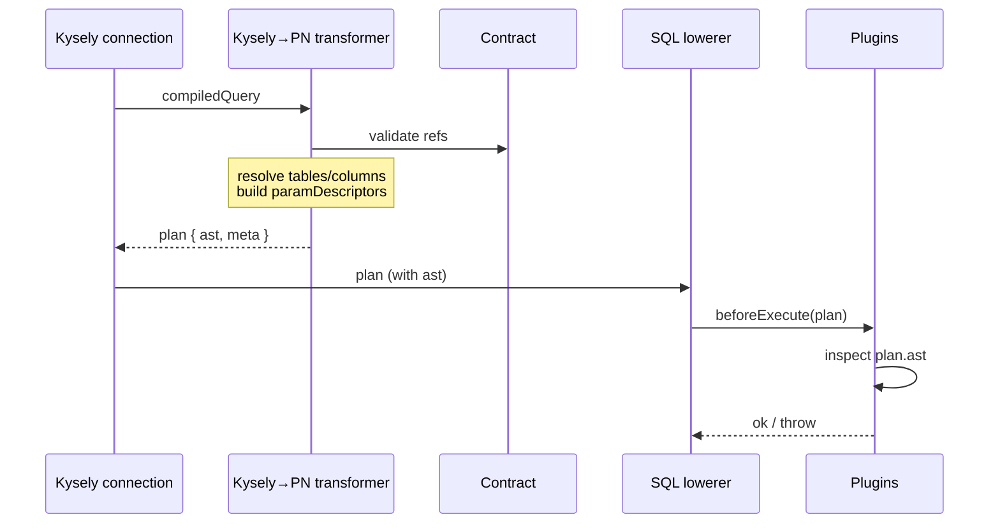
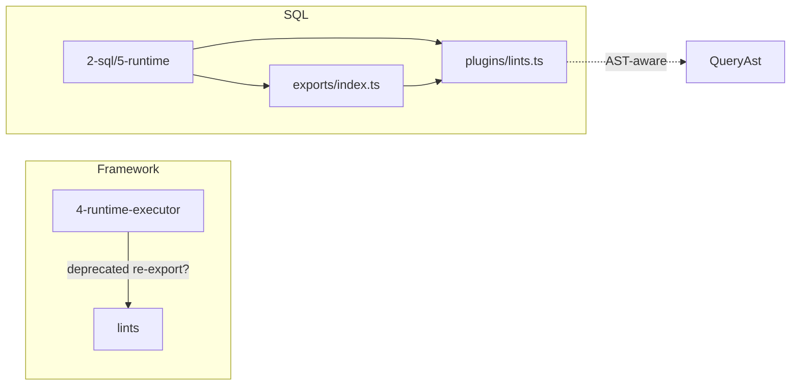

# Transform Kysely AST → Prisma Next SQL AST (QueryAst) for plugin inspection

Date: 2026-02-15  
Status: Draft

## Summary

The Kysely query lane currently executes compiled SQL but produces plans with **no Prisma Next SQL AST** attached (`plan.ast` is `undefined`) and no structured refs or param descriptors. Runtime plugins cannot inspect query structure (e.g. “DELETE without WHERE”) because they lack a lane-agnostic, machine-readable AST.

This spec adds a **Kysely `compiledQuery` AST → PN SQL `QueryAst` transformer** that:

- Converts Kysely’s `compiledQuery.query` into Prisma Next’s SQL-family AST (`QueryAst`)
- Attaches it as `ExecutionPlan.ast` with `meta.lane = 'kysely'`
- Populates `plan.meta.refs` with **PN-native resolved references** (canonical `{ table, column }` pairs validated against the contract)
- Populates `plan.params` and `plan.meta.paramDescriptors` for param encoding and plugin inspection

Where the current PN SQL AST is too rudimentary, we expand it in a lane-neutral way (no Kysely-shaped nodes). Acceptance scope is defined by recreating all demo queries from `examples/prisma-next-demo/src/queries` as Kysely equivalents under `examples/prisma-next-demo/src/kysely`.

To prove the end-to-end concept, this spec also **reimplements the lint plugin as an AST-first plugin** that inspects `plan.ast`, and **migrates that plugin into the SQL domain** so it is exported from the SQL runtime surface rather than the framework domain.

## Background

### Current plan model and plugin surfaces

- Runtime plugins receive an `ExecutionPlan` (`sql`, `params`, optional `ast`, and `meta`).
- SQL lanes (DSL/ORM) attach a PN SQL AST as `plan.ast` (`QueryAst`) and populate `meta.refs`, `meta.projection`, `meta.projectionTypes`, and `meta.paramDescriptors`.
- The SQL runtime uses `meta.annotations.codecs` / `meta.projectionTypes` to decode result rows and `meta.paramDescriptors` to encode params.

Kysely integration (`packages/3-extensions/integration-kysely/src/connection.ts`) currently creates an `ExecutionPlan` with:

- `ast: undefined`
- `meta.lane: 'raw'`
- `meta.paramDescriptors: []`

…even though Kysely exposes a structured AST (`compiledQuery.query`) and parameter values (`compiledQuery.parameters`).

### Why “Kysely AST inside the plan” is not enough

We explicitly do not want plugins to depend on Kysely node shapes or semantics. Plans must carry a **Prisma Next-native AST** so:

- plugins are lane-agnostic (Kysely/DSL/ORM)
- guardrails and budgets can share heuristics reliably
- future lanes can reuse the same inspection surfaces

See [supporting-reference.md](./supporting-reference.md) for the current plan/AST structures and a Kysely↔PN node compatibility table.

## Goals

1. **Transformer**: Transform Kysely `compiledQuery.query` into PN SQL AST (`QueryAst`) and attach it as `plan.ast` with `plan.meta.lane = 'kysely'`.
2. **PN-native refs**: Populate `plan.meta.refs` with resolved `{ table, column }` pairs validated against the contract; prevent ambiguous queries in the Kysely lane.
3. **Plan metadata parity**: Populate `meta.projection`, `meta.projectionTypes`, `meta.annotations.codecs`, and `meta.paramDescriptors` so runtime and plugins have full structural context.
4. **PN AST expansion**: Evolve the PN SQL AST (and/or, like, in, list literals, join on expressiveness, selectAll intent preservation) for demo scope—lane-neutral, no Kysely-specific shapes.
5. **AST-first lint plugin**: Reimplement lints to inspect `plan.ast`; prove Kysely-authored plans are compatible with PN runtime plugin analysis and lowering.
6. **Migrate lints plugin**: Move it into the SQL domain and export from the SQL runtime surface.
7. **Example parity**: Add Kysely equivalents for all demo queries; validate execution and plugin inspection.
8. **Lowering equivalence**: Lowering the resulting PN SQL AST must yield the same SQL, or a semantically equivalent SQL statement, compared to what Kysely compiles for the same query intent.

## Non-goals

- Encoding Kysely-specific node kinds into PN SQL AST.
- Implementing a full production lint ruleset beyond the minimum rules required to prove AST-based inspection.
- Solving every SQL feature in one go; focus on the subset used by the current Kysely lane / MVP demo scope.

## Design

### High-level architecture

```mermaid
flowchart TB
  subgraph Authoring["Kysely Lane (authoring)"]
    KyselyBuilder[Kysely query builder]
    KyselyBuilder -->|compile()| Compiled[compiledQuery: sql, parameters, query]
  end

  subgraph Transform["Transform layer (SQL domain)"]
    Compiled --> Transformer[Kysely → PN AST transformer]
    Transformer --> QueryAst[QueryAst]
    Transformer --> Meta[PlanMeta: refs, projection, paramDescriptors]
    QueryAst --> Plan[ExecutionPlan]
    Meta --> Plan
  end

  subgraph PlanAttrs["ExecutionPlan"]
    Plan
    Plan -->|ast| QueryAst
    Plan -->|meta.lane| Lane["lane: 'kysely'"]
    Plan -->|meta.refs| Refs["refs: tables, columns"]
  end

  Plan --> Runtime[SQL runtime]
  Runtime --> Lower[lowerSqlPlan]
  Runtime --> Plugins[Plugins: lints, budgets]
  Plugins -->|inspect plan.ast| ASTLint[AST-first lint rules]
```

### Kysely compiledQuery AST → PN SQL QueryAst transformer

| Aspect | Specification |
|--------|---------------|
| **Input** | `contract`, `compiledQuery.query` (Kysely AST), `compiledQuery.parameters` |
| **Output** | `ast: QueryAst`, `meta` additions (refs, projection, projectionTypes, paramDescriptors) |
| **Attachment** | `plan.ast = transformed QueryAst` |
| **Lane id** | `plan.meta.lane = 'kysely'` |
| **Lowering expectation** | Lowering PN `QueryAst` should produce SQL that is string-equal to Kysely output when practical, otherwise semantically equivalent for execution. |
| **Robustness** | Unsupported Kysely node kinds **throw** (forcing function). No silent fallback or heuristic “raw” linting. |

The transformer is a pure function in the SQL domain. It does not encode Kysely-shaped node kinds into PN; any PN AST changes remain lane-neutral.

### PN-native refs and ambiguity prevention

`plan.meta.refs` must contain **PN-native resolved references** (canonical `{ table, column }` pairs validated against `contract.storage.tables`). Ambiguous queries must not reach the transformer; if they do, the transformer **throws**.

**Minimum guardrails (Kysely lane):**

- **Qualified refs in multi-table scope**: If more than one table is in scope (e.g. joins), reject unqualified column references—require table/alias qualification.
- **Ambiguous selectAll**: Reject `selectAll()` / `select *` in multi-table scope unless it can be unambiguously scoped to a single table.
- **Transformer fallback**: If ambiguity still reaches the transformer (unexpected node shapes, raw fragments, future Kysely features), **throw** rather than emitting best-effort refs.

**Result**: Plugins receive deterministic, contract-validated refs; no heuristic string matching.

### PN SQL AST expansions (lane-neutral)

The current SQL AST (`packages/2-sql/4-lanes/relational-core/src/ast/types.ts`) is minimal. Expand it to represent constructs required by the demo scope:

| Construct | Current state | Expansion |
|-----------|---------------|-----------|
| Boolean composition | Missing | Add `AndExpr` / `OrExpr` for `WhereExpr` |
| `like` operator | Missing | Add `like` (and `ilike` if needed) to `BinaryOp` |
| `in` operator | Missing | Add `in` (and `notIn` if needed) to `BinaryOp` |
| List literals (`IN (...)`) | Missing | Add `ListLiteralExpr` or equivalent for `IN` operands |
| Join ON expressiveness | Only `eqCol` | Allow ON to reuse `WhereExpr` / expression structure |
| `select *` / selectAll intent | Not represented | Add `selectAll` intent—either explicit AST node or `meta.annotations.selectAllIntent` when normalized to explicit columns |
| WHERE absence for mutations | `where` required | Make `DeleteAst.where` and `UpdateAst.where` optional (`WhereExpr \| undefined`) |

These changes are compatible with existing lanes (DSL/ORM) and runtime lowering; adapters must handle new node kinds.

See [supporting-reference.md §4–6](./supporting-reference.md) for the current AST shape and Kysely↔PN compatibility table.

### Parameter indexing and mapping

- `plan.params = compiledQuery.parameters` (0-based JS array).
- PN `ParamRef.index` = **1-based** position into that array.
- Every Kysely parameterized value encountered during deterministic traversal gets the next index.
- `meta.paramDescriptors` include `refs: { table, column }` when the param is used in a predicate against a known column; `codecId`, `nativeType`, `nullable` derived from contract column metadata.

### AST & meta model changes

| Change | Description |
|--------|-------------|
| `ParamDescriptor.source` | Extend from `'dsl' \| 'raw'` to `'dsl' \| 'raw' \| 'lane'`. Kysely uses `'lane'`. |
| `DeleteAst.where` / `UpdateAst.where` | Make optional (`WhereExpr \| undefined`) to represent absence for lint rules. |
| New AST node types | `AndExpr`, `OrExpr`; `like`, `in` in `BinaryOp`; list literal for IN; richer `JoinOnExpr` (or reuse `WhereExpr`). |
| `selectAll` intent | Preserve via `meta.annotations.selectAllIntent` or explicit AST construct when we normalize `.selectAll()` to explicit columns. |

## AST-based lint plugin (proof-of-concept)

### Why

The current POC lint plugin (`packages/1-framework/4-runtime-executor/src/plugins/lints.ts`) returns early when `plan.ast` exists and only lints “raw” SQL via heuristic parsing. That does not validate the intended architecture.

### Desired behavior

Reimplement the lint plugin to **inspect `plan.ast`** (structural analysis, not SQL string parsing):

- If `plan.ast` is a SQL `QueryAst`, perform structural linting on the AST.
- If `plan.ast` is missing, optionally fall back to raw guardrails (heuristic); AST-bearing plans are the primary target.

**Minimum lint rules (to prove the concept):**

| Rule | Condition | Action |
|------|-----------|--------|
| **DELETE without WHERE** | `ast.kind === 'delete'` and `ast.where` is missing | Block execution |
| **UPDATE without WHERE** | `ast.kind === 'update'` and `ast.where` is missing | Block execution |
| **Unbounded SELECT** | `ast.kind === 'select'` and `ast.limit` is missing | Warn/error (severity configurable) |
| **SELECT \* intent** | Query was authored as “select all columns” | Warn/error (preserve selectAll intent in AST or meta) |

This proves that:

- Runtime plugins are lane-agnostic and operate on PN AST.
- Kysely-authored plans are compatible with Prisma Next runtime plugin analysis and PN SQL lowering.

## Migrate lint plugin into SQL domain

| Current location | Target location |
|------------------|-----------------|
| `packages/1-framework/4-runtime-executor/src/plugins/lints.ts` | `packages/2-sql/5-runtime/src/plugins/lints.ts` |

- Export from `packages/2-sql/5-runtime/src/exports/index.ts` (SQL runtime surface).
- SQL runtime re-exports `lints` so consumers import from `@prisma-next/sql-runtime` (or equivalent) instead of the framework domain.
- Framework package may keep a deprecated re-export that delegates to SQL lints for backward compatibility during migration, or remove it per project policy.

## Architecture diagrams

### Transform pipeline (detailed)



### Package layout after migration



## Example parity plan

Add Kysely equivalents for demo queries under `examples/prisma-next-demo/src/kysely/`:

- Mirror all queries in `examples/prisma-next-demo/src/queries` (select, insert, update, delete, joins, like, in, limit, returning, etc.).
- Each Kysely query must execute successfully with the demo runtime.
- Plans must carry `plan.ast` and `plan.meta.refs` / `paramDescriptors` / `projectionTypes`.
- Include at least one “guardrail proving” query that intentionally violates a lint (e.g. DELETE without WHERE) to verify AST-based plugin enforcement blocks execution.

## Testing plan

| Category | Scope |
|----------|-------|
| **Unit (SQL domain)** | Transformer produces expected `QueryAst` for representative Kysely AST inputs (select, where, like, in, join, limit, insert, update, delete, returning). Parameter indexing matches `compiledQuery.parameters`. `meta.refs` resolved and validated against fixture contract. Unsupported node kinds throw with stable error shape. |
| **Unit (lowering parity)** | For supported constructs, lower transformed PN `QueryAst` and compare with Kysely-compiled SQL: require exact match where deterministic, otherwise assert semantic equivalence (same operation, predicates, ordering, and limits). |
| **Unit (lints)** | AST-first lint plugin blocks delete/update without where; flags missing select limit; flags selectAll intent. |
| **Integration** | Extend `test/integration/test/` Kysely tests to assert `plan.ast` presence. Run Kysely integration with AST-first lints enabled; assert expected failures for unsafe queries. |
| **Demo** | Add and execute Kysely equivalents under `examples/prisma-next-demo/src/kysely`; validate execution and plugin observation. |

## Risks and mitigations

| Risk | Mitigation |
|------|------------|
| Parameter ordering mismatch | Implement explicit node visitors matching Kysely compiler structure; cover with unit tests. |
| AST expansions require lowering changes | Treat as part of spec; add tests around adapter lowering for new node kinds. |
| `selectAll` expansion needs contract access | Transformer receives contract; expansion uses contract table columns deterministically (sorted keys). |
| Ambiguous refs in multi-table scope | Kysely-lane guardrails reject unqualified refs / ambiguous selectAll before execution; transformer throws if ambiguity slips through. |
| Lint plugin migration breaks existing consumers | Export from SQL runtime; framework can re-export or document migration path. |

## Documentation updates

- Keep [supporting-reference.md](./supporting-reference.md) as the evolving compatibility/implementation reference.
- Update architecture docs and package READMEs when shared types change (`ParamDescriptor.source`, optional `DeleteAst.where` / `UpdateAst.where`).
- Document the lint plugin migration in SQL runtime README and any “plugins” or “guardrails” documentation.
- Update Query Lanes and Runtime & Plugin Framework subsystem docs to mention Kysely lane and AST-first lints.
