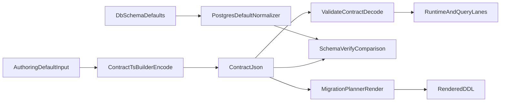

# Visuals

## Typed default lifecycle

## Encoding and decoding rules

- `bigint` literal defaults encode to tagged JSON objects and decode back to runtime `BigInt`.
- `Date` literal defaults encode to ISO strings and decode to `Date` for temporal columns.
- JSON-safe literals remain JSON values in `contract.json`.
- Postgres planner renders typed literals to SQL using type-aware escaping/stringification.
