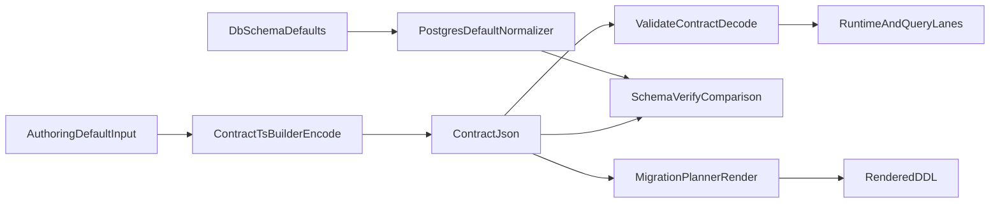

# Spec: Strictly Typed Column Default Literals

## Summary

Introduce strictly-typed literal defaults for SQL columns, replacing string `expression` payloads with typed `value` payloads. Defaults are represented as typed values (JSON-safe primitives, bigint, Date) instead of raw SQL snippets. Function defaults (`{ kind: 'function', expression }`) remain unchanged.

## Context

Previously, literal defaults used a string `expression` field, which was SQL-first and opaque to the type system. This spec shifts to a value-first model where authors pass typed JavaScript/TypeScript values, which are serialized deterministically into `contract.json` and decoded at validation time for runtime use.

The change affects authoring builders, contract emission, validation, schema verification (default comparison), migration planning (DDL rendering), and codec-aware typing.

## Goals

- **Value-first defaults**: Column literal defaults use typed `value` instead of string `expression`.
- **Full literal support**: JSON-safe values (`string | number | boolean | null | object | array`), `bigint`, and `Date`.
- **Deterministic pipeline**: Same authoring input → same contract JSON → same validation output → same migration DDL.
- **Codec-aware typing**: Both nullable and non-nullable columns can define defaults. SQL builder default typing aligns with codec output types.
- **Round-trip correctness**: Bigint encodes as tagged JSON (`{ "$type": "bigint", "value": "<decimal-string>" }`); Date encodes as ISO string; validation decodes tagged bigint only for bigint-like columns.

## Non-goals

- New default kinds beyond `literal` and `function`.
- Cross-target custom literal parsing beyond existing adapter behavior.
- Backward-compatibility shim for `{ kind: 'literal', expression }`.
- Broader refactors unrelated to default literal typing.

## Design

### Contract types

Defined in `@prisma-next/contract/types`:

```ts
export type TaggedBigInt = { readonly $type: 'bigint'; readonly value: string };
export type TaggedLiteralValue = TaggedBigInt;
export type ColumnDefaultLiteralValue = JsonValue | TaggedLiteralValue;
export type ColumnDefaultLiteralInputValue = ColumnDefaultLiteralValue | bigint | Date;

export type ColumnDefault =
  | { readonly kind: 'literal'; readonly value: ColumnDefaultLiteralInputValue }
  | { readonly kind: 'function'; readonly expression: string };

export type ColumnDefaultInput = ColumnDefault;
```

Literal variant is `{ kind: 'literal', value: ... }`. `ColumnDefaultLiteralInputValue` is the authoring input type (includes `bigint` and `Date`); `ColumnDefaultLiteralValue` is the serialized form in JSON (bigint → tagged, Date → ISO string).

### Authoring

- **Framework table builder** (`packages/1-framework/2-authoring/contract/src/table-builder.ts`): Accepts `ColumnDefaultInput` for both nullable and non-nullable columns.
- **SQL contract builder** (`packages/2-sql/2-authoring/contract-ts/src/contract-builder.ts`): Accepts typed literals at build time. `encodeDefaultLiteralValue()` normalizes for JSON: `bigint` → `{ $type: 'bigint', value }`, `Date` → ISO string, JSON-safe values pass through.

### Emission and canonicalization

- **Contract emission**: Emitter emits literal defaults with `value` in the appropriate form (tagged bigint, ISO string for Date, plain JSON for JSON-safe).
- **Canonicalization** (`packages/1-framework/1-core/migration/control-plane/src/emission/canonicalization.ts`): `omitDefaults` preserves Date and bigint for hashing; JSON stringify replacer converts runtime `bigint` to `{ $type: 'bigint', value }` for deterministic hashing.

### Validation

- **validateContract** (`packages/2-sql/1-core/contract/src/validate.ts`): `decodeContractDefaults()` decodes literal defaults before returning the contract:
  - Tagged bigint → `BigInt(value)` only for bigint-like columns
  - Temporal/date-like strings remain strings
  - Other literals unchanged

### Postgres default normalizer

- **parsePostgresDefault** (`packages/3-targets/6-adapters/postgres/src/core/default-normalizer.ts`): Parses raw DB defaults into normalized `ColumnDefault`:
  - Boolean: `true`/`false`
  - Numeric: integer/decimal; bigint columns get `{ $type: 'bigint', value }`
  - String literals: unescaped value
  - Functions: nextval, now(), gen_random_uuid, etc. → `kind: 'function'`

### Migration planner SQL rendering

- **renderDefaultLiteral** (`packages/3-targets/3-targets/postgres/src/core/migrations/planner.ts`):
  - String → quoted + escaped
  - Number/boolean → literal
  - `null` → `NULL`
  - `Date` → quoted ISO string
  - `bigint` / tagged bigint → numeric literal
  - JSON/JSONB → `JSON.stringify` + `::json`/`::jsonb` cast

## Data flow and lifecycle



**Encoding rules:**

- `bigint` → `{ "$type": "bigint", "value": "<decimal-string>" }`
- `Date` → ISO string
- JSON-safe literals → plain JSON values

**Decoding rules (validateContract):**

- Tagged bigint on bigint-like columns → runtime `BigInt`
- Temporal/date-like strings → unchanged strings
- Other literals → unchanged

## Acceptance criteria

- [x] Core contract types expose `ColumnDefaultLiteralValue`, `ColumnDefaultLiteralInputValue`, `ColumnDefaultInput`; literal variant is `{ kind: 'literal', value }`.
- [x] Authoring builders accept typed literals on both nullable and non-nullable columns; SQL builder default typing is codec-aware.
- [x] Emission serializes non-JSON primitives: bigint as tagged object, Date as ISO string.
- [x] Validation decodes tagged bigint → `BigInt` only for bigint-like columns and keeps temporal/date-like strings as strings.
- [x] Postgres schema/default comparison uses `parsePostgresDefault` to normalize DB defaults to typed literals; string/boolean/numeric comparison works.
- [x] Migration planner renders typed literals: quoted strings, numeric/boolean literals, `NULL`, JSON/JSONB with casts, tagged bigint as numeric.
- [x] E2E fixtures (`literal_defaults` table) cover text, int, float, boolean, bigint, json object, json array; insert/select assertions verify runtime values.

## Risks

- **Bigint precision**: Tagged format avoids JSON number precision loss; validation must decode correctly.
- **Date/timezone**: Runtime surfaces temporal and interval values as strings to avoid implicit JS `Date` coercions.
- **Schema verification**: Unrecognized DB default expressions fall back to `kind: 'function'`; comparison may not match contract literals if DB uses non-standard syntax.

## Testing plan

- **Unit tests**:
  - `table-builder.test.ts`: Literal default acceptance on nullable and non-nullable columns.
  - `type-check-mutual-exclusivity.ts`: Compile-time acceptance for nullable+default combinations.
  - `contract.logic.test.ts`: Literal default encoding/validation.
  - `schema-verify.defaults.test.ts`: Normalized default comparison (string, boolean, numeric, escaped quotes).
  - `planner.case1.test.ts`: DDL rendering for literal defaults.
  - `control-adapter.defaults.test.ts`: Default normalization.
- **Integration tests**: `contract-builder.test.ts`, `codecs.test.ts`, `sql-dml.test.ts`, `kysely.test.ts`.
- **E2E tests**:
  - `dml.test.ts`: `literal_defaults` table insert with empty `{}`; assertions on label, score, rating, active, big_count, metadata, tags; `event` table `scheduled_at` literal `Date` default.
  - `ddl.test.ts`: DDL generation for `literal_defaults` table.

## Key package and file areas

| Area                | Package / Path                                                                 |
|---------------------|---------------------------------------------------------------------------------|
| Contract types      | `packages/1-framework/1-core/shared/contract/src/types.ts`                      |
| Table builder       | `packages/1-framework/2-authoring/contract/src/table-builder.ts`                 |
| SQL contract builder| `packages/2-sql/2-authoring/contract-ts/src/contract-builder.ts`                |
| JSON schema         | `packages/2-sql/2-authoring/contract-ts/schemas/data-contract-sql-v1.json`      |
| Validation / decode | `packages/2-sql/1-core/contract/src/validate.ts`                                |
| Emitter             | `packages/2-sql/3-tooling/emitter/src/index.ts`                                 |
| Canonicalization    | `packages/1-framework/1-core/migration/control-plane/src/emission/canonicalization.ts` |
| Default normalizer  | `packages/3-targets/6-adapters/postgres/src/core/default-normalizer.ts`         |
| Migration planner   | `packages/3-targets/3-targets/postgres/src/core/migrations/planner.ts`            |
| E2E fixtures        | `test/e2e/framework/test/fixtures/contract.ts`                                  |
| E2E tests           | `test/e2e/framework/test/dml.test.ts`, `ddl.test.ts`                            |
