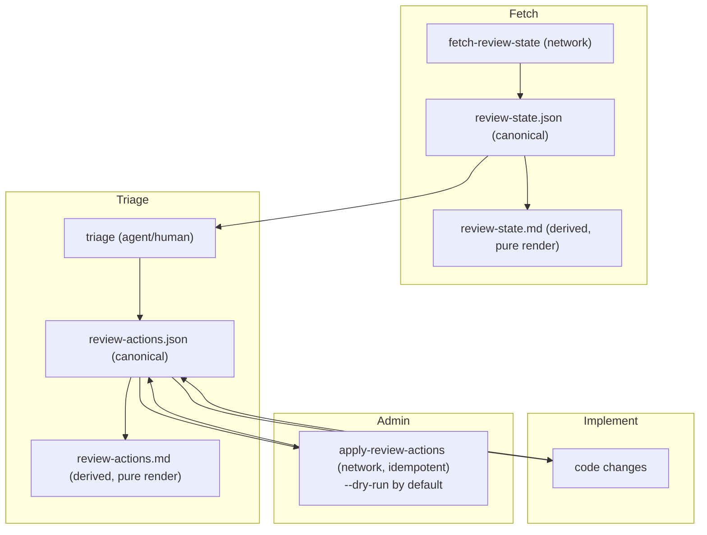

# Review framework spec (deterministic, agent-friendly PR review iteration)

Status: Draft  
Audience: repo contributors + agents  
Scope: local-only workflow + CLI tooling around GitHub PR review threads/comments

## Summary

This spec defines a deterministic, agent-friendly PR review iteration framework:

- **Canonical JSON artifacts**: `review-state.json` and `review-actions.json` (versioned, stable ordering).
- **Derived Markdown views**: deterministic transforms from JSON (no hand-edits).
- **Pure scripts** (no network) for rendering/summarizing (unit-testable with `node --test`).
- **Side-effect scripts** for GitHub mutations (reply/react/resolve) that are **idempotent**, safe to retry, and **`--dry-run` by default**.

## Goals

- **Determinism**: given the same JSON input, derived outputs are byte-for-byte identical.
- **Separation of concerns**:
  - pure transforms: no network, no timestamps unless already in input
  - mutations: explicit, idempotent, retry-safe
- **Stable contracts**: versioned schemas with explicit upgrade rules.
- **Agent-friendly workflow**: predictable file locations, identifiers, and CLI contracts.
- **Repo-aligned practices**:
  - use `pnpm` for repo commands
  - tests use `node --test`
  - scripts are deterministic and do not “guess”
  - git staging is explicit (never rely on `git add .` / `git add -A`)

## Non-goals

- CI integration (local workflow first).
- Auto-triage that replaces human judgment.
- Recreating the GitHub UI.
- Introducing non-repo dependencies (this remains small Node scripts + `gh`).

## Glossary

- **Node ID**: GitHub GraphQL node id. Used as the *only* canonical identifier in artifacts and mutations.
- **Thread**: PR review thread (`PullRequestReviewThread`) containing review comments.
- **Standalone comment**: a comment without a native “resolved” mechanism (e.g. PR issue comment). Resolution is tracked by workflow semantics.
- **Pure script**: deterministic and side-effect-free (no network; writes only declared outputs).

## Overview: workflow and artifacts

### Typical loop

Fetch → triage → implement → apply GitHub admin actions → repeat.



### Standard storage layout (recommended)

Store artifacts under the spec’s `reviews/` folder so they can be committed and shared:

```
agent-os/specs/review-framework/
  spec.md
  reviews/
    <owner>_<repo>_pr-<number>/
      review-state.json
      review-state.md
      review-actions.json
      review-actions.md
      apply-log.json          # optional derived artifact
```

The `<owner>_<repo>_pr-<number>` directory name is deterministic from the PR URL.

## Identifier policy (hard requirement)

- **Only GraphQL node ids are used as canonical identifiers** in artifacts, rendering, and mutations.
- **Do not require or depend on `databaseId`** anywhere.
- Artifacts may include `url` for human convenience, but mutations must rely on node ids, not URL parsing.

## Artifact contract quick reference

- **Identifiers:** GraphQL `nodeId` is the only canonical identifier (never require `databaseId`).
- **Canonical artifacts:** `review-state.json` and `review-actions.json` with `version: 1`.
- **Deterministic ordering:** sort using the v1 rules for threads/comments/reviews/issue comments; preserve `actions[]` order in `review-actions.json`.
- **Deterministic formatting:** canonical JSON uses 2-space indent with a trailing newline.
- **Markers:** automation marker text (for example `<!-- review-framework:actionId=A-001 kind=done -->`) is stripped from bodies in `review-state.json`.

## Canonical artifacts

### Artifact: `review-state.json` (canonical)

Purpose: capture relevant PR review state as a stable, versioned JSON document that:

- supports deterministic transforms (render/summarize),
- provides enough identifiers to plan/apply actions,
- is suitable for commit/audit.

Baseline scope (requirements):

- unresolved review threads (+ their comments)
- submitted reviews with non-empty bodies
- PR issue comments (conversation comments)

#### `review-state.json` schema (v1)

Top-level fields:

- `version`: `1`
- `fetchedAt`: ISO-8601 string
- `sourceBranch`: string | null
- `pr`: metadata (includes `nodeId`)
- `reviewThreads`: unresolved threads
- `reviews`: submitted reviews with body
- `issueComments`: PR conversation comments

Informal schema:

```json
{
  "version": 1,
  "fetchedAt": "2026-02-12T00:00:00.000Z",
  "sourceBranch": "my-branch",
  "pr": {
    "url": "https://github.com/OWNER/REPO/pull/123",
    "nodeId": "PR_kwDO...",
    "number": 123,
    "title": "Title",
    "state": "OPEN",
    "headRefName": "feature",
    "baseRefName": "main",
    "updatedAt": "2026-02-12T00:00:00.000Z"
  },
  "reviewThreads": [
    {
      "nodeId": "PRRT_...",
      "isResolved": false,
      "isOutdated": false,
      "path": "packages/foo/src/x.ts",
      "startLine": 10,
      "endLine": 12,
      "comments": [
        {
          "nodeId": "PRRC_...",
          "url": "https://github.com/OWNER/REPO/pull/123#discussion_r...",
          "author": { "login": "reviewer" },
          "createdAt": "2026-02-12T00:00:00.000Z",
          "body": "comment text",
          "reactionGroups": [{ "content": "THUMBS_UP", "users": { "totalCount": 2 } }]
        }
      ]
    }
  ],
  "reviews": [
    {
      "nodeId": "PRR_...",
      "url": "https://github.com/OWNER/REPO/pull/123#pullrequestreview-...",
      "author": { "login": "reviewer" },
      "state": "COMMENTED",
      "submittedAt": "2026-02-12T00:00:00.000Z",
      "body": "review body text",
      "reactionGroups": [{ "content": "THUMBS_UP", "users": { "totalCount": 1 } }]
    }
  ],
  "issueComments": [
    {
      "nodeId": "IC_...",
      "url": "https://github.com/OWNER/REPO/pull/123#issuecomment-...",
      "author": { "login": "someone" },
      "createdAt": "2026-02-12T00:00:00.000Z",
      "body": "comment text",
      "reactionGroups": [],
      "replies": []
    }
  ]
}
```

Rules:

- All `nodeId` values are GraphQL node ids.
- Bodies must **strip framework markers** (see “Markers”) before writing into JSON.
- JSON formatting is deterministic: 2-space indent + trailing newline.

#### Deterministic normalization rules (v1)

- **Thread inclusion**: include only threads where `isResolved === false`.
- **Thread sorting**: `(path ASC, startLine ASC, earliestCommentCreatedAt ASC, nodeId ASC)`.
- **Thread comment sorting**: `(createdAt ASC, nodeId ASC)`.
- **Review sorting**: `(submittedAt ASC, nodeId ASC)`.
- **Issue comment sorting**: `(createdAt ASC, nodeId ASC)`.
- **Reaction groups**:
  - normalize to counts-only: `{ content, users: { totalCount } }`
  - sort by `content ASC`

### Artifact: `review-actions.json` (canonical)

Purpose: canonical action plan authored during triage and updated through implementation/admin steps.

#### `review-actions.json` schema (v1)

Top-level fields:

- `version`: `1`
- `pr`: `{ url, nodeId? }`
- `reviewState`: `{ path, fetchedAt, digest? }`
- `actions`: ordered list

Action item fields:

- `actionId`: unique within the file
- `target`: `{ kind, nodeId, url? }`
- `decision`: explicit triage decision
- `summary`: one-line description
- `rationale`: optional; **required** for `wont_address` if used
- `targetFiles`: optional list of repo paths
- `acceptance`: optional completion check
- `status`: `pending | in_progress | done`
- `done`: optional completion record

Informal schema:

```json
{
  "version": 1,
  "pr": { "url": "https://github.com/OWNER/REPO/pull/123", "nodeId": "PR_kwDO..." },
  "reviewState": { "path": "review-state.json", "fetchedAt": "2026-02-12T00:00:00.000Z" },
  "actions": [
    {
      "actionId": "A-001",
      "target": {
        "kind": "review_thread",
        "nodeId": "PRRT_...",
        "url": "https://github.com/OWNER/REPO/pull/123#discussion_r..."
      },
      "decision": "will_address",
      "summary": "Make ordering deterministic across runs",
      "rationale": null,
      "targetFiles": ["scripts/pr/fetch-review-state.mjs"],
      "acceptance": "Same input JSON renders identical Markdown",
      "status": "pending",
      "done": null
    }
  ]
}
```

##### `target.kind` enum (v1)

- `review_thread`
- `review_comment`
- `pull_request_review`
- `issue_comment`

##### `decision` enum (v1) and guidance

Prefer explicit reason codes (avoid ambiguous “won’t address”):

- `will_address`
- `defer`
- `out_of_scope`
- `already_fixed`
- `not_actionable`

Optional (discouraged):

- `wont_address` (only allowed if `rationale` is a **non-empty** string)

##### `done` shape (v1)

```json
{
  "doneAt": "2026-02-12T00:00:00.000Z",
  "summary": "What changed / where",
  "commits": ["<sha>"],
  "githubAdmin": {
    "appliedAt": "2026-02-12T00:00:00.000Z",
    "operations": [{ "kind": "resolve_thread", "targetNodeId": "PRRT_..." }]
  }
}
```

Recording `githubAdmin` inside `review-actions.json` is optional; an external `apply-log.json` is acceptable.

## Derived outputs (deterministic)

Derived outputs are never hand-edited. They are deterministic transforms from JSON.

### Output: `review-actions.md` (derived from `review-actions.json`)

Rendered by `scripts/pr/render-review-actions.mjs` (pure).

Rules:

- Uses only the JSON input (no injected timestamps).
- Stable order: preserves the order of `actions` as written in JSON.
- May filter decisions, but must not reorder remaining items.
- UTF-8 with trailing newline.
- Table safety: escape `|`, collapse newlines/whitespace within cells.

### Output: `review-state.md` (derived from `review-state.json`)

Recommended: add a pure renderer `scripts/pr/render-review-state.mjs`.

Rules:

- Stable order based on the sorting rules already applied in `review-state.json`.
- Strips framework markers from bodies.
- UTF-8 with trailing newline.

### Optional output: `apply-log.json`

If apply does not write back to `review-actions.json`, it may emit a derived `apply-log.json` containing:

- timestamp
- planned operations (dry-run) or executed operations (apply)
- per-operation result (`applied | noop | skipped | failed`)

## CLI contracts

All scripts use these exit codes:

- `0`: success (including no-op)
- `1`: operational error
- `2`: CLI/usage error

All scripts:

- support `--help` → prints to stdout, exits `0`
- write errors to stderr
- are deterministic for the same inputs (pure scripts)

### Script: fetch review state (network)

Current: `scripts/pr/fetch-review-state.mjs`

Contract:

```bash
node scripts/pr/fetch-review-state.mjs [--pr <url>] [--out <path.md>|-] [--out-json <path.json>|-] [--help]
```

Migration requirements:

- Must emit canonical `review-state.json` v1 using **node ids only**.
- Must not require `databaseId`.
- Prefer “JSON-first”: treat `review-state.json` as canonical and Markdown as derived.
- If `--out` is omitted, markdown is written to stdout.
- If `--out-json` is omitted and `--out` is a file path, JSON defaults to the same path with `.json`.

### Script: render review actions (pure)

Existing: `scripts/pr/render-review-actions.mjs`

Contract:

```bash
node scripts/pr/render-review-actions.mjs --in <review-actions.json> [--out <review-actions.md>|-] [--help]
```

Compatibility requirements:

- Must not depend on `decision: wont_address` (prefer explicit reason codes).
- Must not depend on any database ids.

### Script: summarize review state (pure)

Recommended new: `scripts/pr/summarize-review-state.mjs`

Contract:

```bash
node scripts/pr/summarize-review-state.mjs --in <review-state.json> [--format text|json] [--out <path>|-] [--help]
```

Rules:

- default `--format text`
- stable ordering in emitted lists
- trailing newline for text output; pretty JSON + trailing newline for JSON output

### Script: apply review actions (network, idempotent)

Recommended new: `scripts/pr/apply-review-actions.mjs`

Contract:

```bash
node scripts/pr/apply-review-actions.mjs --in <review-actions.json> [--review-state <review-state.json>] [--apply] [--dry-run] [--format text|json] [--log-out <apply-log.json>] [--help]
```

Rules:

- Default is **`--dry-run`**.
- `--apply` enables mutations and must be explicit.
- `--format` defaults to `text`.
- All mutations use node ids.
- `--log-out` optionally writes deterministic apply output to `apply-log.json`.

## Idempotent GitHub mutation semantics

### Simplified idempotency rule (hard requirement)

- **Unresolved threads stay in scope**: if a review thread is not resolved on GitHub, it remains applicable until it becomes resolved.
- **Standalone comment considered resolved** if it has a **“Done”** comment from the current user.

Interpretation details:

- “Done comment” means a comment authored by the current user whose body is exactly `Done` or begins with `Done` followed by whitespace/newline.
- For threads, the source of truth is GitHub’s `isResolved`.

### Markers (recommended for robust idempotency)

To avoid duplicates, replies posted by automation should include a hidden marker:

- `<!-- review-framework:actionId=A-001 kind=done -->`

Rules:

- Apply checks for the marker (or exact body match) before posting.
- `review-state.json` stripping removes these markers so they do not pollute human-visible diffs.

### Ensure-semantics for primitives

- **Ensure reaction**: add reaction only if current user does not already have it.
- **Ensure reply**: post only if marker/body is not already present by current user.
- **Ensure thread resolved**: resolve only if currently unresolved.

### Current user identity

The current user is the authenticated `gh` user (GraphQL `viewer.login`).

## TLS/cert failures (Cursor sandbox)

If `gh api` fails with TLS/certificate errors inside a sandboxed shell (e.g. `x509: OSStatus -26276`):

- **Fail fast**: exit `1`.
- Print guidance to stderr: rerun outside the sandbox (system cert store).
- Never disable TLS verification (no `GH_NO_VERIFY_SSL`, no `curl -k`).

This must remain consistent with `.cursor/rules/github-cli-tls-in-sandbox.mdc`.

## Testing plan (pure scripts + mutation planner)

### Pure scripts

Use `node --test` with deterministic fixtures:

- verify exact Markdown output (including trailing newline)
- verify escaping and stable ordering
- keep tests network-free

### Mutation script

Split into:

- pure planner: compute operations from inputs + current user + optional state
- executor: runs `gh api` operations

Planner tests cover:

- unresolved threads remain in scope until resolved
- standalone “Done” detection from current user
- marker detection and idempotent no-op behavior
- TLS error detection (simulated `gh` stderr triggers fail-fast guidance)

## Migration plan (explicitly allowed)

The existing `scripts/pr/fetch-review-state.mjs` is workflow-specific and may be relocated/modified.

### 1) Update `fetch-review-state` output to node-id-only

- Remove database ids from JSON output.
- Store GraphQL node ids in `nodeId` fields consistently.
- Ensure sorting/normalization matches this spec.

### 2) Make Markdown derived (recommended split)

- Treat `review-state.json` as canonical.
- Add `render-review-state.mjs` (pure) to generate `review-state.md` from JSON.
- Keep fetch focused on network + JSON emission.

### 3) Align `render-review-actions` with decision guidance and node ids

- Update tests/data that use `wont_address` to prefer `defer | out_of_scope | already_fixed | not_actionable`.
- Remove any expectation of database ids in rendered output.

### 4) Add `apply-review-actions` with `--dry-run` default

- Implement idempotent ensure-semantics.
- Implement simplified idempotency rules (unresolved threads in scope; standalone “Done” rule).
- Add TLS/cert fail-fast guidance and rerun-outside-sandbox instructions.
