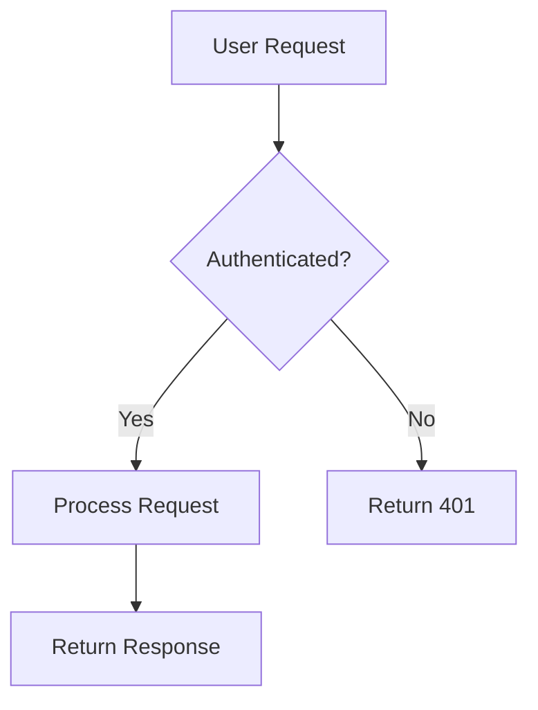
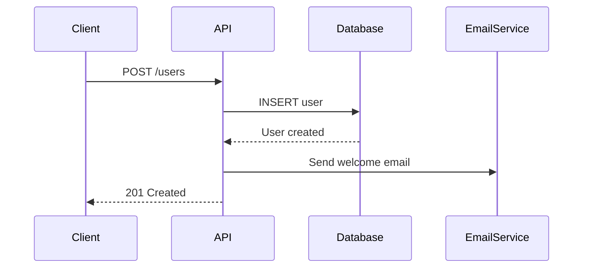
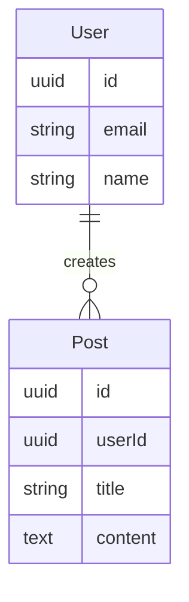

# Documentation Standards

## Philosophy

Documentation at Prisma follows the Doc Prompting approach: treat docs as both the prompt for AI agents and the context for humans. Documentation should live with the code, be clear and concise, and serve as the foundation for reliable AI-assisted development.

## Core Principles

### Documentation Lives in Code
No external portals required. All documentation resides in the repository.

**Guidelines:**
- Keep docs in the repository alongside code
- Use markdown for all documentation
- Make docs discoverable through clear structure
- Version docs with the code
- Update docs in the same PR as code changes

### Write for Both Humans and AI
Documentation should be clear enough for humans while providing structured context for AI agents.

**Guidelines:**
- Use clear, descriptive headings
- Include concrete examples
- Be specific, not vague
- Avoid ambiguity
- Structure information hierarchically

### Keep Context Narrow and Relevant
Like humans, AI agents are more effective with clear, applicable context.

**Guidelines:**
- Create focused, modular docs
- Reference specific sections when needed
- Don't duplicate information
- Use links to connect related concepts
- Organize by concern (standards, domain, technology, plans)

## Repository Documentation Structure

### README.md
The entry point for both humans and AI agents.

**Must include:**
- Project overview and purpose
- Quick start guide
- How to use the `docs/` folder
- Link to main documentation
- Development setup instructions
- Common commands

**Example structure:**
```markdown
# Project Name

Brief description of what this project does.

## Quick Start

\`\`\`bash
npm install
npm run dev
\`\`\`

## Documentation

This project uses Doc Prompting for structured documentation:

- `docs/standards/` - Coding practices and conventions
- `docs/technology/` - Architecture and system design
- `docs/domain/` - Business context and terminology
- `docs/plans/` - Specifications and requirements

For AI agents: Start with `AGENTS.md` for agent-specific instructions.

## Development

[Development instructions here]
```

### AGENTS.md
Instructions specifically for AI agents.

**Must include:**
- How to navigate the codebase
- Important conventions
- What to check before making changes
- Testing requirements
- Documentation update requirements

**Example:**
```markdown
# Instructions for AI Agents

## Before Making Changes

1. Read relevant `docs/standards/` files for coding conventions
2. Check `docs/technology/` for architecture constraints
3. Review `docs/domain/` for business context
4. Find or create a spec in `docs/plans/` for the feature

## After Making Changes

1. Run all tests: `npm test`
2. Run linter: `npm run lint`
3. Run type check: `npm run typecheck`
4. Update documentation if you:
   - Added new patterns or conventions
   - Changed architecture
   - Introduced new terminology
   - Made decisions that affect future development

## Testing Requirements

- Write tests for all new features
- Maintain test coverage above 70%
- Test security-sensitive code thoroughly
- Include both happy path and error cases

## Code Review

This project uses CodeRabbit for automated reviews. Address all comments before merging.
```

### docs/ Directory Structure

**Standard structure:**
```
docs/
├── standards/          # How we write code
│   ├── api-design.md
│   ├── testing.md
│   ├── error-handling.md
│   └── security.md
├── technology/         # System architecture
│   ├── architecture.md
│   ├── deployment.md
│   └── integrations.md
├── domain/            # Business context
│   ├── users.md
│   ├── products.md
│   └── glossary.md
└── plans/             # Specs and requirements
    ├── 2025-01-15-user-authentication/
    │   ├── spec.md
    │   ├── tasks.md
    │   └── implementation.md
    └── 2025-01-20-api-versioning/
        └── spec.md
```

## Documentation Types

### Standards
How we write code and make technical decisions.

**Include:**
- Coding conventions
- Design patterns we use
- Architecture principles
- Testing practices
- Security practices
- Performance guidelines

**Example `docs/standards/api-design.md`:**
```markdown
# API Design Standards

## RESTful Principles

We follow REST conventions for all HTTP APIs.

### URL Structure

\`\`\`
GET    /api/users           # List users
GET    /api/users/:id       # Get user
POST   /api/users           # Create user
PUT    /api/users/:id       # Update user (full)
PATCH  /api/users/:id       # Update user (partial)
DELETE /api/users/:id       # Delete user
\`\`\`

### Response Format

Always return JSON with consistent structure:

\`\`\`typescript
// Success
{
  "data": { ...result },
  "meta": { "timestamp": "2025-01-15T10:00:00Z" }
}

// Error
{
  "error": {
    "code": "VALIDATION_ERROR",
    "message": "Invalid email format",
    "details": [...]
  }
}
\`\`\`

[More standards...]
```

### Technology
System architecture, infrastructure, and technical context.

**Include:**
- Architecture diagrams
- System components
- Infrastructure setup
- Deployment targets
- External integrations
- Database schemas

**Example `docs/technology/architecture.md`:**
```markdown
# System Architecture

## Overview

Our system is a serverless application deployed on Cloudflare infrastructure.

## Architecture Diagram

\`\`\`mermaid
graph TD
    A[Client] --> B[Cloudflare Pages]
    A --> C[Cloudflare Workers]
    C --> D[Database]
    C --> E[External APIs]
\`\`\`

## Components

### Frontend (Cloudflare Pages)
- Built with React
- Deployed to Cloudflare Pages
- Static assets cached at edge

### API (Cloudflare Workers)
- RESTful API
- Handles business logic
- Deployed to Cloudflare Workers

### Database
- PostgreSQL
- Hosted on [provider]
- Accessed via connection pooler

[More details...]
```

### Domain
Business context, users, products, and terminology.

**Include:**
- Who uses the product
- What problems it solves
- Business terminology
- User personas
- Product features

**Example `docs/domain/users.md`:**
```markdown
# Users

## Target Users

### Primary: Software Developers
- Building applications with databases
- Need reliable ORM tooling
- Value type safety and good DX

### Secondary: DevOps Engineers
- Managing database infrastructure
- Deploying and monitoring applications
- Need observability and performance

## User Needs

### Developers Need
- Type-safe database access
- Easy migrations
- Good documentation
- Fast query performance

### DevOps Need
- Reliable deployments
- Performance monitoring
- Clear error messages
- Scalability

## Glossary

- **DX**: Developer Experience
- **ORM**: Object-Relational Mapping
- **Schema**: Database structure definition
```

### Plans (Specifications)
Product requirements and technical specifications.

**Include:**
- Feature specifications
- Product requirements
- Technical design docs
- Task breakdowns
- Implementation notes

**Follow spec template from Doc Prompting:**
```markdown
# Feature Name

## Overview
Brief description of what we're building.

## Description
Detailed description of the feature, problems it solves, and approach.

## References
- docs/standards/api-design.md
- docs/technology/architecture.md
- docs/domain/users.md

## User Stories
As a [user], I want to [action] so that I can [outcome].

## Product Requirements

### Functional Requirements
- Feature must do X
- Feature must support Y
- Feature must validate Z

### Non-Functional Requirements
- API must respond in < 200ms
- Must handle 1000 concurrent users
- Must be accessible (WCAG 2.1 AA)

## Technical Requirements

### Security
- Input validation requirements
- Authentication/authorization approach
- Data protection measures

### Implementation Approach
- Technology choices
- Architecture decisions
- Integration points

## Out of Scope
What we're explicitly NOT doing in this iteration.

## Open Questions
1. How should we handle edge case X?
2. What's the expected behavior for Y?
```

## Code Documentation

### When to Write Comments
Comments should explain "why", not "what".

**When to comment:**
```typescript
// ✅ Explains non-obvious business logic
// We retry 3 times because the payment provider
// occasionally returns 503 during deployments
const MAX_RETRIES = 3;

// ✅ Explains security decision
// We use bcrypt instead of scrypt because our
// infrastructure doesn't support native crypto yet
const hash = await bcrypt.hash(password, 12);

// ✅ Documents workaround
// TODO: Remove this when upstream bug is fixed
// See: https://github.com/library/issue/123
if (data.length === 0) {
  return defaultValue;
}
```

**When NOT to comment:**
```typescript
// ❌ Obvious from code
// Get the user by ID
const user = await getUserById(id);

// ❌ Redundant
// Increment counter by 1
counter++;

// ❌ Outdated comment
// Returns user object (actually returns array now!)
function getUsers() {
  return users; // array
}
```

### Function Documentation
Document public APIs and complex functions.

**Example:**
```typescript
/**
 * Validates and creates a new user account.
 *
 * @param data - User registration data
 * @returns Created user object without password
 * @throws {ValidationError} If email format is invalid
 * @throws {DuplicateError} If email already exists
 *
 * @example
 * ```typescript
 * const user = await createUser({
 *   email: 'user@example.com',
 *   name: 'John Doe',
 *   password: 'secure-password'
 * });
 * ```
 */
async function createUser(data: CreateUserData): Promise<User> {
  // Implementation
}
```

### Type Documentation
Document complex types and their constraints.

**Example:**
```typescript
/**
 * User search filters.
 *
 * All filters are optional and combined with AND logic.
 */
interface UserFilters {
  /** Partial match on name or email */
  search?: string;

  /** Filter by user role */
  role?: 'admin' | 'user' | 'guest';

  /** Only active/inactive users */
  isActive?: boolean;

  /** Users created after this date */
  createdAfter?: Date;
}
```

## Diagrams

### Use Mermaid for Diagrams
Mermaid diagrams are text-based, versioned with code, and AI-friendly.

**Common diagram types:**

**Flowchart:**


**Sequence Diagram:**


**Entity Relationship:**


## Keeping Documentation Updated

### Update Docs with Code
Documentation changes should be part of the same PR as code changes.

**When to update docs:**
- Adding new features → Update specs and domain docs
- Changing architecture → Update technology docs
- Adding new patterns → Update standards
- Making decisions → Document in ADR (Architecture Decision Record)

### Documentation Reviews
Review documentation as carefully as code.

**Check for:**
- Accuracy - Does it reflect current reality?
- Completeness - Are all sections filled out?
- Clarity - Is it easy to understand?
- Examples - Are there concrete examples?
- Links - Are references still valid?

### Deprecation Notices
Mark deprecated features clearly.

**Example:**
```markdown
## ~~Old Authentication Method~~ (Deprecated)

**⚠️ DEPRECATED**: Use the new JWT-based authentication instead.
This method will be removed in v3.0.0.

See: [New Authentication](./new-auth.md)

[Old documentation for reference...]
```

## Documentation Templates

### ADR (Architecture Decision Record)
Document important technical decisions.

**Template:**
```markdown
# ADR-001: Use PostgreSQL for Primary Database

## Status
Accepted

## Context
We need a reliable, ACID-compliant database for our application.

## Decision
Use PostgreSQL as our primary database.

## Consequences

### Positive
- ACID compliance for data integrity
- Rich query capabilities
- Strong ecosystem and tooling
- Excellent performance for our use case

### Negative
- More complex than document databases
- Requires schema migrations
- Horizontal scaling requires additional tools

## Alternatives Considered
- MongoDB - Less structured, eventual consistency
- MySQL - Similar but PostgreSQL has better JSON support
```

## AI Agent-Friendly Documentation

### Clear Structure
Use consistent headings and structure.

**Example:**
```markdown
# Feature Name

## Overview
[High-level summary]

## Requirements
[What needs to be built]

## Implementation
[How to build it]

## Testing
[How to verify it works]

## Examples
[Concrete usage examples]
```

### Concrete Examples
Always include examples, not just descriptions.

**Example:**
```markdown
## Error Handling

❌ Don't just describe:
"Handle errors appropriately with try-catch blocks."

✅ Show concrete examples:
\`\`\`typescript
try {
  const user = await createUser(data);
  return user;
} catch (error) {
  if (error instanceof ValidationError) {
    throw new APIError('Invalid input', 400);
  }
  logger.error('User creation failed', { error, data });
  throw new APIError('Internal error', 500);
}
\`\`\`
```

### Reference Specific Sections
When working with AI agents, reference specific doc sections.

**Example prompt:**
```
Implement the user authentication feature following:
- @docs/standards/security.md (Authentication section)
- @docs/standards/api-design.md
- @docs/technology/architecture.md (API Components)
```

## Resources

- [Doc Prompting Guide](https://www.notion.so/prismaio/Doc-Prompting-Spec-Driven-Development-for-Pragmatists-29b9e8aecef7806bad4ace516599ad14) - Full methodology
- [Markdown Guide](https://www.markdownguide.org/) - Markdown syntax
- [Mermaid Docs](https://mermaid.js.org/) - Diagram syntax
