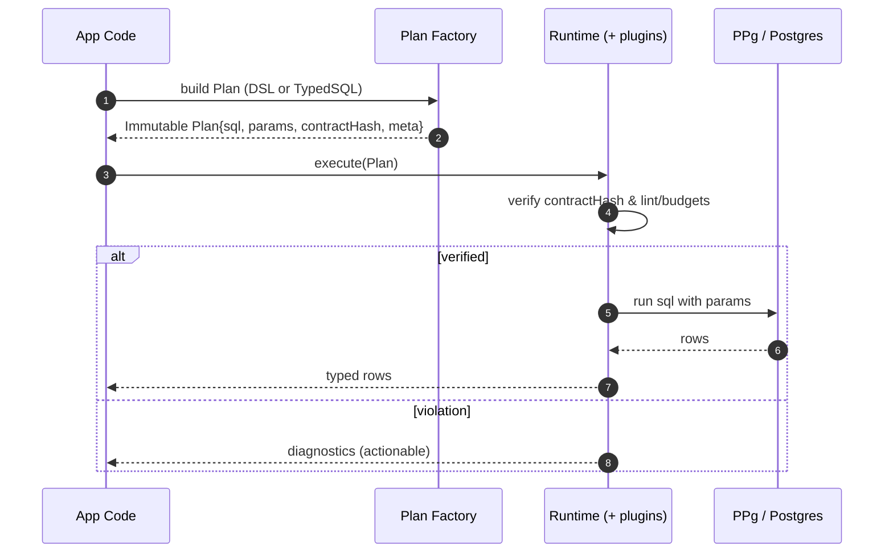
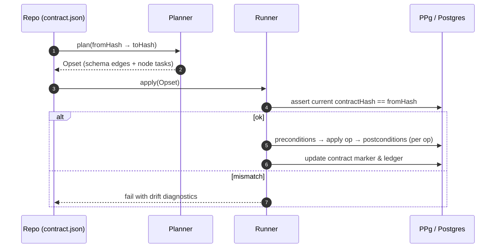

# Prisma Next — Architecture Overview

> **Audience:** Engineering, PM, DX, leadership
> **Goal:** A single entry point to the Prisma Next design: what it is, why it exists, how the pieces fit, and the contracts that bind them.

## Problem & Goals

**Context.** Developer tooling is shifting to agent‑assisted workflows. Agents can write SQL; what they lack is **structure, verification, and safe deployment**. Meanwhile, modern toolchains expect **TypeScript‑native** libs that “just work” without native binaries or heavy client codegen.

**Pain points today:**
- Schema changes are risky; migration order and ad‑hoc scripts cause incidents.
- Generated clients add friction (native binaries, explicit “generate” steps, bundling issues).
- Safety is **after the fact** (runtime errors, post‑hoc reviews), not **by construction**.

**Prisma Next goals.**
1. **Data Contract as the system boundary.** A single, verifiable artifact that ties schema, code, queries, and the database together.
2. **Safety‑first by design.** Guardrails, verification, and preflight checks before changes hit production.
3. **TS‑native developer experience.** No heavy client; minimal, composable runtime; zero‑touch dev integrations (Vite/Next).
4. **Agent‑ready surfaces.** Contracts and plans that are machine‑navigable and deterministic.
5. **Platform advantage with PPg.** A “contract‑aware” hosted Postgres that can preflight, advise, and orchestrate changes.

**Non‑goals (v1).**
- Feature parity with the legacy ORM (e.g., multi‑query relation loading)
- Multi‑dialect at GA. We start with Postgres; others follow success
- Shipping a “black‑box client.” Everything is explicit, inspectable artifacts

## Core Principles

- **Contract‑first.** The **data contract** is the source of truth for structure and capabilities
- **One query → one statement.** No hidden client‑side joins or multi‑roundtrips
- **Plans are data.** Queries and migrations compile to **immutable Plan** objects
- **Thin core, fat targets.** A small, stable core with target‑specific adapters (SQL today; Mongo later)
- **Measured safety.** Guardrails, budgets, and preflight are first‑class, not afterthoughts

## High‑Level Architecture

### Component map

```mermaid
flowchart LR
  subgraph Authoring
    A1[PSL file]:::f
    A2[TS Contract Builder]:::f
  end

  subgraph Emit
    E1[Contract Emitter]:::s
    E2[contract.json<br/>.d.ts types]:::a
  end

  subgraph App
    Q1[Relational DSL]:::s
    Q2[Typed SQL Files]:::s
    Q3[Plan Factories]:::a
    R1[Runtime + Plugins<br/>(guardrails, budgets, telemetry)]:::s
  end

  subgraph Migrate
    M1[Planner<br/>(contract→contract)]:::s
    M2[Runner<br/>(edges + node tasks)]:::s
    M3[Preflight CLI/CI]:::s
  end

  subgraph PPg[Prisma Postgres (PPg)]
    D1[(DB)]:::f
    D2[Contract Marker + Ledger]:::a
    D3[Previews & Orchestrator]:::a
    D4[Advisors/Guardrails]:::a
  end

  A1 --> E1
  A2 --> E1
  E1 --> E2
  E2 --> Q1
  E2 --> Q2
  Q1 --> Q3
  Q2 --> Q3
  Q3 --> R1
  R1 --> D1
  E2 --> M1
  M1 --> M2
  M2 --> D1
  M3 --> D1
  D1 --> D2
  M2 --> D2
  R1 --> D4
  M3 --> D3

  classDef f fill:#e1f5ff;
  classDef s fill:#fff4e1;
  classDef a fill:#f0e1ff;
```

**Legend:**
PSL/TS author a contract → Emitter produces contract.json + types → Queries (DSL or SQL) compile to Plans → Runtime executes with guardrails → Migrate plans & applies contract changes with Preflight → PPg provides contract‑aware previews, orchestration, and advisors.

## Key Request Flows

### Query execution (runtime verification)



### Migration apply (deterministic edges)



## Glossary & Invariants

- **Data Contract.** Canonical JSON describing storage (tables/indexes/FKs) and the models they support. Authored in PSL or a TS builder; emits the same artifact
- **Contract Hash.** A unique identifier for a contract; persisted in artifacts and the database marker
- **Plan.** An immutable object describing a query or a migration opset. Plans carry the contract hash and references
- **Guardrails.** Configurable checks (lints, budgets, policies) applied before execution
- **Preflight.** A dry‑run/EXPLAIN of plans and migrations in CI or a preview DB; returns structured diagnostics
- **Node Task.** A verifiable data operation attached to a contract state (e.g., backfill), separate from schema edges

**Invariants:**

- `plan.contractHash` must match the active contract, or the runtime blocks/warns (configurable)
- Plans are immutable and auditable (hashable)
- One Plan → one DB statement (no hidden multi‑queries)
- Contract emission is deterministic

## Versioning & Stability

- **Packages.** Semver; document stability levels (Stable / Experimental)
- **Data Contract.** Schema version embedded; changes are backward‑compatible within a major line
- **Database Marker.** Includes contract hash and marker schema version for safe upgrades
- **Adapters.** Advertise capability flags (e.g., JSON aggregation). Features gated by capability

## Security & Privacy (Summary)

- **Least privilege.** Runtime uses minimum DB roles; migration runner escalates only when needed
- **No PII in artifacts.** Contracts and plans encode structure, not data
- **Diagnostics redaction.** Errors and EXPLAIN outputs are redacted before logging
- **Auditability.** Migration ledger and plan hashes enable forensic trails
- **Secrets.** Standardized secret management; no secrets in code or artifacts

## PPg (Prisma Postgres) Integration

- **Contract marker in DB.** Simple schema/functions to read/write current contract hash and ledger
- **Preflight‑as‑a‑service.** Preview DB per PR; apply planned edges; run checks; post diagnostics
- **Managed migrations.** Orchestrate safe online changes (concurrent index builds, phased defaults, chunked backfills)
- **Advisors & optional guardrails.** Index/plan suggestions; production policies (timeouts, require LIMIT) when enabled

## Adapters & Future Targets

- **SQL (Postgres v1).** Relational adapter and lowerer; capability flags (e.g., lateral joins)
- **MySQL/SQLite.** Follow once Postgres GA is stable; share the same core contracts and runtime
- **Mongo family (path).** Extend contract to model collections, documents, and indexes; implement a Mongo adapter that compiles Plans into Mongo operations. Same guardrail and preflight story, different target

**Community contribution.** TS‑only, modular design + documented adapter interfaces and plugin hooks make Prisma Next contributor‑friendly: new dialects, migration ops, and plugin packs can be built outside core.

## Test Strategy (Overview)

- **Contract conformance.** Schema validation, hash determinism, back/forward‑compat tests
- **Plan stability.** Golden tests (AST → SQL/diagnostics hash) to detect unintended changes
- **Differential tests.** Where there's overlap with the legacy ORM, verify result and error parity
- **Preflight reliability.** Shadow DB and EXPLAIN‑only modes; reproducibility checks
- **Performance budgets.** CI gates for compile/execute overhead; p95 CRUD targets

## Links to Subsystem Specs

- **Data Contract:** `architecture docs/1. Data Contract — Subsystem Design.md`
- **Contract Emitter & Types:** `architecture docs/2. Contract Emitter & Types.md`
- **Query Lanes:** `architecture docs/3. Query Lanes.md`
- **Runtime & Plugin Framework:** `architecture docs/4. Runtime & Plugin Framework.md`
- **Migration System:** `architecture docs/5. Migration System.md`
- **Preflight & CI Integration:** `architecture docs/6. Preflight & CI Integration.md`
- **PPg Integration:** `architecture docs/7. PPg Integration.md`
- **Adapters & Targets:** `architecture docs/8. Adapters & Targets.md`
- **Security, Privacy, Compliance:** `architecture docs/9. Security, Privacy, Compliance.md`
- **Performance & Capacity:** `architecture docs/10. Performance & Capacity.md`
- **No-Emit Workflow — Technical Design:** `architecture docs/11. No-Emit Workflow — Technical Design.md`

**ADR Index:** `architecture docs/` (e.g., `ADR 001 - Migrations as Edges.md`, `ADR 002 - Plans are Immutable.md`, `ADR 003 - One Query One Statement.md`, etc.)

## Roadmap (At a Glance)

- **MVP (2 weeks):** Postgres; contract emit + auto‑watch; DSL subset; runtime guardrails; additive migrations; preflight; example app
- **Pilot (12 weeks):** Rename/drop via hints; richer diagnostics; squash/baselines; PPg preflight‑as‑a‑service; design partners
- **GA (2 quarters):** Hardened runtime; policy packs; advisors; PPg orchestration; docs & DX polish. Next targets follow success

## Open Questions (To Track in ADRs)

- Default policy levels (warn vs block) per environment
- Contract change tolerance (e.g., extension capabilities) without requiring a full re‑emit
- Optional syntax sugar (compile‑time transforms) for the DSL
- Minimum Mongo surface for a credible v1
**Bottom line:** Prisma Next centers everything on a verifiable data contract. Queries and migrations become plans that we can lint, preflight, and safely execute. Teams get a faster, TS‑native workflow; agents get deterministic surfaces; and PPg becomes a contract‑aware platform that previews and orchestrates changes safely.

