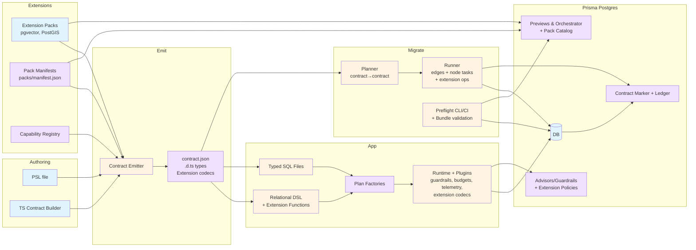
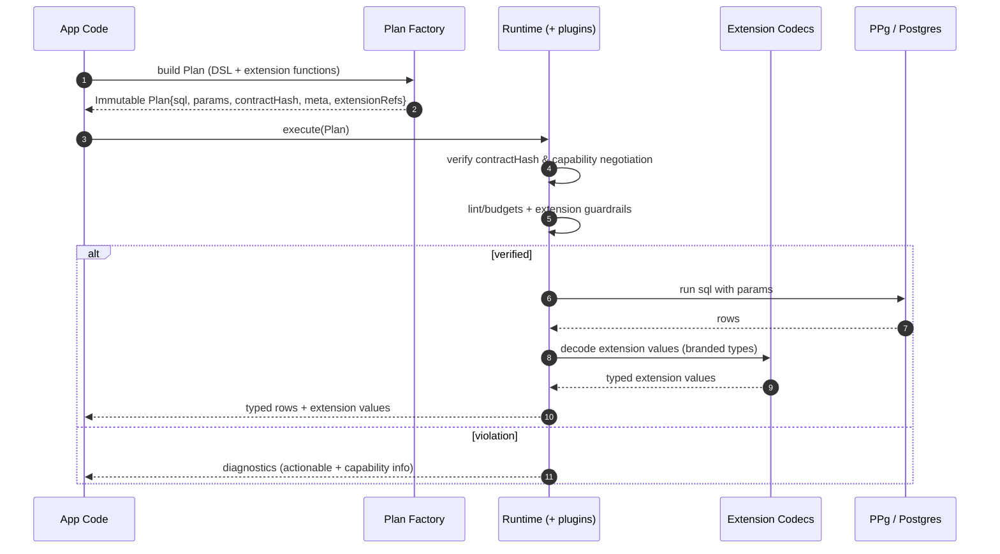
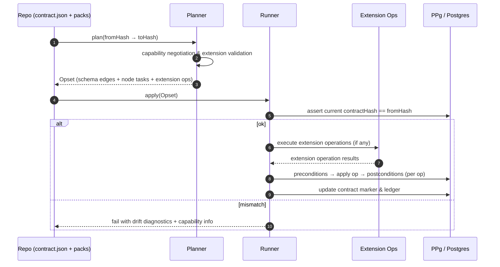

# Prisma Next — Architecture Overview

> **Audience:** Engineering, PM, DX, leadership  
> **Goal:** A single entry point to the Prisma Next design: what it is, why it exists, how the pieces fit, and the contracts that bind them.

## Problem & Goals

**Context.** Developer tooling is shifting to agent‑assisted workflows. Agents can write SQL; what they lack is **structure, verification, and safe deployment**. Meanwhile, modern toolchains expect **TypeScript‑native** libs that “just work” without native binaries or heavy client codegen.

**Pain points today:**
- Schema changes are risky; migration order and ad‑hoc scripts cause incidents.
- Generated clients add friction (native binaries, explicit “generate” steps, bundling issues).
- Safety is **after the fact** (runtime errors, post‑hoc reviews), not **by construction**.

**Prisma Next goals.**
1. **Data Contract as the system boundary.** A single, verifiable artifact that ties schema, code, queries, and the database together.
2. **Safety‑first by design.** Guardrails, verification, and preflight checks before changes hit production.
3. **TS‑native developer experience.** No heavy client; minimal, composable runtime; zero‑touch dev integrations (Vite/Next).
4. **Agent‑ready surfaces.** Contracts and plans that are machine‑navigable and deterministic.
5. **Platform advantage with PPg.** A “contract‑aware” hosted Postgres that can preflight, advise, and orchestrate changes.

**Non‑goals (v1).**
- Feature parity with the legacy ORM (e.g., multi‑query relation loading)
- Multi‑dialect at GA. We start with Postgres; others follow success
- Shipping a “black‑box client.” Everything is explicit, inspectable artifacts

## Core Principles

- **Contract‑first.** The **data contract** is the source of truth for structure and capabilities
- **One query → one statement.** No hidden client‑side joins or multi‑roundtrips
- **Plans are data.** Queries and migrations compile to **immutable Plan** objects
- **Thin core, fat targets.** A small, stable core with target‑specific adapters (SQL today; Mongo later)
- **Measured safety.** Guardrails, budgets, and preflight are first‑class, not afterthoughts

## High‑Level Architecture

### Component map

**Legend:**
PSL/TS author a contract + Extension Packs provide domain capabilities → Emitter produces contract.json + types + extension codecs → Queries (DSL or SQL) compile to Plans with extension functions → Runtime executes with guardrails + extension codecs → Migrate plans & applies contract changes with Preflight + bundle validation → PPg provides contract‑aware previews, orchestration, advisors, and pack catalog.

## Key Request Flows

### Query execution (runtime verification)

### Migration apply (deterministic edges)

## Core Concepts

- **Plan.** An immutable object describing a query or a migration opset. Plans carry the contract hash, references, and annotations for policy enforcement
- **Guardrails.** Configurable checks (lints, budgets, policies) applied before execution, including extension-specific rules
- **Preflight.** A dry‑run/EXPLAIN of plans and migrations in CI or a preview DB; returns structured diagnostics including capability verification
- **Data Contract.** Canonical JSON describing storage, models, capabilities, and extensions. Authored in PSL or TS; emits identical artifacts
- **Contract Hash.** Unique identifier with `coreHash` (logical schema) and `profileHash` (physical capabilities)
- **Plan.** Immutable query or migration object with contract hash and policy annotations
- **Extension Pack.** Versioned npm package providing domain capabilities (pgvector, PostGIS) through standardized SPIs

**Key Invariants:**
- Plans are immutable and auditable (hashable)
- One Plan → one DB statement (no hidden multi-queries)
- Contract emission is deterministic
- Extension capabilities are negotiated at runtime

## Versioning & Stability

- **Packages.** Semver; document stability levels (Stable / Experimental)
- **Data Contract.** Schema version embedded; changes are backward‑compatible within a major line
- **Database Marker.** Includes contract hash and marker schema version for safe upgrades
- **Adapters.** Advertise capability flags (e.g., JSON aggregation). Features gated by capability

## Security & Privacy (Summary)

- **Least privilege.** Runtime uses minimum DB roles; migration runner escalates only when needed
- **No PII in artifacts.** Contracts and plans encode structure, not data
- **Diagnostics redaction.** Errors and EXPLAIN outputs are redacted before logging
- **Auditability.** Migration ledger and plan hashes enable forensic trails
- **Secrets.** Standardized secret management; no secrets in code or artifacts

## PPg (Prisma Postgres) Integration

- **Contract marker in DB.** Simple schema/functions to read/write current contract hash and ledger
- **Preflight‑as‑a‑service.** Preview DB per PR; apply planned edges; run checks; post diagnostics
- **Managed migrations.** Orchestrate safe online changes (concurrent index builds, phased defaults, chunked backfills)
- **Pack catalog.** Hosted registry of extension packs with capability negotiation and regional availability
- **Advisors & guardrails.** Index/plan suggestions; production policies; extension-specific guardrails when enabled

## Adapters & Future Targets

- **SQL (Postgres v1).** Relational adapter with capability negotiation (lateral joins, JSON aggregation, extension support)
- **MySQL/SQLite.** Follow once Postgres GA is stable; share the same core contracts, runtime, and extension system
- **Mongo family (path).** Extend contract to model collections, documents, and indexes; implement a Mongo adapter that compiles Plans into Mongo operations. Same guardrail and preflight story, different target

**Community contribution.** TS‑only, modular design + documented adapter interfaces, plugin hooks, and extension pack APIs make Prisma Next contributor‑friendly: new dialects, migration ops, and extension packs can be built outside core.

## Test Strategy (Overview)

- **Contract conformance.** Schema validation, hash determinism, back/forward‑compat tests
- **Plan stability.** Golden tests (AST → SQL/diagnostics hash) to detect unintended changes
- **Extension testing.** Capability negotiation, codec validation, and extension-specific guardrails
- **Differential tests.** Where there's overlap with the legacy ORM, verify result and error parity
- **Preflight reliability.** Shadow DB and EXPLAIN‑only modes; reproducibility checks
- **Performance budgets.** CI gates for compile/execute overhead; p95 CRUD targets

## Artifacts

Prisma Next produces several key artifacts that serve as the foundation for type safety, verification, and tooling:

### Core Artifacts
- **`contract.json`** — Canonical data contract describing models, storage, capabilities, and extensions
- **`contract.d.ts`** — TypeScript declaration file exposing table and model types for the DSL
- **`packs/manifest.json`** — Extension pack manifests declaring capabilities and integration points

### Migration Artifacts
- **Migration files** — Migration packages containing from/to contract hashes, operations, and edge metadata for contract-to-contract transitions
- **Optional graph index** — Performance cache for pathfinding on large DAG (optional, regeneratable from migration files)
- **Database migration ledger** — Audit trail in database for tooling, UI, and historical visualization (not used for operations)
- **Bundle archives** — Self-contained artifacts for preflight containing contracts, migrations, and pack code

### Development Artifacts
- **`.d.ts` types** — Generated TypeScript types for tables, columns, and extension values
- **Plan factories** — TypedSQL-generated query factories with contract verification

## Links to Subsystem Specs

- **[Data Contract](architecture%20docs/subsystems/1.%20Data%20Contract.md)** — Core contract model, PSL/TS authoring, extensions
- **[Contract Emitter & Types](architecture%20docs/subsystems/2.%20Contract%20Emitter%20&%20Types.md)** — Type generation, branded types, extension codecs
- **[Query Lanes](architecture%20docs/subsystems/3.%20Query%20Lanes.md)** — DSL, TypedSQL, extension functions, capability branching
- **[Runtime & Plugin Framework](architecture%20docs/subsystems/4.%20Runtime%20&%20Plugin%20Framework.md)** — Execution, plugins, capability negotiation
- **[Migration System](architecture%20docs/subsystems/5.%20Migration%20System.md)** — Edge-based migrations, extension operations
- **[Preflight & CI Integration](architecture%20docs/subsystems/6.%20Preflight%20&%20CI%20Integration.md)** — Validation, bundles, profile negotiation
- **[PPg Integration](architecture%20docs/subsystems/7.%20PPg%20Integration.md)** — Hosted services, pack catalog, server-side guardrails
- **[Adapters & Targets](architecture%20docs/subsystems/8.%20Adapters%20&%20Targets.md)** — Database adapters, capability schema, conformance
- **[Security, Privacy, Compliance](architecture%20docs/subsystems/9.%20Security%2C%20Privacy%2C%20Compliance.md)** — Security model, bundle signatures, sandboxing
- **[Performance & Capacity](architecture%20docs/subsystems/10.%20Performance%20&%20Capacity.md)** — Performance budgets, extension overhead
- **[No-Emit Workflow](architecture%20docs/subsystems/11.%20No-Emit%20Workflow.md)** — TS authoring, extension serialization, CI trust model
- **[Ecosystem Extensions & Packs](architecture%20docs/subsystems/12.%20Ecosystem%20Extensions%20&%20Packs.md)** — Extension pack architecture, publishing, registry

**ADR Index:** [architecture docs/ADR-INDEX.md](architecture%20docs/ADR-INDEX.md) — Complete index of all ADRs with descriptions and links

## Roadmap (At a Glance)

- **MVP (2 weeks):** Postgres; contract emit + auto‑watch; DSL subset; runtime guardrails; additive migrations; preflight; example app
- **Pilot (12 weeks):** Rename/drop via hints; richer diagnostics; squash/baselines; PPg preflight‑as‑a‑service; design partners
- **GA (2 quarters):** Hardened runtime; policy packs; advisors; PPg orchestration; docs & DX polish. Next targets follow success

## Open Questions (To Track in ADRs)

- Default policy levels (warn vs block) per environment
- Contract change tolerance (e.g., extension capabilities) without requiring a full re‑emit
- Optional syntax sugar (compile‑time transforms) for the DSL
- Minimum Mongo surface for a credible v1
**Bottom line:** Prisma Next centers everything on a verifiable data contract. Queries and migrations become plans that we can lint, preflight, and safely execute. Teams get a faster, TS‑native workflow; agents get deterministic surfaces; and PPg becomes a contract‑aware platform that previews and orchestrates changes safely.

