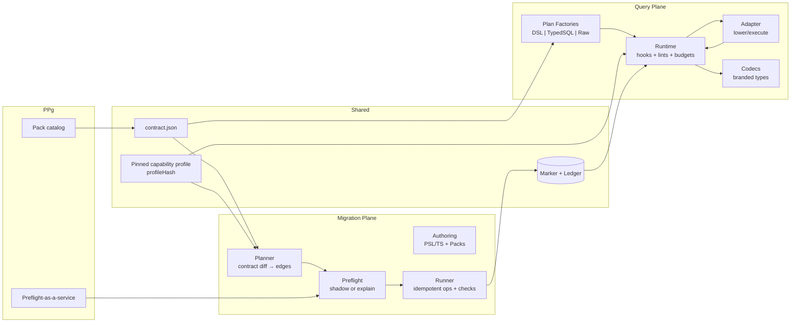
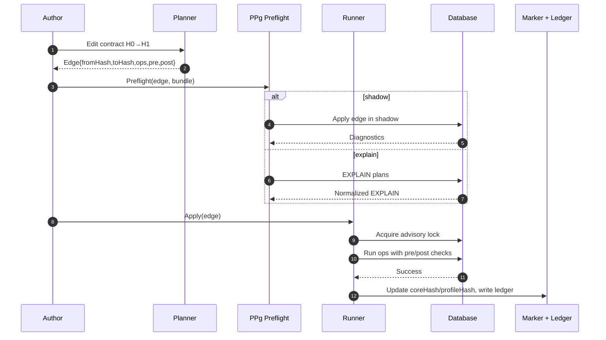
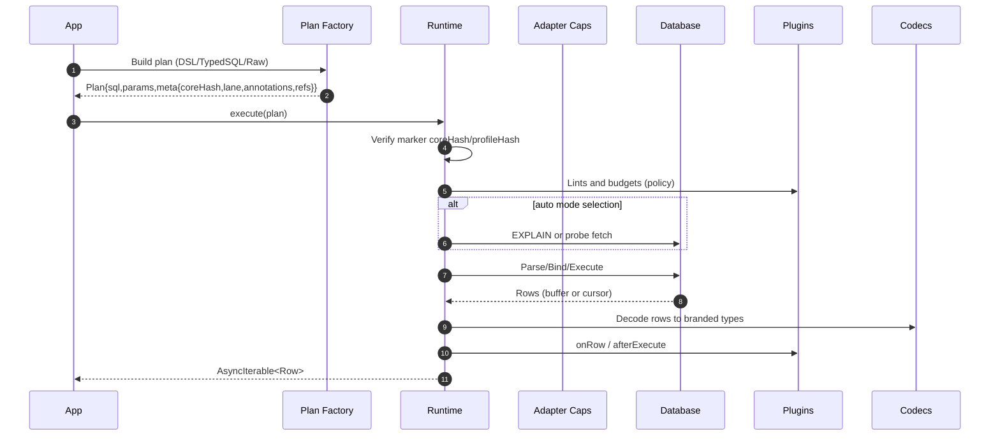
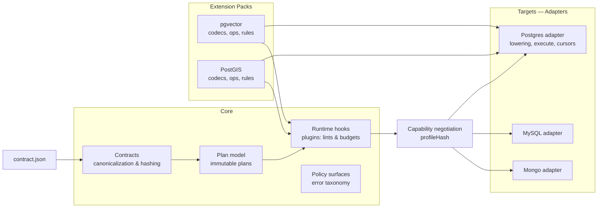

# Prisma Next — Architecture Overview

## Agent-First ORM

Prisma Next is an ORM designed for software agents. Agents need deterministic surfaces, machine-readable structure, and tight feedback loops. Prisma Next makes every operation explicit and inspectable so agents—and the humans working alongside them—always know what will happen, why it is safe, and how to adapt it.

This architecture focuses on three outcomes:

- **Deterministic behavior:** Declarative artifacts define every execution path, and verification happens before data is touched
- **Explicit, machine-readable contracts:** The data contract sets the system boundary, describing schema, capabilities, and policies for both queries and migrations
- **Guardrails with frequent feedback:** Authoring tools, PPg, and the runtime surface the intent, validation, and policy impact of each operation before it can cause drift

Prisma Next also addresses the largest weakness in the legacy Prisma ORM: a monolithic, tightly coupled codebase. By modularizing responsibilities, new behaviors are introduced by composing modules and capability packs instead of patching core implementation.

## Guiding Principles

### Contract-first
The contract is the center of gravity. A single canonical `contract.json` defines what exists, what’s allowed, and what’s expected. Both planes ingest the same deterministic data and verify `coreHash` and `profileHash` against the database marker before acting. Contracts carry no executable logic; they are data that gates execution (ADR 006, ADR 010, ADR 021)

### Plans are the product
We don’t execute intent directly; we compile it into immutable Plans. Every query plan lowers to one statement for predictability and guardrails, and every migration is a contract→contract edge with verifiable pre and post conditions. Plans are hashable, auditable, and portable across environments (ADR 002, ADR 003, ADR 001, ADR 011)

### Thin core, fat targets
Keep the core small and stable—contracts, plan model, runtime lifecycle, and policy surfaces—while adapters and extension packs carry dialect and capability logic. Capabilities are declared in the contract and verified against the database so behavior is explicit and swappable without touching core (ADR 005, ADR 112, ADR 117)

### Explicit over implicit
No hidden multi round-trips, fallbacks, or adapter heuristics. Strategies are chosen explicitly via hints, annotations, and capability checks; raw SQL carries annotations so guardrails still apply. Multi-step behavior is expressed as explicit pipelines or transactions, not implicit client behavior (ADR 003, ADR 012, ADR 018, ADR 022)

### Compose, don’t configure
Behavior comes from adapters, extension packs, and runtime plugins, not global flags or magic modes. The ORM is optional and built on the relational DSL; packs contribute codecs, functions, and ops without changing core implementation (ADR 014, ADR 015, ADR 112)

### Feedback before execution
Fast, targeted feedback at authoring, planning, and execution time. Lints and budgets, preflight in CI and PPg, and marker checks catch risks early and explain what to fix, with stricter defaults in staging and production (ADR 022, ADR 029, ADR 051, ADR 021, ADR 115)

## Architecture at a Glance

Prisma Next is organized around two planes that share the contract and a pinned capability profile

- **Migration Plane** (build time): authoring, planning, verifying, and applying contract changes
- **Query Plane** (runtime): authoring, validating, and executing query plans against live data

Both planes operate on the same shared artifacts:

- **Data Contract:** Generated from PSL + TypeScript builders + extension manifests and distributed as JSON alongside TypeScript definitions
- **Capability profile (pinned):** The contract declares required capabilities (and optional adapter pins) and emits a pinned `profileHash`. The runner verifies the database satisfies the contract and writes the same `profileHash` to the marker (ADR 117, ADR 021)
- **Plan Factories:** Compile declarative inputs into deterministic plans with hash-stamped metadata
- **Guardrail Plugins:** Applied during plan creation, PPg preflight, and runtime execution
- **Marker and ledger:** Database marker storing `coreHash` and `profileHash` plus an append-only ledger of applied edges for verification and audit (ADR 021, ADR 001)

### Diagram — System map

## Migration Plane — Self-Verifying Change

**Authoring**

- Contract authors update PSL or TypeScript builders
- Extension packs contribute capability manifests and code hooks

**Planning**

- Planner computes graph edges between contract revisions
- Each migration edge produces an immutable plan `{ edgeId, fromHash, toHash, ops, tasks, preconditions, postconditions }`

**Verification**

- Plans simulate locally; PPg can answer “Will this migration do what I expect?” via preflight
- Pre and post checks, capability gates, and policy checks run before apply

**Execution**

- Runner executes operations idempotently
- Drift detection ensures the database marker matches the expected `from` hash

**Feedback loop**

- Postconditions verify effects; PPg ledger records contract hashes and applied migrations
- Failures emit diagnostics tied back to contract statements or extension hooks

### Diagram — Migration preflight and apply

## Query Plane — Runtime Assertions

**Authoring**

- Queries are defined through a relational DSL, TypedSQL, or generated functions from extension packs
- Authoring surfaces capability annotations so agents understand available operations

**Planning**

- Every query compiles to a plan `{ sql, params, meta: { coreHash, optional profileHash, lane, annotations, refs } }`
- Plans are immutable and executable across environments

**Verification**

- Runtime verifies marker `coreHash` and `profileHash` equality with the contract and applies lint rules and budgets configured by policy
- Extensible linting highlights potential issues before execution

**Execution**

- Runtime streams results through adapters while extension codecs decode branded types deterministically
- Results are exposed as `AsyncIterable<Row>` with pre‑emission buffer vs stream selection based on adapter capabilities and configured thresholds (ADR 124, ADR 125)
- Guardrail plugins observe execution for telemetry, throttling, or policy enforcement

**Feedback loop**

- Immediate feedback on query success or failure, capability mismatches, or contract drift
- Plans and results are logged in machine-readable formats for agents and observability tooling

### Diagram — Query execution

## Guardrails and Feedback Matrix

| Stage            | Migration Plane                                                  | Query Plane                                                     |
|------------------|------------------------------------------------------------------|-----------------------------------------------------------------|
| Authoring        | Contract builders validate schema intent and capability usage.   | DSL annotations and TypedSQL expose capabilities and policies. |
| Planning         | Planner simulates edges; hash-stamps preconditions and outcomes. | Plan factories attach lint/budget annotations. |
| Preflight/Verify | PPg answers “Will this migration do what I expect?” and enforces policy gates. | Runtime verifies marker equality and applies guardrail plugins. |
| Execution        | Runner enforces idempotency, markers, and extension requirements. | Streaming execution monitored by guardrail plugins and budgets. |
| Post-feedback    | PPg ledger, drift detectors, and diagnostics inform authors.     | Policy outcomes and drift indicators feed back to authoring tools. |
## Modularity and Extensibility

Legacy Prisma required touching multiple layers of a monolithic Rust/TypeScript codebase to add features. Prisma Next treats the core as a stable execution kernel and exposes extension hooks instead.

- **Extension packs** supply capabilities, migration operations, codecs, and policies in manifest-driven bundles
- **Adapters** implement database-specific behavior behind capability interfaces
- **Plugins** compose runtime guardrails (budgets, telemetry, policy enforcement) without altering the executor
- **Capability negotiation** ensures new behavior is discoverable and opt-in through explicit contract declarations

Contributors extend behavior by publishing packs or adapters. Core recompilation is not required.

### Diagram — Thin core, fat targets

## Role of Prisma Postgres (PPg)

PPg is a contract-aware Postgres service that amplifies determinism and feedback.

- **Preflight service:** answers “Will this migration do what I expect?” by simulating plans against staged data
- **Contract ledger:** records contract hashes and applied edges to detect drift instantly
- **Advisor and guardrail enforcement:** applies capability policies, extension requirements, and advisor recommendations server-side
- **Pack catalog:** distributes approved extension packs with capability metadata

PPg is optional, but using it delivers zero-touch guardrails for teams and agents.
## Operating the System

- **Drift handling:** Marker checks, plan hashes, and contract verification detect drift at startup, before queries, and throughout migration workflows
- **Environment policies:** Development environments allow automatic reconciliation while staging and production enforce strict guardrails and human approval
- **Observability:** Plans, guardrail outcomes, and contract changes are logged in machine-readable formats for agents and dashboards
## Roadmap Snapshot

1. **MVP:** Postgres support, contract emit, plan factories, runtime guardrails, PPg preflight previews
2. **Pilot:** Rename/drop with policy hints, richer diagnostics, pack catalog, PPg-managed advisors and orchestration
3. **GA:** Hardened runtime, policy packs, additional database adapters, contributor-friendly extension tooling
