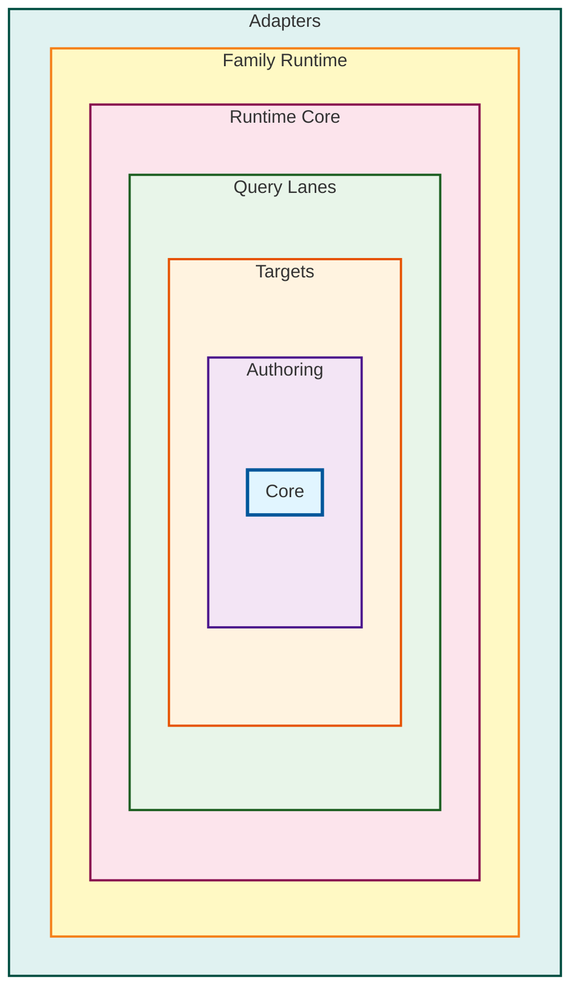

# Package Layering & Naming Conventions

This document describes the package layering structure and naming conventions for Prisma Next, as defined in [ADR 140](../adrs/ADR%20140%20-%20Package%20Layering%20&%20Target-Family%20Namespacing.md).

## Overview

The package structure encodes both Clean Architecture rings and target-family namespaces. This ensures:

- Clear ownership and boundaries
- Prevention of cyclic/inward dependencies via structure and lint rules
- Readable, repeatable path for adding new target families
- Target-agnostic runtime core

## Ring Structure

Packages are organized into concentric rings, with dependencies flowing inward:

```
core → authoring → targets → lanes → runtime(core) → family-runtime → adapters
```

### Package Layering Diagram



### Core Ring

The innermost ring containing target-family agnostic types and utilities.

- `packages/core/contract/` → `@prisma-next/contract` - Core contract types + plan metadata
- `packages/core/plan/` → `@prisma-next/plan` - Plan helpers, diagnostics, shared errors
- `packages/core/operations/` → `@prisma-next/operations` - Target-neutral operation registry + capability helpers

**Dependency Rules:** Cannot import from any other ring.

### Authoring Ring

Contract authoring surfaces for creating contracts programmatically.

- `packages/authoring/contract-authoring/` → `@prisma-next/contract-authoring` - TS builders, canonicalization, schema DSL
- `packages/authoring/contract-ts/` → `@prisma-next/contract-ts` - TS authoring surface (future)
- `packages/authoring/contract-psl/` → `@prisma-next/contract-psl` - PSL parser + IR (future)

**Dependency Rules:** Can import from `core/*` only.

### Targets Ring

Target-family specific contract types and emitter hooks.

- `packages/targets/sql/contract-types/` → `@prisma-next/sql-contract-types` - SQL contract types
- `packages/targets/sql/operations/` → `@prisma-next/sql-operations` - SQL-specific operations
- `packages/targets/sql/emitter/` → `@prisma-next/sql-contract-emitter` - SQL emitter hook

**Dependency Rules:** Can import from `core/*` and `authoring/*` only.

### SQL Family Namespace

SQL-specific packages that live in the SQL family namespace (`packages/sql/`) to keep SQL family cohesion.

**Authoring:**
- `packages/sql/authoring/sql-contract-ts/` → `@prisma-next/sql-contract-ts` - SQL-specific TypeScript contract authoring surface (`defineContract`, `validateContract`)

**Lanes:**
- `packages/sql/lanes/relational-core/` → `@prisma-next/sql-relational-core` - Schema + column builders, operation attachment, AST types
- `packages/sql/lanes/sql-lane/` → `@prisma-next/sql-lane` - Relational DSL + raw SQL helpers
- `packages/sql/lanes/orm-lane/` → `@prisma-next/sql-orm-lane` - ORM builder, include compilation, relation filters

**Dependency Rules:** Can import from `core/*`, `authoring/*`, `targets/sql/*`, and other SQL family packages.

### Runtime Ring

Target-agnostic runtime kernel.

- `packages/runtime/core/` → `@prisma-next/runtime-core` - Target-agnostic runtime kernel (verification, plugins, SPI)

**Dependency Rules:** Can import from `core/*`, `authoring/*`, `targets/sql/*` only (no direct imports from `targets/*`).

### SQL Family Runtime & Adapters

SQL-specific runtime implementation and adapters.

- `packages/sql/sql-runtime/` → `@prisma-next/sql-runtime` - SQL runtime implementation of the SPI
- `packages/sql/postgres/postgres-adapter/` → `@prisma-next/adapter-postgres` - Postgres adapter (conventional name)
- `packages/sql/postgres/postgres-driver/` → `@prisma-next/driver-postgres` - Postgres driver (conventional name)

**Dependency Rules:**
- `sql/sql-runtime` → can import from `runtime/core` and `targets/sql/*` and `sql/postgres/*` only
- `sql/postgres/*` → can import from `targets/sql/*` and `sql/sql-runtime` only

### Compat Ring

Compatibility layers for migration.

- `packages/compat/compat-prisma/` → `@prisma-next/compat-prisma` - Compatibility packages

**Dependency Rules:** Can import from all inner rings.

## Naming Conventions

### Published Package Names

**Key Principle:** Published package name is the import specifier. Directory layout is for humans and guardrails.

- Use the published package name as the only import specifier
- Encode target family in the package name prefix (e.g., `@prisma-next/sql-...`)
- Collapse nested directories to hyphenated names (no slashes after scope)
- Keep conventional names for adapters/drivers (e.g., `@prisma-next/adapter-postgres`, `@prisma-next/driver-postgres`), even if they live under `packages/sql/postgres/**`
- Rings constrain dependencies but don't appear in package names except when meaningful (e.g., `runtime-core`)

### Examples

| Directory | Published Package Name |
|-----------|------------------------|
| `packages/core/contract/` | `@prisma-next/contract` |
| `packages/core/plan/` | `@prisma-next/plan` |
| `packages/core/operations/` | `@prisma-next/operations` |
| `packages/authoring/contract-authoring/` | `@prisma-next/contract-authoring` |
| `packages/targets/sql/contract-types/` | `@prisma-next/sql-contract-types` |
| `packages/targets/sql/emitter/` | `@prisma-next/sql-contract-emitter` |
| `packages/sql/lanes/relational-core/` | `@prisma-next/sql-relational-core` |
| `packages/sql/lanes/sql-lane/` | `@prisma-next/sql-lane` |
| `packages/sql/lanes/orm-lane/` | `@prisma-next/sql-orm-lane` |
| `packages/runtime/core/` | `@prisma-next/runtime-core` |
| `packages/sql/sql-runtime/` | `@prisma-next/sql-runtime` |
| `packages/sql/postgres/postgres-adapter/` | `@prisma-next/adapter-postgres` |
| `packages/sql/postgres/postgres-driver/` | `@prisma-next/driver-postgres` |
| `packages/compat/compat-prisma/` | `@prisma-next/compat-prisma` |

## TypeScript Path Aliases

### Published Package Name Aliases

Path aliases map published package names to source entry files:

```json
{
  "compilerOptions": {
    "paths": {
      "@prisma-next/contract": ["packages/core/contract/src/index.ts"],
      "@prisma-next/plan": ["packages/core/plan/src/index.ts"],
      "@prisma-next/operations": ["packages/core/operations/src/index.ts"],
      "@prisma-next/contract-authoring": ["packages/authoring/contract-authoring/src/index.ts"],
      "@prisma-next/sql-contract-types": ["packages/targets/sql/contract-types/src/index.ts"],
      "@prisma-next/sql-lane": ["packages/sql/lanes/sql-lane/src/index.ts"],
      "@prisma-next/runtime-core": ["packages/runtime/core/src/index.ts"],
      "@prisma-next/sql-runtime": ["packages/sql/sql-runtime/src/index.ts"],
      "@prisma-next/adapter-postgres": ["packages/sql/postgres/postgres-adapter/src/index.ts"],
      "@prisma-next/driver-postgres": ["packages/sql/postgres/postgres-driver/src/index.ts"]
    }
  }
}
```

### Optional Ring Aliases (Dev-Time Only)

Ring aliases are optional ergonomic helpers for internal development. They are **not** for published imports:

```json
{
  "compilerOptions": {
    "paths": {
      "@core/*": ["packages/core/*/src"],
      "@authoring/*": ["packages/authoring/*/src"],
      "@targets/sql/*": ["packages/targets/sql/*/src"],
      "@sql/*": ["packages/sql/*/src"],
      "@runtime/*": ["packages/runtime/*/src"],
      "@adapters/*": ["packages/sql/*/*/src"]
    }
  }
}
```

## Dependency Rules

### General Rules

1. **Inner rings never import outer rings** - This is enforced by directory structure and import validation
2. **Family namespaces** (e.g., `packages/sql/**`) can depend on inner rings and their own family packages, but not across families
3. **Directory placement dictates allowed dependencies** (ring + family); package name dictates how consumers import

### Specific Rules by Ring

- **`core/*`** → cannot import from any other ring
- **`authoring/*`** → can import from `core/*` only
- **`targets/sql/*`** → can import from `core/*` and `authoring/*` only
- **`sql/lanes/*`** → can import from `core/*`, `authoring/*`, `targets/sql/*` only
- **`runtime/core`** → can import from `core/*`, `authoring/*`, `targets/sql/*` only (no direct imports from `targets/*`)
- **`sql/sql-runtime`** → can import from `runtime/core` and `targets/sql/*` and `sql/postgres/*` only
- **`sql/postgres/*`** → can import from `targets/sql/*` and `sql/sql-runtime` only

### Family Rules

- Family namespaces (e.g., `sql/*`) can import from inner rings and their own family packages
- Family namespaces cannot import from other families (e.g., `sql/*` cannot import `document/*`)
- SQL family packages use `@prisma-next/sql-...` prefix for discoverability

## Package Exports Pattern

Use curated subpath exports to keep public API stable across internal moves:

```json
{
  "name": "@prisma-next/sql-lane",
  "type": "module",
  "exports": {
    ".": {
      "types": "./dist/index.d.ts",
      "import": "./dist/index.js"
    },
    "./sql": {
      "types": "./dist/exports/sql.d.ts",
      "import": "./dist/exports/sql.js"
    },
    "./schema": {
      "types": "./dist/exports/schema.d.ts",
      "import": "./dist/exports/schema.js"
    },
    "./param": {
      "types": "./dist/exports/param.d.ts",
      "import": "./dist/exports/param.js"
    }
  },
  "files": ["dist"]
}
```

## Workspace Configuration

The `pnpm-workspace.yaml` includes patterns for all rings:

```yaml
packages:
  - packages/core/*
  - packages/authoring/*
  - packages/targets/sql/*
  - packages/sql/**
  - packages/runtime/*
  - packages/compat/*
  - packages/*
  - examples/*
```

## Import Validation

Import dependencies are validated using `scripts/check-imports.mjs`:

```bash
pnpm lint:deps
```

This script:
- Scans all TypeScript files in `packages/`
- Validates imports against ring and family rules
- Reports violations with detailed context
- Can be run locally or in CI
- Enforces the dependency direction: `core → authoring → targets → lanes → runtime-core → family-runtime → adapters`

**Status:** ✅ Scaffolding complete - Import validation script is active and enforces ring-based dependency rules.

## Adding New Packages

When adding a new package:

1. **Choose the correct ring** based on dependencies and purpose
2. **Choose the correct family namespace** if target-family specific (e.g., `packages/sql/**`)
3. **Follow naming conventions** - use hyphenated names, encode family in prefix
4. **Add path aliases** to `tsconfig.base.json` mapping published name to source
5. **Add workspace pattern** to `pnpm-workspace.yaml` if needed
6. **Create README.md** documenting purpose, dependencies, and architecture
7. **Run import check** to verify no violations

## Migration Notes

**Scaffolding Status:** ✅ Complete (Slice 1)

The package layering structure has been scaffolded with placeholder packages:
- All ring directories created (`core/`, `authoring/`, `targets/`, `lanes/`, `runtime/`, `sql/`, `compat/`, `document/`)
- Placeholder packages with basic structure (package.json, tsconfig.json, src/index.ts, tsup.config.ts, README.md)
- Workspace configuration updated (`pnpm-workspace.yaml`)
- TypeScript path aliases and project references added (`tsconfig.base.json`)
- Import validation script created (`scripts/check-imports.mjs`)
- `pnpm lint:deps` script added to root package.json

**Migration Status:** ✅ Phase 2 Complete (Slice 2)

- **Contract Authoring (Phase 1)**: SQL contract authoring code moved from `@prisma-next/sql-query` to `@prisma-next/sql-contract-ts` in the SQL family namespace (`packages/sql/authoring/sql-contract-ts`)
- **Contract Authoring (Phase 2)**: Target-agnostic contract authoring core extracted to `@prisma-next/contract-authoring` in the authoring ring (`packages/authoring/contract-authoring`)
- `@prisma-next/sql-contract-ts` now composes `@prisma-next/contract-authoring` with SQL-specific types
- Integration tests that depend on both `sql-contract-ts` and `sql-query` moved to `@prisma-next/integration-tests` to avoid cyclic dependencies
- `@prisma-next/sql-query` maintains backward compatibility through re-exports (will be removed in Slice 7)
- Duplicate implementation files removed from `@prisma-next/sql-query` after migration

During migration from the old structure:

- Old packages remain in `packages/*` (legacy location)
- New packages are created in ring-based structure
- Path aliases support both old and new locations during transition
- Import check script validates both old and new packages
- Once migration is complete, old packages will be removed

## References

- [ADR 140 - Package Layering & Target-Family Namespacing](../adrs/ADR%20140%20-%20Package%20Layering%20&%20Target-Family%20Namespacing.md)
- [Brief 12 - Package Layering](../../briefs/12-Package-Layering.md)
- [ADR 005 - Thin Core, Fat Targets](../adrs/ADR%20005%20-%20Thin%20Core,%20Fat%20Targets.md)


