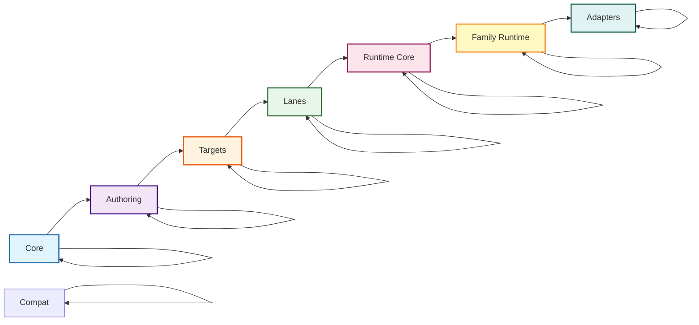

# Package Layering & Naming Conventions

This document describes the package layering structure and naming conventions for Prisma Next, as defined in [ADR 140](../adrs/ADR%20140%20-%20Package%20Layering%20&%20Target-Family%20Namespacing.md).

## Overview

The package structure encodes **three orthogonal ideas**:

1. **Domains** (framework vs target families). The framework domain is target-agnostic; target families (SQL, document, etc.) are family-specific.
2. **Layers** (responsibility-based layers). Layers express dependency *direction*: packages may depend on peers in the same layer (lateral relationships) and on layers closer to core (downward), but never "upward."
3. **Planes** (migration vs runtime). Migration plane (authoring, tooling, targets) must not import runtime plane code. Runtime plane may consume artifacts (JSON/manifests) from migration, but not code imports.

This separation keeps the architecture flexible (per the original Clean Architecture guidance) while still making it obvious where SQL/document packages live and enforcing clear boundaries between migration and runtime concerns.

## Domain and Layer Structure

### Framework Domain (Target-Agnostic)

The framework domain contains target-agnostic packages that work across all target families:

```
* framework
|-- core (shared plane)
|   |-- @prisma-next/contract
|   |-- @prisma-next/plan
|   |-- @prisma-next/operations
|-- authoring (migration plane)
|   |-- @prisma-next/contract-authoring
|   |-- @prisma-next/contract-ts (future)
|   |-- @prisma-next/contract-psl (future)
|-- tooling (migration plane)
|   |-- @prisma-next/cli
|   |-- @prisma-next/emitter
|   |-- @prisma-next/node-utils
|-- runtime-core (runtime plane)
    |-- @prisma-next/runtime-core
```

### SQL Target Family Domain

The SQL domain contains SQL-specific packages organized by layer:

```
* sql target family
|-- authoring (migration plane)
|   |-- @prisma-next/sql-contract-ts
|-- targets (migration→runtime boundary)
|   |-- @prisma-next/sql-contract-types
|   |-- @prisma-next/sql-operations
|   |-- @prisma-next/sql-contract-emitter
|-- lanes (runtime plane)
|   |-- @prisma-next/sql-relational-core
|   |-- @prisma-next/sql-lane
|   |-- @prisma-next/sql-orm-lane
|-- runtime (runtime plane)
|   |-- @prisma-next/sql-runtime
|-- adapters (runtime plane)
    |-- @prisma-next/adapter-postgres
    |-- @prisma-next/driver-postgres
    |-- @prisma-next/compat-prisma
```

### Layer Structure

Clean Architecture layers for Prisma Next:

- **Core** – target-agnostic contracts, plan metadata, shared operations, runtime kernel.
- **Authoring** – PSL/TS builders that produce contracts.
- **Targets** – family-specific contract types and emitter hooks.
- **Lanes** – query DSLs/ORMs that produce AST plans.
- **Runtime** – target-neutral runtime core plus per-family runtime implementations.
- **Adapters** – database adapters/drivers and optional compat layers.

Dependencies flow downward (toward core); lateral dependencies within the same layer are permitted. Example: `@prisma-next/sql-lane` and `@prisma-next/sql-orm-lane` both live in the Lanes layer, so they may share helpers via `@prisma-next/sql-relational-core`, but neither may depend on Runtime or Adapters. Optional compat packages live at the edge alongside adapters; they can depend on inner layers but do not form a separate layer.

```
Core → Authoring → Targets → Lanes → Runtime → Adapters
             (lateral deps allowed within each layer)
```

### Layer Diagram



### Dependency Rules

**Within a domain:**
- Layers may depend laterally (same layer) and downward (toward core), never upward.
- Example: `@prisma-next/sql-lane` and `@prisma-next/sql-orm-lane` both live in the Lanes layer, so they may share helpers via `@prisma-next/sql-relational-core`, but neither may depend on Runtime or Adapters.

**Cross-domain:**
- Cross-domain imports are forbidden except when importing framework packages.
- Example: SQL domain packages can import from framework domain packages, but not from other target families.

**Plane boundaries:**
- Migration plane (authoring, tooling, targets) must not import runtime plane code.
- Runtime plane may consume artifacts (JSON/manifests) from migration, but not code imports.
- Example: `@prisma-next/sql-contract-ts` (migration plane) cannot import from `@prisma-next/sql-lane` (runtime plane).

### Core Layer (Framework Domain, Shared Plane)

The innermost layer containing target-family agnostic types and utilities.

- `packages/core/contract/` → `@prisma-next/contract` - Core contract types + plan metadata
- `packages/core/plan/` → `@prisma-next/plan` - Plan helpers, diagnostics, shared errors
- `packages/core/operations/` → `@prisma-next/operations` - Target-neutral operation registry + capability helpers

**Dependency Rules:** Cannot import from any other layer.

### Authoring Layer

Contract authoring surfaces for creating contracts programmatically.

**Framework Domain (Migration Plane):**
- `packages/authoring/contract-authoring/` → `@prisma-next/contract-authoring` - TS builders, canonicalization, schema DSL
- `packages/authoring/contract-ts/` → `@prisma-next/contract-ts` - TS authoring surface (future)
- `packages/authoring/contract-psl/` → `@prisma-next/contract-psl` - PSL parser + IR (future)

**SQL Domain (Migration Plane):**
- `packages/sql/authoring/sql-contract-ts/` → `@prisma-next/sql-contract-ts` - SQL TS authoring surface wraps `@prisma-next/contract-authoring`

**Dependency Rules:** Can import from `core/*` only. SQL authoring may also import from SQL targets layer.

### Targets Layer (SQL Domain, Migration→Runtime Boundary)

Target-family specific contract types and emitter hooks.

- `packages/targets/sql/contract-types/` → `@prisma-next/sql-contract-types` - SQL contract types
- `packages/targets/sql/operations/` → `@prisma-next/sql-operations` - SQL-specific operations
- `packages/targets/sql/emitter/` → `@prisma-next/sql-contract-emitter` - SQL emitter hook

**Dependency Rules:** Can import from `core/*` and `authoring/*` only.

### Lanes Layer (SQL Domain, Runtime Plane)

Lanes consume targets and relational-core helpers to produce AST plans. Packages in this layer may depend laterally on other lane utilities (e.g., shared relational helpers) and on inner layers, but not on runtime/adapter layers.

- `packages/sql/lanes/relational-core/` → `@prisma-next/sql-relational-core` – shared schema/column builders, operation attachment, AST factories
- `packages/sql/lanes/sql-lane/` → `@prisma-next/sql-lane` – SQL DSL + raw lane (Phase 1 refactor keeps API stable while using shared factories)
- `packages/sql/lanes/orm-lane/` → `@prisma-next/sql-orm-lane` – ORM builder (Phase 1 removes dependency on `sql-lane`)

### Runtime Layer

Target-agnostic runtime kernel plus per-family runtime implementations.

**Framework Domain (Runtime Plane):**
- `packages/runtime/core/` → `@prisma-next/runtime-core` – verification, marker checks, plugin SPI (Slice 6 moves code here)

**SQL Domain (Runtime Plane):**
- `packages/sql/sql-runtime/` → `@prisma-next/sql-runtime` – SQL family runtime that composes runtime-core with SQL adapters (future document runtimes will mirror this)

**Dependency Rules:** runtime-core can import from inner layers only. Family runtimes can import from runtime-core, targets, and their family's adapters.

### Adapters Layer (SQL Domain, Runtime Plane)

Database adapters, drivers, and optional compatibility shims. These packages may depend on runtime-family packages and inner layers but never outward.

- `packages/sql/postgres/postgres-adapter/` → `@prisma-next/adapter-postgres`
- `packages/sql/postgres/postgres-driver/` → `@prisma-next/driver-postgres`
- `packages/compat/compat-prisma/` → `@prisma-next/compat-prisma` (compat layer that lives alongside adapters)

## Naming Conventions

### Published Package Names

**Key Principle:** Published package name is the import specifier. Directory layout is for humans and guardrails.

- Use the published package name as the only import specifier
- Encode target family in the package name prefix (e.g., `@prisma-next/sql-...`)
- Collapse nested directories to hyphenated names (no slashes after scope)
- Keep conventional names for adapters/drivers (e.g., `@prisma-next/adapter-postgres`, `@prisma-next/driver-postgres`), even if they live under `packages/sql/postgres/**`
- Layers constrain dependencies but don't appear in package names except when meaningful (e.g., `runtime-core`)

### Examples

| Directory | Published Package Name |
|-----------|------------------------|
| `packages/core/contract/` | `@prisma-next/contract` |
| `packages/core/plan/` | `@prisma-next/plan` |
| `packages/core/operations/` | `@prisma-next/operations` |
| `packages/authoring/contract-authoring/` | `@prisma-next/contract-authoring` |
| `packages/targets/sql/contract-types/` | `@prisma-next/sql-contract-types` |
| `packages/targets/sql/operations/` | `@prisma-next/sql-operations` |
| `packages/targets/sql/emitter/` | `@prisma-next/sql-contract-emitter` |
| `packages/sql/lanes/relational-core/` | `@prisma-next/sql-relational-core` |
| `packages/sql/lanes/sql-lane/` | `@prisma-next/sql-lane` |
| `packages/sql/lanes/orm-lane/` | `@prisma-next/sql-orm-lane` |
| `packages/runtime/core/` | `@prisma-next/runtime-core` |
| `packages/sql/sql-runtime/` | `@prisma-next/sql-runtime` |
| `packages/sql/postgres/postgres-adapter/` | `@prisma-next/adapter-postgres` |
| `packages/sql/postgres/postgres-driver/` | `@prisma-next/driver-postgres` |
| `packages/compat/compat-prisma/` | `@prisma-next/compat-prisma` |

## TypeScript Path Aliases

### Published Package Name Aliases

Path aliases map published package names to source entry files:

```json
{
  "compilerOptions": {
    "paths": {
      "@prisma-next/contract": ["packages/core/contract/src/index.ts"],
      "@prisma-next/plan": ["packages/core/plan/src/index.ts"],
      "@prisma-next/operations": ["packages/core/operations/src/index.ts"],
      "@prisma-next/contract-authoring": ["packages/authoring/contract-authoring/src/index.ts"],
      "@prisma-next/sql-contract-types": ["packages/targets/sql/contract-types/src/index.ts"],
      "@prisma-next/sql-operations": ["packages/targets/sql/operations/src/index.ts"],
      "@prisma-next/sql-contract-emitter": ["packages/targets/sql/emitter/src/index.ts"],
      "@prisma-next/sql-lane": ["packages/sql/lanes/sql-lane/src/index.ts"],
      "@prisma-next/runtime-core": ["packages/runtime/core/src/index.ts"],
      "@prisma-next/sql-runtime": ["packages/sql/sql-runtime/src/index.ts"],
      "@prisma-next/adapter-postgres": ["packages/sql/postgres/postgres-adapter/src/index.ts"],
      "@prisma-next/driver-postgres": ["packages/sql/postgres/postgres-driver/src/index.ts"]
    }
  }
}
```

### Optional Layer Aliases (Dev-Time Only)

Layer aliases are optional ergonomic helpers for internal development. They are **not** for published imports:

```json
{
  "compilerOptions": {
    "paths": {
      "@core/*": ["packages/core/*/src"],
      "@authoring/*": ["packages/authoring/*/src"],
      "@targets/sql/*": ["packages/targets/sql/*/src"],
      "@sql/*": ["packages/sql/*/src"],
      "@runtime/*": ["packages/runtime/*/src"],
      "@adapters/*": ["packages/sql/*/*/src"]
    }
  }
}
```

## Dependency Rules

### General Rules

1. **Within a domain, layers may depend laterally (same layer) and downward (toward core), never upward** - This is enforced by directory structure and import validation
2. **Cross-domain imports are forbidden except when importing framework packages** - SQL domain packages can import from framework domain, but not from other target families
3. **Migration plane must not import runtime plane code** - Authoring, tooling, and targets (migration plane) cannot import from lanes, runtime, or adapters (runtime plane)
4. **Runtime plane may consume artifacts (JSON/manifests) from migration, but not code imports** - Runtime packages can read contract.json and manifest.json files, but cannot import TypeScript code from migration plane packages
5. **Directory placement dictates allowed dependencies** (domain + layer + plane); package name dictates how consumers import

### Specific Rules by Layer

- **`core/*`** → cannot import from any other layer
- **`authoring/*`** → can import from `core/*` only
- **`targets/sql/*`** → can import from `core/*` and `authoring/*` only
- **`sql/lanes/*`** → can import from `core/*`, `authoring/*`, `targets/sql/*` only
- **`runtime/core`** → can import from `core/*`, `authoring/*`, `targets/sql/*` only (no direct imports from `targets/*`)
- **`sql/sql-runtime`** → can import from `runtime/core` and `targets/sql/*` and `sql/postgres/*` only
- **`sql/postgres/*`** → can import from `targets/sql/*` and `sql/sql-runtime` only

### Domain Rules

- Framework domain packages are target-agnostic and can be imported by any target family
- SQL domain packages can import from framework domain and their own SQL family packages
- SQL domain packages cannot import from other target families (e.g., `sql/*` cannot import `document/*`)
- SQL family packages use `@prisma-next/sql-...` prefix for discoverability

## Package Exports Pattern

Use curated subpath exports to keep public API stable across internal moves:

```json
{
  "name": "@prisma-next/sql-lane",
  "type": "module",
  "exports": {
    ".": {
      "types": "./dist/index.d.ts",
      "import": "./dist/index.js"
    },
    "./sql": {
      "types": "./dist/exports/sql.d.ts",
      "import": "./dist/exports/sql.js"
    },
    "./schema": {
      "types": "./dist/exports/schema.d.ts",
      "import": "./dist/exports/schema.js"
    },
    "./param": {
      "types": "./dist/exports/param.d.ts",
      "import": "./dist/exports/param.js"
    }
  },
  "files": ["dist"]
}
```

## Workspace Configuration

The `pnpm-workspace.yaml` includes patterns for all layers:

```yaml
packages:
  - packages/core/*
  - packages/authoring/*
  - packages/targets/sql/*
  - packages/sql/**
  - packages/runtime/*
  - packages/compat/*
  - packages/*
  - examples/*
```

## Import Validation

Import dependencies are validated using `scripts/check-imports.mjs`:

```bash
pnpm lint:deps
```

This script:
- Scans all TypeScript files in `packages/`
- Validates imports against domain, layer, and plane rules
- Reports violations with detailed context
- Can be run locally or in CI
- Supports changed-files mode for pre-commit hooks
- Enforces the dependency direction: `core → authoring → targets → lanes → runtime-core → family-runtime → adapters`

**Implementation:**
- Uses data-driven configuration from `architecture.config.json`
- Maps package directory globs to {domain, layer, plane} based on configuration
- Maps package names to directory paths by reading package.json files
- Uses longest-path matching to find the most specific package match
- Allows same-layer imports (e.g., `orm-lane` can import from `sql-relational-core`)
- Enforces cross-domain rules (only framework can be imported cross-domain)
- Enforces plane boundaries (migration cannot import runtime, runtime cannot import migration code)

**Status:** ✅ Import validation script is active and enforces Domains/Layers/Planes dependency rules using data-driven configuration.

## Adding New Packages

When adding a new package:

1. **Choose the correct domain** (framework or target family like sql)
2. **Choose the correct layer** based on dependencies and purpose
3. **Choose the correct plane** (migration or runtime)
4. **Follow naming conventions** - use hyphenated names, encode family in prefix
5. **Add package mapping** to `architecture.config.json` with domain/layer/plane
6. **Add path aliases** to `tsconfig.base.json` mapping published name to source
7. **Add workspace pattern** to `pnpm-workspace.yaml` if needed
8. **Create README.md** documenting purpose, dependencies, and architecture with domain/layer/plane labels
9. **Run import check** to verify no violations

## Migration Notes

**Scaffolding Status:** ✅ Complete (Slice 1)

The package layering structure has been scaffolded with placeholder packages:
- All layer directories created (`core/`, `authoring/`, `targets/`, `lanes/`, `runtime/`, `sql/`, `compat/`, `document/`)
- Placeholder packages with basic structure (package.json, tsconfig.json, src/index.ts, tsup.config.ts, README.md)
- Workspace configuration updated (`pnpm-workspace.yaml`)
- TypeScript path aliases and project references added (`tsconfig.base.json`)
- Import validation script created (`scripts/check-imports.mjs`)
- Architecture configuration file created (`architecture.config.json`)
- `pnpm lint:deps` script added to root package.json

**Migration Status:** ✅ Phase 2 Complete (Slice 2)

- **Contract Authoring (Phase 1)**: SQL contract authoring code moved from `@prisma-next/sql-query` to `@prisma-next/sql-contract-ts` in the SQL family namespace (`packages/sql/authoring/sql-contract-ts`)
- **Contract Authoring (Phase 2)**: Target-agnostic contract authoring core extracted to `@prisma-next/contract-authoring` in the authoring layer (`packages/authoring/contract-authoring`)
- `@prisma-next/sql-contract-ts` now composes `@prisma-next/contract-authoring` with SQL-specific types
- Integration tests that depend on both `sql-contract-ts` and `sql-query` moved to `@prisma-next/integration-tests` to avoid cyclic dependencies
- `@prisma-next/sql-query` maintains backward compatibility through re-exports (will be removed in Slice 7)
- Duplicate implementation files removed from `@prisma-next/sql-query` after migration

During migration from the old structure:

- Old packages remain in `packages/*` (legacy location)
- New packages are created in ring-based structure
- Path aliases support both old and new locations during transition
- Import check script validates both old and new packages
- Once migration is complete, old packages will be removed

## References

- [ADR 140 - Package Layering & Target-Family Namespacing](../adrs/ADR%20140%20-%20Package%20Layering%20&%20Target-Family%20Namespacing.md)
- [Brief 12 - Package Layering](../../briefs/12-Package-Layering.md)
- [ADR 005 - Thin Core, Fat Targets](../adrs/ADR%20005%20-%20Thin%20Core,%20Fat%20Targets.md)
