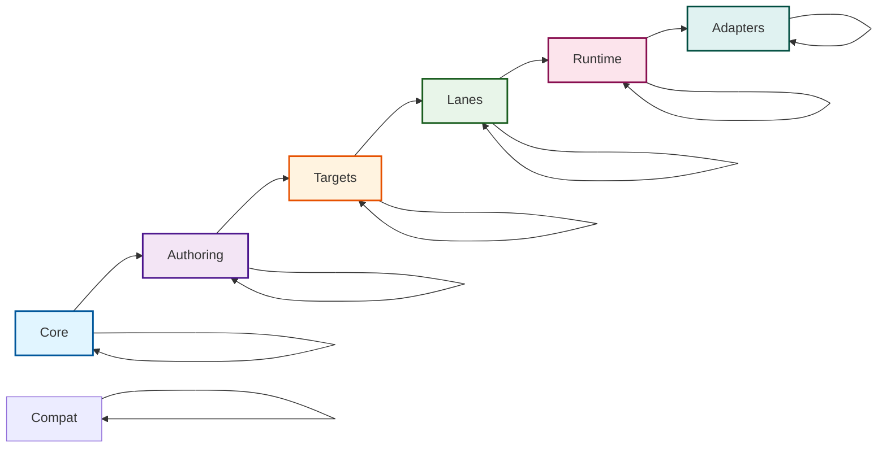

# Package Layering & Naming Conventions

This document describes the package layering structure and naming conventions for Prisma Next, as defined in [ADR 140](../adrs/ADR%20140%20-%20Package%20Layering%20&%20Target-Family%20Namespacing.md).

## Overview

The package structure encodes **three orthogonal ideas**:

1. **Domains** (framework vs target families). The framework domain is target-agnostic; target families (SQL, document, etc.) are family-specific.
2. **Layers** (responsibility-based layers). Layers express dependency *direction*: packages may depend on peers in the same layer (lateral relationships) and on layers closer to core (downward), but never "upward."
3. **Planes** (migration vs runtime). Migration plane (authoring, tooling, targets) must not import runtime plane code. Runtime plane may consume artifacts (JSON/manifests) from migration, but not code imports.

This separation keeps the architecture flexible (per the original Clean Architecture guidance) while still making it obvious where SQL/document packages live and enforcing clear boundaries between migration and runtime concerns.

## Directory Structure

The repository uses numbered prefixes in directory names to make the hierarchy explicit:

```text
packages/
  1-framework/           # Domain 1: Framework (target-agnostic)
    0-foundation/        # Layer 0: Foundation
    1-core/              # Layer 1: Core
    2-authoring/         # Layer 2: Authoring
    3-tooling/           # Layer 3: Tooling
  2-document/            # Domain 2: Document (placeholder)
  2-mongo-family/        # Domain 2: Mongo family
  2-sql/                 # Domain 2: SQL family
    1-core/              # Layer 1: Core
    2-authoring/         # Layer 2: Authoring
    3-tooling/           # Layer 3: Tooling
    4-lanes/             # Layer 4: Lanes
    5-runtime/           # Layer 5: Runtime
  3-mongo-target/        # Domain 3: Mongo target
  3-extensions/          # Domain 3: Extensions
  3-targets/             # Domain 3: Targets
    3-targets/           # Layer 3: Target descriptors
    6-adapters/          # Layer 6: Adapters
    7-drivers/           # Layer 7: Drivers
```

The numbered prefixes serve two purposes:
1. **Visual hierarchy**: Makes domain/layer relationships clear at a glance
2. **Dependency direction**: Lower numbers can be imported by higher numbers, never the reverse

Planes are a conceptual grouping recorded in `architecture.config.json` but do not appear as intermediate subdirectories.

## Domain and Layer Structure

### Framework Domain (Target-Agnostic)

The framework domain (`packages/1-framework/`) contains target-agnostic packages that work across all target families:

```
* 1-framework
|-- 0-foundation
|   |-- contract/      → @prisma-next/contract
|-- 1-core
|   |-- config/        → @prisma-next/config
|   |-- errors/        → @prisma-next/errors
|   |-- framework-components/ → @prisma-next/framework-components
|   |-- operations/    → @prisma-next/operations
|-- 2-authoring (migration plane)
|   |-- contract/      → @prisma-next/contract-authoring
|   |-- psl-parser/    → @prisma-next/psl-parser
|-- 3-tooling (migration plane)
    |-- cli/           → @prisma-next/cli
    |-- emitter/       → @prisma-next/emitter
    |-- migration/     → @prisma-next/migration-tools
```

### SQL Family Domain

The SQL domain (`packages/2-sql/`) contains SQL-specific packages organized by layer:

```text
* 2-sql
|-- 1-core (shared plane)
|   |-- contract/      → @prisma-next/sql-contract
|   |-- operations/    → @prisma-next/sql-operations
|   |-- schema-ir/     → @prisma-next/sql-schema-ir
|-- 2-authoring (migration plane)
|   |-- contract-ts/   → @prisma-next/sql-contract-ts
|-- 3-tooling (migration plane)
|   |-- emitter/       → @prisma-next/sql-contract-emitter
|-- 4-lanes (runtime plane)
|   |-- relational-core/ → @prisma-next/sql-relational-core
|   |-- sql-lane/      → @prisma-next/sql-lane
|   |-- orm-lane/      → @prisma-next/sql-orm-lane
|   |-- query-builder/ → @prisma-next/sql-lane-query-builder
|-- 5-runtime (runtime plane)
    |-- → @prisma-next/sql-runtime
|-- 9-family (migration plane)
    |-- → @prisma-next/family-sql
```

### Mongo Family Domain

The Mongo family domain (`packages/2-mongo-family/`) contains Mongo-specific packages organized by layer:

```text
* 2-mongo-family
|-- 1-foundation (shared plane)
|   |-- mongo-contract/   → @prisma-next/mongo-contract
|-- 2-authoring (migration plane)
|   |-- contract-psl/     → @prisma-next/mongo-contract-psl
|   |-- contract-ts/      → @prisma-next/mongo-contract-ts
|-- 3-tooling (migration plane)
|   |-- emitter/          → @prisma-next/mongo-emitter
|-- 4-query (runtime plane)
|   |-- query-ast/        → @prisma-next/mongo-query-ast
|-- 5-query-builders (runtime plane)
|   |-- orm/              → @prisma-next/mongo-orm
|   |-- query-builder/    → @prisma-next/mongo-query-builder
|-- 6-transport (shared plane)
|   |-- mongo-lowering/   → @prisma-next/mongo-lowering
|   |-- mongo-wire/       → @prisma-next/mongo-wire
|-- 7-runtime (runtime plane)
|   |-- → @prisma-next/mongo-runtime
|-- 9-family (migration plane)
    |-- → @prisma-next/family-mongo
```

### Targets Domain (Extension Packs)

The targets domain (`packages/3-targets/`) contains concrete target extension packs (e.g., Postgres, MySQL). Dialect (target), adapter, and driver are kept as separate packages to enable mix-and-match:

```
* 3-targets
|-- 3-targets/postgres (migration plane)
|   |-- → @prisma-next/target-postgres (target descriptor)
|-- 6-adapters/postgres (multi-plane: shared, migration, runtime)
|   |-- → @prisma-next/adapter-postgres (adapter with control/runtime entrypoints)
|-- 7-drivers/postgres (runtime plane)
    |-- → @prisma-next/driver-postgres (driver implementation)
```

### Mongo Targets Domain

Mongo-specific target packages live under `packages/3-mongo-target/`:

```text
* 3-mongo-target
|-- 1-mongo-target (migration plane)
|   |-- → @prisma-next/target-mongo (target descriptor / pack)
|-- 2-mongo-adapter (multi-plane)
|   |-- → @prisma-next/adapter-mongo
|-- 3-mongo-driver (runtime plane)
    |-- → @prisma-next/driver-mongo
```

### Extensions Domain

The extensions domain (`packages/3-extensions/`) contains ecosystem extensions and compatibility layers:

```
* 3-extensions
|-- sql-orm-client/ (runtime plane)
|   |-- → @prisma-next/sql-orm-client
|-- pgvector/ (multi-plane)
    |-- → @prisma-next/extension-pgvector
```

### Layer Structure

Clean Architecture layers for Prisma Next:

- **Core** – target-agnostic contracts, plan metadata, shared operations, runtime kernel.
- **Authoring** – PSL/TS authoring surfaces plus shared descriptor types that produce contracts.
- **Targets** – family-specific contract types and emitter hooks.
- **Lanes** – query DSLs/ORMs that produce AST plans.
- **Runtime** – per-family runtime implementations that extend `RuntimeCore` from `@prisma-next/framework-components` (core layer).
- **Adapters** – database adapters/drivers and optional compat layers.

Dependencies flow downward (toward core); lateral dependencies within the same layer are permitted. Example: `@prisma-next/sql-lane` and `@prisma-next/sql-orm-lane` both live in the Lanes layer, so they may share helpers via `@prisma-next/sql-relational-core`, but neither may depend on Runtime or Adapters. Optional compat packages live at the edge alongside adapters; they can depend on inner layers but do not form a separate layer.

```
Core → Authoring → Targets → Lanes → Runtime → Adapters
             (lateral deps allowed within each layer)
```

### Layer Diagram



The runtime ring is a single layer: `RuntimeCore` (the abstract base) lives in `@prisma-next/framework-components` (core layer) and is extended directly by family runtimes (`@prisma-next/sql-runtime`, `@prisma-next/mongo-runtime`). See [ADR 204](../adrs/ADR%20204%20-%20Single-tier%20runtime.md).

### Dependency Rules

**Within a domain:**
- Layers may depend laterally (same layer) and downward (toward core), never upward.
- Example: `@prisma-next/sql-lane` and `@prisma-next/sql-orm-lane` both live in the Lanes layer, so they may share helpers via `@prisma-next/sql-relational-core`, but neither may depend on Runtime or Adapters.

**Cross-domain:**
- Cross-domain imports are forbidden except when importing framework packages.
- Example: SQL domain packages can import from framework domain packages, but not from other target families.

**Plane boundaries:**
- Migration plane (authoring, tooling, targets) must not import runtime plane code.
- Runtime plane may consume artifacts (JSON/manifests) from migration, but not code imports.
- Shared plane must not import from migration or runtime planes.
- Example: `@prisma-next/sql-contract-ts` (migration plane) cannot import from `@prisma-next/sql-lane` (runtime plane).

Plane import constraints are enforced declaratively via `planeRules` in `architecture.config.json`. Each plane specifies which planes it can import from (`allow`) and which are forbidden (`forbid`), with optional exceptions for temporary refactoring needs.

### Core Layer (Framework Domain)

The innermost layer containing target-family agnostic types and utilities.

- `packages/1-framework/0-foundation/contract/` → `@prisma-next/contract` - Core contract types + plan metadata
- `packages/1-framework/1-core/operations/` → `@prisma-next/operations` - Target-neutral operation registry + capability helpers
- `packages/1-framework/1-core/framework-components/` → `@prisma-next/framework-components` - Component descriptors, control-plane types (`./control`), execution-plane types (`./execution`), emission SPI types (`./emission`)
- `packages/1-framework/1-core/errors/` → `@prisma-next/errors` - CLI/runtime error factories and error types (`./control`)
- `packages/1-framework/1-core/config/` → `@prisma-next/config` - Config authoring types and validation

**Dependency Rules:** Cannot import from any other layer.

### Authoring Layer

Contract authoring surfaces for creating contracts programmatically.

**Framework Domain (Migration Plane):**
- `packages/1-framework/2-authoring/contract/` → `@prisma-next/contract-authoring` - shared target-neutral authoring descriptors (`ColumnTypeDescriptor`, `IndexDef`, FK metadata)
- `packages/1-framework/2-authoring/psl-parser/` → `@prisma-next/psl-parser` - PSL parser + IR (future)

**SQL Domain (Migration Plane):**
- `packages/2-sql/2-authoring/contract-ts/` → `@prisma-next/sql-contract-ts` - SQL TS authoring surface, composed helper DSL, and lowering pipeline

**Mongo Domain (Migration Plane):**
- `packages/2-mongo-family/2-authoring/contract-psl/` → `@prisma-next/mongo-contract-psl` - PSL interpretation into Mongo contract input
- `packages/2-mongo-family/2-authoring/contract-ts/` → `@prisma-next/mongo-contract-ts` - Mongo TS authoring surface for `defineContract(...)`

**Dependency Rules:** Can import from `core/*` only. SQL authoring may also import from SQL tooling layer; Mongo authoring may also import from Mongo tooling layer.

### Tooling Layer (Family Domains, Migration Plane)

Target-family specific emitter hooks and family-provided helpers for CLI assembly.

- `packages/2-sql/3-tooling/emitter/` → `@prisma-next/sql-contract-emitter` - SQL emitter hook
- `packages/2-sql/9-family/` → `@prisma-next/family-sql` - SQL family descriptor and authoring-time family pack
- `packages/2-mongo-family/3-tooling/emitter/` → `@prisma-next/mongo-emitter` - Mongo emitter hook
- `packages/2-mongo-family/9-family/` → `@prisma-next/family-mongo` - Mongo family descriptor and authoring-time family pack
- `packages/1-framework/3-tooling/cli/src/pack-assembly.ts` - Generic assembly functions that loop over descriptors and delegate to family's `convertOperationManifest()` for conversion
- Pack entrypoints: use `/control` for control plane descriptors and helpers (no runtime), `/runtime` for factories (runtime only). The app config imports from `/control` to keep emit pure.

**Dependency Rules:** Can import from `core/*` and `authoring/*` only.

### Lanes Layer (SQL Domain, Runtime Plane)

Lanes consume targets and relational-core helpers to produce AST plans. Packages in this layer may depend laterally on other lane utilities (e.g., shared relational helpers) and on inner layers, but not on runtime/adapter layers.

- `packages/2-sql/4-lanes/relational-core/` → `@prisma-next/sql-relational-core` – shared schema/column builders, operation attachment, AST factories
- `packages/2-sql/4-lanes/sql-lane/` → `@prisma-next/sql-lane` – SQL DSL + raw lane (Phase 1 refactor keeps API stable while using shared factories)
- `packages/2-sql/4-lanes/orm-lane/` → `@prisma-next/sql-orm-lane` – ORM builder (Phase 1 removes dependency on `sql-lane`)
- `packages/2-sql/4-lanes/query-builder/` → `@prisma-next/sql-lane-query-builder` – Query builder lane

### Runtime Layer

Per-family runtime implementations that extend the abstract `RuntimeCore` from `@prisma-next/framework-components` (core layer). There is no separate target-agnostic runtime package; the kernel collapsed into `framework-components` per [ADR 204](../adrs/ADR%20204%20-%20Single-tier%20runtime.md).

**SQL Domain (Runtime Plane):**
- `packages/2-sql/5-runtime/` → `@prisma-next/sql-runtime` – SQL family runtime that extends `RuntimeCore` from `@prisma-next/framework-components/runtime` with SQL adapters (future document runtimes will mirror this)

**Mongo Domain (Runtime Plane):**
- `packages/2-mongo-family/7-runtime/` → `@prisma-next/mongo-runtime` – Mongo family runtime that extends `RuntimeCore` from `@prisma-next/framework-components/runtime` with the Mongo adapter

**Dependency Rules:** Family runtimes import the runtime SPI (`RuntimeCore`, `RuntimeMiddleware`, `RuntimeExecutor`, `runWithMiddleware`) from `@prisma-next/framework-components` (core layer) and may also import from their family's lanes, transport, and adapter packages. There is no separate target-agnostic runtime package; per [ADR 204](../adrs/ADR%20204%20-%20Single-tier%20runtime.md), the runtime kernel collapsed into `@prisma-next/framework-components` and family runtimes extend it directly.

### Adapters Layer (Targets Domain, Multi-Plane)

Database adapters, drivers, and targets (dialects) live in the Targets domain as separate packages. Adapters use multi-plane entrypoints to support both control (migration) and runtime usage.

**Targets (Migration Plane):**
- `packages/3-targets/3-targets/postgres/` → `@prisma-next/target-postgres` - Postgres target descriptor

**Adapters (Multi-Plane: Shared, Migration, Runtime):**
- `packages/3-targets/6-adapters/postgres/` → `@prisma-next/adapter-postgres` - Postgres adapter with multi-plane entrypoints:
  - `src/core/**` → shared plane (adapter SPI implementation)
  - `src/exports/control.ts` → migration plane (control plane descriptor)
  - `src/exports/runtime.ts` → runtime plane (runtime factory)

**Drivers (Runtime Plane):**
- `packages/3-targets/7-drivers/postgres/` → `@prisma-next/driver-postgres` - Postgres driver

## Naming Conventions

### Published Package Names

**Key Principle:** Published package name is the import specifier. Directory layout is for humans and guardrails.

- Use the published package name as the only import specifier
- Encode target family in the package name prefix (e.g., `@prisma-next/sql-...`)
- Collapse nested directories to hyphenated names (no slashes after scope)
- Keep conventional names for adapters/drivers (e.g., `@prisma-next/adapter-postgres`, `@prisma-next/driver-postgres`). They are located under `packages/3-targets/**` as separate packages (target, adapter, driver) to enable mix-and-match.
- Layers constrain dependencies but don't generally appear in package names

### Examples

| Directory | Published Package Name |
|-----------|------------------------|
| `packages/1-framework/0-foundation/contract/` | `@prisma-next/contract` |
| `packages/1-framework/1-core/operations/` | `@prisma-next/operations` |
| `packages/1-framework/1-core/framework-components/` | `@prisma-next/framework-components` |
| `packages/1-framework/1-core/errors/` | `@prisma-next/errors` |
| `packages/1-framework/1-core/config/` | `@prisma-next/config` |
| `packages/1-framework/2-authoring/contract/` | `@prisma-next/contract-authoring` |
| `packages/1-framework/2-authoring/psl-parser/` | `@prisma-next/psl-parser` |
| `packages/1-framework/3-tooling/cli/` | `@prisma-next/cli` |
| `packages/1-framework/3-tooling/emitter/` | `@prisma-next/emitter` |
| `packages/2-mongo-family/1-foundation/mongo-contract/` | `@prisma-next/mongo-contract` |
| `packages/2-mongo-family/2-authoring/contract-psl/` | `@prisma-next/mongo-contract-psl` |
| `packages/2-mongo-family/2-authoring/contract-ts/` | `@prisma-next/mongo-contract-ts` |
| `packages/2-mongo-family/3-tooling/emitter/` | `@prisma-next/mongo-emitter` |
| `packages/2-mongo-family/4-query/query-ast/` | `@prisma-next/mongo-query-ast` |
| `packages/2-mongo-family/5-query-builders/orm/` | `@prisma-next/mongo-orm` |
| `packages/2-mongo-family/5-query-builders/query-builder/` | `@prisma-next/mongo-query-builder` |
| `packages/2-mongo-family/6-transport/mongo-lowering/` | `@prisma-next/mongo-lowering` |
| `packages/2-mongo-family/6-transport/mongo-wire/` | `@prisma-next/mongo-wire` |
| `packages/2-mongo-family/7-runtime/` | `@prisma-next/mongo-runtime` |
| `packages/2-mongo-family/9-family/` | `@prisma-next/family-mongo` |
| `packages/2-sql/1-core/contract/` | `@prisma-next/sql-contract` |
| `packages/2-sql/1-core/operations/` | `@prisma-next/sql-operations` |
| `packages/2-sql/1-core/schema-ir/` | `@prisma-next/sql-schema-ir` |
| `packages/2-sql/2-authoring/contract-ts/` | `@prisma-next/sql-contract-ts` |
| `packages/2-sql/3-tooling/emitter/` | `@prisma-next/sql-contract-emitter` |
| `packages/2-sql/3-tooling/family/` | `@prisma-next/family-sql` |
| `packages/2-sql/4-lanes/relational-core/` | `@prisma-next/sql-relational-core` |
| `packages/2-sql/4-lanes/sql-lane/` | `@prisma-next/sql-lane` |
| `packages/2-sql/4-lanes/orm-lane/` | `@prisma-next/sql-orm-lane` |
| `packages/2-sql/4-lanes/query-builder/` | `@prisma-next/sql-lane-query-builder` |
| `packages/2-sql/5-runtime/` | `@prisma-next/sql-runtime` |
| `packages/3-mongo-target/1-mongo-target/` | `@prisma-next/target-mongo` |
| `packages/3-mongo-target/2-mongo-adapter/` | `@prisma-next/adapter-mongo` |
| `packages/3-mongo-target/3-mongo-driver/` | `@prisma-next/driver-mongo` |
| `packages/3-targets/3-targets/postgres/` | `@prisma-next/target-postgres` |
| `packages/3-targets/6-adapters/postgres/` | `@prisma-next/adapter-postgres` |
| `packages/3-targets/7-drivers/postgres/` | `@prisma-next/driver-postgres` |
| `packages/3-extensions/sql-orm-client/` | `@prisma-next/sql-orm-client` |
| `packages/3-extensions/pgvector/` | `@prisma-next/extension-pgvector` |

## Dependency Rules

### General Rules

1. **Within a domain, layers may depend laterally (same layer) and downward (toward core), never upward** - This is enforced by directory structure and import validation
2. **Cross-domain imports are forbidden except when importing framework packages** - SQL domain packages can import from framework domain, but not from other target families
3. **Migration plane must not import runtime plane code** - Authoring, tooling, and targets (migration plane) cannot import from lanes, runtime, or adapters (runtime plane)
4. **Runtime plane may consume artifacts (JSON/manifests) from migration, but not code imports** - Runtime packages can read contract.json and manifest.json files, but cannot import TypeScript code from migration plane packages
5. **Directory placement dictates allowed dependencies** (domain + layer + plane); package name dictates how consumers import

### Specific Rules by Layer

- **`core/*`** → cannot import from any other layer
- **`authoring/*`** → can import from `core/*` only
- **`2-sql/3-tooling/*`** → can import from `1-core/*` and `2-authoring/*` only
- **`2-mongo-family/3-tooling/*`** and **`2-mongo-family/9-family`** → can import from `1-core/*` and `2-authoring/*` only
- **`2-sql/4-lanes/*`** → can import from `1-core/*`, `2-authoring/*`, `2-sql/3-tooling/*` only
- **`2-sql/5-runtime`** → can import from `1-framework/1-core/framework-components` (for `RuntimeCore` / `RuntimeMiddleware` / `runWithMiddleware`), `2-sql/3-tooling/*`, `2-sql/4-lanes/*`, and `3-targets/6-adapters/*` only
- **`2-mongo-family/4-query/*`, `5-query-builders/*`, `6-transport/*`, `7-runtime`** → follow the same downward-only rule within the Mongo family plus allowed framework imports (notably `1-framework/1-core/framework-components` for the runtime SPI)
- **`3-targets/6-adapters/*`** → can import from `2-sql/3-tooling/*` and `2-sql/5-runtime` only
- **`3-mongo-target/2-mongo-adapter`** → can import from Mongo family shared/runtime layers, not SQL family packages

### Domain Rules

- Framework domain packages are target-agnostic and can be imported by any target family
- SQL domain packages can import from framework domain and their own SQL family packages
- Mongo domain packages can import from framework domain and their own Mongo family packages
- Family packages cannot import from other target families (e.g., `sql/*` cannot import `mongo/*`, and `mongo/*` cannot import `sql/*`)
- SQL family packages use the `@prisma-next/sql-...` prefix and Mongo family packages use the `@prisma-next/mongo-...` prefix for discoverability

## Package Exports Pattern

Use curated subpath exports to keep public API stable across internal moves:

```json
{
  "name": "@prisma-next/sql-lane",
  "type": "module",
  "exports": {
    ".": {
      "types": "./dist/index.d.ts",
      "import": "./dist/index.js"
    },
    "./sql": {
      "types": "./dist/exports/sql.d.ts",
      "import": "./dist/exports/sql.js"
    },
    "./schema": {
      "types": "./dist/exports/schema.d.ts",
      "import": "./dist/exports/schema.js"
    },
    "./param": {
      "types": "./dist/exports/param.d.ts",
      "import": "./dist/exports/param.js"
    }
  },
  "files": ["dist"]
}
```

## Workspace Configuration

The `pnpm-workspace.yaml` includes patterns for all packages:

```yaml
packages:
  - packages/**
  - examples/*
  - test/**
```

The numbered directory prefixes ensure packages appear in dependency order when browsing the filesystem.

## Import Validation

Import dependencies are validated using Dependency Cruiser:

```bash
pnpm lint:deps
```

Dependency Cruiser:
- Scans all TypeScript files in `packages/`
- Validates imports against domain, layer, and plane rules
- Reports violations with detailed context
- Can be run locally or in CI
- Supports incremental checks for lint-staged hooks
- Enforces the dependency direction: `core → authoring → targets → lanes → runtime → adapters`

**Implementation:**
- Uses data-driven configuration from `architecture.config.json`
- Maps package directory globs to {domain, layer, plane} based on configuration
- Converts glob patterns to regex patterns in `dependency-cruiser.config.mjs`
- Uses TypeScript path resolution for accurate module resolution
- Allows same-layer imports (e.g., `orm-lane` can import from `sql-relational-core`)
- Enforces cross-domain rules (only framework can be imported cross-domain)
- Enforces plane boundaries via declarative `planeRules` in `architecture.config.json`:
  - Shared plane cannot import from migration or runtime
  - Migration plane cannot import from runtime
  - Runtime plane cannot import from migration (with documented exceptions)

**Status:** ✅ Import validation is active and enforces Domains/Layers/Planes dependency rules using Dependency Cruiser with data-driven configuration. Plane rules are defined declaratively in `architecture.config.json` rather than hardcoded in the dependency cruiser config.

## Adding New Packages

When adding a new package:

1. **Choose the correct domain** (framework or target family like sql, or targets for extension packs)
2. **Choose the correct layer** based on dependencies and purpose
3. **Choose the correct plane** (migration, runtime, or shared)
4. **Follow naming conventions** - use hyphenated names, encode family in prefix
5. **Add package mapping** to `architecture.config.json` with domain/layer/plane
   - For multi-plane packages, add separate globs for each plane (e.g., `src/core/**` for shared, `src/exports/cli.ts` for migration, `src/exports/runtime.ts` for runtime)
6. **Add project references** to `tsconfig.base.json`.
7. **Add workspace pattern** to `pnpm-workspace.yaml` if needed
8. **Create README.md** documenting purpose, dependencies, and architecture with domain/layer/plane labels
9. **Run import check** to verify no violations

## Multi-Plane Packages

Some packages span multiple planes (e.g., adapters that have both control plane entry points and runtime code). These packages use a structured layout:

- **`src/core/**`**: Shared plane code that can be imported by both migration and runtime planes
- **`src/exports/control.ts`**: Migration plane entry point (control plane descriptors)
- **`src/exports/runtime.ts`**: Runtime plane entry point (runtime factories)

**Example:** `@prisma-next/adapter-postgres` spans three planes:
- `packages/3-targets/6-adapters/postgres/src/core/**` → domain: `targets`, layer: `adapters`, plane: `shared`
- `packages/3-targets/6-adapters/postgres/src/exports/control.ts` → domain: `targets`, layer: `adapters`, plane: `migration`
- `packages/3-targets/6-adapters/postgres/src/exports/runtime.ts` → domain: `targets`, layer: `adapters`, plane: `runtime`

**Note:** Dialect (target), adapter, and driver are separate packages under `packages/3-targets/**` to enable mix-and-match. The adapter package uses multi-plane entrypoints to support both control plane configuration (migration plane) and runtime usage (runtime plane) while keeping shared core code (shared plane) accessible to both.

This structure allows the same package to provide both control plane configuration (migration plane) and runtime implementation (runtime plane) while keeping shared code (core) accessible to both.

## Migration Notes

**Directory Structure Status:** ✅ Complete

The package layering structure uses numbered directory prefixes for visual hierarchy:
- All domain directories created with numbered prefixes (`1-framework/`, `2-sql/`, `2-document/`, `3-targets/`, `3-extensions/`)
- Active Mongo domains also live under numbered prefixes (`2-mongo-family/`, `3-mongo-target/`)
- All layer directories created with numbered prefixes (e.g., `1-core/`, `2-authoring/`, `3-tooling/`, `4-lanes/`, `5-runtime/`)
- Plane subdirectories removed (`shared/`, `migration/`, `runtime/` intermediate directories flattened)
- Workspace configuration updated (`pnpm-workspace.yaml`)
- TypeScript project references updated (`tsconfig.base.json`)
- Import validation configured (Dependency Cruiser with `dependency-cruiser.config.mjs`)
- Architecture configuration file updated (`architecture.config.json`)
- `pnpm lint:deps` script validates dependency direction

**Package Layout:**

- `packages/1-framework/` - Framework domain (target-agnostic)
- `packages/2-mongo-family/` - Mongo family domain
- `packages/2-sql/` - SQL family domain
- `packages/2-document/` - Document family domain (placeholder)
- `packages/3-mongo-target/` - Mongo target domain (target pack, adapter, driver)
- `packages/3-targets/` - Targets domain (concrete dialects, adapters, drivers)
- `packages/3-extensions/` - Extensions domain (compat layers, extension packs)

The numbered prefixes ensure:
1. Packages appear in dependency order when browsing the filesystem
2. Visual reinforcement of the architecture hierarchy
3. Lower numbers can be imported by higher numbers, never the reverse

## References

- [ADR 140 - Package Layering & Target-Family Namespacing](../adrs/ADR%20140%20-%20Package%20Layering%20&%20Target-Family%20Namespacing.md)
- [ADR 005 - Thin Core, Fat Targets](../adrs/ADR%20005%20-%20Thin%20Core,%20Fat%20Targets.md)
