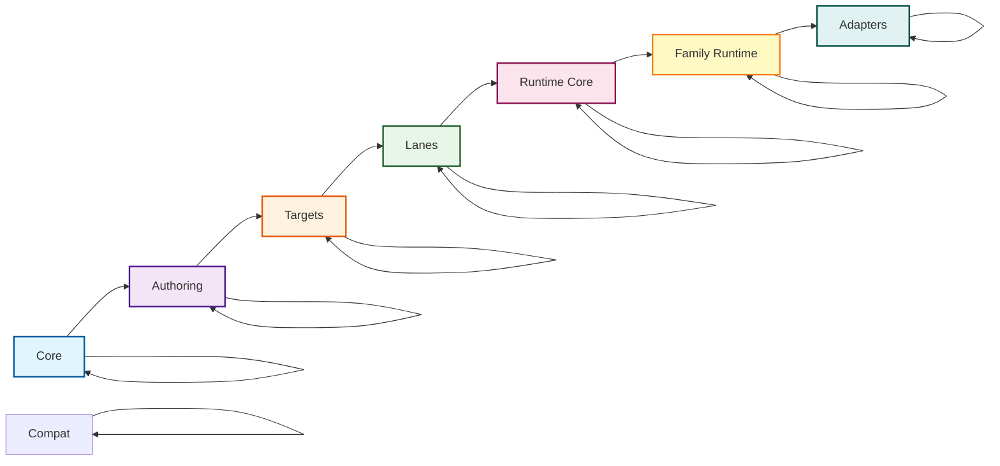

# Package Layering & Naming Conventions

This document describes the package layering structure and naming conventions for Prisma Next, as defined in [ADR 140](../adrs/ADR%20140%20-%20Package%20Layering%20&%20Target-Family%20Namespacing.md).

## Overview

The package structure encodes **three orthogonal ideas**:

1. **Domains** (framework vs target families). The framework domain is target-agnostic; target families (SQL, document, etc.) are family-specific.
2. **Layers** (responsibility-based layers). Layers express dependency *direction*: packages may depend on peers in the same layer (lateral relationships) and on layers closer to core (downward), but never "upward."
3. **Planes** (migration vs runtime). Migration plane (authoring, tooling, targets) must not import runtime plane code. Runtime plane may consume artifacts (JSON/manifests) from migration, but not code imports.

This separation keeps the architecture flexible (per the original Clean Architecture guidance) while still making it obvious where SQL/document packages live and enforcing clear boundaries between migration and runtime concerns.

## Domain and Layer Structure

### Framework Domain (Target-Agnostic)

The framework domain contains target-agnostic packages that work across all target families:

```
* framework
|-- core (shared plane)
|   |-- @prisma-next/contract
|   |-- @prisma-next/plan
|   |-- @prisma-next/operations
|-- authoring (migration plane)
|   |-- @prisma-next/contract-authoring
|   |-- @prisma-next/contract-ts (future)
|   |-- @prisma-next/contract-psl (future)
|-- tooling (migration plane)
|   |-- @prisma-next/cli
|   |-- @prisma-next/emitter
|-- runtime-executor (runtime plane)
    |-- @prisma-next/runtime-executor
```

### SQL Family Domain

The SQL domain contains SQL-specific packages organized by layer:

```
* sql family
|-- authoring (migration plane)
|   |-- @prisma-next/sql-contract-ts
|-- tooling (migration plane)
|   |-- @prisma-next/sql-contract-emitter
|-- core (shared plane)
|   |-- @prisma-next/sql-contract
|   |-- @prisma-next/sql-operations
|-- lanes (runtime plane)
|   |-- @prisma-next/sql-relational-core
|   |-- @prisma-next/sql-lane
|   |-- @prisma-next/sql-orm-lane
|-- runtime (runtime plane)
|   |-- @prisma-next/sql-runtime
|-- adapters (runtime plane)
    |-- @prisma-next/driver-postgres
    |-- @prisma-next/compat-prisma
```

### Targets Domain (Extension Packs)

The targets domain contains concrete target extension packs (e.g., Postgres, MySQL). Dialect (target), adapter, and driver are kept as separate packages to enable mix-and-match:

```
* targets
|-- postgres (migration plane)
|   |-- @prisma-next/targets-postgres (target descriptor)
|-- postgres-adapter (multi-plane: shared, migration, runtime)
|   |-- @prisma-next/adapter-postgres (adapter with CLI/runtime entrypoints)
|-- postgres-driver (runtime plane)
    |-- @prisma-next/driver-postgres (driver implementation)
```

### Layer Structure

Clean Architecture layers for Prisma Next:

- **Core** – target-agnostic contracts, plan metadata, shared operations, runtime kernel.
- **Authoring** – PSL/TS builders that produce contracts.
- **Targets** – family-specific contract types and emitter hooks.
- **Lanes** – query DSLs/ORMs that produce AST plans.
- **Runtime** – target-neutral runtime core plus per-family runtime implementations.
- **Adapters** – database adapters/drivers and optional compat layers.

Dependencies flow downward (toward core); lateral dependencies within the same layer are permitted. Example: `@prisma-next/sql-lane` and `@prisma-next/sql-orm-lane` both live in the Lanes layer, so they may share helpers via `@prisma-next/sql-relational-core`, but neither may depend on Runtime or Adapters. Optional compat packages live at the edge alongside adapters; they can depend on inner layers but do not form a separate layer.

```
Core → Authoring → Targets → Lanes → Runtime → Adapters
             (lateral deps allowed within each layer)
```

### Layer Diagram



### Dependency Rules

**Within a domain:**
- Layers may depend laterally (same layer) and downward (toward core), never upward.
- Example: `@prisma-next/sql-lane` and `@prisma-next/sql-orm-lane` both live in the Lanes layer, so they may share helpers via `@prisma-next/sql-relational-core`, but neither may depend on Runtime or Adapters.

**Cross-domain:**
- Cross-domain imports are forbidden except when importing framework packages.
- Example: SQL domain packages can import from framework domain packages, but not from other target families.

**Plane boundaries:**
- Migration plane (authoring, tooling, targets) must not import runtime plane code.
- Runtime plane may consume artifacts (JSON/manifests) from migration, but not code imports.
- Shared plane must not import from migration or runtime planes.
- Example: `@prisma-next/sql-contract-ts` (migration plane) cannot import from `@prisma-next/sql-lane` (runtime plane).

Plane import constraints are enforced declaratively via `planeRules` in `architecture.config.json`. Each plane specifies which planes it can import from (`allow`) and which are forbidden (`forbid`), with optional exceptions for temporary refactoring needs.

### Core Layer (Framework Domain, Shared Plane)

The innermost layer containing target-family agnostic types and utilities.

- `packages/framework/core-plan/` → `@prisma-next/plan` - Plan helpers, diagnostics, shared errors
- `packages/framework/core-operations/` → `@prisma-next/operations` - Target-neutral operation registry + capability helpers
- `packages/contract/` → `@prisma-next/contract` - Core contract types + plan metadata (legacy, will be migrated)

**Dependency Rules:** Cannot import from any other layer.

### Authoring Layer

Contract authoring surfaces for creating contracts programmatically.

**Framework Domain (Migration Plane):**
- `packages/framework/authoring/contract-authoring/` → `@prisma-next/contract-authoring` - TS builders, canonicalization, schema DSL
- `packages/framework/authoring/contract-ts/` → `@prisma-next/contract-ts` - TS authoring surface (future)
- `packages/framework/authoring/contract-psl/` → `@prisma-next/contract-psl` - PSL parser + IR (future)

**SQL Domain (Migration Plane):**
- `packages/sql/authoring/sql-contract-ts/` → `@prisma-next/sql-contract-ts` - SQL TS authoring surface wraps `@prisma-next/contract-authoring`

**Dependency Rules:** Can import from `core/*` only. SQL authoring may also import from SQL tooling layer.

### Tooling Layer (SQL Domain, Migration Plane)

Target-family specific emitter hooks and family‑provided helpers for CLI assembly.

- `packages/sql/tooling/emitter/` → `@prisma-next/sql-contract-emitter` - SQL emitter hook
- `packages/sql/tooling/assembly/` → `@prisma-next/sql-tooling-assembly` - SQL family assembly helpers (operation registry, type imports)
- `packages/sql/tooling/cli/` → `@prisma-next/family-sql` - SQL family CLI entry point (exports `FamilyDescriptor` with hook and helpers)
- Pack entrypoints: use `/cli` for IR descriptors and helpers (no runtime), `/runtime` for factories (runtime only). The app config imports from `/cli` to keep emit pure.

**Dependency Rules:** Can import from `core/*` and `authoring/*` only.

### Lanes Layer (SQL Domain, Runtime Plane)

Lanes consume targets and relational-core helpers to produce AST plans. Packages in this layer may depend laterally on other lane utilities (e.g., shared relational helpers) and on inner layers, but not on runtime/adapter layers.

- `packages/sql/lanes/relational-core/` → `@prisma-next/sql-relational-core` – shared schema/column builders, operation attachment, AST factories
- `packages/sql/lanes/sql-lane/` → `@prisma-next/sql-lane` – SQL DSL + raw lane (Phase 1 refactor keeps API stable while using shared factories)
- `packages/sql/lanes/orm-lane/` → `@prisma-next/sql-orm-lane` – ORM builder (Phase 1 removes dependency on `sql-lane`)

### Runtime Layer

Target-agnostic runtime kernel plus per-family runtime implementations.

**Framework Domain (Runtime Plane):**
- `packages/framework/runtime-executor/` → `@prisma-next/runtime-executor` – verification, marker checks, plugin SPI (Slice 6 moves code here)

**SQL Domain (Runtime Plane):**
- `packages/sql/sql-runtime/` → `@prisma-next/sql-runtime` – SQL family runtime that composes runtime-executor with SQL adapters (future document runtimes will mirror this)

**Dependency Rules:** runtime-executor can import from inner layers only. Family runtimes can import from runtime-executor, targets, and their family's adapters.

### Adapters Layer (Targets Domain, Multi-Plane)

Database adapters, drivers, and targets (dialects) live in the Targets domain as separate packages. Adapters use multi-plane entrypoints to support both CLI (migration) and runtime usage.

**Targets (Migration Plane):**
- `packages/targets/postgres/` → `@prisma-next/targets-postgres` - Postgres target descriptor

**Adapters (Multi-Plane: Shared, Migration, Runtime):**
- `packages/targets/postgres-adapter/` → `@prisma-next/adapter-postgres` - Postgres adapter with multi-plane entrypoints:
  - `src/core/**` → shared plane (adapter SPI implementation)
  - `src/exports/cli.ts` → migration plane (CLI descriptor)
  - `src/exports/runtime.ts` → runtime plane (runtime factory)

**Drivers (Runtime Plane):**
- `packages/targets/postgres-driver/` → `@prisma-next/driver-postgres` - Postgres driver

**Compatibility (Runtime Plane):**
- `packages/extensions/compat-prisma/` → `@prisma-next/compat-prisma` (compat layer that lives alongside adapters)

## Naming Conventions

### Published Package Names

**Key Principle:** Published package name is the import specifier. Directory layout is for humans and guardrails.

- Use the published package name as the only import specifier
- Encode target family in the package name prefix (e.g., `@prisma-next/sql-...`)
- Collapse nested directories to hyphenated names (no slashes after scope)
- Keep conventional names for adapters/drivers (e.g., `@prisma-next/adapter-postgres`, `@prisma-next/driver-postgres`). They are located under `packages/targets/**` as separate packages (target, adapter, driver) to enable mix-and-match.
- Layers constrain dependencies but don't appear in package names except when meaningful (e.g., `runtime-executor`)

### Examples

| Directory | Published Package Name |
|-----------|------------------------|
| `packages/contract/` | `@prisma-next/contract` (legacy, will be migrated) |
| `packages/framework/core-plan/` | `@prisma-next/plan` |
| `packages/framework/core-operations/` | `@prisma-next/operations` |
| `packages/framework/authoring/contract-authoring/` | `@prisma-next/contract-authoring` |
| `packages/framework/authoring/contract-ts/` | `@prisma-next/contract-ts` |
| `packages/framework/authoring/contract-psl/` | `@prisma-next/contract-psl` |
| `packages/framework/tooling/cli/` | `@prisma-next/cli` |
| `packages/framework/tooling/emitter/` | `@prisma-next/emitter` |
| `packages/framework/runtime-executor/` | `@prisma-next/runtime-executor` |
| `packages/sql/contract/` | `@prisma-next/sql-contract` |
| `packages/sql/operations/` | `@prisma-next/sql-operations` |
| `packages/sql/tooling/emitter/` | `@prisma-next/sql-contract-emitter` |
| `packages/sql/lanes/relational-core/` | `@prisma-next/sql-relational-core` |
| `packages/sql/lanes/sql-lane/` | `@prisma-next/sql-lane` |
| `packages/sql/lanes/orm-lane/` | `@prisma-next/sql-orm-lane` |
| `packages/sql/sql-runtime/` | `@prisma-next/sql-runtime` |
| `packages/targets/postgres/` | `@prisma-next/targets-postgres` |
| `packages/targets/postgres-adapter/` | `@prisma-next/adapter-postgres` |
| `packages/targets/postgres-driver/` | `@prisma-next/driver-postgres` |
| `packages/extensions/compat-prisma/` | `@prisma-next/compat-prisma` |

## TypeScript Path Aliases

### Published Package Name Aliases

Path aliases map published package names to source entry files:

```json
{
  "compilerOptions": {
    "paths": {
      "@prisma-next/contract": ["packages/contract/src/exports/types.ts"],
      "@prisma-next/plan": ["packages/framework/core-plan/src/index.ts"],
      "@prisma-next/operations": ["packages/framework/core-operations/src/index.ts"],
      "@prisma-next/contract-authoring": ["packages/framework/authoring/contract-authoring/src/index.ts"],
      "@prisma-next/contract-ts": ["packages/framework/authoring/contract-ts/src/index.ts"],
      "@prisma-next/contract-psl": ["packages/framework/authoring/contract-psl/src/index.ts"],
      "@prisma-next/cli": ["packages/framework/tooling/cli/src/exports/index.ts"],
      "@prisma-next/emitter": ["packages/framework/tooling/emitter/src/exports/index.ts"],
      "@prisma-next/runtime-executor": ["packages/framework/runtime-executor/src/index.ts"],
      "@prisma-next/sql-contract": ["packages/sql/contract/src/exports/types.ts"],
      "@prisma-next/sql-operations": ["packages/sql/operations/src/index.ts"],
      "@prisma-next/sql-contract-emitter": ["packages/sql/tooling/emitter/src/index.ts"],
      "@prisma-next/sql-lane": ["packages/sql/lanes/sql-lane/src/index.ts"],
      "@prisma-next/sql-runtime": ["packages/sql/sql-runtime/src/index.ts"],
      "@prisma-next/adapter-postgres": ["packages/adapter-postgres/src/exports/index.ts"],
      "@prisma-next/driver-postgres": ["packages/driver-postgres/src/exports/index.ts"]
    }
  }
}
```

### Optional Layer Aliases (Dev-Time Only)

Layer aliases are optional ergonomic helpers for internal development. They are **not** for published imports:

```json
{
  "compilerOptions": {
    "paths": {
      "@core/*": ["packages/core/*/src"],
      "@authoring/*": ["packages/authoring/*/src"],
      "@targets/*": ["packages/targets/*/src"],
      "@sql/*": ["packages/sql/*/src"],
      "@runtime/*": ["packages/runtime/*/src"],
      "@adapters/*": ["packages/sql/*/*/src"]
    }
  }
}
```

## Dependency Rules

### General Rules

1. **Within a domain, layers may depend laterally (same layer) and downward (toward core), never upward** - This is enforced by directory structure and import validation
2. **Cross-domain imports are forbidden except when importing framework packages** - SQL domain packages can import from framework domain, but not from other target families
3. **Migration plane must not import runtime plane code** - Authoring, tooling, and targets (migration plane) cannot import from lanes, runtime, or adapters (runtime plane)
4. **Runtime plane may consume artifacts (JSON/manifests) from migration, but not code imports** - Runtime packages can read contract.json and manifest.json files, but cannot import TypeScript code from migration plane packages
5. **Directory placement dictates allowed dependencies** (domain + layer + plane); package name dictates how consumers import

### Specific Rules by Layer

- **`core/*`** → cannot import from any other layer
- **`authoring/*`** → can import from `core/*` only
- **`sql/tooling/*`** → can import from `core/*` and `authoring/*` only
- **`sql/lanes/*`** → can import from `core/*`, `authoring/*`, `sql/tooling/*` only
- **`runtime/core`** → can import from `core/*`, `authoring/*`, `sql/tooling/*` only (no direct imports from `targets/*`)
- **`sql/sql-runtime`** → can import from `runtime/core` and `sql/tooling/*` and `targets/postgres-adapter/*` only
- **`targets/postgres-adapter/*`** → can import from `sql/tooling/*` and `sql/sql-runtime` only

### Domain Rules

- Framework domain packages are target-agnostic and can be imported by any target family
- SQL domain packages can import from framework domain and their own SQL family packages
- SQL domain packages cannot import from other target families (e.g., `sql/*` cannot import `document/*`)
- SQL family packages use `@prisma-next/sql-...` prefix for discoverability

## Package Exports Pattern

Use curated subpath exports to keep public API stable across internal moves:

```json
{
  "name": "@prisma-next/sql-lane",
  "type": "module",
  "exports": {
    ".": {
      "types": "./dist/index.d.ts",
      "import": "./dist/index.js"
    },
    "./sql": {
      "types": "./dist/exports/sql.d.ts",
      "import": "./dist/exports/sql.js"
    },
    "./schema": {
      "types": "./dist/exports/schema.d.ts",
      "import": "./dist/exports/schema.js"
    },
    "./param": {
      "types": "./dist/exports/param.d.ts",
      "import": "./dist/exports/param.js"
    }
  },
  "files": ["dist"]
}
```

## Workspace Configuration

The `pnpm-workspace.yaml` includes patterns for all layers:

```yaml
packages:
  - packages/core/*
  - packages/authoring/*
  - packages/sql/tooling/*
  - packages/sql/**
  - packages/runtime/*
  - packages/compat/*
  - packages/*
  - examples/*
```

## Import Validation

Import dependencies are validated using Dependency Cruiser:

```bash
pnpm lint:deps
```

Dependency Cruiser:
- Scans all TypeScript files in `packages/`
- Validates imports against domain, layer, and plane rules
- Reports violations with detailed context
- Can be run locally or in CI
- Supports incremental checks for lint-staged hooks
- Enforces the dependency direction: `core → authoring → targets → lanes → runtime-executor → family-runtime → adapters`

**Implementation:**
- Uses data-driven configuration from `architecture.config.json`
- Maps package directory globs to {domain, layer, plane} based on configuration
- Converts glob patterns to regex patterns in `dependency-cruiser.config.mjs`
- Uses TypeScript path resolution for accurate module resolution
- Allows same-layer imports (e.g., `orm-lane` can import from `sql-relational-core`)
- Enforces cross-domain rules (only framework can be imported cross-domain)
- Enforces plane boundaries via declarative `planeRules` in `architecture.config.json`:
  - Shared plane cannot import from migration or runtime
  - Migration plane cannot import from runtime
  - Runtime plane cannot import from migration (with documented exceptions)

**Status:** ✅ Import validation is active and enforces Domains/Layers/Planes dependency rules using Dependency Cruiser with data-driven configuration. Plane rules are defined declaratively in `architecture.config.json` rather than hardcoded in the dependency cruiser config.

## Adding New Packages

When adding a new package:

1. **Choose the correct domain** (framework or target family like sql, or targets for extension packs)
2. **Choose the correct layer** based on dependencies and purpose
3. **Choose the correct plane** (migration, runtime, or shared)
4. **Follow naming conventions** - use hyphenated names, encode family in prefix
5. **Add package mapping** to `architecture.config.json` with domain/layer/plane
   - For multi-plane packages, add separate globs for each plane (e.g., `src/core/**` for shared, `src/exports/cli.ts` for migration, `src/exports/runtime.ts` for runtime)
6. **Add path aliases** to `tsconfig.base.json` mapping published name to source
7. **Add workspace pattern** to `pnpm-workspace.yaml` if needed
8. **Create README.md** documenting purpose, dependencies, and architecture with domain/layer/plane labels
9. **Run import check** to verify no violations

## Multi-Plane Packages

Some packages span multiple planes (e.g., adapters that have both CLI entry points and runtime code). These packages use a structured layout:

- **`src/core/**`**: Shared plane code that can be imported by both migration and runtime planes
- **`src/exports/cli.ts`**: Migration plane entry point (CLI descriptors)
- **`src/exports/runtime.ts`**: Runtime plane entry point (runtime factories)

**Example:** `@prisma-next/adapter-postgres` spans three planes:
- `packages/targets/postgres-adapter/src/core/**` → domain: `extensions` (or `targets`), layer: `adapters`, plane: `shared`
- `packages/targets/postgres-adapter/src/exports/cli.ts` → domain: `extensions` (or `targets`), layer: `adapters`, plane: `migration`
- `packages/targets/postgres-adapter/src/exports/runtime.ts` → domain: `extensions` (or `targets`), layer: `adapters`, plane: `runtime`

**Note:** Dialect (target), adapter, and driver are separate packages under `packages/targets/**` to enable mix-and-match. The adapter package uses multi-plane entrypoints to support both CLI configuration (migration plane) and runtime usage (runtime plane) while keeping shared core code (shared plane) accessible to both.

This structure allows the same package to provide both CLI configuration (migration plane) and runtime implementation (runtime plane) while keeping shared code (core) accessible to both.

## Migration Notes

**Scaffolding Status:** ✅ Complete (Slice 1)

The package layering structure has been scaffolded with placeholder packages:
- All layer directories created (`core/`, `authoring/`, `targets/`, `lanes/`, `runtime/`, `sql/`, `compat/`, `document/`)
- Placeholder packages with basic structure (package.json, tsconfig.json, src/index.ts, tsup.config.ts, README.md)
- Workspace configuration updated (`pnpm-workspace.yaml`)
- TypeScript path aliases and project references added (`tsconfig.base.json`)
- Import validation configured (Dependency Cruiser with `dependency-cruiser.config.mjs`)
- Architecture configuration file created (`architecture.config.json`)
- `pnpm lint:deps` script added to root package.json

**Migration Status:** ✅ Phase 2 Complete (Slice 2)

- **Contract Authoring (Phase 1)**: SQL contract authoring code moved from `@prisma-next/sql-query` to `@prisma-next/sql-contract-ts` in the SQL family namespace (`packages/sql/authoring/sql-contract-ts`)
- **Contract Authoring (Phase 2)**: Target-agnostic contract authoring core extracted to `@prisma-next/contract-authoring` in the authoring layer (`packages/framework/authoring/contract-authoring`)
- `@prisma-next/sql-contract-ts` now composes `@prisma-next/contract-authoring` with SQL-specific types
- Integration tests that depend on both `sql-contract-ts` and `sql-query` moved to `@prisma-next/integration-tests` (located at `test/integration/`) to avoid cyclic dependencies
- Test packages (`e2e-tests`, `integration-tests`, `test-utils`) moved from `packages/` to `test/` directory to separate test suites from source packages
- **Package Cleanup (Slice 7)**: `@prisma-next/sql-query` legacy package removed; all imports updated to use new package structure

During migration from the old structure:

- Old packages remain in `packages/*` (legacy location)
- New packages are created in ring-based structure
- Path aliases support both old and new locations during transition
- Import check script validates both old and new packages
- Once migration is complete, old packages will be removed

## References

- [ADR 140 - Package Layering & Target-Family Namespacing](../adrs/ADR%20140%20-%20Package%20Layering%20&%20Target-Family%20Namespacing.md)
- [Brief 12 - Package Layering](../../briefs/12-Package-Layering.md)
- [ADR 005 - Thin Core, Fat Targets](../adrs/ADR%20005%20-%20Thin%20Core,%20Fat%20Targets.md)
