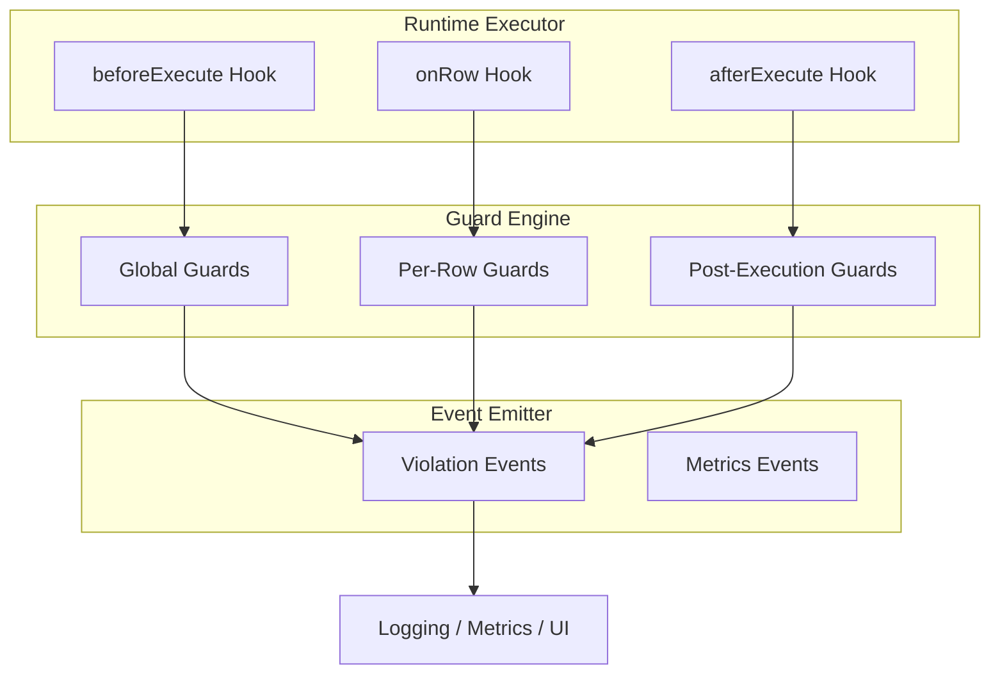

# ADR 153 — Runtime Linting Guards

## Context

Prisma Next provides query linting as a first-class differentiator. While many query issues can be detected statically (missing `LIMIT`, missing `WHERE`, `SELECT *`), a critical class of issues can **only be detected at runtime**:

- **Actual row counts** — static analysis cannot predict how many rows a query will return
- **Execution latency** — timing is inherently a runtime measurement
- **Data content inspection** — detecting PII or sensitive data in actual row values
- **Query patterns over time** — N+1 detection requires observing repeated executions
- **Resource utilization** — memory pressure, connection pool state, concurrent query counts

This ADR defines the architecture for **runtime-only guards** — validation rules that execute during query lifecycle phases and emit violations or block execution based on observed runtime behavior.

### Relationship to existing ADRs

- **ADR 014** (Runtime Hook API) defines the hook surface (`beforeExecute`, `onRow`, `afterExecute`, `onError`) that guards execute within
- **ADR 022** (Lint Rule Taxonomy) defines the configuration model and rule ID conventions; guards integrate with this model
- **ADR 023** (Budget Evaluation) defines budget semantics for `maxRows`, `maxLatencyMs`, `maxSqlLength`

This ADR extends those foundations with:
- A guard-specific interface for defining runtime-only rules
- Event emitter integration for violation surfacing
- Performance optimization strategies for per-row guards
- Custom guard registration API for user-defined rules

## Decision

### Guard architecture

Runtime guards are specialized plugins that implement validation logic across three lifecycle phases:



**Guard execution order:**
1. **beforeExecute guards** — run before query execution starts; can block execution
2. **onRow guards** — run for each row as it streams; can terminate early
3. **afterExecute guards** — run after streaming completes; report post-hoc violations

### Guard definition interface

Guards are defined with a simple, declarative interface:

```typescript
import type { ExecutionPlan } from '@prisma-next/contract/types';

/**
 * A runtime guard that validates query execution at a specific lifecycle phase.
 */
interface RuntimeGuard<TContract = unknown> {
  /** Stable rule ID following ADR 022 conventions (lowercase kebab-case) */
  readonly id: string;

  /** Lifecycle phase when this guard executes */
  readonly phase: 'beforeExecute' | 'onRow' | 'afterExecute';

  /** Default severity level; can be overridden via configuration */
  readonly defaultLevel: 'off' | 'warn' | 'error';

  /** Human-readable description for documentation and tooling */
  readonly description?: string;

  /** Evaluate the guard and return a result */
  evaluate(ctx: GuardContext<TContract>): GuardResult | Promise<GuardResult>;
}

/**
 * Context provided to guard evaluation functions.
 */
interface GuardContext<TContract = unknown> {
  /** The execution plan being evaluated */
  readonly plan: ExecutionPlan;

  /** The validated contract */
  readonly contract: TContract;

  /** Current timestamp provider */
  readonly now: () => number;

  /** Runtime metrics accumulated during execution */
  readonly metrics: RuntimeMetrics;

  // Phase-specific fields (discriminated by guard phase)

  /** Current row value (onRow phase only) */
  readonly row?: Readonly<Record<string, unknown>>;

  /** Execution result summary (afterExecute phase only) */
  readonly result?: AfterExecuteResult;
}

/**
 * Runtime metrics available to guards.
 */
interface RuntimeMetrics {
  /** Number of rows processed so far (incrementing during onRow) */
  readonly rowCount: number;

  /** Elapsed time in milliseconds since execution started */
  readonly latencyMs: number;

  /** Estimated memory usage in bytes (if available) */
  readonly memoryBytes?: number;

  /** Normalized SQL fingerprint for pattern matching */
  readonly queryFingerprint: string;

  /** Recent query history for pattern detection (e.g., N+1) */
  readonly recentQueries: ReadonlyArray<QueryHistoryEntry>;
}

interface QueryHistoryEntry {
  readonly fingerprint: string;
  readonly timestamp: number;
  readonly rowCount: number;
  readonly latencyMs: number;
}

interface AfterExecuteResult {
  readonly rowCount: number;
  readonly latencyMs: number;
  readonly completed: boolean;
}

/**
 * Result returned from guard evaluation.
 */
interface GuardResult {
  /** Whether the guard detected a violation */
  readonly violated: boolean;

  /** Human-readable message (required if violated) */
  readonly message?: string;

  /** Machine-readable details for tooling */
  readonly details?: Readonly<Record<string, unknown>>;

  /** Suggested remediation actions */
  readonly hints?: ReadonlyArray<GuardHint>;

  /** Override the configured level for this specific violation */
  readonly levelOverride?: 'warn' | 'error';

  /** For onRow guards: signal to stop processing further rows */
  readonly terminateStream?: boolean;
}

interface GuardHint {
  readonly action: string;
  readonly payload?: unknown;
}
```

### Runtime-only rules (priority order)

These rules can **only** be detected at runtime and cannot be implemented via static analysis:

| Priority | Rule ID | Phase | Description |
|----------|---------|-------|-------------|
| P0 | `row-count-budget-exceeded` | afterExecute | Actual row count exceeds configured `maxRows` budget |
| P0 | `latency-budget-exceeded` | afterExecute | Query execution time exceeds configured `maxLatencyMs` threshold |
| P1 | `n-plus-one-detected` | beforeExecute | Same query fingerprint executed N+ times within a time window |
| P1 | `per-row-pii-detected` | onRow | Sensitive data patterns (SSN, credit card, etc.) detected in actual row values |
| P2 | `result-set-anomaly` | afterExecute | Row count significantly deviates from historical average for this fingerprint |
| P2 | `slow-query-adaptive` | afterExecute | Query slower than adaptive p95 baseline for this fingerprint |
| P3 | `transaction-duration-exceeded` | afterExecute | Transaction held open longer than configured threshold |
| P3 | `concurrent-query-limit` | beforeExecute | Too many parallel queries executing from the same runtime context |

**Why these are runtime-only:**

- **Row count / latency budgets**: Static analysis can estimate but cannot predict actual database state or network conditions
- **N+1 detection**: Requires observing repeated query executions over time; static analysis can detect patterns in code but not actual execution frequency
- **PII detection**: Requires inspecting actual data values, not just column types
- **Anomaly detection**: Requires historical baselines that can only be built from observed executions
- **Transaction duration**: Requires timing actual transaction lifecycle
- **Concurrent query limit**: Requires tracking active query count at runtime

### Code examples

**Global guard: N+1 detection (beforeExecute phase)**

```typescript
import type { RuntimeGuard } from '@prisma-next/runtime-executor/guards';

/**
 * Detects N+1 query patterns by tracking query fingerprints over a sliding time window.
 * Triggers when the same query fingerprint is executed more than `threshold` times
 * within `windowMs` milliseconds.
 */
export function createNPlusOneGuard(options?: {
  threshold?: number;
  windowMs?: number;
}): RuntimeGuard {
  const threshold = options?.threshold ?? 5;
  const windowMs = options?.windowMs ?? 1000;

  return {
    id: 'n-plus-one-detected',
    phase: 'beforeExecute',
    defaultLevel: 'warn',
    description: `Detects when the same query is executed ${threshold}+ times within ${windowMs}ms`,

    evaluate({ plan, metrics, now }) {
      const fingerprint = plan.meta.sqlFingerprint;
      if (!fingerprint) {
        return { violated: false };
      }

      const currentTime = now();
      const windowStart = currentTime - windowMs;

      const recentMatches = metrics.recentQueries.filter(
        (q) => q.fingerprint === fingerprint && q.timestamp >= windowStart,
      );

      if (recentMatches.length >= threshold) {
        const count = recentMatches.length + 1; // +1 for current query
        return {
          violated: true,
          message: `N+1 query pattern detected: "${fingerprint}" executed ${count} times in ${windowMs}ms`,
          details: {
            fingerprint,
            executionCount: count,
            windowMs,
            threshold,
            tables: plan.meta.refs?.tables,
          },
          hints: [
            {
              action: 'useIncludeMany',
              payload: { reason: 'Batch related queries using includeMany() instead of iterating' },
            },
            {
              action: 'useDataLoader',
              payload: { reason: 'Consider a DataLoader pattern for request-scoped batching' },
            },
          ],
        };
      }

      return { violated: false };
    },
  };
}
```

**Per-row guard: PII detection (onRow phase)**

```typescript
import type { RuntimeGuard } from '@prisma-next/runtime-executor/guards';

/**
 * Detects potential PII (Personally Identifiable Information) in row values.
 * Scans string columns for patterns matching SSN, credit cards, emails, etc.
 *
 * Performance considerations:
 * - Regex patterns are compiled once and reused
 * - Only scans string-valued columns
 * - Supports sampling mode for high-throughput scenarios
 */
export function createPiiDetectionGuard(options?: {
  patterns?: Record<string, RegExp>;
  columnsToScan?: string[];
  earlyTermination?: boolean;
}): RuntimeGuard {
  // Precompiled patterns for common PII types
  const defaultPatterns: Record<string, RegExp> = {
    ssn: /\b\d{3}-\d{2}-\d{4}\b/,
    creditCard: /\b(?:\d{4}[- ]?){3}\d{4}\b/,
    email: /\b[A-Za-z0-9._%+-]+@[A-Za-z0-9.-]+\.[A-Z|a-z]{2,}\b/i,
    phone: /\b(?:\+1[- ]?)?\(?\d{3}\)?[- ]?\d{3}[- ]?\d{4}\b/,
    ipAddress: /\b(?:\d{1,3}\.){3}\d{1,3}\b/,
  };

  const patterns = options?.patterns ?? defaultPatterns;
  const columnsToScan = options?.columnsToScan; // undefined = scan all
  const earlyTermination = options?.earlyTermination ?? true;

  return {
    id: 'per-row-pii-detected',
    phase: 'onRow',
    defaultLevel: 'warn',
    description: 'Detects potential PII patterns in query result values',

    evaluate({ row, plan }) {
      if (!row) {
        return { violated: false };
      }

      for (const [column, value] of Object.entries(row)) {
        // Skip if column filtering is enabled and column not in list
        if (columnsToScan && !columnsToScan.includes(column)) {
          continue;
        }

        // Only scan string values
        if (typeof value !== 'string') {
          continue;
        }

        for (const [piiType, pattern] of Object.entries(patterns)) {
          if (pattern.test(value)) {
            const tableName = plan.meta.refs?.tables?.[0] ?? 'unknown';

            return {
              violated: true,
              message: `Potential ${piiType.toUpperCase()} detected in column "${column}"`,
              details: {
                piiType,
                column,
                table: tableName,
                // Do NOT include the actual value in details for security
                valueLength: value.length,
              },
              hints: [
                {
                  action: 'maskColumn',
                  payload: { column, table: tableName },
                },
                {
                  action: 'excludeFromProjection',
                  payload: { column },
                },
              ],
              terminateStream: earlyTermination,
            };
          }
        }
      }

      return { violated: false };
    },
  };
}
```

**Post-execution guard: Row count budget (afterExecute phase)**

```typescript
import type { RuntimeGuard } from '@prisma-next/runtime-executor/guards';

/**
 * Enforces row count budgets defined in plan annotations or runtime config.
 * Runs after execution completes to report actual vs expected row counts.
 */
export function createRowCountBudgetGuard(options?: {
  defaultMaxRows?: number;
}): RuntimeGuard {
  const defaultMaxRows = options?.defaultMaxRows ?? 10000;

  return {
    id: 'row-count-budget-exceeded',
    phase: 'afterExecute',
    defaultLevel: 'error',
    description: 'Enforces maximum row count budgets',

    evaluate({ plan, result }) {
      if (!result) {
        return { violated: false };
      }

      // Check plan-level budget first, fall back to default
      const maxRows = plan.meta.annotations?.budget?.maxRows ?? defaultMaxRows;
      const actualRows = result.rowCount;

      if (actualRows > maxRows) {
        const overage = actualRows - maxRows;
        const percentOver = Math.round((overage / maxRows) * 100);

        return {
          violated: true,
          message: `Row count budget exceeded: ${actualRows} rows returned (limit: ${maxRows}, ${percentOver}% over)`,
          details: {
            actualRows,
            maxRows,
            overage,
            percentOver,
            tables: plan.meta.refs?.tables,
            lane: plan.meta.lane,
          },
          hints: [
            {
              action: 'addLimit',
              payload: { suggestedLimit: maxRows },
            },
            {
              action: 'addPagination',
              payload: { pageSize: Math.min(100, maxRows) },
            },
          ],
        };
      }

      return { violated: false };
    },
  };
}
```

### Event emitter integration

Guards emit events that consumers can subscribe to for logging, metrics, and UI integration:

```typescript
import type { GuardResult } from '@prisma-next/runtime-executor/guards';
import type { ExecutionPlan } from '@prisma-next/contract/types';

/**
 * Events emitted by the guard engine.
 */
interface RuntimeGuardEvents {
  /**
   * Emitted when a guard detects a violation (warn or error level).
   */
  'guard:violation': (event: GuardViolationEvent) => void;

  /**
   * Emitted when execution is blocked due to an error-level violation.
   */
  'guard:blocked': (event: GuardBlockedEvent) => void;

  /**
   * Emitted after each query with aggregated metrics (for telemetry).
   */
  'guard:metrics': (event: GuardMetricsEvent) => void;
}

interface GuardViolationEvent {
  readonly guardId: string;
  readonly level: 'warn' | 'error';
  readonly message: string;
  readonly details?: Record<string, unknown>;
  readonly hints?: ReadonlyArray<{ action: string; payload?: unknown }>;
  readonly plan: ExecutionPlan;
  readonly timestamp: number;
}

interface GuardBlockedEvent extends GuardViolationEvent {
  readonly level: 'error';
}

interface GuardMetricsEvent {
  readonly planId: string;
  readonly fingerprint: string;
  readonly rowCount: number;
  readonly latencyMs: number;
  readonly violationCount: number;
  readonly guardResults: ReadonlyArray<{
    guardId: string;
    violated: boolean;
    durationMs: number;
  }>;
}
```

**Usage in runtime creation:**

```typescript
import { createRuntime } from '@prisma-next/runtime';
import {
  createNPlusOneGuard,
  createRowCountBudgetGuard,
  createPiiDetectionGuard,
} from '@prisma-next/runtime-executor/guards';

const runtime = createRuntime({
  contract,
  adapter,
  driver,
  guards: {
    // Enable built-in guards by ID
    builtin: ['latency-budget-exceeded'],

    // Register custom guards
    custom: [
      createNPlusOneGuard({ threshold: 3, windowMs: 500 }),
      createRowCountBudgetGuard({ defaultMaxRows: 1000 }),
      createPiiDetectionGuard({ earlyTermination: true }),
    ],

    // Configure guard levels (overrides defaultLevel)
    config: {
      'row-count-budget-exceeded': { level: 'error' },
      'n-plus-one-detected': { level: 'warn' },
      'per-row-pii-detected': { level: 'error' },
      'latency-budget-exceeded': { level: 'warn', maxLatencyMs: 200 },
    },
  },

  // Subscribe to guard events
  on: {
    'guard:violation': (event) => {
      logger.warn('Guard violation', {
        guard: event.guardId,
        message: event.message,
        tables: event.details?.tables,
      });
    },
    'guard:blocked': (event) => {
      metrics.increment('prisma.query.blocked', {
        guard: event.guardId,
      });
    },
    'guard:metrics': (event) => {
      telemetry.recordQueryMetrics(event);
    },
  },
});
```

### Guard registration API

Guards can be registered through multiple mechanisms:

```typescript
// 1. Built-in guards via runtime config
createRuntime({
  guards: {
    builtin: ['row-count-budget-exceeded', 'latency-budget-exceeded'],
  },
});

// 2. Custom guards via runtime config
createRuntime({
  guards: {
    custom: [myCustomGuard],
  },
});

// 3. Dynamic registration after runtime creation
runtime.guards.register(myCustomGuard);

// 4. Via extension packs (for reusable guard collections)
const securityExtension = {
  id: 'security-guards',
  guards: () => [
    createPiiDetectionGuard(),
    createSensitiveColumnGuard(),
  ],
};

createRuntime({
  extensions: [securityExtension],
});

// 5. Unregister a guard dynamically
runtime.guards.unregister('my-custom-guard');
```

### Performance implications

Runtime guards add overhead to query execution. The following table summarizes expected impact and mitigation strategies:

| Guard Type | Time Complexity | Memory | Mitigation Strategies |
|------------|-----------------|--------|----------------------|
| beforeExecute | O(1) per query | Minimal | Negligible; runs once before execution |
| onRow | O(n) where n = row count | O(1) per row | Sampling, early termination, column filtering |
| afterExecute | O(1) per query | Minimal | Negligible; runs once after execution |
| N+1 detection | O(k) where k = history size | O(k) entries | Circular buffer, fingerprint hash index, TTL eviction |
| PII detection | O(m × p) per row | O(p) patterns | Precompiled regex, column whitelist, sampling |
| Anomaly detection | O(1) lookup | O(f) fingerprints | Bloom filter for fingerprint existence, bounded history |

**Sampling mode for per-row guards:**

For high-throughput scenarios, per-row guards support sampling to reduce overhead:

```typescript
interface PerRowGuardConfig {
  /**
   * Sample rate between 0.0 and 1.0.
   * 1.0 = scan every row (default)
   * 0.1 = scan ~10% of rows
   */
  sampleRate?: number;

  /**
   * Maximum number of rows to scan.
   * After this limit, the guard stops evaluating.
   */
  maxRowsToScan?: number;

  /**
   * Stop scanning on first violation.
   * Reduces overhead but may miss additional violations.
   */
  earlyTermination?: boolean;
}

// Example: PII detection with sampling
createPiiDetectionGuard({
  sampleRate: 0.1,        // Scan 10% of rows
  maxRowsToScan: 1000,    // Never scan more than 1000 rows
  earlyTermination: true, // Stop on first match
});
```

**N+1 detection performance:**

The N+1 guard maintains a sliding window of recent queries:

```typescript
interface QueryHistoryConfig {
  /**
   * Maximum number of entries to retain.
   * Older entries are evicted when limit is reached.
   */
  maxEntries?: number;       // Default: 1000

  /**
   * Time-to-live for entries in milliseconds.
   * Entries older than this are evicted.
   */
  ttlMs?: number;            // Default: 10000 (10 seconds)

  /**
   * Use fingerprint hash index for O(1) lookup.
   */
  useHashIndex?: boolean;    // Default: true
}
```

**Guard overhead budget:**

We recommend a total guard overhead budget of **< 5% of query latency** for production use:

- beforeExecute guards: < 1ms total
- onRow guards: < 0.1ms per row (with sampling, this averages much lower)
- afterExecute guards: < 1ms total

Guards that exceed these thresholds should log warnings and consider more aggressive sampling or disabling in production.

### Configuration precedence

Guard configuration follows the same precedence rules as ADR 022 (Lint Rule Taxonomy):

1. **Per-query override** — annotations in `plan.meta.annotations.guards`
2. **Guard-specific config** — `guards.config['guard-id']`
3. **Guard default level** — `guard.defaultLevel`
4. **Mode preset** — strict vs permissive mode defaults

```typescript
// Precedence example
createRuntime({
  guards: {
    mode: 'strict',  // Base: all guards at strict defaults
    config: {
      'n-plus-one-detected': { level: 'warn' },  // Override: lower to warn
    },
  },
});

// Per-query override via plan annotations
sql.from(users)
  .select({ id: users.columns.id })
  .annotate({ guards: { 'row-count-budget-exceeded': 'off' } })  // Disable for this query
  .build();
```

## Consequences

### Positive

- **Runtime-only detection**: Catches issues that static analysis cannot detect
- **User-extensible**: Custom guards enable organization-specific policies
- **Event-driven**: Decoupled violation handling enables flexible consumption (logs, metrics, UI)
- **Performance-aware**: Sampling and early termination prevent guards from becoming bottlenecks
- **Consistent with existing APIs**: Integrates with ADR 014 hooks and ADR 022 configuration model

### Trade-offs

- **Runtime overhead**: Guards add latency to query execution; mitigated by sampling and budgets
- **Per-row guards scale with data**: Large result sets increase guard overhead; mitigated by sampling
- **History state for pattern detection**: N+1 and anomaly guards require maintaining query history

### Negative

- **Cannot prevent bad queries**: afterExecute guards report violations after data is fetched; static analysis is needed for pre-execution blocking of structural issues

## Testing

- **Unit tests**: Each guard implementation tested with mock contexts
- **Integration tests**: Guard registration, event emission, and level configuration
- **Performance benchmarks**: Measure overhead at various row counts and sampling rates
- **Golden tests**: Stable violation message formats for documentation and tooling

## Open questions

- Whether to expose guard execution timing in metrics for observability
- How to surface guard violations in Studio or dashboard integrations
- Whether to add a `disabled` option to guards for temporary bypass without level changes
- Standard guard IDs for common patterns to avoid collisions across extensions

