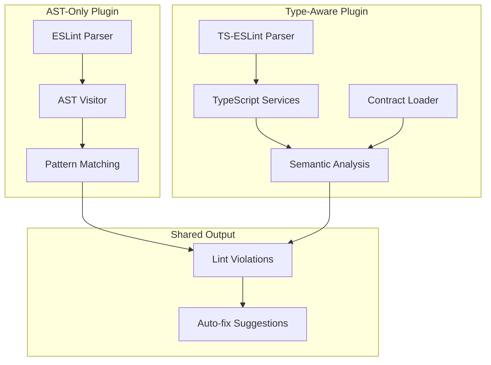

# ADR 154 — Static Linting Guards

## Context

Prisma Next provides query linting as a first-class differentiator. ADR 153 (Runtime Linting Guards) defines the architecture for runtime-only validation that catches issues during query execution—row counts, latency, PII detection, and N+1 patterns. However, many structural query problems can be detected **earlier**, at development time, before code is even executed.

Static analysis provides several advantages over runtime-only detection:

- **Instant IDE feedback**: Developers see issues as they type, without running code
- **Reduced cycle time**: Structural problems are caught during authoring, not debugging
- **CI integration**: Lint failures block merges before bad queries reach production
- **Static-only rules**: Some issues can only be detected statically (dead code, unused includes, type mismatches)

This ADR defines the architecture for **ESLint-based static analysis** of Prisma Next queries, complementing runtime guards with early detection of structural issues.

### Relationship to existing ADRs

- **ADR 022** (Lint Rule Taxonomy) defines the canonical rule taxonomy, configuration model, and `LintViolation` shape; static rules integrate with this model
- **ADR 153** (Runtime Linting Guards) defines runtime-only guards; static analysis catches complementary issues that don't require execution
- **ADR 018** (Plan Annotations Schema) defines the annotation structure that static rules can validate against

### Static vs Runtime rule boundaries

| Aspect | Static (ESLint) | Runtime (Guards) |
|--------|----------------|------------------|
| When | Authoring / CI | Execution |
| What | Structural patterns, type mismatches | Actual data, timing, behavior |
| Speed | Fast (per-file) | Per-query overhead |
| Context | AST + types + contract | Plan + metrics + rows |

Some rules have **both static and runtime implementations**:

- `no-missing-limit`: Static detects missing `.limit()` call; runtime enforces actual row count budgets
- `mutation-requires-where`: Static detects missing `.where()`; runtime validates predicate selectivity
- `sensitive-column-read`: Static flags projection of sensitive columns; runtime detects actual PII in values

## Decision

### Plugin architecture

Prisma Next provides two ESLint plugin variants to balance performance and capability:



#### Variant A: AST-Only Plugin (`@prisma-next/eslint-plugin`)

The AST-only plugin provides fast, lightweight static analysis using ESLint's standard JavaScript/TypeScript parser:

- **Parsing**: Uses ESLint's built-in parser or `@typescript-eslint/parser` without type information
- **Detection**: Pattern matches on call expressions (e.g., `sql.from()`, `orm.user()`)
- **Contract integration**: Loads `contract.json` to check table annotations (size, sensitivity, indexes)
- **Performance**: Sub-second analysis, suitable for on-save linting
- **Limitations**: Cannot resolve variable types, imported values

**Best for:** Structural rules that don't require type information—missing method calls, method ordering, deprecated patterns.

#### Variant B: Type-Aware Plugin (`@prisma-next/eslint-plugin-typed`)

The type-aware plugin provides deeper semantic analysis using TypeScript's type checker:

- **Parsing**: Uses `@typescript-eslint/parser` with `parserOptions.project` for full type information
- **Detection**: Resolves variable types, infers builder state, accesses contract type definitions
- **Contract integration**: Loads `contract.json` to check table annotations (size, sensitivity, indexes)
- **Performance**: Slower (requires TypeScript program), suitable for CI and periodic IDE checks

**Best for:** Semantic rules requiring type context—contract annotations, type-based validation, cross-reference checks.

### Lane detection patterns

Both plugins identify Prisma Next DSL calls by recognizing characteristic call chain patterns:

#### SQL Lane patterns

```typescript
// SELECT queries
sql.from(table).select({...}).where(...).limit(n).build()
sql.from(table).select({...}).orderBy(...).build()

// INSERT queries
sql.insert(table, data).returning(...).build()

// UPDATE queries
sql.update(table, data).where(...).returning(...).build()

// DELETE queries
sql.delete(table).where(...).returning(...).build()

// Joins and includes
sql.from(table).innerJoin(other, on).select({...}).build()
sql.from(table).includeMany(child, on, config).select({...}).build()
```

#### ORM Lane patterns

```typescript
// Read operations
orm.user().select((u) => ({...})).findMany()
orm.user().where((u) => u.id.eq(param('id'))).findFirst()
orm.user().include.posts((p) => p.select({...})).findMany()

// Write operations
orm.user().create(data)
orm.user().update(where, data)
orm.user().delete(where)
```

#### Detection algorithm

The plugin walks the AST looking for `CallExpression` nodes and traces the call chain:

1. Find the **root identifier** by traversing `MemberExpression.object` until reaching an `Identifier`
2. Check if root is a known Prisma Next entry point (`sql`, `orm`, `tables`, `schema`)
3. Collect all **method names** in the chain by walking `MemberExpression.property`
4. Apply rule-specific logic based on collected methods and their arguments

### ESLint configuration

Prisma Next plugins support ESLint v9's flat config format exclusively:

```javascript
// eslint.config.js
import prismaPlugin from '@prisma-next/eslint-plugin';
import prismaTypedPlugin from '@prisma-next/eslint-plugin-typed';
import tseslint from 'typescript-eslint';

export default [
  // AST-only rules (fast, no type info required)
  {
    files: ['**/*.ts', '**/*.tsx'],
    plugins: {
      'prisma-next': prismaPlugin,
    },
    rules: {
      'prisma-next/no-select-star': 'error',
      'prisma-next/no-missing-limit': 'warn',
      'prisma-next/mutation-requires-where': 'error',
      'prisma-next/no-cartesian-join': 'error',
      'prisma-next/prefer-param-over-interpolation': 'warn',
    },
  },

  // Type-aware rules (slower, requires TypeScript program)
  {
    files: ['**/*.ts', '**/*.tsx'],
    languageOptions: {
      parser: tseslint.parser,
      parserOptions: {
        project: './tsconfig.json',
      },
    },
    plugins: {
      'prisma-next-typed': prismaTypedPlugin,
    },
    rules: {
      'prisma-next-typed/no-unbounded-large-table': 'error',
      'prisma-next-typed/sensitive-column-read': 'warn',
      'prisma-next-typed/no-unused-include': 'warn',
    },
  },
];
```

#### Shared configuration presets

For convenience, both plugins export shared configurations matching ADR 022 modes:

```javascript
// eslint.config.js
import prismaPlugin from '@prisma-next/eslint-plugin';

export default [
  // Use 'strict' preset (all rules at strictest level)
  prismaPlugin.configs.strict,

  // Or 'permissive' preset (warnings only, fewer rules)
  // prismaPlugin.configs.permissive,

  // Override specific rules as needed
  {
    rules: {
      'prisma-next/no-missing-limit': 'warn', // Downgrade from error
    },
  },
];
```

### Implementation examples

#### AST-Only rule: `no-missing-limit`

This rule detects SELECT queries without a `.limit()` clause:

```typescript
import type { TSESTree } from '@typescript-eslint/utils';
import { ESLintUtils } from '@typescript-eslint/utils';

const createRule = ESLintUtils.RuleCreator(
  (name) => `https://prisma.io/docs/prisma-next/eslint/${name}`,
);

export const noMissingLimit = createRule({
  name: 'no-missing-limit',
  meta: {
    type: 'problem',
    docs: {
      description: 'Require .limit() on SELECT queries to prevent unbounded result sets',
    },
    messages: {
      missingLimit:
        'Query is missing a .limit() clause. Add .limit(n) to bound the result set.',
      missingLimitWithTable:
        'Query on "{{table}}" is missing a .limit() clause. Add .limit(n) to bound the result set.',
    },
    schema: [
      {
        type: 'object',
        properties: {
          allowAnnotatedUnbounded: {
            type: 'boolean',
            description: 'Allow unbounded queries with explicit @unbounded annotation',
          },
        },
        additionalProperties: false,
      },
    ],
  },
  defaultOptions: [{ allowAnnotatedUnbounded: true }],

  create(context, [options]) {
    return {
      CallExpression(node) {
        // Only analyze calls ending in .build() or .findMany()
        if (!isTerminalBuildCall(node)) {
          return;
        }

        // Check if this is a Prisma Next query chain
        const chainInfo = parsePrismaChain(node);
        if (!chainInfo) {
          return;
        }

        // Skip non-SELECT operations (INSERT, UPDATE, DELETE)
        if (chainInfo.operation !== 'select') {
          return;
        }

        // Check for .limit() or .take() in the chain
        const hasLimit = chainInfo.methods.some(
          (m) => m.name === 'limit' || m.name === 'take',
        );

        if (hasLimit) {
          return;
        }

        // Check for @unbounded annotation if allowed
        if (options.allowAnnotatedUnbounded && hasUnboundedAnnotation(node, context)) {
          return;
        }

        // Report violation
        const tableName = chainInfo.tableName;
        context.report({
          node,
          messageId: tableName ? 'missingLimitWithTable' : 'missingLimit',
          data: { table: tableName ?? 'unknown' },
        });
      },
    };
  },
});

/**
 * Check if this CallExpression is a terminal .build() or .findMany() call.
 */
function isTerminalBuildCall(node: TSESTree.CallExpression): boolean {
  if (node.callee.type !== 'MemberExpression') {
    return false;
  }
  const property = node.callee.property;
  if (property.type !== 'Identifier') {
    return false;
  }
  return ['build', 'findMany', 'findFirst'].includes(property.name);
}

interface ChainInfo {
  root: string;
  operation: 'select' | 'insert' | 'update' | 'delete';
  methods: Array<{ name: string; node: TSESTree.CallExpression }>;
  tableName: string | undefined;
}

/**
 * Parse a Prisma Next call chain and extract method information.
 */
function parsePrismaChain(node: TSESTree.CallExpression): ChainInfo | undefined {
  const methods: ChainInfo['methods'] = [];
  let current: TSESTree.Node = node;
  let tableName: string | undefined;

  // Walk up the chain collecting method calls
  while (current.type === 'CallExpression') {
    const callee = current.callee;
    if (callee.type !== 'MemberExpression') {
      break;
    }

    const property = callee.property;
    if (property.type === 'Identifier') {
      methods.unshift({ name: property.name, node: current });

      // Extract table name from .from(table) calls
      if (property.name === 'from' && current.arguments.length > 0) {
        tableName = extractTableName(current.arguments[0]);
      }
    }

    current = callee.object;
  }

  // Check if root is a Prisma Next entry point
  if (current.type !== 'Identifier') {
    return undefined;
  }

  const root = current.name;
  if (!['sql', 'orm'].includes(root)) {
    return undefined;
  }

  // Determine operation type
  const operation = determineOperation(methods);

  return { root, operation, methods, tableName };
}

function determineOperation(
  methods: ChainInfo['methods'],
): 'select' | 'insert' | 'update' | 'delete' {
  const methodNames = methods.map((m) => m.name);

  if (methodNames.includes('insert')) return 'insert';
  if (methodNames.includes('update')) return 'update';
  if (methodNames.includes('delete')) return 'delete';

  // Default to select for .from() chains
  return 'select';
}

function extractTableName(arg: TSESTree.Node): string | undefined {
  // Handle direct identifier: sql.from(userTable)
  if (arg.type === 'Identifier') {
    return arg.name;
  }

  // Handle member expression: sql.from(tables.user)
  if (arg.type === 'MemberExpression' && arg.property.type === 'Identifier') {
    return arg.property.name;
  }

  return undefined;
}

function hasUnboundedAnnotation(
  node: TSESTree.CallExpression,
  context: Readonly<{ sourceCode: { getCommentsBefore: (node: TSESTree.Node) => TSESTree.Comment[] } }>,
): boolean {
  // Check for @prisma-next-unbounded comment annotation
  const comments = context.sourceCode.getCommentsBefore(node);
  return comments.some((c) => c.value.includes('@prisma-next-unbounded'));
}
```

#### Type-Aware rule: `no-unbounded-large-table`

This rule uses TypeScript's type checker and contract information to detect unbounded queries on tables marked as large:

```typescript
import { ESLintUtils } from '@typescript-eslint/utils';
import type { ParserServicesWithTypeInformation } from '@typescript-eslint/utils';
import * as ts from 'typescript';
import * as fs from 'node:fs';
import * as path from 'node:path';

const createRule = ESLintUtils.RuleCreator(
  (name) => `https://prisma.io/docs/prisma-next/eslint/${name}`,
);

// Contract cache to avoid reloading on every file
let contractCache: ContractJson | undefined;
let contractPath: string | undefined;

interface ContractJson {
  storage: {
    tables: Record<
      string,
      {
        meta?: {
          annotations?: {
            size?: 'small' | 'medium' | 'large';
          };
        };
      }
    >;
  };
}

export const noUnboundedLargeTable = createRule({
  name: 'no-unbounded-large-table',
  meta: {
    type: 'problem',
    docs: {
      description:
        'Require .limit() on queries targeting tables annotated as large in the contract',
    },
    messages: {
      unboundedLargeTable:
        'Unbounded query on large table "{{table}}". Add .limit() or .take() to bound the result set.',
    },
    schema: [
      {
        type: 'object',
        properties: {
          contractPath: {
            type: 'string',
            description: 'Path to contract.json (relative to project root)',
          },
        },
        additionalProperties: false,
      },
    ],
  },
  defaultOptions: [{ contractPath: 'src/prisma/contract.json' }],

  create(context, [options]) {
    // Get TypeScript services for type resolution
    const services = ESLintUtils.getParserServices(context);
    const checker = services.program.getTypeChecker();

    // Load contract if not cached
    const contract = loadContract(options.contractPath, context.cwd);

    return {
      CallExpression(node) {
        if (!isTerminalBuildCall(node)) {
          return;
        }

        const chainInfo = parsePrismaChain(node);
        if (!chainInfo || chainInfo.operation !== 'select') {
          return;
        }

        // Check for limit
        const hasLimit = chainInfo.methods.some(
          (m) => m.name === 'limit' || m.name === 'take',
        );

        if (hasLimit) {
          return;
        }

        // Resolve table name using type information
        const tableName = resolveTableNameFromTypes(
          chainInfo,
          services,
          checker,
        );

        if (!tableName) {
          return;
        }

        // Check if table is marked as large in contract
        const tableInfo = contract?.storage?.tables?.[tableName];
        const isLarge = tableInfo?.meta?.annotations?.size === 'large';

        if (!isLarge) {
          return;
        }

        context.report({
          node,
          messageId: 'unboundedLargeTable',
          data: { table: tableName },
        });
      },
    };
  },
});

function loadContract(
  relativePath: string,
  cwd: string,
): ContractJson | undefined {
  const fullPath = path.resolve(cwd, relativePath);

  // Return cached contract if path matches
  if (contractCache && contractPath === fullPath) {
    return contractCache;
  }

  try {
    const content = fs.readFileSync(fullPath, 'utf-8');
    contractCache = JSON.parse(content) as ContractJson;
    contractPath = fullPath;
    return contractCache;
  } catch {
    // Contract not found or invalid - skip contract-based checks
    return undefined;
  }
}

function resolveTableNameFromTypes(
  chainInfo: ChainInfo,
  services: ParserServicesWithTypeInformation,
  checker: ts.TypeChecker,
): string | undefined {
  // Find the .from() call in the chain
  const fromCall = chainInfo.methods.find((m) => m.name === 'from');
  if (!fromCall || fromCall.node.arguments.length === 0) {
    return chainInfo.tableName; // Fall back to AST-based extraction
  }

  // Get the TypeScript node for the table argument
  const tableArg = fromCall.node.arguments[0];
  const tsNode = services.esTreeNodeToTSNodeMap.get(tableArg);

  if (!tsNode) {
    return chainInfo.tableName;
  }

  // Resolve the type of the table argument
  const type = checker.getTypeAtLocation(tsNode);

  // Look for a 'name' property with a string literal type
  const nameProperty = type.getProperty('name');
  if (!nameProperty) {
    return chainInfo.tableName;
  }

  const nameType = checker.getTypeOfSymbolAtLocation(nameProperty, tsNode);

  // Extract the literal value if it's a string literal type
  if (nameType.isStringLiteral()) {
    return nameType.value;
  }

  return chainInfo.tableName;
}

// Reuse helper functions from AST-only rule
function isTerminalBuildCall(node: TSESTree.CallExpression): boolean {
  // ... same as above
}

function parsePrismaChain(node: TSESTree.CallExpression): ChainInfo | undefined {
  // ... same as above
}
```

### Static-only rules (priority order)

These rules can **only** be detected at static analysis time and have no runtime equivalent:

| Priority | Rule ID | Type | Description |
|----------|---------|------|-------------|
| P0 | `no-missing-limit` | AST | SELECT queries must include `.limit()` unless explicitly annotated |
| P0 | `mutation-requires-where` | AST | UPDATE/DELETE must have a `.where()` clause |
| P0 | `no-delete` | AST | Disallow DELETE queries, in favour of soft delete mutations |
| P1 | `no-unbounded-large-table` | Typed | Unbounded queries on tables annotated as `large` require limits |
| P1 | `prefer-take-over-limit` | AST | ORM lane should use `.take()` instead of `.limit()` for API consistency |
| P2 | `no-unused-include` | Typed | Detect `.includeMany()` results not referenced in `.select()` projection |
| P2 | `sensitive-column-read` | Typed | Reading columns marked `sensitive` in contract requires annotation |
| P2 | `no-cartesian-join` | AST | Detect `.innerJoin()` / `.leftJoin()` without ON condition callback |
| P3 | `no-raw-without-annotation` | AST | Raw SQL escape hatch (`sql.raw()`) requires explicit `@prisma-next-raw` annotation |
| P3 | `prefer-param-over-interpolation` | AST | Use `param('name')` instead of template literal interpolation for values |

**Why these are static-only:**

- **no-unused-include**: Requires analyzing projection callback to detect unreferenced includes; runtime cannot know if include result is used
- **prefer-take-over-limit**: API consistency rule; both produce the same SQL at runtime
- **no-raw-without-annotation**: Code organization rule; raw SQL works fine at runtime
- **prefer-param-over-interpolation**: Security hygiene; interpolated values still execute correctly

### Package structure

```
packages/
  framework/
    tooling/
      eslint-plugin/                    # @prisma-next/eslint-plugin
        package.json
        tsconfig.json
        tsup.config.ts
        src/
          index.ts                      # Plugin entry point with configs
          rules/
            index.ts                    # Rule exports
            no-missing-limit.ts
            no-select-star.ts
            mutation-requires-where.ts
            no-cartesian-join.ts
            prefer-take-over-limit.ts
            no-raw-without-annotation.ts
            prefer-param-over-interpolation.ts
          utils/
            chain-parser.ts             # Call chain traversal utilities
            pattern-matchers.ts         # Lane detection patterns
            annotation-reader.ts        # Comment annotation parsing
          configs/
            strict.ts                   # Strict mode preset
            permissive.ts               # Permissive mode preset

      eslint-plugin-typed/              # @prisma-next/eslint-plugin-typed
        package.json
        tsconfig.json
        tsup.config.ts
        src/
          index.ts                      # Plugin entry point
          rules/
            index.ts
            no-unbounded-large-table.ts
            sensitive-column-read.ts
            no-unused-include.ts
          utils/
            type-resolver.ts            # TypeScript type utilities
            contract-loader.ts          # Contract.json loading and caching
            symbol-tracker.ts           # Cross-reference tracking
          configs/
            strict.ts
            permissive.ts
```

### Plugin entry point structure

```typescript
// packages/framework/tooling/eslint-plugin/src/index.ts
import { noMissingLimit } from './rules/no-missing-limit';
import { noSelectStar } from './rules/no-select-star';
import { mutationRequiresWhere } from './rules/mutation-requires-where';
import { noCartesianJoin } from './rules/no-cartesian-join';
import { preferTakeOverLimit } from './rules/prefer-take-over-limit';
import { noRawWithoutAnnotation } from './rules/no-raw-without-annotation';
import { preferParamOverInterpolation } from './rules/prefer-param-over-interpolation';
import { strictConfig } from './configs/strict';
import { permissiveConfig } from './configs/permissive';

const rules = {
  'no-missing-limit': noMissingLimit,
  'no-select-star': noSelectStar,
  'mutation-requires-where': mutationRequiresWhere,
  'no-cartesian-join': noCartesianJoin,
  'prefer-take-over-limit': preferTakeOverLimit,
  'no-raw-without-annotation': noRawWithoutAnnotation,
  'prefer-param-over-interpolation': preferParamOverInterpolation,
};

const configs = {
  strict: strictConfig,
  permissive: permissiveConfig,
};

export default { rules, configs };
```

### Handling import aliases

Both plugins must handle common import aliasing patterns:

```typescript
// Direct import
import { sql } from '../prisma/query';

// Aliased import
import { sql as query } from '../prisma/query';

// Namespace import
import * as prisma from '../prisma/query';
prisma.sql.from(...);

// Re-exported from different file
import { sql } from './db';  // re-exports from '../prisma/query'
```

**AST-only approach:**

The AST-only plugin tracks import declarations at the start of file analysis:

```typescript
create(context) {
  const prismaIdentifiers = new Set<string>();

  return {
    ImportDeclaration(node) {
      // Check if importing from Prisma Next query file
      if (!isPrismaQueryImport(node.source.value)) {
        return;
      }

      for (const specifier of node.specifiers) {
        if (specifier.type === 'ImportSpecifier') {
          // Track aliased imports: { sql as query }
          if (specifier.imported.name === 'sql' || specifier.imported.name === 'orm') {
            prismaIdentifiers.add(specifier.local.name);
          }
        } else if (specifier.type === 'ImportNamespaceSpecifier') {
          // Track namespace imports: * as prisma
          prismaIdentifiers.add(`${specifier.local.name}.sql`);
          prismaIdentifiers.add(`${specifier.local.name}.orm`);
        }
      }
    },

    CallExpression(node) {
      // Check against tracked identifiers
      const root = getRootIdentifier(node);
      if (!root || !prismaIdentifiers.has(root)) {
        return;
      }
      // ... rule logic
    },
  };
}

function isPrismaQueryImport(source: string): boolean {
  // Match common patterns:
  // - Relative: '../prisma/query', './query'
  // - Package: '@prisma-next/...'
  return (
    source.includes('prisma/query') ||
    source.includes('/query') ||
    source.startsWith('@prisma-next/')
  );
}
```

**Type-aware approach:**

The type-aware plugin uses TypeScript's symbol resolution, which automatically handles all aliasing:

```typescript
create(context) {
  const services = ESLintUtils.getParserServices(context);
  const checker = services.program.getTypeChecker();

  return {
    CallExpression(node) {
      const root = getRootNode(node);
      if (!root) return;

      // Get the TypeScript symbol for the root identifier
      const tsNode = services.esTreeNodeToTSNodeMap.get(root);
      const symbol = checker.getSymbolAtLocation(tsNode);

      if (!symbol) return;

      // Resolve to original declaration
      const declaration = symbol.declarations?.[0];
      if (!declaration) return;

      // Check if the original declaration is from a Prisma Next package
      const sourceFile = declaration.getSourceFile();
      if (isPrismaNextSourceFile(sourceFile.fileName)) {
        // This is a Prisma Next call, regardless of how it was imported
        // ... rule logic
      }
    },
  };
}
```

### Integration with ADR 022 configuration

Static lint rules follow the same configuration precedence as ADR 022:

1. **Per-query annotation** — `// @prisma-next-disable no-missing-limit`
2. **ESLint rule config** — `rules: { 'prisma-next/no-missing-limit': 'warn' }`
3. **Plugin preset** — `prismaPlugin.configs.strict`
4. **Rule default** — defined in rule's `defaultOptions`

Annotation syntax for disabling rules:

```typescript
// Disable for next line
// @prisma-next-disable no-missing-limit
const plan = sql.from(tables.user).select({...}).build();

// Disable with reason
// @prisma-next-disable no-missing-limit -- Intentionally unbounded for export
const plan = sql.from(tables.user).select({...}).build();

// Disable multiple rules
// @prisma-next-disable no-missing-limit, no-select-star
const plan = sql.from(tables.user).build();
```

## Consequences

### Positive

- **Instant feedback**: Developers see issues as they type, reducing debug cycles
- **CI integration**: Lint failures block merges before bad queries reach production
- **IDE support**: Standard ESLint integration works with VS Code, WebStorm, Neovim, etc.
- **Two-tier performance**: AST-only rules are fast for on-save; type-aware rules can run in CI
- **Ecosystem alignment**: Uses standard `@typescript-eslint` infrastructure; no custom parsers needed
- **Complementary to runtime**: Static catches structure; runtime catches behavior

### Trade-offs

- **Type-aware rules are slower**: Require full TypeScript compilation; may not be suitable for on-save in large projects
- **AST-only rules may have false positives**: Cannot resolve aliased imports or complex patterns without type information
- **Contract-aware rules require file access**: Must load and parse `contract.json`, adding I/O overhead
- **Two packages to maintain**: Separate plugins for AST-only and type-aware rules

### Negative

- **Learning curve**: Team must learn ESLint rule development patterns (`@typescript-eslint/utils`, AST visitors)
- **Single-file limitation**: ESLint analyzes one file at a time; cross-file patterns (e.g., N+1 across function boundaries) are difficult
- **No custom parser**: Cannot parse Prisma-specific syntax; limited to analyzing standard TypeScript call patterns

## Testing

- **Unit tests**: Each rule tested with valid/invalid code snippets using `RuleTester`
- **Integration tests**: Full ESLint runs on example app files
- **Golden tests**: Stable error message formats for documentation
- **Performance benchmarks**: Measure type-aware rule overhead on large codebases

Example unit test structure:

```typescript
import { RuleTester } from '@typescript-eslint/rule-tester';
import { noMissingLimit } from './no-missing-limit';

const ruleTester = new RuleTester({
  parser: '@typescript-eslint/parser',
});

ruleTester.run('no-missing-limit', noMissingLimit, {
  valid: [
    // With limit
    `sql.from(users).select({ id: users.columns.id }).limit(10).build()`,
    // Non-Prisma code
    `db.from(users).select()`,
    // Insert (not a SELECT)
    `sql.insert(users, data).build()`,
  ],
  invalid: [
    {
      code: `sql.from(users).select({ id: users.columns.id }).build()`,
      errors: [{ messageId: 'missingLimit' }],
    },
  ],
});
```

## Open questions

- How to auto-discover `contract.json` path from `prisma-next.config.ts`?
- Should the typed plugin provide a language service plugin for richer IDE integration?
- How to share configuration between ESLint rules and runtime guards?
- Should we provide auto-fix for some rules (e.g., add `.limit(100)`)?
- How to handle monorepo setups with multiple contracts?

