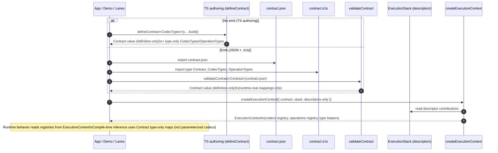

# ADR 155 - Definition-only contracts and type-only codec/operation maps

**Status:** Proposed  
**Date:** 2026-02-15  
**Authors:** Prisma Next Team  
**Domain:** SQL family, contract types, lanes, runtime DX

## Context

Prisma Next uses a contract-first architecture:

- `contract.json` is a **canonical, hashable** artifact (and will later be produced from PSL parsing).
- In no-emit workflows, developers author the contract directly in TypeScript via `defineContract()`.
- Because JSON imports lose important literal and branded type information, we emit a types-only `contract.d.ts` alongside the JSON.

Query lanes and the demo visualization want a **single predictable “contract” object** they can traverse and inspect at runtime.

### The problem we hit

Over time we developed multiple “contract representations” that look similar but aren’t:

- The **TypeScript `Contract` type** (from `contract.d.ts`, or from TS authoring generics) includes helpful “mapping dictionaries” such as codec/operation type maps.
- The **runtime contract value** (from `validateContract(contract.json)`) does not and cannot meaningfully contain those type maps as real data.

This mismatch became obvious in the demo app (e.g. Vite hot reload): the object you can iterate/render is **different** from what the TypeScript type claims it is.

### Why this is tricky

Some “maps” are runtime-real:

- model ↔ table
- field ↔ column
- other structural indexes derived from `storage` + `models`

Other “maps” are **compile-time-only typing channels**:

- codecId → TypeScript output type (including parameterized codecs where output depends on per-column `typeParams` / `typeRef`)
- operation method → argument/return TypeScript types

These typing channels are essential for lane inference, but they are not derivable from JSON at runtime and cannot be inferred from runtime registries without losing precision (especially for parameterized codecs).

Related decisions:

- ADR 131 — codec typing separation (type maps at emit time; runtime registries at execution time)
- ADR 152 — execution-plane descriptors and instances (runtime composition via descriptors)

## Decision

### 1) Contract is definition-only

The contract remains **definition-only**:

- Loading and validating a contract must **not** require an `ExecutionStack`.
- The resulting runtime contract object must **not** embed runtime codec/operation implementations.

This preserves:

- deterministic contracts (`contract.json`)
- no-emit workflows (TS-authored contract value)
- the ability to inspect/render contracts without instantiating any runtime components

### 2) Split “runtime-real mappings” from “type-only maps”

We separate two categories that were previously mixed:

#### 2.1 Runtime-real mappings (stay on the runtime contract value)

The runtime contract object may include **runtime-real structural mappings** derived from contract content, e.g.:

- `modelToTable`, `tableToModel`
- `fieldToColumn`, `columnToField`

These are real data and should be safe to traverse, render, and serialize.

#### 2.2 Type-only codec/operation maps (do not exist as runtime keys)

Codec/operation type maps are treated as **type-only** and must not be modeled as ordinary runtime keys on the contract value.

Instead, they are carried via a **phantom type channel** on the `Contract` type so that:

- lanes can infer types deterministically from `TContract` (no registry-dependent typing)
- runtime contract values remain honest/traversable (no “pretend” keys)

### 3) Query lanes get runtime behavior from ExecutionContext, compile-time typing from Contract types

Lanes already operate with an `ExecutionContext`:

- Runtime behavior reads:
  - `context.codecs` (codec implementations)
  - `context.operations` (operation signatures + lowering, assembled from descriptors)
  - `context.types` (parameterized type helpers)

But compile-time inference for columns and operation expressions continues to flow from the **contract type surface** (from `contract.d.ts` or TS authoring generics), because:

- parameterized codec output types vary per column/type instance, and
- that information is encoded in the contract type graph, not in runtime registry values.

### 4) Stop reading codec/operation type maps from `contract.mappings.*`

Any lane code that currently does something like:

- `contract.mappings.codecTypes`
- `contract.mappings.operationTypes`

must be updated to use type-level extraction helpers (backed by the phantom channel) and/or to rely on runtime registries on `ExecutionContext` only for execution behavior.

## Naming and API shape

### Runtime mappings naming

- We keep the name **`mappings`** for runtime-real structural mappings on the contract value.
- Within `mappings`, only runtime-real keys remain (model/table/field/column indexes, etc.).

Rationale: “mappings” is already widely used, and these indexes are genuinely mappings between contract sub-graphs.

### Type-only maps naming

We introduce a **type-only** concept for codec/operation type maps:

- **`SqlTypeMaps`** (or similar) for the type-level attachment
- a `unique symbol` key (e.g. `SQL_TYPE_MAPS`) used to store the phantom attachment so it cannot collide with user schema keys and is not something consumers will render/serialize accidentally.

Rationale: we want an explicit signal that these maps are for TypeScript inference only, not runtime inspection.

## Consequences

### Positive

- **Contract runtime values match their types** for all runtime-real keys.
- Demo visualization can render/inspect contract objects directly without “pretend property” traps.
- No-emit workflows keep a **single configuration surface** (import codec column constructors once; types flow).
- Lane typing remains deterministic and precise, including parameterized codecs.
- Runtime composition remains where it belongs: `ExecutionContext` derived from descriptors.

### Trade-offs

- We introduce an explicit conceptual split:
  - runtime contract shape vs type-only type maps
- Lanes and helper types need refactors away from reading type maps as runtime properties.

## Alternatives considered

1. **Keep codec/operation type maps as ordinary runtime keys on the contract**
   - Rejected: they are not derivable from JSON at runtime and cause immediate type/value mismatch.
2. **Make contract “resolved” by requiring descriptors/stack to construct it**
   - Rejected: violates the definition-only contract constraint; hurts inspection and no-emit workflows.
3. **Infer column/operation types from runtime registries on `ExecutionContext`**
   - Rejected: current registries are not typed that way, and parameterized codec typing cannot be reconstructed from registries without losing precision.

## Implementation notes (high level)

- Update SQL contract type surfaces so runtime `mappings` contains only runtime-real keys.
- Provide a type-only phantom channel for codec/operation type maps and extraction helpers (e.g. `ExtractCodecTypes<TContract>`).
- Update lane code to:
  - use type-level extraction (not runtime reads) for row typing
  - use `ExecutionContext` registries for runtime execution behavior
- Ensure `validateContract()` does not attempt to fabricate type-only maps as runtime values.

## Follow-ups

- Update the Linear issue text for TML-1831 to reflect the clarified design (contract definition-only; type-only maps via phantom channel; runtime mappings remain runtime-real).

