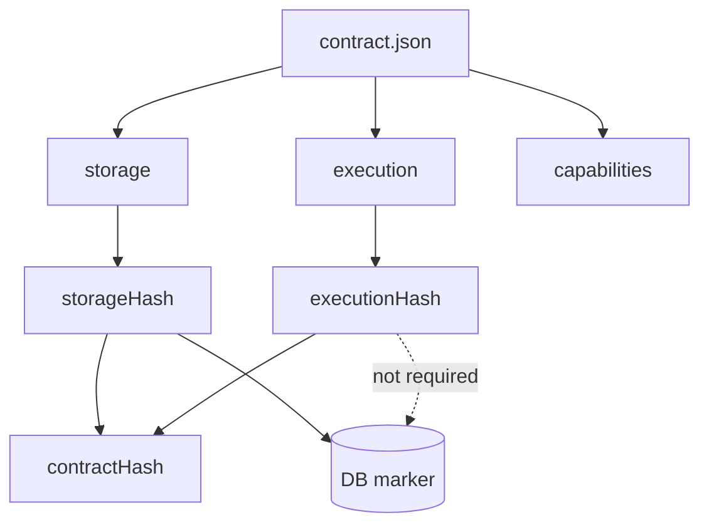

# ADR 158 — Execution mutation defaults

## Context

We want to support **execution-time value generation** for columns during mutation operations (for example, generating IDs via `cuid()`), similar to behaviors found in Prisma ORM and competitors like Kysely and Drizzle.

Prisma Next already has a clear notion of **database column defaults** under `storage.tables.*.columns.*.default`. That is the right place for defaults the **database** provides (literals, `now()`, `gen_random_uuid()`, sequences, etc.).

However, a generator like `cuid()` is not something the database provides. It is a rule for how the **execution plane authors a mutation** when a value is omitted.

This ADR introduces a contract representation for these **mutation defaults** while preserving the separation between DB-verifiable storage facts and execution-plane authoring semantics.

## Terminology

- **database default**: a default applied by the database itself; belongs in `storage`.
- **mutation default**: a value filled in by the execution plane when a mutation omits a column; belongs in `execution`.

Mutation defaults are often authored “on a column” for ergonomics, but they are not storage requirements.

## What problem are we solving?

The primary problem is to support **client/execution-generated defaults** in a contract-first system whose `storage` section is reserved for DB-verifiable facts.

We specifically need:

- a place to record mutation-default intent that is addressable by **(table, column)** so SQL lanes can use it
- one shared implementation so lanes don’t drift
- a hashing/verification story where changing mutation defaults does **not** force database marker churn

## Design constraints

- **Storage must remain DB-verifiable**: `storage` must describe only facts the database can satisfy and we can verify against a live schema.
- **Table/column addressing**: SQL lanes operate on tables and columns; mutation defaults must be discoverable without consulting models.
- **Shared execution behavior**: we don’t want each lane reimplementing defaulting rules.
- **Generator compatibility**: a generator must be compatible with the backing column type (at minimum by `codecId`, and later by column facets like length/precision when available).
- **No unnecessary DB re-signing**: edits to execution-only semantics (like mutation defaults) must not require updating DB marker verification state.

## Decision

### 1) Introduce `execution.mutations.defaults`

We introduce a new top-level sibling section alongside `storage`:

- `storage`: DB-satisfied facts and constraints (tables, columns, keys, indexes, FKs, DB defaults)
- `execution`: declarative execution-plane semantics used when authoring and executing Plans (no executable code)

Mutation defaults live at:

- `execution.mutations.defaults`

Each default is keyed by a reference to a storage column:

- `ref: { table, column }`

This makes the feature usable from SQL lanes and other table-centric consumers.

### 2) Execution-plane behavior is provided as a shared helper (via `ExecutionContext`)

Mutation defaults are applied in the execution plane, not in adapters.

Conceptually, the execution context provides:

- a pre-indexed lookup keyed by `(table, column)` derived from `execution.mutations.defaults`
- a single helper:
  - `applyMutationDefaults({ op, table, values }) → valuesWithDefaults`

Lanes call this once per mutation and then build a Plan normally.

### 3) Generator registry + compatibility validation

Mutation defaults refer to generators by stable IDs (built-in + extension-provided).

Generators must be registered with:

- an implementation (to produce values at execution time)
- a static descriptor used for validation, for example:
  - output shape (string/number/etc.)
  - optional constraints (maxLength, etc.)
  - supported column codecs (or a predicate over `{ codecId, nativeType, typeParams, ... }`)

During execution context creation, we validate that every mutation default’s generator is compatible with its backing column.

This fails fast with a clear error rather than discovering mismatches at query execution time.

### 4) Precedence rules

When authoring a mutation:

1. **Caller-provided value wins** (including explicit `null` when allowed).
2. Else, apply **execution mutation default** from `execution.mutations.defaults`.
3. Else, allow **database default** to apply by omitting the column when `storage.tables.*.columns.*.default` exists.

If both an execution mutation default and a database default exist for the same column, the execution default shadows the database default. This is allowed, but authoring/validation should emit a diagnostic to reduce accidental ambiguity.

## Hashing and marker verification

Today, the contract’s hashing split (for example, `coreHash` vs `profileHash`) is too coarse for execution-only semantics.

Mutation defaults change how the execution plane fills omitted values, but they do **not** change what the database must satisfy. We should not have to re-sign the database marker for those edits.

### Proposed hash model: section-owned hashes

Move to section-owned hashes, where each top-level section computes its own hash:

- `storageHash`: hash of DB-satisfied expectations (the `storage` section and pinned capability requirements)
- `executionHash`: hash of `execution` (including `execution.mutations.defaults`)
- `contractHash` (optional): hash of `{ storageHash, executionHash, ... }` for distribution/debugging

### Marker verification under the new scheme

The database marker verifies only what the database must satisfy:

- verify `storageHash`
- do **not** require marker updates when `executionHash` changes

## Worked example (proposed contract shape)

```json
{
  "schemaVersion": "1",
  "targetFamily": "sql",
  "target": "postgres",

  "storageHash": "sha256:<storage>",
  "executionHash": "sha256:<execution>",
  "contractHash": "sha256:<root>",

  "capabilities": {
    "postgres": { "returning": true }
  },

  "storage": {
    "tables": {
      "user": {
        "columns": {
          "id": { "nativeType": "text", "codecId": "pg/text@1", "nullable": false },
          "email": { "nativeType": "text", "codecId": "pg/text@1", "nullable": false }
        },
        "primaryKey": { "columns": ["id"] },
        "uniques": [],
        "indexes": [],
        "foreignKeys": []
      }
    }
  },

  "execution": {
    "mutations": {
      "defaults": [
        {
          "ref": { "table": "user", "column": "id" },
          "onCreate": { "kind": "generator", "id": "cuid" }
        }
      ]
    }
  }
}
```

Note: the exact JSON layout for defaults can be an array (as shown) or a map keyed by table/column. The requirement is that defaults are addressable by `(table, column)`.

## Diagram (contract branches and verification)



## Consequences

### Benefits

- Storage remains DB-verifiable and marker semantics stay crisp.
- Mutation defaults work for SQL lanes (table/column addressing).
- One shared defaulting implementation reduces drift across lanes.
- Execution-only changes don’t cause DB marker churn.

### Costs

- Adds a new contract section (`execution`) and associated hashing model changes.
- Requires a generator registry + compatibility validation infrastructure in the execution plane.
- Requires evolving existing hashing/marker ADRs (follow-up work) to match the new scheme.

## Related

- ADR 021 — Contract Marker Storage
- ADR 004 — Core Hash vs Profile Hash (this ADR proposes an evolution beyond that split)
- ADR 155 — Driver/Codec boundary value representation and responsibilities (codecId-based compatibility reasoning)

