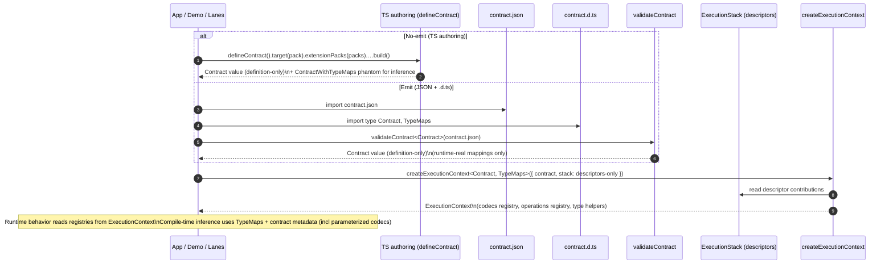

# ADR 159 - Definition-only contracts and separate TypeMaps for lane typing



**Status:** Accepted  
**Date:** 2026-02-15  
**Authors:** Prisma Next Team  
**Domain:** SQL family, contract types, lanes, runtime DX  
**Spec:** [agent-os/specs/2026-02-15-runtime-dx-ir-shaped-contract-mappings-on-executioncontext/spec.md](../../../agent-os/specs/2026-02-15-runtime-dx-ir-shaped-contract-mappings-on-executioncontext/spec.md)

## Context

Prisma Next uses a contract-first architecture:

- `contract.json` is a **canonical, hashable** artifact (and will later be produced from PSL parsing).
- In no-emit workflows, developers author the contract directly in TypeScript via `defineContract()`.
- Because JSON imports lose important literal and branded type information, we emit a types-only `contract.d.ts` alongside the JSON.

Query lanes and the demo visualization want a **single predictable “contract” object** they can traverse and inspect at runtime.

### The problem we hit

Over time we developed multiple “contract representations” that look similar but aren’t:

- The **TypeScript `Contract` type** (from `contract.d.ts`, or from TS authoring) implied the presence of codec/operation type maps as if they were part of the contract structure.
- The **runtime contract value** (from `validateContract(contract.json)`) does not and cannot meaningfully contain those type maps as real data.

This mismatch became obvious in the demo app (e.g. Vite hot reload): the object you can iterate/render is **different** from what the TypeScript type claims it is.

### Why this is tricky

Some “maps” are runtime-real:

- model ↔ table
- field ↔ column
- other structural indexes derived from `storage` + `models`

Other “maps” are **compile-time-only typing channels**:

- codecId → TypeScript output type (including parameterized codecs where output depends on per-column `typeParams` / `typeRef`)
- operation method → argument/return TypeScript types

These typing channels are essential for lane inference, but they are not derivable from JSON at runtime and cannot be inferred from runtime registries without losing precision (especially for parameterized codecs).

Related decisions:

- ADR 131 — codec typing separation (type maps at emit time; runtime registries at execution time)
- ADR 152 — execution-plane descriptors and instances (runtime composition via descriptors)

## Decision

### 1) Contract is definition-only

The contract remains **definition-only**:

- Loading and validating a contract must **not** require an `ExecutionStack`.
- The resulting runtime contract object must **not** embed runtime codec/operation implementations.

This preserves:

- deterministic contracts (`contract.json`)
- no-emit workflows (TS-authored contract value)
- the ability to inspect/render contracts without instantiating any runtime components

### 2) Split “runtime-real mappings” from “type-only maps”

We separate two categories that were previously mixed:

#### 2.1 Runtime-real mappings (stay on the runtime contract value)

The runtime contract object may include **runtime-real structural mappings** derived from contract content, e.g.:

- `modelToTable`, `tableToModel`
- `fieldToColumn`, `columnToField`

These are real data and should be safe to traverse, render, and serialize.

#### 2.2 TypeMaps are a separate type (not part of Contract)

Codec/operation typing is treated as **type-only** and must not be modeled as ordinary runtime keys on the contract value.

Instead, `contract.d.ts` exports a separate `TypeMaps` type alongside `Contract`:

```ts
export type TypeMaps = {
  readonly codecTypes: CodecTypes
  readonly operationTypes: OperationTypes
}
```

Key properties:

- `Contract` stays focused on **contract structure** (definition-only runtime value).
- `TypeMaps` carries the compile-time maps needed for deterministic inference (including parameterized codecs).
- Consumers that need lane typing thread `TypeMaps` explicitly (e.g. `ExecutionContext<Contract, TypeMaps>`).

### 2.3 Ergonomics: infer type maps from packs in TS authoring

In TS authoring (no-emit), developers already provide a single point of configuration by selecting:

- a target pack (`.target(postgresPack)`)
- extension packs (`.extensionPacks({ pgvector })`)

The codec/operation **type maps** used for inference are therefore derivable from those pack refs at compile time. We should not require users to manually write unions/intersections like:

- `type AllCodecTypes = PostgresCodecTypes & PgVectorCodecTypes`

This ADR keeps the underlying type map concept (it is still required for inference, including parameterized codecs), but expects the authoring DSL to infer and accumulate it from the selected packs.

In the no-emit workflow, we additionally allow convenience helpers (e.g. `postgres()`) to infer `TypeMaps` without a second generic by using a composite type:

```ts
export type ContractWithTypeMaps<TContract, TTypeMaps> = TContract & {
  readonly [TYPE_MAPS]?: TTypeMaps
}
```

This is a **phantom type parameter**: it does not add runtime keys to the contract object, and it does not turn `TypeMaps` into part of `Contract`’s structural model. It exists purely so helpers can infer the associated `TypeMaps` from the authored contract type.

### 3) Query lanes get runtime behavior from ExecutionContext, compile-time typing from TypeMaps

Lanes already operate with an `ExecutionContext`:

- Runtime behavior reads:
  - `context.codecs` (codec implementations)
  - `context.operations` (operation signatures + lowering, assembled from descriptors)
  - `context.types` (parameterized type helpers)

But compile-time inference for columns and operation expressions continues to flow from **TypeMaps** (from `contract.d.ts` or TS authoring inference), because:

- parameterized codec output types vary per column/type instance, and
- that information is encoded in the contract type graph, not in runtime registry values.

### 4) Stop reading codec/operation typing from the runtime Contract shape

Any lane code that currently does something like:

- `contract.mappings.codecTypes`
- `contract.mappings.operationTypes`

must be updated to use `TypeMaps` (type-level) and to rely on runtime registries on `ExecutionContext` for execution behavior.

## Naming and API shape

### Runtime mappings naming

- We keep the name **`mappings`** for runtime-real structural mappings on the contract value.
- Within `mappings`, only runtime-real keys remain (model/table/field/column indexes, etc.).

Rationale: “mappings” is already widely used, and these indexes are genuinely mappings between contract sub-graphs.

### Type-only maps naming

We introduce a **type-only** `TypeMaps` export for codec/operation type maps:

- **`TypeMaps`**: exported from `contract.d.ts` and used as the explicit typing input for lane-context construction.
- `ContractWithTypeMaps`: a no-emit-only composite type that carries `TypeMaps` as a phantom parameter for inference in convenience helpers.

Rationale: we want an explicit signal that these maps are for TypeScript inference only, not runtime inspection, and we want to avoid implying that they are part of the contract structure.

## Consequences

### Positive

- **Contract runtime values match their types** for all runtime-real keys.
- Demo visualization can render/inspect contract objects directly without “pretend property” traps.
- No-emit workflows keep a **single configuration surface** (import codec column constructors once; types flow).
- Lane typing remains deterministic and precise, including parameterized codecs.
- Runtime composition remains where it belongs: `ExecutionContext` derived from descriptors.
- Higher-level runtime clients (e.g. `@prisma-next/postgres/runtime`) can stay ergonomic:
  - emitted workflow: `postgres<Contract, TypeMaps>({ contractJson, ... })`
  - no-emit workflow: `postgres({ contract })` where `contract` is `ContractWithTypeMaps<Contract, TypeMaps>`

### Trade-offs

- We introduce an explicit conceptual split:
  - runtime contract shape vs type-only type maps
- Lanes and helper types need refactors away from reading type maps as runtime properties.

## Alternatives considered

1. **Keep codec/operation type maps as ordinary runtime keys on the contract**
   - Rejected: they are not derivable from JSON at runtime and cause immediate type/value mismatch.
2. **Make contract “resolved” by requiring descriptors/stack to construct it**
   - Rejected: violates the definition-only contract constraint; hurts inspection and no-emit workflows.
3. **Infer column/operation types from runtime registries on `ExecutionContext`**
   - Rejected: current registries are not typed that way, and parameterized codec typing cannot be reconstructed from registries without losing precision.

## Implementation notes (high level)

- Update SQL contract type surfaces so runtime `mappings` contains only runtime-real keys.
- Emit and export `TypeMaps` from `contract.d.ts`.
- Thread `TypeMaps` through lane/context typing (e.g. `ExecutionContext<TContract, TypeMaps>`), removing assumptions that codec/op typing is available on the runtime contract value.
- Update lane code to:
  - use `TypeMaps` (type-level) for row typing
  - use `ExecutionContext` registries for runtime execution behavior
- Ensure `validateContract()` does not attempt to fabricate type-only maps as runtime values.
- Ensure convenience clients and façades remain compatible with this model (validate contract first, then derive context/registries).

## Implementation complete (2026-02-15)

- Demo visualization (`examples/prisma-next-demo/src/entry.ts`) renders directly from `validateContract<Contract>(contractJson)` output. No `ContractIR` alias; the constructed Contract is used for rendering and HMR.
- Demo emitted workflow (`examples/prisma-next-demo/src/prisma/db.ts`) uses `postgres<Contract, TypeMaps>({ contractJson, ... })` with explicit `TypeMaps` from `contract.d.ts`.
- Control-client test utilities use the constructed Contract from `validateContract` for dbInit/verify operations.

