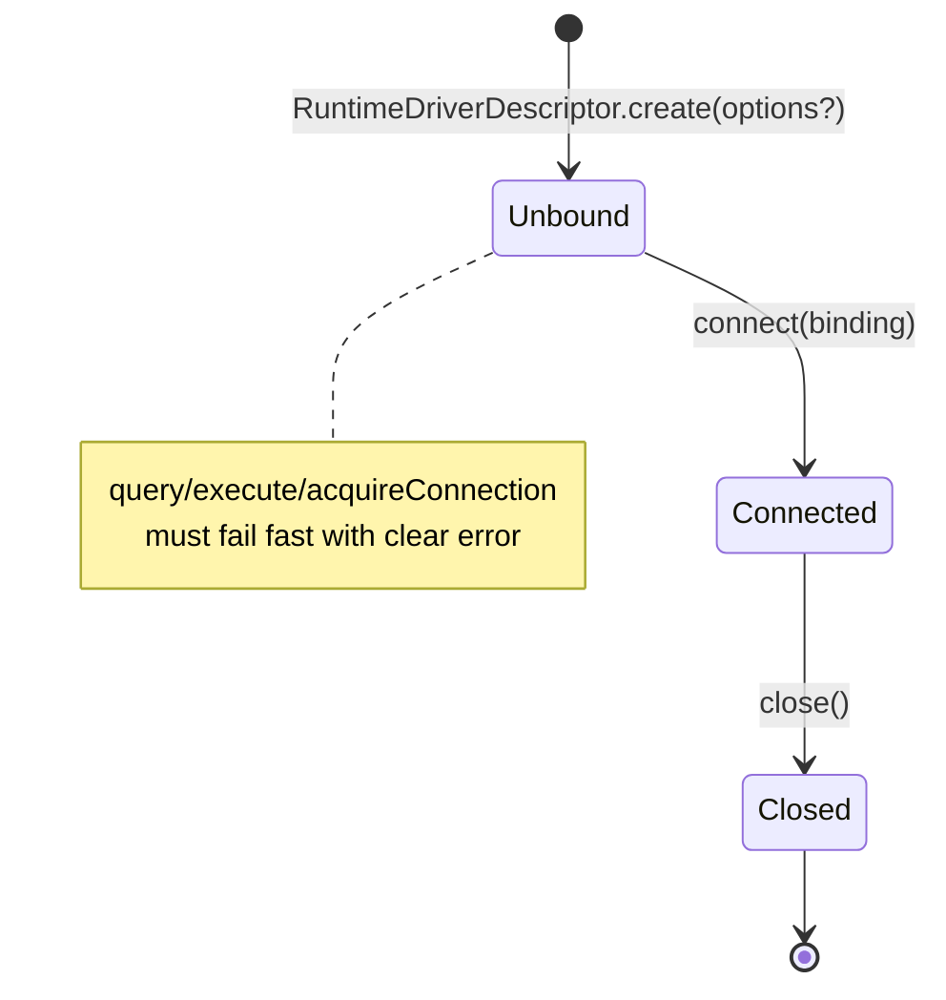
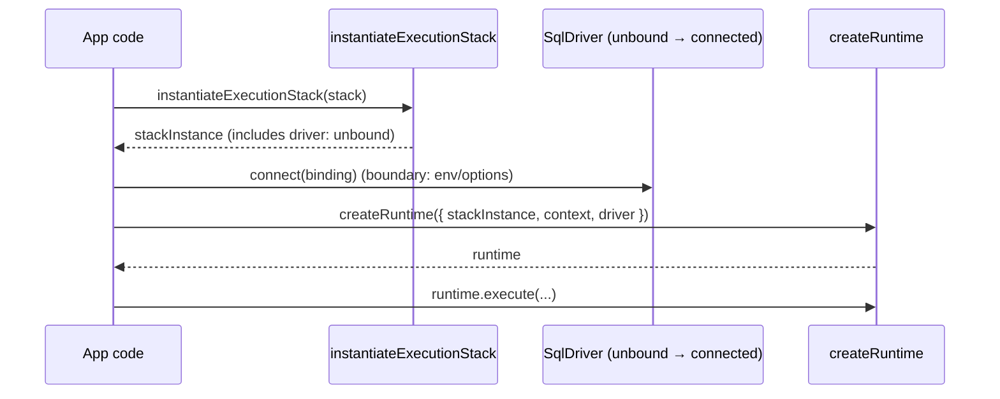

# ADR 159 — Runtime Driver Lifecycle (Instantiation vs Binding vs Connection)

**Status:** Implemented  
**Date:** 2026-02-15  
**Domain:** Runtime, Drivers  

## TL;DR

- A runtime driver instance has two relevant states:
  - **Unbound**: created, configured, but not wired to any transport yet
  - **Connected**: bound to a driver-determined “binding” (pool/client/url/http/etc), and now executable
- `RuntimeDriverDescriptor.create(options?)` **creates the driver instance** (no env access; no connection/binding)
- `SqlDriver.connect(binding)` **binds the driver instance** to its transport configuration
- After `connect(...)`, call sites can use `query/execute/acquireConnection`.
- Before `connect(...)`, use fails fast with a clear error.
- `acquireConnection()` returns a connection handle. **`connect()` does not “return a connection.”**

## Context

Runtime drivers previously required connection-ish configuration at instantiation time. `RuntimeDriverDescriptor.create(options)` accepted connection data (e.g. Postgres pool/client), which made stack instantiation environment-bound and prevented `instantiateExecutionStack()` from producing a “complete” stack instance.

We need a clear lifecycle that:

- keeps **stack instantiation deterministic and env-free**, and
- pushes **environment/runtime configuration** (e.g. `DATABASE_URL`) to the boundary where it exists.

## Problem

The term “driver” was overloaded and the lifecycle was unclear:

- People assumed a driver instance implied an underlying connected library instance (e.g. `pg`).
- Call sites had to construct drivers “late”, outside the execution stack, which diverged from the descriptor/instance pattern used for targets/adapters/extensions.
- The API shape conflated “create a driver object” with “bind it to a transport”.

## Definitions (non-negotiable vocabulary)

- **Driver**: A Prisma Next runtime interface that implements execution behavior (e.g. `SqlDriver`). It is **not** the underlying library object (e.g. `pg.Pool`).
- **Binding**: Driver-determined data that wires a driver to a transport/configuration. Examples:
  - Postgres: `{ kind: 'url' | 'pgPool' | 'pgClient', ... }`
  - Future: `{ kind: 'http', endpoint, headers }`, `{ kind: 'memory' }`
- **Connect**: A method on the driver instance (`connect(binding)`) that transitions the driver from **unbound → connected** by storing/initializing whatever it needs to execute.
- **Connection**: A handle returned by `acquireConnection()` for operations that require a dedicated connection (e.g. transactions). This is separate from “binding”.

## Decision

### Responsibilities and boundary

| Step | Owner | Input | Output | Env allowed? |
|------|-------|-------|--------|--------------|
| Instantiate stack | `instantiateExecutionStack(stack)` | descriptors | instances incl. **unbound driver** | No |
| Bind/Connect | boundary (e.g. `postgres().runtime()`) | binding derived from options/env | driver becomes **connected** | Yes |
| Create runtime | `createRuntime(...)` | connected driver + stack instance + context | runtime object | Yes |
| Execute | runtime + driver | plans/queries | results | Yes |

### Lifecycle state model



### Sequencing (happy path)



### Interface changes (what to memorize)

- `RuntimeDriverDescriptor.create(options?: TCreateOptions)`:
  - options are **driver-specific** and must be **non-connection**
  - returns an **unbound** driver instance
- `SqlDriver.connect(binding: TBinding)`:
  - binding is **driver-determined**
  - after connect, driver is executable (and may lazily allocate resources as needed)
- `ExecutionStackInstance.driver`:
  - stack instantiation includes the driver instance so the stack is “complete” and deterministic

### How to pass driver create options when stack instantiation calls `create()` with no args

Because `instantiateExecutionStack(...)` calls `descriptor.create()` with no arguments, the supported pattern is to **curry options into the descriptor** (i.e. wrap `create()`):

```ts
const driverWithCursor = {
  ...postgresDriverDescriptor,
  create() {
    return postgresDriverDescriptor.create({ cursor });
  },
};
```

This preserves the invariant that stack instantiation is env-free while still allowing driver-specific configuration at create time.

## Consequences

- ✅ Stack instantiation is deterministic and env-free (descriptors → instances, including driver).
- ✅ Binding is explicitly a boundary concern (env/options live there).
- ✅ “Driver” terminology is unambiguous: interface object ≠ underlying library object.
- ⚠️ Create-time driver options must be passed by descriptor wrapping (or via a future helper API); this needs to be documented wherever drivers are configured.

## Worked example (Postgres lazy client)

At the boundary (e.g. `postgres().runtime()`), we:

1. instantiate the execution stack (includes unbound driver),
2. resolve binding from options/env,
3. call `driver.connect(binding)`,
4. call `createRuntime(...)`.

## References

- [ADR 152 — Execution Plane Descriptors and Instances](./ADR%20152%20-%20Execution%20Plane%20Descriptors%20and%20Instances.md)
- TML-1837 spec: `agent-os/specs/2026-02-15-runtime-dx-decouple-runtime-driver-instantiation-from-connection-binding/spec.md`
- [Runtime & Plugin Framework](../subsystems/4.%20Runtime%20&%20Plugin%20Framework.md)
