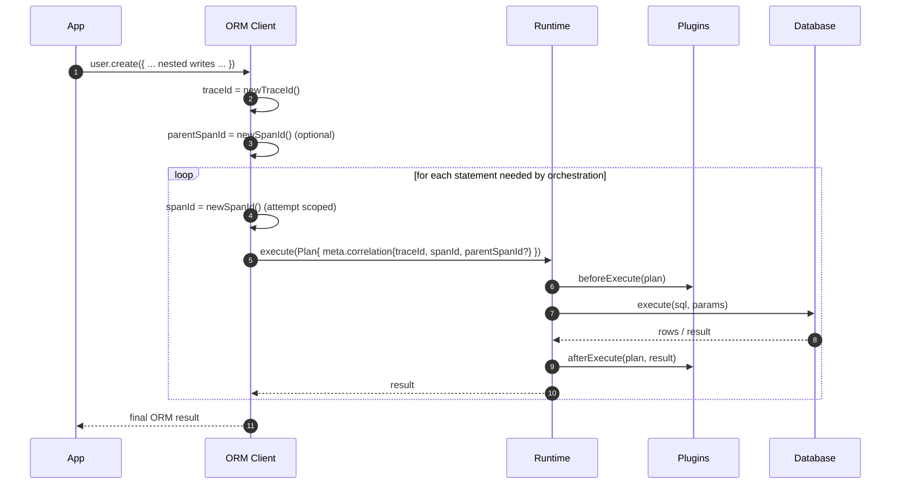

# ADR 159 — Plan correlation IDs for multi-statement orchestration

```ts
// ORM Client (conceptual)
import type { ExecutionPlan } from '@prisma-next/contract/types';

type Correlation = {
  readonly traceId: string; // stable for one ORM operation invocation
  readonly spanId: string; // unique per statement execution attempt
  readonly parentSpanId?: string; // optional: enables nesting later
};

function attachCorrelation<Row>(
  plan: ExecutionPlan<Row>,
  correlation: Correlation,
): ExecutionPlan<Row> {
  // Plans are immutable and may be reused/re-executed; attach attempt-scoped
  // correlation by returning a new Plan value for this execution attempt.
  return Object.freeze({
    ...plan,
    meta: Object.freeze({
      ...plan.meta,
      correlation,
    }),
  });
}
```



## Context

Prisma Next’s query plane is built around immutable Plans and the **one query → one statement** rule (ADR 003). This makes verification, guardrails, and debugging predictable: runtime plugins can lint, budget, and observe each statement deterministically.

We also want to build a higher-abstraction, model-centric client (working title: **ORM Client**) in the vein of PrismaClient / ActiveRecord. One of its key specializations is ergonomic relationship traversal and nested writes. In practice, many ORM operations will require orchestrating **multiple database statements** (for example: nested creates across multiple tables, read-then-write sequences with capability-gated strategies, retries, or explicit transaction workflows).

At that layer, it is not always possible—or desirable—to preserve “one call → one statement”. Even when each individual statement remains analyzable, plugins currently have no stable way to recognize that a set of statements belong to the same higher-level user operation.

We want a grouping mechanism that:

- Preserves statement-level analysis (lints/budgets/telemetry run per Plan)
- Enables correlation across multiple Plans that serve one user-visible operation
- Generalizes beyond the initial ORM use case (other orchestrators may also group work)
- Mirrors a well-understood model (OpenTelemetry trace/span semantics)

## Decision

Introduce **core, first-class correlation identifiers** on the Plan metadata, inspired by OpenTelemetry:

- Add optional `meta.correlation` to the unified Plan metadata type (`PlanMeta`) in `@prisma-next/contract/types`.
- Define the correlation model as:
  - **`traceId`**: groups multiple statement executions that serve the same higher-level operation
  - **`spanId`**: identifies a single statement execution attempt (one `execute(plan)` call, including per-attempt retries)
  - **`parentSpanId?`**: optional field enabling a future tree model (nested spans) without redesign

These identifiers are **informational only**:

- They do not affect execution semantics, correctness, lowering, or verification
- They are excluded from any hashing, identity, caching, or de-duplication keys
- They exist solely to improve plugin correlation and developer experience

### Why this lives on `PlanMeta` (not “black box” metadata)

Correlation is a cross-cutting concern in the runtime/plugin ecosystem. If it is hidden in `annotations.ext` or ad-hoc metadata bags, plugins become inconsistent and we lose the ability to standardize tooling and patterns.

Making correlation a **core Plan abstraction** aligns with “Plans are the product” and “Explicit over implicit” (Architecture Overview). It also keeps the runtime core wafer-thin: the runtime does not invent meaning; it executes the Plan it is given and provides consistent surfaces to plugins (ADR 014).

## Semantics and naming

We intentionally choose OTel-adjacent naming because the semantics are widely understood:

- **`traceId`** is the closest match for “this ORM operation invocation”
- **`spanId`** is the closest match for “this statement execution attempt”

To avoid overloading generic identifiers at the top level, these fields live under a scoped container: `meta.correlation`.

We explicitly avoid domain-specific names like `intentId`. Today, “grouping by ORM user intent” is the motivating use case, but future orchestrators may group work for different reasons (pipelines, retries, backfills, preflight/probing, multi-target fanout). “Correlation” captures the general purpose without implying a single domain meaning.

## How it is applied

### Source of truth: the orchestrator

Correlation is assigned by the component that orchestrates multiple Plans (initially the ORM Client):

- `traceId` is created **once**, at the start of an ORM operation invocation
- Each statement execution attempt gets a fresh `spanId`
- `parentSpanId` is optional; when used, it typically points at the ORM operation’s “root span”

### Attempt-scoped `spanId` requires immutability-friendly attachment

Plans are immutable and may be reused or re-executed. A `spanId` cannot be a stable property of a reusable Plan template if it must be unique per execution attempt.

Therefore, the orchestrator attaches correlation **at execution time**, by constructing a new Plan value for that attempt (copying meta and adding `meta.correlation`). This keeps Plan templates reusable and keeps correlation attempt-scoped.

### Plugin visibility

Plugins already receive the full `ExecutionPlan` on every hook. By storing correlation on `PlanMeta`, the correlation identifiers become available everywhere plugins operate (beforeExecute, onRow, afterExecute), without introducing additional hook parameters or global context.

## Reapplying the concept beyond the ORM Client

The correlation model is intentionally generic:

- Any future “orchestrator” that executes multiple Plans (pipelines, batch APIs, queue workers, explicit multi-step flows) can create a `traceId` and attach attempt-scoped `spanId`s.
- Higher-level tooling can aggregate by `traceId` to present “one user action” timelines.
- Runtime telemetry can include correlation IDs where appropriate, without parsing SQL text or inferring relationships.

If we later need relationships that are not strictly a tree, we can extend `meta.correlation` with OTel-like *links* (DAG edges) without changing the basic trace/span model.

## Consequences

### Positive

- Runtime plugins can correlate multiple statement executions belonging to the same operation
- Correlation works across lanes and lowering because it is Plan metadata (lane-neutral)
- Orchestrators stay responsible for orchestration and grouping; adapters stay responsible for lowering (ADR 016)
- No changes to query semantics or execution pipeline; this is additive, informational metadata

### Trade-offs

- Requires discipline: correlation IDs must be treated as non-semantic metadata and excluded from any plan identity/hashing
- Names overlap with OTel concepts; scoping under `meta.correlation` mitigates ambiguity but does not eliminate it

## Alternatives considered

- **Hide in `meta.annotations.ext`**: keeps core types small, but makes correlation non-standard and plugin behavior inconsistent.
- **Runtime assigns IDs automatically**: would guarantee coverage, but makes correlation semantics unclear (what is the group?) and risks coupling runtime behavior to higher-level orchestration decisions.
- **Async-local context propagation**: convenient, but adds complexity and implicit behavior; we prefer explicit propagation on Plans.
- **Use SQL fingerprint only**: fingerprints group *identical SQL*, not “belongs to the same user operation”, and cannot represent multi-statement workflows.

## Notes on hashing, caching, and fingerprints

The runtime’s current telemetry fingerprint is computed from SQL text only, so adding `meta.correlation` does not affect it.

If/when we implement plan identity/hashing as described in ADR 013, `meta.correlation` must be explicitly excluded from identity inputs. Correlation is observational metadata, not part of the Plan’s executable meaning.

## Decision record

Add optional, OTel-inspired correlation identifiers to Plan metadata as `meta.correlation{traceId, spanId, parentSpanId?}`. Generate and attach them in orchestrators (starting with the ORM Client) such that `traceId` is stable per higher-level operation invocation and `spanId` is unique per statement execution attempt. Keep these fields informational only and exclude them from hashing and caching semantics.

