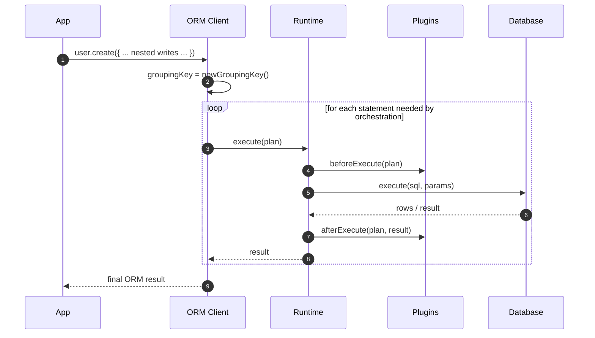

# ADR 160 — Plan grouping keys for multi-statement orchestration

```ts
// ORM Client (conceptual)
import type { ExecutionPlan } from '@prisma-next/contract/types';

function attachGroupingKey<Row>(
  plan: ExecutionPlan<Row>,
  groupingKey: string,
): ExecutionPlan<Row> {
  // Plans are immutable and may be reused/re-executed; attach attempt-scoped
  // metadata by returning a new Plan value for this execution attempt.
  return Object.freeze({
    ...plan,
    meta: Object.freeze({
      ...plan.meta,
      groupingKey,
    }),
  });
}
```



Note: each `plan` executed by the ORM Client carries the same `meta.groupingKey` value for the duration of that ORM operation invocation.

## Context

Prisma Next’s query plane is built around immutable Plans and the **one query → one statement** rule (see [ADR 003 — One Query One Statement](ADR 003 - One Query One Statement.md)). This makes verification, guardrails, and debugging predictable: runtime plugins can lint, budget, and observe each statement deterministically.

We also want to build a higher-abstraction, model-centric client (working title: **ORM Client**) in the vein of PrismaClient / ActiveRecord. One of its key specializations is ergonomic relationship traversal and nested writes. In practice, many ORM operations will require orchestrating **multiple database statements** (for example: nested creates across multiple tables, read-then-write sequences with capability-gated strategies, retries, or explicit transaction workflows).

At that layer, it is not always possible—or desirable—to preserve “one call → one statement”. Even when each individual statement remains analyzable, plugins currently have no stable way to recognize that a set of statements belong to the same higher-level user operation.

We want a grouping mechanism that:

- Preserves statement-level analysis (lints/budgets/telemetry run per Plan)
- Enables correlation across multiple Plans that serve one user-visible operation
- Generalizes beyond the initial ORM use case (other orchestrators may also group work)
- Avoids overloading future distributed tracing identifiers (Prisma Next may adopt OpenTelemetry for tracing later)

## Decision

Introduce a **core, first-class Plan grouping key**:

- Extend the shared Plan metadata (`PlanMeta`) to allow an optional `meta.groupingKey`.
- `groupingKey` groups multiple statement executions that serve the same higher-level operation.

The grouping key is **informational only**:

- It does not affect execution semantics, correctness, lowering, or verification.
- It is excluded from any hashing, identity, caching, or de-duplication keys.
- It exists solely to improve plugin correlation and developer experience.

### Why this lives on `PlanMeta` (not “black box” metadata)

Correlation is a cross-cutting concern in the runtime/plugin ecosystem. If it is hidden in `annotations.ext` or ad-hoc metadata bags, plugins become inconsistent and we lose the ability to standardize tooling and patterns.

Making grouping a **core Plan abstraction** aligns with “Plans are the product” and “Explicit over implicit” (Architecture Overview). It also keeps the runtime core wafer-thin: the runtime does not invent meaning; it executes the Plan it is given and provides consistent surfaces to plugins (see [ADR 014 — Runtime Hook API](ADR 014 - Runtime Hook API.md)).

## Semantics and naming

We intentionally avoid OpenTelemetry terms like `traceId` and `spanId`. Prisma Next may adopt OTel for real tracing later, and reusing those names in the Plan model would be overloaded and confusing.

We also avoid domain-specific names like `intentId`. Today, “grouping by ORM user intent” is the motivating use case, but future orchestrators may group work for different reasons (pipelines, retries, backfills, preflight/probing, multi-target fanout).

We choose **`groupingKey`** because it:

- Signals the field is for **grouping and correlation** (not identity)
- Avoids implying global uniqueness or stability
- Remains broadly applicable to future orchestrators beyond the ORM Client

## How it is applied

### Source of truth: the orchestrator

The grouping key is assigned by the component that orchestrates multiple Plans (initially the ORM Client):

- `groupingKey` is created **once**, at the start of an ORM operation invocation
- All statement executions that belong to that invocation attach the same `groupingKey`

### Immutability-friendly attachment

Plans are immutable and may be reused or re-executed.

Therefore, the orchestrator attaches `groupingKey` **at execution time**, by constructing a new Plan value for the attempt (copying meta and adding `meta.groupingKey`). This keeps Plan templates reusable and keeps grouping explicit.

### Plugin visibility

Plugins already receive the full `ExecutionPlan` on every hook. By storing grouping on `PlanMeta`, `groupingKey` is available everywhere plugins operate (beforeExecute, onRow, afterExecute), without introducing additional hook parameters or global context.

## Reapplying the concept beyond the ORM Client

The grouping mechanism is intentionally generic:

- Any future “orchestrator” that executes multiple Plans (pipelines, batch APIs, queue workers, explicit multi-step flows) can create a `groupingKey` and attach it to each Plan execution.
- Higher-level tooling can aggregate by `groupingKey` to present “one user action” timelines.
- Runtime telemetry can include `groupingKey` where appropriate, without parsing SQL text or inferring relationships.

## Consequences

### Positive

- Runtime plugins can correlate multiple statement executions belonging to the same operation
- Correlation works across lanes and lowering because it is Plan metadata (lane-neutral)
- Orchestrators stay responsible for orchestration and grouping; adapters stay responsible for lowering (see [ADR 016 — Adapter SPI for Lowering](ADR 016 - Adapter SPI for Lowering.md))
- No changes to query semantics or execution pipeline; this is additive, informational metadata

### Trade-offs

- Requires discipline: `groupingKey` must be treated as non-semantic metadata and excluded from any plan identity/hashing

## Alternatives considered

- **Hide in `meta.annotations.ext`**: keeps core types small, but makes correlation non-standard and plugin behavior inconsistent.
- **Runtime assigns IDs automatically**: would guarantee coverage, but makes correlation semantics unclear (what is the group?) and risks coupling runtime behavior to higher-level orchestration decisions.
- **Async-local context propagation**: convenient, but adds complexity and implicit behavior; we prefer explicit propagation on Plans.
- **Use SQL fingerprint only**: fingerprints group *identical SQL*, not “belongs to the same user operation”, and cannot represent multi-statement workflows.

## Notes on hashing, caching, and fingerprints

The runtime’s current telemetry fingerprint is computed from SQL text only, so adding `meta.groupingKey` does not affect it.

If/when we implement plan identity/hashing as described in [ADR 013 — Lane Agnostic Plan Identity](ADR 013 - Lane Agnostic Plan Identity.md), `meta.groupingKey` must be explicitly excluded from identity inputs. Grouping is observational metadata, not part of the Plan’s executable meaning.

## Decision record

Add optional `meta.groupingKey: string` to Plan metadata. Generate it in orchestrators (starting with the ORM Client) such that it is stable per higher-level operation invocation and attached to all statement executions that serve that invocation. Keep it informational only and exclude it from hashing and caching semantics.

