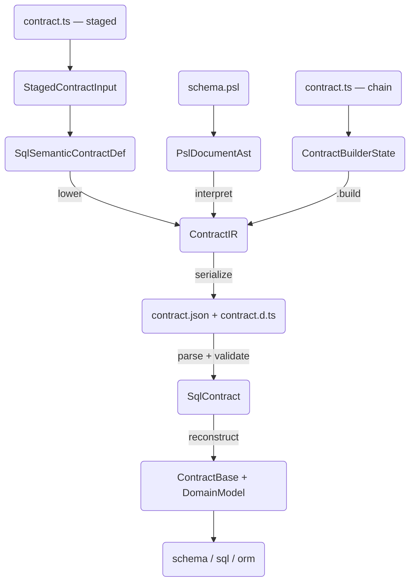
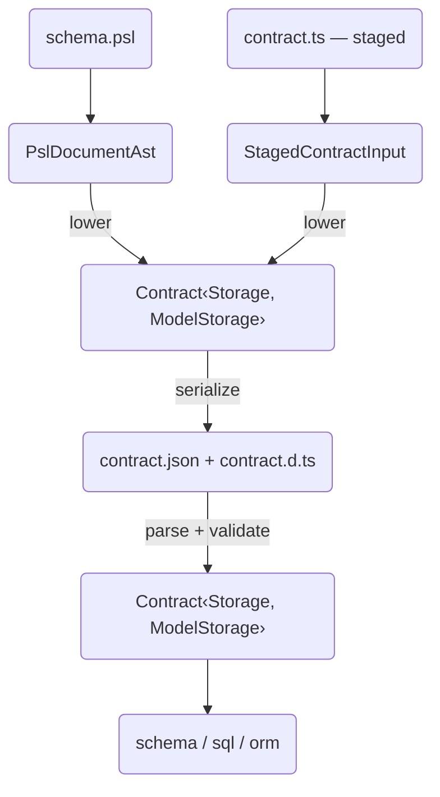

# ADR 179 — Unified contract representation

## At a glance

A contract passes through six distinct in-memory representations between authoring and runtime. Each exists because the previous one was missing something the next consumer needed.

**Today** — six representations, two round-trips:



The types a contract passes through, in order:

- **PslDocumentAst** / **StagedContractInput** / **ContractBuilderState** — authoring-time representations (non-serializable, transient)
- **SqlSemanticContractDefinition** — model-first intermediate; exists because ContractIR is storage-first and awkward as a lowering target
- **ContractIR** — storage-first canonical IR; tables are the primary key, models and relations are separate top-level sections
- **contract.json** — serialized ContractIR on disk
- **SqlContract** — validated runtime object; extends `ContractBase` with SQL-specific storage, relations, and materialized mappings
- **ContractBase / DomainModel** — model-first types reconstructed from the storage-first layout so runtime consumers can work with models, fields, and relations

`SqlSemanticContractDefinition` and `ContractBase` / `DomainModel` exist because `ContractIR` is storage-first but both authoring and runtime need model-first structure. Authoring builds the semantic definition as a stepping stone *down* to the IR; runtime reconstructs domain types on the way back *up*.

**After** — one canonical representation:



- **PslDocumentAst** / **StagedContractInput** — authoring-time representations (unchanged — non-serializable by design)
- **Contract** — the single canonical type; model-first, family-parameterized, serializable
- **contract.json** — serialized Contract on disk
- **Contract** — parsed back into the same type; runtime consumers read it directly

Both authoring surfaces lower directly to `Contract`. The emitter serializes it. The validator parses it back into the same type. Runtime consumers read it as-is. No intermediate representations, no reconstruction.

## Context

The contract has evolved through several representations:

- **ContractIR / SqlContract** — the current canonical form. Storage-first (organized by tables, not models), with materialized bidirectional mappings and a separate top-level `relations` section. Family-agnostic at the `ContractIR` level but instantiated as `SqlContract` for the only family that uses it.
- **SqlSemanticContractDefinition** — an intermediate form introduced by the staged TS authoring DSL. Model-first, SQL-specific, resolved but not materialized. Exists because the canonical ContractIR was too storage-first to be a natural authoring target.
- **DomainModel / ContractBase** — runtime-side types built by working backward from ContractIR. Describe models with fields and relations so runtime consumers don't have to reverse-engineer the domain from storage-first data.
- **MongoContract** — the Mongo family's contract, designed from scratch with [ADR 172](ADR%20172%20-%20Contract%20domain-storage%20separation.md)'s domain/storage separation. Already model-first with family-specific storage.

These representations converge: all of them describe "a contract organized by models with typed fields, named relations, and family-specific storage." `SqlSemanticContractDefinition` mirrors the ORM client's type definitions — both organize data around models, fields, and relations because both are trying to describe the contract from the user's semantic perspective. `MongoContract` arrived at the same shape independently. The authoring-side types were built working forward from user intent; the runtime-side types were built working backward from query needs. All three converged on the same structure.

## Problem

Three separate type hierarchies describe the same thing. Authoring surfaces lower through intermediate representations to reach `ContractIR`, then runtime consumers reconstruct model-level structure from `ContractIR`'s storage-first layout. This round-trip is unnecessary — the canonical representation should be model-first from the start, so authoring surfaces can target it directly and runtime consumers can read it without reconstruction.

The specific problems with the current `ContractIR`:

1. **Storage-first organization.** `storage.tables` is the primary key. Models are a secondary section that references tables by name. Relations are a third section keyed by table name. A consumer that wants "User's fields and relations" must cross-reference three top-level sections.
2. **Materialized mappings.** `modelToTable`, `tableToModel`, `fieldToColumn`, `columnToField` are redundant derived data baked into the artifact. Every consumer that reads the contract also has access to `model.storage`, from which these mappings are trivially derivable.
3. **SQL-only in practice.** `ContractIR` is nominally family-agnostic, but `MongoContract` does not use it. Each family already defines its own contract type. The "agnostic" IR is really just the SQL contract with `Record<string, unknown>` escape hatches.
4. **Intermediate representations exist to work around it.** `SqlSemanticContractDefinition` was introduced because the storage-first IR was an awkward lowering target for model-first authoring. `DomainModel` was introduced because runtime consumers needed model-level structure that the IR doesn't provide directly.

## Decision

Replace `ContractIR`, `SqlSemanticContractDefinition`, and `DomainModel` with a single unified contract type parameterized by family-specific storage.

### The unified contract type

```ts
interface Contract<Storage extends StorageBase, ModelStorage> {
  readonly target: string;
  readonly targetFamily: string;
  readonly roots: Record<string, string>;
  readonly models: Record<string, ContractModel<ModelStorage>>;
  readonly capabilities?: Record<string, Record<string, boolean>>;
  readonly extensionPacks?: Record<string, unknown>;
  readonly storage: Storage;
}

interface StorageBase {
  readonly storageHash: string;
}

interface ContractModel<ModelStorage> {
  readonly fields: Record<string, DomainField>;
  readonly relations: Record<string, DomainRelation>;
  readonly storage: ModelStorage;
  readonly discriminator?: DomainDiscriminator;
  readonly variants?: Record<string, DomainVariantEntry>;
  readonly base?: string;
  readonly owner?: string;
}
```

Two generic parameters:

- **`Storage`** — the top-level family storage block. For SQL: the complete database schema (tables, columns, constraints, indexes, named types). For Mongo: collection metadata. Must extend `StorageBase`, which requires a `storageHash`. The family decides how to compute the hash from its own storage representation.
- **`ModelStorage`** — the per-model storage bridge. For SQL: `{ table, fields: { fieldName → { column } } }`. For Mongo: `{ collection? }`. Opaque to the framework — its structure is known to the family but not to framework-level consumers.

### What the framework sees

The framework operates on the domain layer: `roots`, `models[*].fields`, `models[*].relations`, `discriminator`, `variants`, `base`, `owner`. These use the existing `DomainField`, `DomainRelation`, `DomainDiscriminator`, and `DomainVariantEntry` types, which are already family-agnostic and already live in the framework layer.

The framework also sees `storage.storageHash` (for verification) and `target` / `targetFamily` / `capabilities` / `extensionPacks` (for composition and capability gating). It does not interpret the contents of `storage` beyond `storageHash`, and it does not interpret `model.storage` at all.

### What families see

Each family defines concrete types for its two storage parameters:

**SQL:**

```ts
type SqlStorage = StorageBase & {
  readonly tables: Record<string, SqlStorageTable>;
  readonly types?: Record<string, SqlStorageType>;
};

type SqlModelStorage = {
  readonly table: string;
  readonly fields: Record<string, { readonly column: string }>;
};

type SqlContract = Contract<SqlStorage, SqlModelStorage>;
```

**Mongo:**

```ts
type MongoStorage = StorageBase & {
  readonly collections: Record<string, MongoStorageCollection>;
};

type MongoModelStorage = {
  readonly collection?: string;
  readonly relations?: Record<string, { readonly field: string }>;
};

type MongoContract = Contract<MongoStorage, MongoModelStorage>;
```

### Validation is two-pass

`validateContract` moves to the framework layer and operates in two passes:

1. **Domain validation** (framework-owned): validates roots, relation targets, variant/base consistency, discriminators, ownership, and orphaned models. This already exists as `validateContractDomain()` in `packages/1-framework/1-core/shared/contract/src/validate-domain.ts`.

2. **Storage validation** (family-provided): validates family-specific storage invariants. Each family provides its own validator. This already exists for Mongo as `validateMongoStorage()`. SQL will provide an equivalent.

The framework orchestrates both passes. The Mongo implementation in `validateMongoContract()` already follows this pattern: structural parse → domain validation → storage validation → build indices.

### Storage hashing is family-owned

The `StorageBase` interface requires a `storageHash` property. The family is responsible for computing this hash from its own storage representation. The framework reads the hash for verification (comparing against the database marker) but does not compute or interpret it. This means each family can choose the hashing strategy that makes sense for its storage structure.

## What this replaces

| Current | Unified |
|---------|---------|
| `ContractIR` (storage-first, family-agnostic facade) | `Contract<Storage, ModelStorage>` |
| `SqlContract<S, M, R>` (SQL instantiation of ContractIR) | `Contract<SqlStorage, SqlModelStorage>` |
| `SqlSemanticContractDefinition` (authoring intermediate) | Authoring surfaces lower directly to `Contract<SqlStorage, SqlModelStorage>` |
| `DomainModel` / `ContractBase` (runtime reconstruction) | `ContractModel<ModelStorage>` — the domain layer is already there, no reconstruction needed |
| `MongoContract` (already model-first) | `Contract<MongoStorage, MongoModelStorage>` — minimal change, already has the right shape |
| `mappings` section in ContractIR | Eliminated — derivable from `model.storage` |
| Top-level `relations` section in ContractIR | Eliminated — relations live on each model |

### What this does not replace

- **PslDocumentAst** — syntax tree with source spans. Fundamentally different from a resolved contract; needed for diagnostics.
- **StagedContractInput** — live builder objects with closures, lazy tokens, and type-level state. Non-serializable by design; this is how you author, not what you produce.
- **ContractBuilderState** — the old chain-builder's internal state. Being deprecated; same category as StagedContractInput.

These are authoring-time representations. They exist because authoring ergonomics require live objects that a serializable contract type cannot provide. The boundary is clear: authoring representations are non-serializable and transient; the contract is serializable and canonical.

## Consequences

### Benefits

- **One canonical type.** Authoring surfaces, the emitter, the validator, and the runtime all operate on the same type. No intermediate representations, no reconstruction, no translation.
- **Model-first everywhere.** The primary organizational key is the model, not the table. A consumer reading `contract.models.User` sees fields, relations, and storage together — no cross-referencing three sections.
- **Family extensibility without framework knowledge.** Adding a new family means defining two storage types and a storage validator. The framework's domain validation, contract type, and runtime SPI work unchanged.
- **MongoContract already works this way.** The Mongo family's contract type, validation, and runtime are already built around this pattern. Unifying means SQL adopts what Mongo has, not inventing something new.
- **No redundant data in the artifact.** Materialized mappings and the separate relations section are eliminated. The contract is smaller and has a single source of truth for each relationship.

### Costs

- **SQL consumers must adapt.** Code that reads `contract.mappings.modelToTable` or `contract.relations[tableName]` must change. Mappings are derivable from model storage; relations are on each model. Utility functions can provide the derived lookups if O(1) access is needed.
- **Emitter changes.** The SQL emitter currently produces `contract.json` in the storage-first ContractIR shape. It must be updated to produce the unified shape.
- **Builder changes.** `SqlContractBuilder.build()` currently produces ContractIR. The staged lowering pipeline and the old builder must be updated to produce `Contract<SqlStorage, SqlModelStorage>`.

### Migration

There are no external consumers of `contract.json`. The change is internal. Existing emitted contracts will be regenerated when the emitter is updated.

## Related

- [ADR 172 — Contract domain-storage separation](ADR%20172%20-%20Contract%20domain-storage%20separation.md) — designed the three-level structure (domain, bridge, storage) that this ADR formalizes as the canonical representation
- [ADR 178 — Staged contract DSL for SQL TS authoring](ADR%20178%20-%20Staged%20contract%20DSL%20for%20SQL%20TS%20authoring.md) — introduced `SqlSemanticContractDefinition` as an intermediate form; this ADR eliminates the need for it
- [Architecture Overview — Domain-first surfaces](../../Architecture%20Overview.md) — the guiding principle that user-facing APIs speak in application-domain terms
