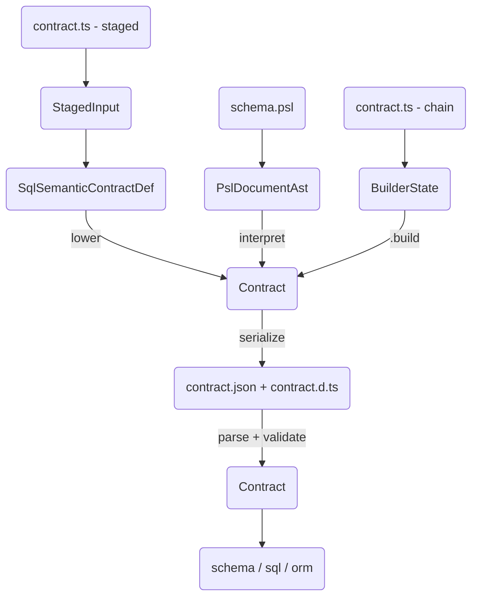
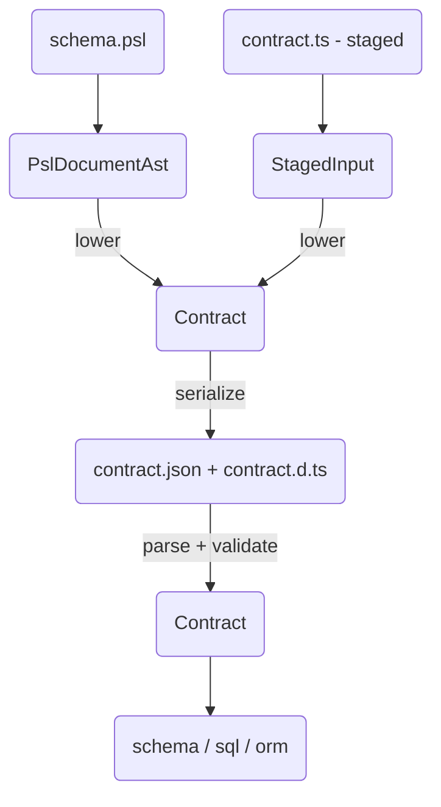

# ADR 182 — Unified contract representation

## At a glance

The contract has one canonical in-memory type, parameterized by family-specific storage:

```ts
interface Contract<Storage extends StorageBase, ModelStorage> {
  readonly target: string;
  readonly targetFamily: string;
  readonly roots: Record<string, string>;
  readonly models: Record<string, ContractModel<ModelStorage>>;
  readonly storage: Storage;                                     // ← family-controlled
  readonly capabilities?: Record<string, Record<string, boolean>>;
  readonly extensionPacks?: Record<string, unknown>;
}

interface StorageBase {
  readonly storageHash: string;   // ← family computes this from its own storage representation
}

interface ContractModel<ModelStorage> {
  readonly fields: Record<string, DomainField>;         // ← framework-owned domain layer
  readonly relations: Record<string, DomainRelation>;   // ← framework-owned domain layer
  readonly storage: ModelStorage;                        // ← family-controlled per-model bridge
  readonly discriminator?: DomainDiscriminator;
  readonly variants?: Record<string, DomainVariantEntry>;
  readonly base?: string;
  readonly owner?: string;
}
```

The framework operates on the domain layer: `roots`, `fields`, `relations`, `discriminator`, `variants`, `base`, `owner`. These types (`DomainField`, `DomainRelation`, etc.) are family-agnostic and already live in the framework layer. The framework also reads `storage.storageHash` for verification, but does not interpret `storage` or `model.storage` beyond that.

Each family fills in the two generic parameters with its own storage types:

```ts
// SQL
type SqlContract = Contract<SqlStorage, SqlModelStorage>;

// Mongo
type MongoContract = Contract<MongoStorage, MongoModelStorage>;
```

This is the type that authoring surfaces produce, that the emitter serializes to `contract.json`, that the validator parses back, and that runtime consumers read. One type, used everywhere.

Here is the contract pipeline **today** — authoring paths converge on a unified in-memory `Contract`, then serialize and validate:



**Simplified view** — the same unified `Contract` survives serialization unchanged:



## The round-trip problem

A contract starts in the user's domain language. Whether authored in PSL or TypeScript, the user describes models, fields, and relations — application concepts.

The canonical intermediate representation (`ContractIR`) was storage-first. Its primary key was `storage.tables`. Models were a secondary section whose fields mixed domain and storage concerns. To get from authoring to `ContractIR`, the authoring surface had to convert model-first data *down* to a storage-first layout.

The emitter serialized this storage-first IR to `contract.json`.

At runtime, consumers needed model-first structure. The ORM client needed to traverse models and relations. The SQL query builder needed field-to-column mappings scoped per model. `SqlContract` extended `ContractBase`, which provided `models: Record<string, DomainModel>` — but this was a reconstruction step, reassembling model-level structure from the storage-first IR.

The result is a round-trip: **model-first → storage-first → model-first**. An intermediate representation exists solely to bridge the authoring-side conversion:

- **SqlSemanticContractDefinition** — the staged TS authoring DSL produced model-first data, but could not emit it directly as the canonical form. So it built this SQL-specific intermediate, then converted *down* to `ContractIR`. This type mirrors the ORM client's type definitions — both organize data around models, fields, and relations, because both describe the contract from the user's semantic perspective.

Some of the most egregious symptoms had already been addressed on main before this ADR: the top-level `relations` section and the materialized `mappings` section (`modelToTable`, `fieldToColumn`, etc.) were removed. Relations now live on each model, and mappings are derived at runtime. But the core problem remained: `ContractIR` was storage-first, `SqlSemanticContractDefinition` existed as a stepping stone down to it, and `ContractBase` reconstructed domain structure on the way back up.

Meanwhile, `MongoContract` — designed from scratch with [ADR 172](ADR%20172%20-%20Contract%20domain-storage%20separation.md)'s domain/storage separation — is already model-first. It doesn't use `ContractIR` at all. And `ContractIR` is nominally family-agnostic, but in practice it's just the SQL contract with `Record<string, unknown>` escape hatches — Mongo never adopted it.

Three independent efforts — the staged DSL, the ORM client, and the Mongo family — all converged on the same model-first shape. The canonical representation needed to be that shape, not the storage-first IR that everything converted to and from.

## Design principles

1. **Model-first organization.** Models are the primary key. A model's fields, relations, and storage bridge are co-located — a consumer reads `contract.models.User` and sees everything about that model without cross-referencing other sections.
2. **Family-parameterized storage.** The framework defines the domain layer (fields, relations, roots, variants, ownership). Each family defines its own storage types. The framework does not interpret storage contents beyond a `storageHash` on the top-level block.
3. **Same type before and after serialization.** The in-memory contract type and the JSON shape are structurally identical. No reconstruction, no conversion, no intermediate representations.
4. **Two-pass validation.** Domain validation (roots, relation targets, variant consistency, ownership) is framework-owned. Storage validation (table/column integrity, FK consistency, collection rules) is family-provided.
5. **Family-owned hashing.** Each family computes its own `storageHash` from its storage representation. The framework reads the hash for verification but does not compute or interpret it.

## Decision

**Status:** Implemented. The codebase now uses the unified `Contract<Storage, ModelStorage>` type shown in [At a glance](#at-a-glance) as the canonical contract, replacing the former `ContractIR` storage-first intermediate and `ContractBase` reconstruction layer. Staged TS authoring may still build `SqlSemanticContractDefinition` before lowering to `Contract` ([ADR 181](ADR%20181%20-%20Staged%20contract%20DSL%20for%20SQL%20TS%20authoring.md)).

### Each family defines its storage types

A family provides two concrete types — one for the top-level storage block, one for the per-model bridge:

**SQL** — the top-level block holds the full database schema; the per-model bridge maps fields to columns:

```ts
type SqlStorage = StorageBase & {
  readonly tables: Record<string, SqlStorageTable>;
  readonly types?: Record<string, SqlStorageType>;
};

type SqlModelStorage = {
  readonly table: string;
  readonly fields: Record<string, { readonly column: string }>;
};

type SqlContract = Contract<SqlStorage, SqlModelStorage>;
```

This unified layout replaces the former structural split in `ContractIR`: the `storage.tables` section is now `contract.storage`, and the `models` section with its mix of domain and storage fields is now `contract.models` with domain and `model.storage` cleanly separated.

**Mongo** — the top-level block holds collection metadata; the per-model bridge is just a collection name:

```ts
type MongoStorage = StorageBase & {
  readonly collections: Record<string, MongoStorageCollection>;
};

type MongoModelStorage = {
  readonly collection?: string;
  readonly relations?: Record<string, { readonly field: string }>;
};

type MongoContract = Contract<MongoStorage, MongoModelStorage>;
```

This is a minimal change for Mongo — `MongoContract` is already model-first with family-specific storage. The existing types adopt the generic parameters; the structure stays the same.

### Validation is two-pass, with family-provided storage validators

The framework provides a `validateContract` function that orchestrates two passes:

1. **Domain validation** (framework-owned): validates roots, relation targets, variant/base consistency, discriminators, ownership, and orphaned models. This already exists as `validateContractDomain()` in `packages/1-framework/1-core/shared/contract/src/validate-domain.ts`.
2. **Storage validation** (family-provided): the family passes a storage validator function that checks family-specific invariants. For Mongo this is `validateMongoStorage()`. SQL will provide an equivalent.

This pattern is already established in the Mongo family. `validateMongoContract()` follows exactly this sequence: structural parse → `validateContractDomain()` → `validateMongoStorage()` → build indices. The unified `validateContract` generalizes this into a framework-level function that accepts the family's storage validator as a parameter.

### Emission-time metadata

The unified contract type focuses on the domain and storage layers — the data that authoring surfaces produce and runtime consumers read. Several properties previously carried on `ContractBase` are added by the emitter during emission, not authored by the user:

- `schemaVersion` — contract format version, stamped by the emitter
- `storageHash` / `executionHash` / `profileHash` — computed hashes for verification
- `meta` — generator metadata
- `sources` — source file references
- `execution` — execution-time configuration (stored procedures, custom operations)

These properties are preserved in the emitted artifact. `storageHash` lives on `StorageBase` (family-computed). The remaining emission-time properties are orthogonal to the domain/storage restructuring — they're added to the contract during emission and are available at runtime, but they don't affect the core contract structure that this ADR addresses.

### What this does not replace

- **PslDocumentAst** — a syntax tree with source spans, fundamentally different from a resolved contract. Needed for diagnostics and error reporting.
- **StagedContractInput** — live builder objects with closures, lazy tokens, and type-level state. Non-serializable by design.
- **ContractBuilderState** — the old chain-builder's internal state. Being deprecated.

These are authoring-time representations. They exist because authoring ergonomics require live objects that a serializable contract type cannot provide. The boundary is clear: authoring representations are non-serializable and transient; the contract is serializable and canonical.

## What this replaces

| Current | Unified |
| --- | --- |
| `ContractIR` (storage-first intermediate) | `Contract<Storage, ModelStorage>` |
| `SqlContract<S, M>` (SQL instantiation extending ContractBase) | `Contract<SqlStorage, SqlModelStorage>` |
| `SqlSemanticContractDefinition` (authoring intermediate) | Authoring surfaces lower directly to `Contract<SqlStorage, SqlModelStorage>` |
| `ContractBase` (framework base with emission-time fields) | `Contract<Storage, ModelStorage>` — domain layer is built in, emission-time fields are orthogonal |
| `DomainModel` (model-level reconstruction) | `ContractModel<ModelStorage>` — the domain layer is already there |
| `MongoContract` (already model-first) | `Contract<MongoStorage, MongoModelStorage>` — minimal change |

## Consequences

### Benefits

- **One canonical type.** Authoring surfaces, the emitter, the validator, and the runtime all operate on the same type. No intermediate representations, no reconstruction.
- **Model-first everywhere.** A consumer reading `contract.models.User` sees fields, relations, and storage together.
- **Family extensibility without framework knowledge.** Adding a new family means defining two storage types and a storage validator. The framework's domain validation, contract type, and runtime SPI work unchanged.
- **MongoContract already works this way.** Unifying means SQL adopts what Mongo has, not inventing something new.
- **No redundant data in the artifact.** The materialized mappings and top-level relations section have already been removed. This ADR eliminated the remaining structural split between the former `ContractIR` storage-first layout and the model-first view that consumers need.

### Costs

- **SQL consumers must adapt.** Code that read `ContractIR`-shaped data (storage as the primary key, models as a secondary section) had to change to read model-first `Contract` data. That affected the emitter, both builders, and the three query lane surfaces (schema, sql, orm). The top-level `relations` and `mappings` sections had already been removed; the remaining work was restructuring the `models` ↔ `storage` relationship.
- **Emitter changes.** The SQL emitter previously produced `contract.json` in the storage-first `ContractIR` shape; it now emits the unified model-first `Contract` shape. The emitted `contract.d.ts` reflects model-first types.
- **Builder changes.** The staged lowering pipeline produces `Contract<SqlStorage, SqlModelStorage>` (via `SqlSemanticContractDefinition` where applicable) instead of ending at `ContractIR`.

### Migration

There are no external consumers of `contract.json`. The change is internal. Existing emitted contracts are regenerated when authors re-run emit with the updated toolchain.

## Related

- [ADR 172 — Contract domain-storage separation](ADR%20172%20-%20Contract%20domain-storage%20separation.md) — designed the three-level structure (domain, bridge, storage) that this ADR formalizes as the canonical contract representation
- [ADR 181 — Staged contract DSL for SQL TS authoring](ADR%20181%20-%20Staged%20contract%20DSL%20for%20SQL%20TS%20authoring.md) — introduced `SqlSemanticContractDefinition` as an intermediate form; lowering now targets `Contract<SqlStorage, SqlModelStorage>` directly (see ADR 181 for the current pipeline)
- [Architecture Overview — Domain-first surfaces](../../Architecture%20Overview.md) — the guiding principle that user-facing APIs speak in application-domain terms
