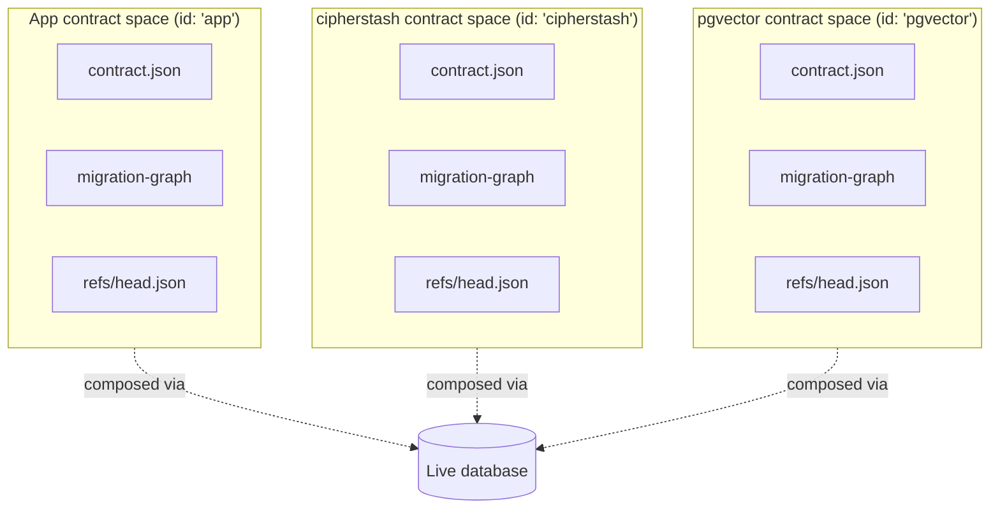

# ADR 211 — Contract spaces

## Status

Accepted (TML-2397). Supersedes the schema-contribution half of [ADR 154 — Component-owned database dependencies](./ADR%20154%20-%20Component-owned%20database%20dependencies.md). The `databaseDependencies` mechanism described there is removed from the framework as part of this work.

## At a glance

A Prisma Next application's database is the integration point for many parties: the application itself, plus every schema-contributing extension installed in `prisma-next.config.ts`. This ADR makes each of those parties a **contract space** — a disjoint `(contract.json, migration-graph, head-ref)` tuple — and runs the same per-space planner, runner, and verifier across all of them. The user's repo holds a pinned mirror of every space the database depends on, so apply-time and verify-time flows never need to read an extension package from `node_modules`.



## Context

Before this work, the framework had two parallel mental models for "schema":

- **Application schema** lived in the contract IR (`contract.json`), drove the planner / verifier / migration runner, and was version-controlled in the user's repo.
- **Extension schema** entered the database through `databaseDependencies.init` — an opaque list of SQL strings on the extension descriptor that ran during `db init`. The planner could not see it. The verifier could not describe it. The migration system could not advance it. Strict-mode `dbInit` rejected every object an extension installed as an "extra column / extra table / extra type."

Two band-aids accumulated. `strictVerification: false` globally relaxed the verifier so extension-installed objects no longer failed it — at the cost of also hiding hand-edited drift the user *did* want flagged. A per-extension allowlist on `ComponentDatabaseDependency.installs.{tables,schemas}` let extensions declare *what tables they install* but not *what shape those tables have*, so the verifier could only check existence, not structure. Both papered over the underlying gap: the contract layer had no seam through which a non-application party could say "I own these structures; manage them with the same machinery you manage the application's."

The cipherstash extension forced the conversation. It contributes ~5,750 lines of SQL: 1 schema, 1 table, several composite types and domains user `Encrypted<String>` columns reference via `nativeType`, plus 169 functions, 46 operators, 4 casts, and 9 operator classes. None of it was describable in any artifact the framework consumed; all of it was visible to the verifier. Monorepo aggregator packages (multiple internal contract owners composed by an aggregator) exhibit the same shape independently.

## Decision

Promote contract spaces to a first-class concept and treat them uniformly across the framework's planning / running / verifying machinery.

### What a contract space is

A **contract space** is a `(contractJson, migrations, headRef)` triple owned by exactly one contributor:

- The **application** owns one space, identified as `'app'`.
- Each loaded extension owns one space, identified by its declared `space-id` (e.g. `'cipherstash'`, `'pgvector'`).
- A monorepo aggregator package can compose multiple internal-package spaces with its own.

Spaces are **disjoint at the artefact level** (separate `contract.json`, separate migration graph) and integrate **only via the live database**. There is no merged contract on disk. The verifier aggregates spaces in memory at verify time, but never serializes the aggregate.

### Extension descriptor field: `contractSpace`

The SQL family's extension descriptor gains an optional `contractSpace` field. Schema-contributing extensions populate it; codec-only or query-op-only extensions leave it absent.

```ts
// packages/2-sql/9-family/src/core/migrations/types.ts
export interface ExtensionContractRef {
  readonly hash: string;
  readonly invariants: readonly string[];
}

export interface ExtensionMigrationPackage {
  readonly dirName: string;            // emit-time directory name; preserved verbatim
  readonly metadata: MigrationMetadata; // ADR 197 manifest with embedded contract snapshot
  readonly ops: MigrationOps;
}

export interface ExtensionContractSpace {
  readonly contractJson: Contract<SqlStorage>;            // typed in-memory contract
  readonly migrations: readonly ExtensionMigrationPackage[];
  readonly headRef: ExtensionContractRef;
}

export interface SqlControlExtensionDescriptor<TTargetId extends string>
  extends ControlExtensionDescriptor<'sql', TTargetId> {
  readonly contractSpace?: ExtensionContractSpace;
}
```

`ExtensionMigrationPackage` is the *in-memory* shape the descriptor publishes — distinct from the on-disk `MigrationPackage` (which carries `dirPath` because it is post-emission). At `migrate` time the framework materialises the in-memory packages into the user's repo, where they become indistinguishable from app-authored migrations.

### On-disk layout (the user's repo)

```
migrations/
├── 20260508T0942_user_init/         ← app-space migration (today's convention)
│   ├── manifest.json
│   ├── ops.json
│   └── contract.json
├── cipherstash/                     ← extension-space root
│   ├── contract.json                 ← pinned current contract
│   ├── contract.d.ts                 ← pinned current typings
│   ├── refs/head.json                ← pinned head ref (hash + invariants)
│   └── 20260601T0000_install_eql_bundle/
│       ├── manifest.json
│       ├── ops.json
│       └── contract.json
└── pgvector/
    ├── contract.json
    ├── contract.d.ts
    ├── refs/head.json
    └── 20240601T0000_install_vector/
        └── …
```

App-space's current `contract.json` continues to live at the project root (today's convention preserved). Extension-space contracts live as *pinned mirrors* under `migrations/<space-id>/`. The asymmetry is deliberate: app-space is the user's authoring surface; extension-space contracts are framework-owned mirrors of state authored elsewhere.

The framework owns the pinned files: every `migrate` invocation overwrites them from each loaded extension's descriptor `contractSpace` values, alongside materialising any new migration directories. The user reviews the resulting diff in their PR.

Space identifiers are constrained to `[a-z][a-z0-9_-]{0,63}` (filesystem-safe and round-trippable through path manipulation).

### Marker schema gains a `space` column

`prisma_contract.marker` was a single-row table keyed by `id`. It becomes one row per loaded contract space, primary-keyed by `space`. See [ADR 021 — Contract Marker Storage](./ADR%20021%20-%20Contract%20Marker%20Storage.md) for the migration path (idempotent across fresh / legacy single-row / already-migrated databases).

| `space`       | `applied_content_hash` | `applied_invariants`                          |
| ------------- | ---------------------- | --------------------------------------------- |
| `app`         | `0a82b3…`              | `["app:user-init-v1", …]`                     |
| `cipherstash` | `7f2c41…`              | `["cipherstash:install-eql-bundle-v1", …]`    |
| `pgvector`    | `9b7e88…`              | `["pgvector:install-vector-v1"]`              |

Three properties hold:

1. **The marker is the truth-of-record** for the live database's per-space applied state.
2. **The set of marker rows must equal the set of loaded spaces** (`'app'` plus every entry in `extensionPacks`). Mismatches surface as verifier errors with clear remediation.
3. **Marker writes are atomic with the migrations that produced them.** Multi-space `db apply` opens one outer transaction; either every marker advances or none does.

### Per-space planner, runner, verifier

The framework runs the same machinery once per space:

- **Planner.** Diffs the prior contract for that space against the new contract for that space; produces a migration JSON for that space.
- **Runner.** Applies each space's migrations against the live database, updating the corresponding marker row.
- **Verifier.** Aggregates all loaded spaces' contracts into an in-memory expected schema, then compares against the live database.

The producer-side helpers (`planAllSpaces`, `concatenateSpaceApplyInputs`, `verifyContractSpaces`, `emitPinnedSpaceArtefacts`, `gatherDiskContractSpaceState`, `detectSpaceContractDrift`) live in `@prisma-next/migration-tools/exports/spaces` — target-agnostic primitives. The SQL family wires them into `db init` / `db update` / `db verify` at consumption sites; a Mongo or other family would compose them the same way (the contract-space concept is not SQL-specific even though M1-M5 only ship the SQL wiring).

### Apply-time atomicity and ordering

Every multi-space apply runs inside a **single outer transaction**. The SQL family's `SqlMigrationRunner` was restructured to support this:

- `execute(options)` — single-space entry point. Opens its own transaction (today's behaviour preserved).
- `executeOnConnection(options)` — runner body without `BEGIN`/`COMMIT`. Caller owns the transaction lifecycle.
- `executeAcrossSpaces({ driver, perSpaceOptions })` — multi-space entry point. Opens **one** outer transaction and calls `executeOnConnection` per space inside it. Failure on any space rolls back every space's writes.

**Cross-space ordering**: extension spaces alphabetical-by-spaceId first, app-space last. The convention is sufficient for v1 (a formal cross-space dependency graph is deferred), and matches the implicit dependency direction — application schema may reference extension-provided types (`Encrypted<String>` → `eql_v2_encrypted`), so extension types must exist before the app's `CREATE TABLE` runs.

### Disjoint per-space ownership: schema-prune

Inside a multi-space apply, the app-space planner is invoked against the *full* introspected live schema. Without intervention it would see extension-owned tables (e.g. `eql_v2_configuration`, owned by cipherstash) as "extras" and emit `DROP TABLE` ops.

The fix is `pruneSchemaByOtherSpaceContracts`: before passing the introspected schema to the app-space planner, the runner reads the pinned `contract.json` of every *other* space and removes its tables from the introspection. The same property is enforced verifier-side by scoping `verifySqlSchema` to `space='app'` (per-space integrity is covered by `verifyContractSpaces` independently).

Both layers enforce the same invariant — disjoint per-space ownership — at different pipeline stages.

### `db init` and `db update`: per-space `findPathWithDecision`

Both flows reduce to the same per-space recipe (per [ADR 208 — Invariant-aware migration routing](./ADR%20208%20-%20Invariant-aware%20migration%20routing.md)):

1. For each loaded space, read the target ref:
   - app-space: read from the project root contract (or compute inline for greenfield).
   - extension-space: read the pinned `migrations/<space-id>/refs/head.json`.
2. Compute `effectiveRequired = ref.invariants − marker.invariants`.
3. Run `findPathWithDecision(currentMarker, ref.hash, effectiveRequired)`.
4. Concatenate all per-space results in the cross-space ordering convention; apply in a single transaction.

For app-space, the existing greenfield synthesis is preserved: when no app-space migrations are on disk, the framework synthesises a `∅ → head` edge from the contract IR. For extension-space, synthesis from the contract alone is impossible (the IR vocabulary doesn't admit functions / operators / etc., which are the body of opaque DDL ops), so the runner walks the explicit migration graph emitted under `migrations/<space-id>/`.

### Descriptor self-consistency

At family-create time the framework asserts `hash(canonicalize(descriptor.contractSpace.contractJson)) === descriptor.contractSpace.headRef.hash`. Mismatch surfaces as `MIGRATION.DESCRIPTOR_HEAD_HASH_MISMATCH` and identifies the offending extension. Catches the case where an extension author published an inconsistent descriptor (e.g. updated `contractJson` but forgot to regenerate `headRef.hash`).

### What apply-time does not need

Once `migrate` has run, the user's repo carries everything `db init` / `db apply` / `db verify` need: app-space `contract.json` at the project root, plus pinned per-space `contract.json` / `contract.d.ts` / `refs/head.json` and migration directories under `migrations/<space-id>/`. Apply-time and verify-time paths read **only** the user's repo — they never import an extension descriptor module. This is what makes the system work in CI / production environments where the extension package may not even be installed:

```bash
$ rm -rf node_modules/@prisma-next/extension-cipherstash
$ prisma-next db init     # ✓ reads only migrations/cipherstash/ on disk
$ prisma-next db apply    # ✓ no migrations to apply
$ prisma-next migrate     # ✗ MIGRATION.EXTENSION_DESCRIPTOR_NOT_FOUND
                          #   cipherstash is in extensionPacks but the package
                          #   isn't installed. Run: pnpm install
```

`migrate` (authoring-time) needs the descriptor to read the extension's *current* state for diffing. Apply-time (`db init` / `db update`) and verify-time (`db verify`) do not.

### Verifier integrity checks

`verifyContractSpaces` reports five structurally distinct violation kinds, each with an actionable remediation hint:

| Kind | Cause |
|---|---|
| `declaredButUnmigrated` | Extension declared in `extensionPacks` but no pinned `contract.json` on disk. |
| `orphanMarker` | Marker row for a space not in `extensionPacks`. |
| `orphanPinnedDir` | Pinned `migrations/<space-id>/` directory for a space not in `extensionPacks`. |
| `hashMismatch` | Marker row's hash differs from pinned contract's hash (or descriptor's hash, depending on which side is being checked). |
| `invariantsMismatch` | Pinned contract's required invariants are not all in the marker row's applied invariants set. |

(Replaces the legacy `dependency_missing` `SchemaIssue` kind — see "Reporting" below.)

## IR vocabulary boundary (preserved)

The contract IR continues to admit only what a column or field can name as `nativeType`:

- **In IR:** tables (with columns, primary keys, foreign keys, indexes, uniques), enums, composite types, domains.
- **Not in IR:** schemas, functions, operators, casts, operator classes/families.

The same boundary applies across all spaces. Cipherstash's space declares `eql_v2_configuration` (table), `eql_v2_configuration_state` (enum), `eql_v2_encrypted` (composite), and the `eql_v2.{bloom_filter,hmac_256,blake3}` domains in its `contract.json` (~3-5 KB). The remaining ~5,750 lines of bundle SQL — functions, operators, casts, op classes — live as the body of one migration op (`installEqlBundle`) inside cipherstash's migration graph, with its own `invariantId`. The verifier is symmetrically blind to those objects on both sides — `verifySqlSchema` doesn't enumerate them, and the IR doesn't declare them — so strict mode is preserved without rejecting them.

Pgvector's `vector` type is in its IR; `CREATE EXTENSION vector` is the body of one migration op. Same shape.

## Migration JSON shape

A single `migrate` invocation produces one migration directory per space whose contract changed in this emit, plus refreshed pinned per-space files for every loaded extension. Each migration's `ops.json` is space-scoped — it contains only ops belonging to that space.

**Codec-emitted ops belong to app-space** and are inlined into the relevant app-space migration's `ops.json` alongside the user's own structural ops. See [ADR 212 — Codec lifecycle hooks](./ADR%20212%20-%20Codec%20lifecycle%20hooks.md) for the hook contract and rationale.

```jsonc
// app-space migration: 20260508T0942_user_init/ops.json
{
  "from": null,
  "to": "<app new hash>",
  "operations": [
    { "invariantId": "app:create-table-User-v1",
      "execute": [{ "sql": "CREATE TABLE \"User\" (...)" }] },
    { "invariantId": "cipherstash-codec:User.email:add-search-config@v1",
      "execute": [{ "sql": "INSERT INTO eql_v2_configuration (...) VALUES (...)" }] }
  ]
}
```

```jsonc
// cipherstash-space migration: cipherstash/20260601T0000_install_eql_bundle/ops.json
{
  "from": null,
  "to": "<cipherstash hash>",
  "operations": [
    { "invariantId": "cipherstash:install-eql-bundle-v1",
      "execute": [{ "sql": "...EQL bundle SQL..." }] },
    { "invariantId": "cipherstash:create-eql_v2_configuration-v1",
      "execute": [{ "sql": "SELECT 1" }] }
  ]
}
```

## Reporting

The legacy `dependency_missing` `SchemaIssue` kind is removed. The same diagnostic is now reported through the per-space verifier as one of:

- `EXTENSION_HEAD_REF_DRIFT` — pinned head ref's hash differs from the marker (extension is "behind" or "ahead").
- `EXTENSION_HEAD_REF_MISSING` — marker row exists but the pinned head ref is absent (or vice versa) — typically `declaredButUnmigrated` or `orphanMarker`.

The reporting is structurally richer than `dependency_missing` because each kind is independently triggerable and carries a specific remediation hint.

## Lifecycle: who reads from where

| Operation               | Reads descriptor | Reads on-disk pinned state | Reads marker         |
| ----------------------- | ---------------- | -------------------------- | -------------------- |
| `prisma-next migrate`   | yes              | yes (compare)              | no                   |
| `prisma-next db init`   | no               | yes                        | yes (writes)         |
| `prisma-next db apply`  | no               | yes                        | yes (read + advance) |
| `prisma-next db verify` | no               | yes (compare)              | yes (compare)        |

The asymmetry between `migrate` (authoring) and the apply/verify path is what makes pinned per-space artefacts load-bearing.

## Consequences

### Positive

- **Extensions are uniformly observable and verifiable.** Strict-mode `dbInit` no longer rejects extension-installed schema objects — they are declared in the extension's contract and aggregated into the verifier's expected schema.
- **One mental model for schema ownership.** The planner, runner, and verifier no longer need a separate "extension" code path; the same primitives serve app-space, extension-space, and (in future) monorepo composition.
- **WYSIWYG-runnable repos.** Every artefact required to apply, hash, verify, or audit the database's expected schema is on disk in the user's repo. CI / production paths never load extension descriptors.
- **Multi-space transactional apply.** `executeAcrossSpaces` is reusable for any future "compose multiple migration sources into one apply" use case (not just extensions).
- **Richer drift detection.** Bumping an extension's package version produces a clear PR diff (updated pinned `contract.json` / `contract.d.ts` / `refs/head.json`, plus any new migration directories). The legacy `databaseDependencies.init` mechanism produced no diff at all.

### Trade-offs

- **Extension authors must ship a contract + migration graph**, not just an init-SQL string. The migration story is demonstrated end-to-end by cipherstash (M3 — greenfield authoring against the new mechanism) and pgvector (M4 — port from `databaseDependencies` to `contractSpace`); the framework helpers `emitPinnedSpaceArtefacts` / `materialiseExtensionMigrationPackageIfMissing` cover the on-disk emission half, but the contract + ops authoring is on the extension author.
- **`migrate` becomes the canonical way to materialise extension bumps.** Bumping an extension in `node_modules` without running `migrate` produces stale pinned artefacts; the drift-detection helper surfaces a non-fatal warning at the next `migrate` invocation.
- **One outer transaction across spaces** is a stronger correctness guarantee than the per-extension `databaseDependencies.init` path provided. The framework inherits the constraint that all SQL across all spaces in a single emit must be transactionally compatible (which is already true of the existing single-space path).

### Non-goals (deferred)

- **Extension removal semantics.** Removing an extension from `extensionPacks` while user schema still depends on extension-installed types (e.g. `Encrypted<String>` columns referencing `eql_v2_encrypted`). Until addressed, removal is unsupported and the verifier reports orphan marker rows as errors.
- **Codec-id-changed lifecycle event.** When a user upgrades an extension in a way that changes a codec ID (`cipherstash:string@1` → `@2`), the codec needs a way to emit a "rotate" migration op. Cleanly extends the existing event vocabulary; deferred until needed.
- **Cross-space dependencies as a first-class concept.** Convention-based ordering (extensions first, app-space second) is sufficient for v1 given the single-transaction property.
- **Cross-space codec hooks.** Codec-emitted ops are app-space-bound by API shape — the hook signature has no parameter for cross-space context. See [ADR 212](./ADR%20212%20-%20Codec%20lifecycle%20hooks.md).

## Related

- [ADR 021 — Contract Marker Storage](./ADR%20021%20-%20Contract%20Marker%20Storage.md) — marker schema gain of `space` column; PK change to `(space)`.
- [ADR 154 — Component-owned database dependencies](./ADR%20154%20-%20Component-owned%20database%20dependencies.md) — superseded by this ADR.
- [ADR 197 — Migration packages snapshot their own contract](./ADR%20197%20-%20Migration%20packages%20snapshot%20their%20own%20contract.md) — per-package metadata shape used by `ExtensionMigrationPackage`.
- [ADR 208 — Invariant-aware migration routing](./ADR%20208%20-%20Invariant-aware%20migration%20routing.md) — `findPathWithDecision` primitive that `db init` / `db update` use per space.
- [ADR 169 — On-disk migration persistence](./ADR%20169%20-%20On-disk%20migration%20persistence.md) — the migration directory shape extended per-space.
- [ADR 212 — Codec lifecycle hooks](./ADR%20212%20-%20Codec%20lifecycle%20hooks.md) — schema-driven companion mechanism that emits app-space ops in response to per-field events.
