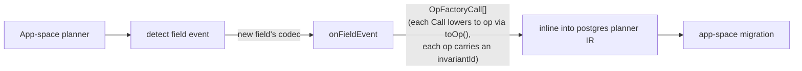

# ADR 212 — Codec lifecycle hooks

## Status

Accepted (TML-2397). Companion mechanism to [ADR 211 — Contract spaces](./ADR%20211%20-%20Contract%20spaces.md).

## At a glance

Some schema-driven extension behaviour is *not* a function of the extension version but of the consuming application's schema. Cipherstash is the canonical example: when a user adds an `Encrypted<String>` column with `searchable: true`, the database needs `INSERT INTO eql_v2_configuration (...) VALUES (...)` (registering the column for search). That work is per-`(table, column)`, not per-cipherstash-version, and ADR 211's contract-space mechanism on its own can't express it — cipherstash's contract space is a pure function of the cipherstash *package*, not of the consuming app's schema.

Codecs already exist as first-class objects: every column in the contract names its codec via `codecId`. This ADR promotes codecs to also carry a **plan-time lifecycle hook**, fired on field-added / field-dropped / field-altered events, that emits app-space migration ops scoped to the columns where the codec applies.



## Context

[ADR 211](./ADR%20211%20-%20Contract%20spaces.md) gives extensions a uniform planner / runner / verifier surface for schema they ship as a pure function of their package version. That covers most of cipherstash's footprint — the EQL bundle, the `eql_v2_configuration` table, the typed objects `Encrypted<String>` columns reference. But it doesn't cover the per-column work: registering each searchable column with EQL via `INSERT INTO eql_v2_configuration (...)` (or a similarly per-column DDL/DML for other future codecs).

Two failed approaches surfaced before settling on codec hooks:

1. **Encode per-column behaviour in the application's contract.** Would force the user to author cipherstash-specific structural ops in their own migrations; couples app authoring to extension internals.
2. **Have cipherstash watch the user's contract diff.** No clean seam — cipherstash has no privileged read on the user's emit pipeline, and a per-extension API for reading app diffs is exactly the surface this ADR avoids.

The right seam is the codec itself. Every column in the contract already names its codec; the planner already runs per-field diff during emit; codecs already export hooks for runtime behaviour (`expandNativeType`, `resolveIdentityValue`). Adding an `onFieldEvent` hook is structurally cheap and keeps "what to do when this column changes" co-located with "what this column means at runtime."

## Decision

Codecs may declare an optional **plan-time** `onFieldEvent` hook. The framework's app-space planner invokes the hook for every per-field event on a column whose `codecId` references that codec; returned ops are inlined into the resulting app-space migration's `ops.json`.

### Hook contract

```ts
// packages/2-sql/9-family/src/core/migrations/types.ts
export type FieldEvent = 'added' | 'dropped' | 'altered';

export interface FieldEventContext {
  readonly tableName: string;
  readonly fieldName: string;
  readonly priorTable?: StorageTable;     // present for 'dropped' and 'altered'
  readonly newTable?: StorageTable;       // present for 'added' and 'altered'
  readonly priorField?: StorageColumn;    // present for 'dropped' and 'altered'
  readonly newField?: StorageColumn;      // present for 'added' and 'altered'
}

export interface CodecControlHooks<TTargetDetails = unknown> {
  // … existing hooks (expandNativeType, resolveIdentityValue, etc.) …
  readonly onFieldEvent?: (
    event: FieldEvent,
    ctx: FieldEventContext,
  ) => readonly OpFactoryCall[];
}
```

The hook is **synchronous** (no I/O at plan time), receives concrete SQL family IR (`StorageTable` / `StorageColumn` from `@prisma-next/sql-contract/types`), and returns a list of `OpFactoryCall` instances ([ADR 195](./ADR%20195%20-%20Planner%20IR%20with%20two%20renderers.md)) — each Call carries its own `invariantId` (surfaced through `toOp()`), self-renders to TypeScript, and self-lowers to a runtime op.

Returning `OpFactoryCall[]` rather than raw `SqlMigrationPlanOperation[]` is what makes codec contributions render as factory calls in the user's `migration.ts` instead of verbose `rawSql({...})` blocks. The postgres planner inlines the Calls into its own call list with no wrapping; both the TypeScript renderer and the operation renderer dispatch through the framework `OpFactoryCall` interface polymorphically. Cipherstash's [`@prisma-next/extension-cipherstash/migration`](../../../packages/3-extensions/cipherstash/src/exports/migration.ts) subpath exposes the matching factory functions (`cipherstashAddSearchConfig` / `cipherstashRemoveSearchConfig`) so users authoring hand-written migrations call the same factories the codec hook uses.

### Triggered events and dispatch

The app-space emitter walks the per-field diff between the prior and new app contracts:

- **`'added'`** — field present in `newTable` but not `priorTable`. Hook is dispatched on the *new* field's codec.
- **`'dropped'`** — field present in `priorTable` but not `newTable`. Hook is dispatched on the *prior* field's codec.
- **`'altered'`** — field present in both, and any field property other than `codecId` differs. Hook is dispatched on the *new* field's codec.

When only `codecId` differs between the prior and new fields, no `'altered'` event fires. Codec-id changes are a v1 non-goal: cleanly extending the event vocabulary with a `'codec-changed'` event is straightforward when a real consumer needs it.

### Returned ops are app-space-bound

Codec-emitted ops are inlined into the **consuming application's** migration JSON (app space), alongside the user's own structural ops. The hook signature has no parameter for cross-space context — by API shape it cannot return ops targeting another space.

This is a deliberate scoping choice: opening cross-space hooks raises ordering questions (which extension-space does an app-side codec event author into? what if a hook depends on another extension's ops?), backward-compat questions (can a codec hook *change* an extension's pinned migration history?), and ownership questions (is a codec a member of one space?). None had concrete consumers when this ADR was written; the hook was kept narrow until they do.

The data invariant *"search-config registered for `User.email`"* is conceptually about application content. Cipherstash's contract space stays a pure function of the cipherstash package version; consuming-app activity never reaches into it.

Note: cross-space *SQL writes* are still possible inside an op's body (e.g. `INSERT INTO eql_v2_configuration ...` writes into a cipherstash-owned table — the database integrates regardless), but the migration *op record* is app-space.

### Each op carries an `invariantId`

Hook-returned values are `OpFactoryCall[]`; each Call's `toOp()` lowers to an `SqlMigrationPlanOperation<TTargetDetails>` carrying an `invariantId` of the codec's choice. The `invariantId` ends up in the marker's `applied_invariants` set after apply, which makes the hook participate in [ADR 208](./ADR%20208%20-%20Invariant-aware%20migration%20routing.md)'s ref-driven routing.

By convention, codec-emitted invariantIds carry a `<extension>-codec:` prefix and identify the column being acted on:

```
cipherstash-codec:User.email:add-search-config@v1
cipherstash-codec:User.email:remove-search-config@v1
```

The convention keeps codec-emitted invariantIds visually distinct from extension-space invariantIds (`cipherstash:install-eql-bundle-v1`).

### Wiring

Two pieces of plumbing connect the hook to the planner:

- **`extractCodecControlHooks(descriptors)`** (in `@prisma-next/family-sql/control`) — collects `onFieldEvent` hooks across all loaded extension descriptors into a `Map<codecId, CodecControlHooks>`. Erases target-details to `unknown` at the codec-extraction boundary (pre-existing convention shared with the rest of `extractCodecControlHooks`'s return type).
- **`planFieldEventOperations(options)`** (in `@prisma-next/family-sql/control`) — given the prior/new app contracts and the hook map, walks per-field diffs, dispatches hooks, and returns the concatenated `OpFactoryCall[]` ready to inline into the app-space migration's IR. Each target's planner concatenates these Calls onto its own call list with no wrapping (no `RawSqlCall`, no target-details cast at this seam — `toOp()` is what re-specializes back to the target's op shape, and that happens later in `renderOps`).

The "no cast at the inline seam" property follows from typing the hook's return as `OpFactoryCall[]` (framework-level): `OpFactoryCall` is target-agnostic by construction, so it concatenates onto a target's call list without a re-specialization step. The framework-level `MigrationPlanOperation` returned by `toOp()` is structurally a supertype of every target's op shape; targets cast back at the renderer-output boundary (`renderOps` returns the postgres-specialized `Op` via a documented per-line `as` cast) where the trust boundary is explicit — codec contributions targeted that lane by construction because the planner only inlines hooks for that adapter.

`extractCodecControlHooks` still erases target-details to `unknown` because codec hooks are inherently cross-target (one codec implementation works for any SQL adapter). That part of the surface is unchanged.

### Op order

Within a single migration, structural ops come first, then codec-emitted ops grouped by triggering event (added → dropped → altered). Within a group, ordering is deterministic by `(tableName, fieldName)` then by hook-returned op index. This ordering is contract — a codec author can rely on the structural `CREATE COLUMN` running before their hook-emitted `INSERT INTO eql_v2_configuration`.

### When the ops appear on disk

The hook fires inside the planner. The planner runs in two distinct flows, and the hook participates in both — but with very different observable behaviour:

| Flow                          | Hook fires? | What happens to the returned ops                                                                                       |
| ----------------------------- | ----------- | ---------------------------------------------------------------------------------------------------------------------- |
| `prisma-next migrate`         | yes         | Inlined into the app-space migration's `ops.json` and rendered into the user's `migrations/<timestamp>/migration.ts` alongside their `addColumn` / `dropColumn` calls. The user reviews them in the same PR. |
| `prisma-next db init`         | yes         | Applied immediately against the live database; never written to disk. (Greenfield synthesis: the planner runs from `∅` to the current contract every time.)                                  |
| `prisma-next db update`       | yes         | Applied immediately against the live database; never written to disk. (Reconciliation synthesis from the live schema.)                                                                       |
| `prisma-next db apply`        | no          | The ops in `migration.ts` are already pinned; apply replays them.                                                       |

This mirrors the broader `migrate` (persist) vs `db init`/`db update` (apply-and-forget) asymmetry that holds for *all* planner output, not just codec hooks. Codec-emitted ops are not special — they flow through the same `TypeScriptRenderablePostgresMigration` (and SQLite mirror) pipeline as structural ops, and are indistinguishable from user-authored ops in `migration.ts`. A reviewer reading a PR cannot tell from the file alone which calls came from a codec hook and which were emitted by a structural diff — by design.

### Worked example: cipherstash

```ts
import {
  cipherstashAddSearchConfig,
  cipherstashRemoveSearchConfig,
} from '@prisma-next/extension-cipherstash/migration';

const cipherstashStringCodecHooks: CodecControlHooks = {
  expandNativeType: ({ nativeType }) => nativeType,

  onFieldEvent: (event, { tableName, fieldName, newField, priorField }) => {
    // Maps `Encrypted<string>` typeParams flags to EQL search-config indices.
    const enabled = (field: StorageColumn | undefined): readonly CipherstashSearchIndex[] => [
      ...(field?.typeParams?.['equality'] === true ? ['unique'] as const : []),
      ...(field?.typeParams?.['freeTextSearch'] === true ? ['match'] as const : []),
    ];

    if (event === 'added') {
      return enabled(newField).map((index) =>
        cipherstashAddSearchConfig({ table: tableName, column: fieldName, index }),
      );
    }
    if (event === 'dropped') {
      return enabled(priorField).map((index) =>
        cipherstashRemoveSearchConfig({ table: tableName, column: fieldName, index }),
      );
    }
    if (event === 'altered') {
      const before = new Set(enabled(priorField));
      const after = new Set(enabled(newField));
      return [
        ...[...after].filter((i) => !before.has(i))
          .map((index) => cipherstashAddSearchConfig({ table: tableName, column: fieldName, index })),
        ...[...before].filter((i) => !after.has(i))
          .map((index) => cipherstashRemoveSearchConfig({ table: tableName, column: fieldName, index })),
      ];
    }
    return [];
  },
};
```

The hook reads the typeParams flags off the field, maps them to EQL search-config indices, and constructs `*Call` instances via the public factory functions. It never reads the live database, never reads cipherstash's contract-space contract or marker — those advance independently via ADR 211's per-space mechanism. It is a pure function over IR.

The same factory functions are re-exported from `@prisma-next/extension-cipherstash/migration` for users authoring hand-written migrations — the codec hook's emit path and the user's authoring path are the same surface.

## Consequences

### Positive

- **Schema-driven extension behaviour has a clean seam.** Cipherstash's `cipherstash:string@1` codec emits per-column work without coupling the application to cipherstash internals. Future schema-driven codecs (e.g. mask-on-read, audit columns, soft-delete tracking) follow the same pattern.
- **Codec-emitted ops are first-class.** Each op carries an `invariantId` that participates in `findPathWithDecision` routing (ADR 208), shows up in the marker's `applied_invariants` set, and is verifiable by the same machinery that verifies user-authored ops.
- **The pin captures the snapshot.** The codec implementation that runs is the one *active at plan time*; the resulting JSON pins that snapshot of the codec's behaviour. Apply-time replay just runs the captured ops — apply is decoupled from the codec module.

### Trade-offs

- **Hooks are synchronous-by-design.** They can't read DB state at plan time; if a codec needs DB-state-aware planning, it must take a different approach (probably an extension-owned migration of its own under ADR 211, or a deferred mechanism not yet designed).
- **App-space-bound by API shape.** Cross-space codec hooks are out of scope; if a real consumer surfaces the need, the API can grow a new context shape rather than retrofitting cross-space behaviour into `onFieldEvent`.
- **Codecs that emit ops also own a small IR.** Returning `OpFactoryCall[]` rather than raw ops means a codec contributing per-field work needs to define its own `*Call` classes (implementing the framework `OpFactoryCall` interface, [ADR 195](./ADR%20195%20-%20Planner%20IR%20with%20two%20renderers.md)) and a public factory subpath so its rendered `migration.ts` calls are user-authorable. The boilerplate is small (one class per factory; cipherstash has two) and the win is a `migration.ts` that reads as factory calls instead of `rawSql({...})` blocks.

## Related

- [ADR 211 — Contract spaces](./ADR%20211%20-%20Contract%20spaces.md) — the contract-space mechanism this hook complements; together they cover both static extension scaffolding and schema-driven per-column behaviour.
- [ADR 184 — Codec-owned value serialization](./ADR%20184%20-%20Codec-owned%20value%20serialization.md) — codecs as first-class objects in the contract.
- [ADR 207 — Codec call context per-query AbortSignal and column metadata](./ADR%20207%20-%20Codec%20call%20context%20per-query%20AbortSignal%20and%20column%20metadata.md) — runtime-side codec context (companion to this ADR's plan-time hook).
- [ADR 195 — Planner IR with two renderers](./ADR%20195%20-%20Planner%20IR%20with%20two%20renderers.md) — the planner pipeline `onFieldEvent` participates in.
- [ADR 208 — Invariant-aware migration routing](./ADR%20208%20-%20Invariant-aware%20migration%20routing.md) — `invariantId` semantics for codec-emitted ops.
