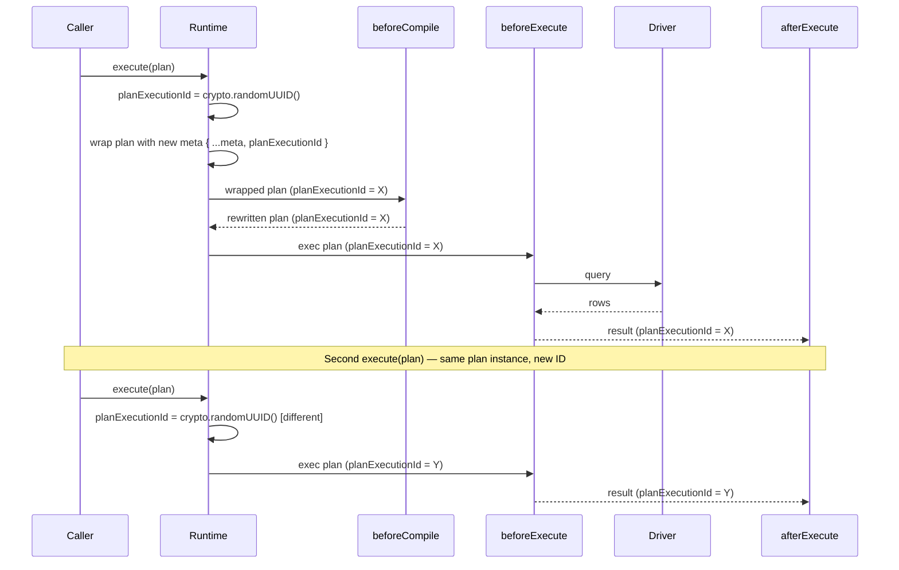

# ADR 220 — Plan execution identity for middleware correlation

## Context

Today's `PlanMeta` carries the contract binding (`storageHash`, `profileHash`), the lane label, and informational metadata like [`groupingKey`](ADR%20160%20-%20Plan%20grouping%20keys%20for%20multi-statement%20orchestration.md). What it does **not** carry is anything that identifies *this particular execution attempt* of a plan.

Middleware authors keep running into the same gap. A middleware that observes `beforeExecute` and wants to correlate the corresponding `afterExecute` callback — for tracing, timing, audit, or replay — has nothing stable to key on. The two hooks fire on the same plan reference, but there is no per-execute identity to thread through external systems (spans, log records, downstream collectors).

[ADR 013 — Lane-agnostic Plan identity and hashing](ADR%20013%20-%20Lane%20Agnostic%20Plan%20Identity.md) defines a content-based `planId` and `sqlFingerprint`. Those identify a *query shape* — two executions of the same plan share them by design. That is the right answer for telemetry de-duplication and cross-lane identity; it is the wrong answer for "which execute call am I in?".

[ADR 160 — Plan grouping keys for multi-statement orchestration](ADR%20160%20-%20Plan%20grouping%20keys%20for%20multi-statement%20orchestration.md) introduced `meta.groupingKey` for orchestrator-assigned multi-plan grouping. It is orthogonal: `groupingKey` answers "which higher-level operation does this statement belong to?", and is assigned by the orchestrator that owns the multi-plan flow. We need a sibling concept for the single-execute lifecycle, owned by the runtime.

## Decision

Add an optional `planExecutionId` field to `PlanMeta`. The **framework runtime** (`RuntimeCore` and every concrete runtime that overrides `execute()` without delegating to `super`) assigns a fresh value via `crypto.randomUUID()` at the entry of every `execute()` call, wraps the input plan with a new `meta` carrying the ID, and dispatches the wrapped plan through the middleware pipeline.

```ts
interface PlanMeta {
  // ... existing fields ...
  /** Runtime-assigned identity for one execute() invocation. */
  readonly planExecutionId?: string;
}
```



### Semantics

- **Per-execute, not per-plan.** A plan executed twice receives two distinct `planExecutionId`s — one per `execute()` call. Reuse is a first-class pattern (prepared queries, repeated requests); two executions of the same plan are two events.
- **All hooks for one execute see the same ID.** `beforeCompile`, `beforeExecute`, `intercept`, `onRow`, `afterExecute` — every hook fired during one `execute()` call observes the same `planExecutionId`. The plan flows through `runBeforeCompile` → `lower` → `runBeforeExecuteChain` → `runWithMiddleware` with `meta` preserved by the spread pattern (`{ ...d, ast, meta }`); the ID rides along automatically.
- **Runtime overrides any caller-supplied value.** If a caller hands the runtime a plan with `planExecutionId` already set, the runtime overrides it. Every execute is a fresh identity by contract.
- **Excluded from hashing.** `planExecutionId` does not participate in `computeSqlContentHash` (which picks `storageHash`, `sql`, `params`) or in `computeSqlFingerprint` (which operates on normalised SQL text). Same query shape, same hash — regardless of execute identity.

### Why runtime-assigned, not builder-assigned

The first design tied the ID to plan construction. Two consequences sank it:

1. **Reused plans would share an ID.** A plan built once and executed many times — the idiomatic shape for prepared queries and repeated requests — would emit the same `planExecutionId` for every execution. Middleware could not distinguish two distinct execute calls of the same plan, which is the entire point of the field.
2. **Construction-site coverage is a moving target.** Twelve plan-builder sites across SQL ORM, raw SQL, SQL DSL, and Mongo builders would all have to remember to generate the ID. A new builder added later would silently omit it. The runtime is one place; SQL and Mongo runtimes inherit (or duplicate, in the case of family runtimes that override `execute()`) one consistent rule.

The lifecycle the name describes — "the ID of an execution of a plan" — is a runtime lifecycle, not a builder lifecycle. The identity belongs at the boundary that owns the lifecycle.

### Why a new field, not `planId`

ADR 013's `planId` is a content hash. It is stable across executions of the same logical query — that is its job. Reusing the name for a per-execute random ID would conflate two distinct concepts. We keep ADR 013's content-based identity intact and add a sibling field for execution identity.

### Why a new field, not `groupingKey`

ADR 160's `groupingKey` is orchestrator-assigned and groups *multiple* plans that serve one higher-level operation. It is unrelated to "which execute call am I in?" — two plans inside one ORM operation share a `groupingKey` but receive distinct `planExecutionId`s when executed (one per `execute()` call). They answer different questions, both on `PlanMeta`.

### Why `crypto.randomUUID()`

- Standard Web Crypto global, available in every Node version we target — no import needed.
- Synchronous, ~48 ns per call — no measurable overhead in the execute path.
- Cryptographically random (v4 UUID) — no collisions to worry about in any practical workload.
- Opaque to middleware consumers — no schema commitments beyond "a string".

## Implementation

`RuntimeCore.execute()` in `@prisma-next/framework-components` generates the ID at the top of its generator and wraps the input plan:

```ts
const planExecutionId = crypto.randomUUID();
const wrapped = { ...plan, meta: { ...plan.meta, planExecutionId } };
// ...subsequent template-method steps see `wrapped` instead of `plan`.
```

`SqlRuntimeImpl` overrides `execute()` and runs its own pipeline through `executeAgainstQueryable` (it does not delegate to `super`). It applies the same wrap at the top of that generator. `executePrepared` follows the same pattern through `executePreparedAgainstQueryable`. The SQL runtime keeps the assignment inline (three lines per entry point) rather than extracting a helper — extracting saves no meaningful complexity and would obscure the per-entry-point grep target.

`MongoRuntimeImpl` likewise overrides `execute()` and runs its own pipeline. It applies the same wrap at the top of its generator.

Both family runtimes — SQL and Mongo — inherit the field on `PlanMeta` from `@prisma-next/contract/types` and therefore need no per-family type changes.

## Consequences

### Positive

- Middleware authors can correlate `beforeExecute` and `afterExecute` for the same execute call by reading `plan.meta.planExecutionId`.
- Two executions of the same plan are observably distinct events.
- Identity is generated where the lifecycle lives; plan builders stay focused on plan content.
- Excluded from content hashing, so cache keys and telemetry fingerprints are unaffected.

### Trade-offs

- The framework base assigns the ID, but family runtimes that override `execute()` (SQL and Mongo today) must remember to assign it too. The discipline is enforced by tests; if a future family runtime adds an `execute()` override, the implementer must add the wrap. This is the same trade-off as any template-method base whose family runtimes override the template.

## Alternatives considered

- **Assign at plan construction (the first design).** Rejected — reused plans share IDs, and the construction-site coverage problem keeps regenerating itself.
- **Reuse ADR 013's `planId`.** Rejected — different concept. Content-based identity is per-query-shape; execution identity is per-execute call.
- **`AsyncLocalStorage` for execution context.** Rejected — implicit propagation conflicts with the codebase's "explicit over implicit" stance (cf. ADR 160's reasoning for `groupingKey`).
- **Per-hook ID parameter.** Add `planExecutionId` to every middleware hook signature. Rejected — changes the hook API surface for a value that fits naturally on `PlanMeta`.
- **Store in `meta.annotations`.** Annotations are extension metadata; this is a cross-cutting runtime concern. First-class field on `PlanMeta` matches the precedent set by ADR 160's `groupingKey`.

## References

- [ADR 013 — Lane-agnostic Plan identity and hashing](ADR%20013%20-%20Lane%20Agnostic%20Plan%20Identity.md)
- [ADR 014 — Runtime Hook API](ADR%20014%20-%20Runtime%20Hook%20API.md)
- [ADR 160 — Plan grouping keys for multi-statement orchestration](ADR%20160%20-%20Plan%20grouping%20keys%20for%20multi-statement%20orchestration.md)
- [ADR 215 — Runtime middleware lifecycle: `beforeExecute` fires before `encodeParams`](ADR%20215%20-%20Runtime%20middleware%20lifecycle%20beforeExecute%20before%20encodeParams.md)
