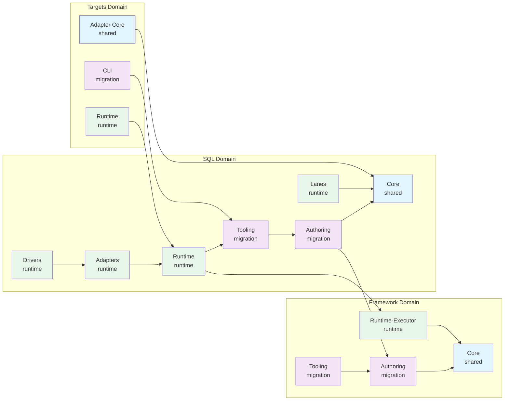
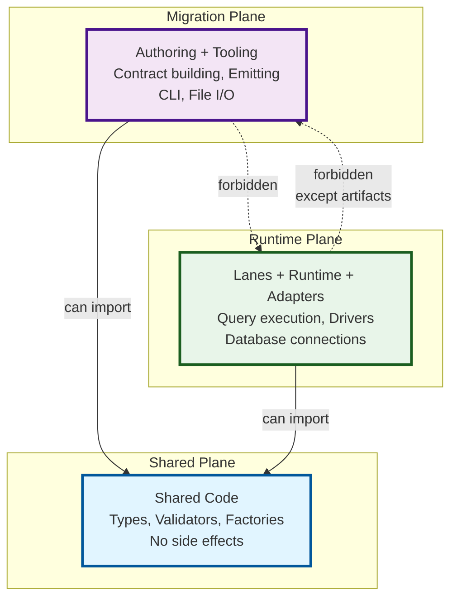

# Domains, Planes, and Layers Architecture Graph

This document provides a visual representation of all domains, planes, and layers in the Prisma Next architecture and their relationships.

## Complete Architecture Graph

```mermaid
graph TB
    subgraph "SHARED PLANE"
        subgraph "Framework Domain - Shared"
            FW_Core_Plan[1-framework/1-core/shared/plan<br/>Plan helpers, diagnostics]
            FW_Core_Ops[1-framework/1-core/shared/operations<br/>Operation registry]
            FW_Core_Contract[1-framework/1-core/shared/contract<br/>Contract types]
        end

        subgraph "SQL Domain - Shared"
            SQL_Contract[2-sql/1-core/contract<br/>SQL contract types]
            SQL_Ops[2-sql/1-core/operations<br/>SQL operations]
        end

        subgraph "Targets Domain - Shared"
            Tgt_Adapter_Core[3-targets/6-adapters/postgres/core<br/>Adapter core]
        end
    end

    subgraph "MIGRATION PLANE"
        subgraph "Framework Domain - Migration"
            FW_Authoring[1-framework/2-authoring/contract<br/>TS builders, canonicalization]
            FW_Authoring_TS[1-framework/2-authoring/contract-ts<br/>TS authoring]
            FW_Authoring_PSL[1-framework/2-authoring/psl-parser<br/>PSL parser]
            FW_Tooling_CLI[1-framework/3-tooling/cli<br/>Framework CLI]
            FW_Tooling_Emitter[1-framework/3-tooling/emitter<br/>Contract emitter]
        end

        subgraph "SQL Domain - Migration"
            SQL_Authoring[2-sql/2-authoring/contract-ts<br/>SQL contract authoring]
            SQL_Tooling[2-sql/3-tooling<br/>SQL emitter hooks, family helpers]
        end

        subgraph "Targets Domain - Migration"
            Tgt_Adapter_CLI[3-targets/6-adapters/postgres/control<br/>Control plane descriptors]
        end
    end

    subgraph "RUNTIME PLANE"
        subgraph "Framework Domain - Runtime"
            FW_Runtime_Exec[1-framework/4-runtime-executor<br/>Runtime kernel, plugins]
        end

        subgraph "SQL Domain - Runtime"
            SQL_Lanes[2-sql/4-lanes<br/>Query DSLs, ORM]
            SQL_Runtime[2-sql/5-runtime<br/>SQL runtime implementation]
            SQL_Adapters[3-targets/6-adapters<br/>Database adapters]
            SQL_Drivers[3-targets/7-drivers<br/>Database drivers]
        end

        subgraph "Targets Domain - Runtime"
            Tgt_Adapter_Runtime[3-targets/6-adapters/postgres/runtime<br/>Runtime factories]
        end

    end

    %% Layer dependencies (downward flow)
    FW_Authoring --> FW_Core_Plan
    FW_Authoring --> FW_Core_Ops
    FW_Authoring --> FW_Core_Contract
    FW_Authoring_TS --> FW_Core_Contract
    FW_Authoring_PSL --> FW_Core_Contract

    FW_Tooling_CLI --> FW_Authoring
    FW_Tooling_CLI --> FW_Tooling_Emitter
    FW_Tooling_Emitter --> FW_Authoring

    SQL_Authoring --> FW_Authoring
    SQL_Authoring --> SQL_Contract
    SQL_Tooling --> SQL_Authoring
    SQL_Tooling --> SQL_Ops

    SQL_Lanes --> SQL_Contract
    SQL_Lanes --> SQL_Ops
    SQL_Runtime --> FW_Runtime_Exec
    SQL_Runtime --> SQL_Tooling
    SQL_Adapters --> SQL_Runtime
    SQL_Drivers --> SQL_Adapters

    Tgt_Adapter_CLI --> SQL_Tooling
    Tgt_Adapter_Runtime --> SQL_Runtime
    Tgt_Adapter_Core --> SQL_Contract

    %% Plane boundaries (no cross-plane imports except shared)
    FW_Tooling_CLI -.->|can import| FW_Core_Plan
    FW_Tooling_CLI -.->|can import| FW_Core_Ops
    SQL_Lanes -.->|can import| SQL_Contract
    SQL_Lanes -.->|can import| SQL_Ops

    style FW_Core_Plan fill:#e1f5ff,stroke:#01579b,stroke-width:2px
    style FW_Core_Ops fill:#e1f5ff,stroke:#01579b,stroke-width:2px
    style FW_Core_Contract fill:#e1f5ff,stroke:#01579b,stroke-width:2px
    style SQL_Contract fill:#e1f5ff,stroke:#01579b,stroke-width:2px
    style SQL_Ops fill:#e1f5ff,stroke:#01579b,stroke-width:2px
    style Tgt_Adapter_Core fill:#e1f5ff,stroke:#01579b,stroke-width:2px

    style FW_Authoring fill:#f3e5f5,stroke:#4a148c,stroke-width:2px
    style FW_Authoring_TS fill:#f3e5f5,stroke:#4a148c,stroke-width:2px
    style FW_Authoring_PSL fill:#f3e5f5,stroke:#4a148c,stroke-width:2px
    style FW_Tooling_CLI fill:#f3e5f5,stroke:#4a148c,stroke-width:2px
    style FW_Tooling_Emitter fill:#f3e5f5,stroke:#4a148c,stroke-width:2px
    style SQL_Authoring fill:#f3e5f5,stroke:#4a148c,stroke-width:2px
    style SQL_Tooling fill:#f3e5f5,stroke:#4a148c,stroke-width:2px
    style Tgt_Adapter_CLI fill:#f3e5f5,stroke:#4a148c,stroke-width:2px

    style FW_Runtime_Exec fill:#e8f5e9,stroke:#1b5e20,stroke-width:2px
    style SQL_Lanes fill:#e8f5e9,stroke:#1b5e20,stroke-width:2px
    style SQL_Runtime fill:#e8f5e9,stroke:#1b5e20,stroke-width:2px
    style SQL_Adapters fill:#e8f5e9,stroke:#1b5e20,stroke-width:2px
    style SQL_Drivers fill:#e8f5e9,stroke:#1b5e20,stroke-width:2px
    style Tgt_Adapter_Runtime fill:#e8f5e9,stroke:#1b5e20,stroke-width:2px
```



## Simplified Layer Flow Diagram



## Plane Boundaries Diagram



## Key Relationships

### Domain Structure
- **Framework** (`packages/1-framework/`): Target-agnostic core (contracts, plans, runtime kernel, tooling)
- **SQL** (`packages/2-sql/`): SQL family-specific packages (contract types, operations, lanes, runtime)
- **Targets** (`packages/3-targets/`): Concrete target extension packs (Postgres adapter, driver)
- **Extensions** (`packages/3-extensions/`): Ecosystem extensions (compat layers, extension packs)

### Layer Order (Dependency Direction)
**Framework Domain:**
```
core → authoring → tooling → runtime-executor
```

**SQL Domain:**
```
core → authoring → tooling → lanes → runtime → adapters → drivers
```

### Plane Rules
1. **Shared Plane**: Can only import from shared plane (no migration/runtime imports)
2. **Migration Plane**: Can import from shared and migration planes (forbidden: runtime)
3. **Runtime Plane**: Can import from shared and runtime planes (forbidden: migration, except artifacts)

### Cross-Domain Rules
- SQL domain packages can import from framework domain
- SQL domain packages cannot import from other target families
- Framework domain is target-agnostic and can be imported by any target family

### Exceptions

None currently.

