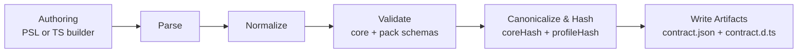

# Contract Emitter & Types

## Overview

The Contract Emitter turns PSL or a TypeScript builder into two canonical artifacts: a machine-readable `contract.json` and a minimal `contract.d.ts` type surface. It guarantees deterministic output across platforms, computes both the logical schema hash (`coreHash`) and the pinned capability profile hash (`profileHash`), and validates extension usage against pack-provided schemas. These artifacts are consumed by the query DSL, runtime, migrations, and tooling; the emitter itself does not plan migrations, lower queries, negotiate capabilities at runtime, or enforce policies.

Responsibilities include parsing source inputs, normalizing structure, validating core and extension data, canonicalizing JSON, hashing, and writing stable artifacts. Non-goals include migration planning, runtime verification, capability discovery/negotiation, query compilation, and policy enforcement.

See [ADR 006 — Dual Authoring Modes](../adrs/ADR%20006%20-%20Dual%20Authoring%20Modes.md), [ADR 007 — Types Only Emission](../adrs/ADR%20007%20-%20Types%20Only%20Emission.md), [ADR 004 — Core Hash vs Profile Hash](../adrs/ADR%20004%20-%20Core%20Hash%20vs%20Profile%20Hash.md), and [ADR 010 — Canonicalization Rules](../adrs/ADR%20010%20-%20Canonicalization%20Rules.md).



The sections below describe inputs and outputs, determinism and hashing guarantees, the emission pipeline, the generated type surface, and how extensions integrate.

## Inputs and Outputs

### Inputs

- `schema.prisma` (PSL authoring mode)
- `contract.ts` entry point exporting `defineContract(...)` (TS-first mode)

A repository declares a single source of truth (PSL or TS). Both authoring modes must produce byte-identical `contract.json` for the same intent (see [ADR 006](../adrs/ADR%20006%20-%20Dual%20Authoring%20Modes.md)).

### Outputs

- `contract.json`: canonical JSON data contract. It includes `schemaVersion`, `targetFamily`, `target`, `coreHash`, `profileHash`, `models`, `storage`, `capabilities`, and `meta`.
- `contract.d.ts`: TypeScript declarations that expose tables, models, relations, mappings, and optional read-only sources used by the DSL. No runtime code is generated; the `t` object is constructed at runtime via `makeT(contractJson)` (see [ADR 007](../adrs/ADR%20007%20-%20Types%20Only%20Emission.md)). Extension values are represented with branded types (see [ADR 114](../adrs/ADR%20114%20-%20Extension%20codecs%20&%20branded%20types.md)).

### Invariants

- PSL and TS builder produce the same `contract.json` for the same intent
- Emission is deterministic and produces identical hashes on all supported platforms

## Determinism and Hashing

Emission is deterministic. The emitter canonicalizes JSON with stable key ordering, normalized scalars and defaults, and well-defined array ordering rules. It then computes two hashes embedded in `contract.json` and used by downstream systems:

- `coreHash` captures the logical meaning of the contract (models, fields, relations, storage layout).
- `profileHash` is derived solely from capability declarations and optional adapter pins encoded in the contract; it does not change logical meaning but pins a capability profile.

See [ADR 010](../adrs/ADR%20010%20-%20Canonicalization%20Rules.md) for canonicalization rules and [ADR 004](../adrs/ADR%20004%20-%20Core%20Hash%20vs%20Profile%20Hash.md) for the two-hash model.

## Emission Pipeline

The pipeline converts authoring inputs into deterministic, verifiable artifacts:

1. Parse — PSL is parsed into an AST with extension attribute support; TS builders construct an in-memory AST via `defineContract(...)` with pack registration.
2. Normalize — resolve model↔storage mappings, expand defaults, infer deterministic names for constraints, and incorporate extension decorations and constructs.
3. Validate — apply structural validation, semantic checks (e.g., FK target existence, uniqueness soundness), and extension schema/capability validation from packs. Note that these checks are offline, not conducted against a running database.
4. Canonicalize and hash — produce canonical JSON and compute `coreHash` and contract-derived `profileHash`. Extension data follows deterministic rules (see [ADR 106](../adrs/ADR%20106%20-%20Canonicalization%20for%20extensions.md)).
5. Write artifacts — emit `contract.json` and `contract.d.ts` to the configured artifact directory, including branded types for extension values (see [ADR 114](../adrs/ADR%20114%20-%20Extension%20codecs%20&%20branded%20types.md)).

## Extending PSL

Extensions allow packs to add capabilities through namespaced attributes and top-level blocks without changing the PSL grammar. The grammar remains fixed (top-level blocks, properties, and attributes). Packs register new blocks and attributes with validation and canonicalization semantics; they do not supply lexing or parsing logic. The parser recognizes the fixed syntax and delegates validated payloads to packs based on namespace and kind. See [ADR 104 — PSL extension namespacing & syntax](../adrs/ADR%20104%20-%20PSL%20extension%20namespacing%20&%20syntax.md) and [ADR 105 — Contract extension encoding](../adrs/ADR%20105%20-%20Contract%20extension%20encoding.md).

### Authoring surfaces

- Attributes (decorators): Namespaced metadata on core entities.

  Example:

  ```prisma
  extensions {
    pgvector = "1.2.0"
  }

  model Document {
    id        Int    @id @default(autoincrement())
    embedding Bytes  @pgvector.column(dim: 1536, distance: cosine)
  }
  ```

  The emitter validates attribute payloads against pack-provided schemas and encodes them deterministically as decorations under `extensions.<namespace>.decorations` (see [ADR 105](../adrs/ADR%20105%20-%20Contract%20extension%20encoding.md)).

- Top-level blocks: Namespaced, standalone constructs with identity (e.g., views, enums).

  Example:

  ```prisma
  extensions {
    postgres = "15.0"
  }

  pg.view active_users {
    schema: "public"
    sql: """
      select id, email from "user" where active = true
    """
    shape: { id: Int, email: String }
  }
  ```

  The parser recognizes namespaced block headers and property maps. Packs register block kinds, schemas, and validators; the emitter validates and emits normalized JSON under `extensions.<namespace>.<kind>[]`. See [ADR 126 — PSL top-level block SPI](../adrs/ADR%20126%20-%20PSL%20top-level%20block%20SPI.md).

- Tagged literals: Structured payloads embedded in attributes or blocks.

  Packs receive a canonicalized literal body plus a `bodyHash` and return deterministic JSON that becomes part of the extension payload. See [ADR 129 — Template-Tagged Literals for Extensions](../adrs/ADR%20129%20-%20Template-Tagged%20Literals%20for%20Extensions.md).

### Registration model (grammar-fixed)

Packs declare what they support; they do not extend the lexer or parser.

- Attributes: Register attribute identifiers, JSON Schemas for their payloads, and canonicalization rules.
- Top-level blocks: Register block kinds (e.g., `view`, `enumType`), JSON Schemas for block bodies, canonicalization, and optional projection hints to expose read-only sources.
- Tagged literals: Register literal tags and schemas; the emitter passes canonicalized bodies with `bodyHash`.

The emitter:
- Parses fixed PSL syntax into a generic AST (block header, properties, attributes)
- Resolves namespace/kind to a pack
- Validates payloads against pack schemas and capabilities
- Canonicalizes extension data per [ADR 106](../adrs/ADR%20106%20-%20Canonicalization%20for%20extensions.md)
- Emits normalized JSON under `contract.extensions.<namespace>`

### Canonical emission and sources

- Decorations (attributes) encode as:

  ```json
  {
    "extensions": {
      "pgvector": {
        "decorations": {
          "columns": [
            {
              "ref": { "kind": "column", "table": "document", "column": "embedding" },
              "payload": { "dim": 1536, "distance": "cosine" }
            }
          ]
        }
      }
    }
  }
  ```

- Top-level blocks encode as objects with stable `id`s, computed from fully-qualified name and content hash:

  ```json
  {
    "extensions": {
      "postgres": {
        "views": [
          {
            "id": "pg.view:public.active_users@sha256:abc123",
            "name": "active_users",
            "schema": "public",
            "sql": "select id, email from \"user\" where active = true",
            "shape": { "id": "int4", "email": "text" },
            "materialized": false
          }
        ]
      }
    }
  }
  ```

- Read-only sources: Packs may project read-only sources from blocks into `contract.sources` for type-safe querying while prohibiting mutations. See [ADR 127 — Views as extension-owned read-only sources](../adrs/ADR%20127%20-%20Views%20as%20extension-owned%20read-only%20sources.md).

### Type generation

The emitter augments `contract.d.ts` with:

- Branded types for extension values (see [ADR 114](../adrs/ADR%20114%20-%20Extension%20codecs%20&%20branded%20types.md)).
- Optional `Sources` alongside `Tables` when read-only sources are projected, enabling `t['schema.view']` access with full typing.

No runtime `t` object is generated; the DSL constructs `t` from `contract.json` at runtime using the emitted types. Extension codecs are registered at runtime to encode/decode branded values; they are not baked into the contract JSON.

### Capability profile impact

Declared extension capabilities contribute to the capability profile and thus to `profileHash`. The profile is derived solely from contract declarations and optional adapter pins; it does not change the logical meaning of the contract. See [ADR 004](../adrs/ADR%20004%20-%20Core%20Hash%20vs%20Profile%20Hash.md) and [ADR 117 — Extension capability keys](../adrs/ADR%20117%20-%20Extension%20capability%20keys.md).

### Error taxonomy

Extension-related errors are deterministic and actionable:

- Unknown namespace or kind
- Unknown attribute
- Schema violation for attribute or block payloads
- Unsupported capability for current target/profile
- Canonicalization failure
- Duplicate block identity within a module
- Invalid references in decorations (e.g., missing table/column)

See [ADR 126](../adrs/ADR%20126%20-%20PSL%20top-level%20block%20SPI.md) for SPI details.

### TS builder parity

The TS builder exposes the same extension semantics via typed helpers and pack registration. Emission must be byte-identical with PSL authoring for the same intent (see [ADR 006](../adrs/ADR%20006%20-%20Dual%20Authoring%20Modes.md)).

## Types That Are Generated

The declarations are pure types to avoid runtime coupling and to keep bundles lean (see [ADR 121](../adrs/ADR%20121%20-%20Contract.d.ts%20structure%20and%20relation%20typing.md) and [ADR 007](../adrs/ADR%20007%20-%20Types%20Only%20Emission.md)):

- **Contract.Tables**
  - map of table names to `{ columnName: Type }` suitable for inferring result shapes
- **Contract.Models**
  - map of model names to model field types, aligned with models → storage mapping
- **Contract.Relations**
  - relation handles `{ to, cardinality, on }` used by higher layers
- **Tables helper and T type**
  - structural types that the DSL uses to type `t.user.id` style access
- **Narrow utility types** for projections, joins, and nullability propagation

**No runtime t object is emitted** — the runtime `t` is constructed by `makeT(contractJson)` in the DSL package, and the generated `.d.ts` supplies types so that `t` is fully typed without shipping code.

## Tooling & Usage

This section explains how emission integrates into local development and CI, how projects configure the emitter, and how to invoke the CLI when needed. The goal is to keep day-to-day workflows automatic while ensuring CI uses explicit steps for determinism.

### Development workflow

- Dev watch: Vite/Next/esbuild plugins auto-emit on import and on file change, surfacing errors inline in the terminal and IDE.
- Editor responsiveness: the `.d.ts` surface is small and incremental, keeping the TypeScript language server snappy.

### CI workflow

- CI runs an explicit emit step to verify determinism and compute hashes.
- Emitted artifacts are passed to downstream steps such as migration planning and preflight.

### Configuration

Projects configure authoring mode and emitter output in `prisma-next.config.ts`. This file selects PSL or TS authoring, sets artifact output paths, and pins naming and target settings to keep emission stable across environments.

```typescript
import { defineConfig } from '@prisma/config'

export default defineConfig({
  authoring: 'psl',               // 'psl' | 'ts'
  schema: './prisma/schema.prisma',
  builder: './contract/contract.ts',
  outDir: './.prisma-next',
  naming: {
    pk: '{table}_pkey',
    uk: '{table}_{cols}_key',
    fk: '{table}_{cols}_fkey',
    idx: '{table}_{cols}_idx',
  },
  target: { family: 'sql', dialect: 'postgres' },
  emit: { dts: true, json: true },
})
```

Notes:
- If `authoring: 'psl'`, `schema` is required and `builder` is ignored
- If `authoring: 'ts'`, `builder` is required and `schema` is optional for back-generation
- `outDir` is the canonical location for `contract.json` and `contract.d.ts`

### CLI

The CLI provides a small surface for explicit emission and validation. Commands are deterministic and operate on canonical JSON.

- `prisma-next emit` — parse → validate → canonicalize → hash → write artifacts
- `prisma-next verify` — validate an existing `contract.json`, recompute hashes, check invariants
- `prisma-next diff <from.json> <to.json>` — produce a human/JSON diff suitable for planner input

## Diagnostics & Quality

The emitter provides clear diagnostics during authoring and CI, adheres to performance targets so it fits save-time workflows, and maintains determinism through a focused test strategy.

### Error handling and diagnostics

Errors include source spans for PSL and callsite hints for TS builders. Diagnostics are categorized with suggested fixes where possible.

- Structural validation failures
- Semantic validation failures (e.g., FK targets, uniqueness sets)
- Extension schema violations and capability gating errors
- Naming conflicts and canonicalization errors

### Performance targets

The emitter is designed to run quickly enough to trigger on file save while remaining stable in CI.

- Small schema: emit < 100 ms on a modern laptop
- Medium schema (~100 tables): emit < 700 ms
- Large schema: emit < 2 s with parser/builder caching

### Test strategy

Determinism and safety are enforced with golden tests and property checks.

- Golden tests for PSL/TS → `contract.json` and hash stability
- Round-trip tests where applicable
- Negative tests for validation and capability errors
- Performance regression tests to keep emission within budget

## Consumption by Other Subsystems

This section summarizes how downstream subsystems consume emitter artifacts. Each consumer relies on the same canonical `contract.json` and `.d.ts` surfaces to ensure consistent behavior across development, CI, and production.

- **Runtime**
  - reads `contract.json`, verifies `plan.coreHash` on execute, exposes capability flags to plugins
- **Query DSL**
  - uses `contract.d.ts` for types and `makeT(contractJson)` for runtime column objects
- **TypedSQL**
  - emits plans that carry `coreHash`, validated against `contract.json`
- **Migrations**
  - planner consumes two contracts to compute an edge, runner writes the DB marker to `toHash`
- **Preflight and PPg**
  - read capabilities and storage to run EXPLAIN checks and advisors


## Open Questions

- Boundary between core and profile for collations and encodings
- Minimal surface for model-level computed fields in `.d.ts` without implying runtime codegen
- Optional back-generation of PSL from the TS builder for teams migrating away from PSL authoring

## Minimal Example

This example shows a small PSL contract and the corresponding emitted artifacts. It illustrates how models map to storage in `contract.json` and how the types-only `contract.d.ts` shapes the query DSL.

**schema.prisma:**

```prisma
model User {
  id        Int      @id @default(autoincrement())
  email     String   @unique
  active    Boolean  @default(true)
  createdAt DateTime @default(now())
}

model Post {
  id        Int      @id @default(autoincrement())
  title     String
  user      User     @relation(fields: [userId], references: [id])
  userId    Int
  @@index([userId])
}
```

**Emitted contract.json (excerpt):**

```json
{
  "schemaVersion": "1",
  "targetFamily": "sql",
  "target": "postgres",
  "coreHash": "sha256:…",
  "profileHash": "sha256:…",
  "models": {
    "User": { "storage": { "table": "user" }, "fields": { "id": { "column": "id" }, "email": { "column": "email" }, "active": { "column": "active" }, "createdAt": { "column": "createdAt" } } },
    "Post": { "storage": { "table": "post" }, "fields": { "id": { "column": "id" }, "title": { "column": "title" }, "userId": { "column": "user_id" } }, "relations": { "user": { "to": "User", "cardinality": "N:1", "on": { "parentCols": ["id"], "childCols": ["user_id"] } } } }
  },
  "storage": {
    "tables": {
      "user": {
        "columns": {
          "id": { "type": "int4", "nullable": false },
          "email": { "type": "text", "nullable": false },
          "active": { "type": "bool", "nullable": false },
          "createdAt": { "type": "timestamp", "nullable": false }
        },
        "primaryKey": { "columns": ["id"], "name": "user_pkey" },
        "uniques": [ { "columns": ["email"], "name": "user_email_key" } ],
        "indexes": []
      }
    }
  },
  "capabilities": { "postgres": { "lateral": true, "jsonAgg": true } }
}
```

**Generated contract.d.ts (complete example):**

```typescript
export declare namespace Contract {
  // Symbol for metadata property to avoid collisions
  const META = Symbol('metadata');

  type Meta<T extends { [META]: unknown }> = T[typeof META];

  interface TableMetadata<Name extends string> {
    name: Name;
  }

  interface ModelMetadata<Name extends string> {
    name: Name;
  }

  // Base interfaces with metadata
  interface TableDef<Name extends string> {
    readonly [META]: TableMetadata<Name>;
  }
  interface ModelDef<Name extends string> {
    readonly [META]: ModelMetadata<Name>;
  }

  // Storage-level types (raw database structure)
  export namespace Tables {
    export interface user extends TableDef<'user'> {
      id: number
      email: string
      active: boolean
      createdAt: Date
    }
    export interface post extends TableDef<'post'> {
      id: number
      title: string
      user_id: number
      createdAt: Date
    }
  }

  // Application-level types (with relations)
  export namespace Models {
    export interface User extends ModelDef<'User'> {
      id: number
      email: string
      active: boolean
      createdAt: Date
      posts: Post[]  // 1:N relation
    }
    export interface Post extends ModelDef<'Post'> {
      id: number
      title: string
      userId: number
      createdAt: Date
      user: User      // N:1 relation
    }
  }

  // Relation metadata for DSL and runtime
  export namespace Relations {
    export interface post {
      user: {
        to: 'User'
        cardinality: 'N:1'
        fields: ['userId']
        references: ['id']
        required: true
      }
    }
    export interface user {
      posts: {
        to: 'Post'
        cardinality: '1:N'
        fields: ['id']
        references: ['userId']
        required: false
      }
    }
  }

  // Model-table-field-column mappings
  export namespace Mappings {
    export interface ModelToTable {
      User: 'user'
      Post: 'post'
    }
    export interface TableToModel {
      user: 'User'
      post: 'Post'
    }
    export interface FieldToColumn {
      'User': {
        id: 'id'
        email: 'email'
        active: 'active'
        createdAt: 'createdAt'
      }
      'Post': {
        id: 'id'
        title: 'title'
        userId: 'user_id'
        createdAt: 'createdAt'
      }
    }
    export interface ColumnToField {
      'user': {
        id: 'id'
        email: 'email'
        active: 'active'
        createdAt: 'createdAt'
      }
      'post': {
        id: 'id'
        title: 'title'
        user_id: 'userId'
        createdAt: 'createdAt'
      }
    }
  }
}

export type Tables = Contract.Tables
export type Models = Contract.Models
export type Relations = Contract.Relations
export type Mappings = Contract.Mappings
```

This structure provides complete type safety for relation navigation, with proper cardinality typing, clear separation between storage-level and application-level types, essential mappings between models and tables, and extensible metadata dictionary for runtime access. See [ADR 121](../adrs/ADR%20121%20-%20Contract.d.ts%20structure%20and%20relation%20typing.md) for the complete specification.

This keeps the runtime code minimal, the types precise, and the artifacts stable for CI, agents, and PPg integrations.
