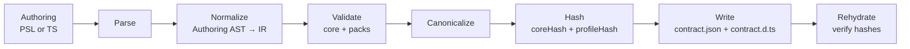

# Contract Emission — Parser, IR, Canonicalization, Types

## Overview

Contract emission turns an authored data model (e.g. in PSL) into two deterministic artifacts: a canonical JSON contract (`contract.json`) and a minimal set of TypeScript type definitions (`contract.d.ts`). While exposed as a single CLI command, emission is purposefully composed from separable primitives: parsing (PSL or TS), normalization into a contract IR, validation (core + extensions), canonicalization with hashing, serialization/deserialization, and rehydration verification.

This modular design reflects our guiding principles: thin core, explicit boundaries, and tight feedback loops that surface issues before execution.

**Purpose:** Provide a deterministic, verifiable representation of the application's data contract and lightweight types that downstream subsystems consume for planning, verification, and execution.

**Responsibilities:**
- Parse authoring inputs (PSL or TypeScript builder) into an authoring AST
- Normalize into a stable, target‑agnostic IR
- Validate core structure and extension payloads
- Canonicalize and compute `coreHash` and `profileHash`
- Emit `contract.json` and `contract.d.ts`; support lossless load/rehydration
- Verify that rehydrated contracts reproduce embedded hashes

**Non‑goals.** Migration planning, query compilation/lowering, runtime capability discovery, and policy enforcement. Emission prepares artifacts; other subsystems act on them.

### Example

```prisma
// PSL authoring (excerpt)
model User {
  id        Int      @id @default(autoincrement())
  email     String   @unique
  active    Boolean  @default(true)
  createdAt DateTime @default(now())
}

model Post {
  id     Int   @id @default(autoincrement())
  title  String
  user   User  @relation(fields: [userId], references: [id])
  userId Int
  @@index([userId])
}
```

Emitting produces:
- `contract.json` — canonical JSON with models, storage, capabilities, and embedded `coreHash`/`profileHash`
- `contract.d.ts` — a types‑only surface used by the query builder DSLs without shipping runtime code

Emitted contract.json (excerpt):

```json
{
  "schemaVersion": "1",
  "targetFamily": "sql",
  "target": "postgres",
  "coreHash": "sha256:…",
  "profileHash": "sha256:…",
  "models": {
    "User": {
      "storage": { "table": "user" },
      "fields": {
        "id": { "column": "id" },
        "email": { "column": "email" },
        "active": { "column": "active" },
        "createdAt": { "column": "createdAt" }
      },
      "relations": {
        "posts": { "to": "Post", "cardinality": "1:N", "on": { "parentCols": ["id"], "childCols": ["user_id"] } }
      }
    },
    "Post": {
      "storage": { "table": "post" },
      "fields": {
        "id": { "column": "id" },
        "title": { "column": "title" },
        "userId": { "column": "user_id" }
      },
      "relations": {
        "user": { "to": "User", "cardinality": "N:1", "on": { "parentCols": ["id"], "childCols": ["user_id"] } }
      }
    }
  },
  "storage": {
    "tables": {
      "user": {
        "columns": {
          "id": { "type": "int4", "nullable": false },
          "email": { "type": "text", "nullable": false },
          "active": { "type": "bool", "nullable": false },
          "createdAt": { "type": "timestamp", "nullable": false }
        },
        "primaryKey": { "columns": ["id"], "name": "user_pkey" },
        "uniques": [ { "columns": ["email"], "name": "user_email_key" } ],
        "indexes": []
      },
      "post": {
        "columns": {
          "id": { "type": "int4", "nullable": false },
          "title": { "type": "text", "nullable": false },
          "user_id": { "type": "int4", "nullable": false }
        },
        "primaryKey": { "columns": ["id"], "name": "post_pkey" },
        "foreignKeys": [ { "columns": ["user_id"], "references": { "table": "user", "columns": ["id"] }, "name": "post_user_id_fkey" } ],
        "indexes": [ { "columns": ["user_id"], "name": "post_user_id_idx" } ]
      }
    }
  },
  "capabilities": { "postgres": { "jsonAgg": true, "lateral": true } }
}
```

### Diagram — Emission pipeline



This pipeline is orchestrated by the CLI for developer ergonomics, but each stage is a single‑responsibility primitive that can be executed independently in tooling and tests or utilized by ecosystem authors.

## Authoring and Parsing

Authoring begins in PSL or through a TypeScript builder. Both paths target the same semantic shape and must produce byte‑identical `contract.json` for equivalent intent (see [ADR 006 — Dual Authoring Modes](../adrs/ADR%20006%20-%20Dual%20Authoring%20Modes.md)).

### PSL parser

The PSL parser recognizes a fixed grammar: top‑level blocks, properties, and attributes. It parses namespaced attributes and namespaced top‑level blocks without allowing packs to extend the lexer or parser. The output is an authoring AST that preserves source spans for diagnostics and defers interpretation of extension payloads until validation.

### TypeScript authoring (optional)

Teams may use a typed builder (e.g., `defineContract(...)`) to construct the same authoring AST/IR in code. This is a secondary surface; its primary requirement is parity and determinism with PSL authoring, not feature differentiation.

## Contract IR — From Authoring AST to Normalized Shape

Normalization converts authoring constructs into a stable, target‑agnostic IR consumed by validation, canonicalization, and generators. The IR resolves model↔storage mappings, expands defaults, materializes relations and constraint identities deterministically, and folds extension decorations and top‑level constructs into namespaced areas of the IR. The design follows the thin‑core, fat‑targets principle from the Architecture Overview: core captures portable relational structure while extensions contribute target‑specific semantics.

## Validation — Core Semantics and Extension Packs

Validation enforces correctness without touching a database. Core checks ensure structural soundness (e.g., FK target existence, uniqueness soundness, nullability propagation). Extension packs register schemas and canonicalization rules for their namespaced attributes, top‑level blocks, and tagged literals. During validation, the emitter resolves namespaces to packs, validates payloads, and performs reference checks. Capability gating is enforced using pack‑declared capability keys; failures are deterministic and actionable. See [ADR 104 — PSL extension namespacing & syntax](../adrs/ADR%20104%20-%20PSL%20extension%20namespacing%20&%20syntax.md) and [ADR 105 — Contract extension encoding](../adrs/ADR%20105%20-%20Contract%20extension%20encoding.md).

Common error classes include unknown namespace/kind, unknown attribute, schema violation, unsupported capability, canonicalization failure, duplicate identities within a module, and invalid references in decorations. These diagnostics are tied back to PSL source spans or TS call sites to reinforce the feedback loop.

## Canonicalization and Hashing

Deterministic emission requires canonical JSON and stable hashing. Canonicalization applies stable key ordering, normalized scalars and defaults, and well‑defined array ordering rules for both core and extension payloads (see [ADR 010 — Canonicalization Rules](../adrs/ADR%20010%20-%20Canonicalization%20Rules.md) and [ADR 106 — Canonicalization for extensions](../adrs/ADR%20106%20-%20Canonicalization%20for%20extensions.md)).

Two hashes are computed and embedded in `contract.json`:
- `coreHash` — captures the logical meaning of the schema (models, fields, relations, storage layout)
- `profileHash` — derived from declared capability keys and optional adapter pins; it pins the capability profile without changing meaning (see [ADR 004 — Core Hash vs Profile Hash](../adrs/ADR%20004%20-%20Core%20Hash%20vs%20Profile%20Hash.md))

Any changes to the structure of the database which would require a migration are reflected in the `coreHash`. Changes to the application's capability requirements are reflected in the `profileHash`. This enables non-structural modifications to the contract without a migration.

Both hashes are used by the runtime to verify that the connected database was verified against the running contract, and by the migration system to locate a connected database in the migration graph.

## Serialization, Types Generation, and Rehydration

### Writing and reading

Serialization writes canonical `contract.json` and emits `contract.d.ts`. Deserialization loads `contract.json` back into an in‑memory representation suitable for re‑canonicalization and verification. The process is lossless relative to the canonical IR; rehydrated contracts must recompute the same hashes.

### Types surface (`contract.d.ts`)

The types are pure declarations to keep bundles lean and editor feedback fast. No runtime objects are generated; the query DSL constructs its query interface  at runtime from `contract.json`. The declarations expose storage‑level tables, application models, relations, and mappings, optionally augmented with pack‑projected read‑only sources. Extension values appear as branded types with codecs supplied by packs at runtime (see [ADR 114 — Extension codecs & branded types](../adrs/ADR%20114%20-%20Extension%20codecs%20&%20branded%20types.md)).

Minimal excerpt:

```typescript
export declare namespace Contract {
  const META = Symbol('metadata')
  interface TableDef<Name extends string> { readonly [META]: { name: Name } }

  export namespace Tables {
    export interface user extends TableDef<'user'> {
      id: number
      email: string
      active: boolean
      createdAt: Date
    }
  }

  export namespace Models {
    export interface User {
      id: number
      email: string
      active: boolean
      createdAt: Date
    }
  }
}

export type Tables = Contract.Tables
export type Models = Contract.Models
export type Relations = Contract.Relations
export type Mappings = Contract.Mappings
```

### Codec type map emission (types‑only)

At emit time, the emitter generates a minimal codec type map in `contract.d.ts` for the codec IDs actually referenced by the contract (via extension decorations on columns):

1. Walk validated extension decorations to collect literal `typeId` strings (`namespace/name@version`).
2. De‑duplicate and sort deterministically.
3. Generate a types‑only mapping that references pack/adapter type exports instead of duplicating types, e.g.:

```ts
// contract.d.ts (excerpt)
import type { CodecTypes as PgCore } from '@prisma-next/adapter-postgres/codec-types';

export type CodecTypes = Pick<
  PgCore,
  'core/string@1' | 'core/int@1' | 'core/iso-datetime@1'
>;
```

Notes:
- `contract.json` remains code‑free; no registry contents are embedded.
- If no `typeId`s are used, the codec map can be omitted; lanes fall back to scalar→JS mapping per target family.

### Rehydration verification

`prisma-next verify` loads `contract.json`, re‑canonicalizes, recomputes `coreHash`/`profileHash`, and fails if they differ from embedded values. This command is used locally as a sanity check and in CI to pin deterministic inputs. It contributes directly to the tight feedback loops emphasized in the Architecture Overview by catching issues before queries or migrations run.

## Extension Encoding and Sources

Extensions integrate through a grammar‑fixed SPI. Packs register attribute identifiers with schemas (decorations on core nodes), top‑level block kinds with schemas (pack‑owned constructs like views), and tagged literal handlers. During emission, validated payloads are encoded deterministically under `extensions.<namespace>`.

Decorations encode as lists of `{ ref, payload }`, where `ref` uses structured addressing to reference core nodes. Top‑level blocks serialize to arrays with stable identities computed from qualified name and content hash. Packs may optionally project pack‑owned blocks (e.g., views) into `contract.sources` as read‑only sources exposed to the DSL with full typing while prohibiting mutations. See [ADR 126 — PSL top‑level block SPI](../adrs/ADR%20126%20-%20PSL%20top-level%20block%20SPI.md) and [ADR 127 — Views as extension‑owned read‑only sources](../adrs/ADR%20127%20-%20Views%20as%20extension-owned%20read-only%20sources.md).

## CLI Surface and Configuration

The CLI composes these primitives into clear, deterministic commands that support development speed and CI rigor:

- `prisma-next emit` — parse/build → normalize → validate → canonicalize → hash → write artifacts
- `prisma-next verify` — deserialize → canonicalize → recompute → compare hashes
- `prisma-next diff <from.json> <to.json>` — produce human/JSON diffs for planning inputs

Projects configure authoring mode and artifact output in a small config file. Naming and target pins keep emission stable across environments. Emission plugins in dev servers watch inputs to provide on‑save feedback, while CI runs explicit commands to assert determinism.

### Emitter I/O is caller-owned

The emitter itself does not perform file I/O. `emit()` simply returns an `EmitResult` (containing the canonical JSON, the generated `.d.ts`, `coreHash`, and `profileHash`) so callers can decide when and where to write files, report diagnostics, or reuse the strings for streaming/CI workflows. This keeps the core deterministic and easy to test; CLI code or custom tools can freely write the artifacts (`contract.json`, `contract.d.ts`) and any auxiliary metadata without forcing the emitter into side effects (`packages/framework/tooling/emitter/src/emitter.ts` contains the implementation).

## Determinism, Diagnostics, and Feedback

Determinism is a first‑class requirement: it underpins the contract hashing model and enables agents and humans to trust that results are reproducible across environments. Emission surfaces high‑quality diagnostics tied to source spans and pack contexts, so authors can fix issues quickly. Performance targets ensure emission fits save‑time workflows; golden tests and property checks defend canonicalization and hashing rules.

This subsystem directly advances the framework’s core goal—tight feedback loops—by making contract errors, capability mismatches, and extension schema issues visible immediately during authoring, long before plans execute against a database.

## Open Questions

- Exact boundary between `coreHash` and `profileHash` for collations/encodings
- Minimal `.d.ts` surface for model‑level computed fields without implying runtime codegen
- Optional back‑generation of PSL from the TS builder to assist teams migrating authoring modes

