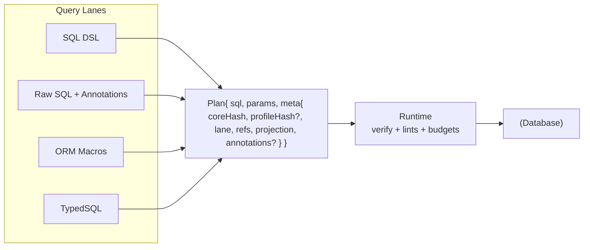

# Query Lanes

## Overview

Query Lanes define the authoring surfaces that compile to a single, unified Plan model. Each lane offers different ergonomics (DSL, raw SQL with annotations, ORM macros, TypedSQL), but all produce immutable Plans that the same runtime executes with consistent verification and guardrails.

Lanes do not execute queries, negotiate capabilities, or manage migrations; they compile intent into Plans that downstream systems verify and run.




## What's a Lane?

Think of lanes like parallel paths that converge on the unified `Plan` model. You can choose per-query ergonomics and still get the same runtime behavior, guardrails, and policy enforcement.

## Responsibilities and Non-goals

Responsibilities:
- Provide multiple authoring surfaces while keeping dialect/capability logic out of lanes
- Compile inputs into a unified Plan with refs/projection/annotations for guardrails
- Expose extension operators/functions in a lane-agnostic, type-safe way

Non-goals:
- Execution/runtime behavior, policy outcomes, or capability negotiation (runtime + contract)
- Dialect heuristics or multi-statement orchestration in lane code (1Q1S by design)

## The Lanes

All lanes compile to the same Plan shape and share the same runtime pipeline. Choose the ergonomics that fit each query; there’s no coupling to a specific lane at runtime.

- SQL DSL lane: Minimal TypeScript builder constructed from `contract.json`, producing a relational AST → Plan. Best for day-to-day CRUD and composition.
- Escape hatch (Raw SQL + annotations): Raw SQL plus typed params and explicit annotations that enable verification and guardrails → Plan. Best for advanced SQL.
- ORM lane: Ergonomic macros over the DSL that emit the same core AST. Best for relation traversal with one call → one statement.
- TypedSQL lane (optional CLI): Author `.sql` files; a CLI validates and emits Plan factories. Best when SQL files are the most readable artifact.

### Quick example

```typescript
import { sql, makeT } from '@prisma/sql'
import contract from './contract.json'

const t = makeT(contract)

const plan = sql()
  .from(t.user)
  .where(t.user.active.eq(true))
  .select({ id: t.user.id, email: t.user.email })
  .limit(100)
  .build()
// One call → one statement; plan carries refs/projection for guardrails
```

## Unified Plan Model

The Plan is the immutable, lane-agnostic artifact produced by all lanes. It carries SQL, parameters, and metadata used by verification, guardrails, and runtime execution. See [ADR 011](../adrs/ADR%20011%20-%20Unified%20Plan%20Model.md).

```typescript
export interface Plan<Row = unknown> {
  // Optional dialect-agnostic AST when available (DSL, ORM)
  ast?: QueryAST

  // Always present
  sql: string
  params: unknown[]

  meta: {
    target: 'postgres' | 'mysql' | 'sqlite'
    coreHash: string            // from contract.json
    profileHash?: string
    lane: 'dsl' | 'orm' | 'raw-sql' | 'typed-sql'
    createdAt: string
    // References and projection help guardrails, change detection, and DX
    refs?: { tables: string[]; columns: Array<{ table: string; column: string }> }
    projection?: Record<string, string> // alias → table.column
    // Annotations power policies when AST is missing or incomplete
    annotations?: {
      intent?: 'read' | 'write' | 'admin'
      isMutation?: boolean
      requiresWhereForMutation?: boolean
      hasWhere?: boolean
      hasLimit?: boolean
      sensitivity?: 'none' | 'pii' | 'phi' | 'secrets'
      ownerTag?: string
      budget?: { maxRows?: number; maxLatencyMs?: number }
      // freeform for extensions to add structured claims
      ext?: Record<string, unknown>
    }
    // Optional codecs to typecheck params and rows at the boundary
    codecs?: { params?: unknown; row?: unknown }
  }
}
```

Plans are immutable in practice and in tests (per ADR 011). **All lanes produce Plans that execute as `AsyncIterable<Row>` regardless of authoring method** — consumers choose between incremental streaming and collection.

## Consistent Execution Semantics

All lanes return `AsyncIterable<Row>` by default, so streaming behavior is consistent regardless of authoring method. Consumers can iterate incrementally or collect results, independent of which lane produced the Plan.

## SQL DSL Lane

The DSL provides a minimal, type-safe builder constructed from `contract.json`. It emits a relational AST that lowers to SQL and produces a Plan.

### Surface

- Constructed from `contract.json` at runtime via `makeT(contract)`
- Column-centric API with fluent expressions

```typescript
import { sql, makeT } from '@prisma/sql'
import contract from './contract.json'

const t = makeT(contract)

const plan = sql()
  .from('user')
  .where(t.user.active.eq(true))
  .select({ id: t.user.id, email: t.user.email })
  .limit(100)
  .build()
// lane = 'dsl', ast present, refs and projection derived automatically
```

### Nested Projection Shaping

The DSL supports nested object literals in `.select()` for ergonomic projection shaping. The compile-time type reflects the nested structure, while the runtime produces flat SQL with flattened aliases.

```typescript
import { sql, makeT } from '@prisma/sql'
import contract from './contract.json'

const t = makeT(contract)

const plan = sql()
  .from(t.user)
  .innerJoin(t.post, (on) => on.eqCol(t.user.id, t.post.userId))
  .select({
    name: t.user.name,
    post: {
      title: t.post.title,
      content: t.post.content,
    },
  })
  .build()

// ResultType<typeof plan> infers: { name: string; post: { title: string; content: string } }
// Runtime returns flat rows with flattened aliases: { name: string, post_title: string, post_content: string }
```

**Aliasing Strategy**: Nested paths are flattened using underscore separators (e.g., `post.title` → `post_title`). The builder detects alias collisions and throws `PLAN.INVALID` with a clear error message.

**Runtime Behavior**: The runtime returns flat JavaScript objects keyed by flattened aliases. MVP does not materialize nested objects at runtime; consumers can destructure/transform if needed. Type safety ensures columns exist and types match.

**Limitations**: This is projection shaping only; it does not include nested aggregation (json_agg/LATERAL) which is capability-gated in a separate feature. See [Brief 06 - SQL Lane Nested Projection Shaping](../../briefs/06-SQL-Lane-Nested-Projection-Shaping.md) for details.

### Nested Array Includes (includeMany)

The DSL supports `includeMany` for 1:N relationships that return one row per parent with a nested array field for children, built in a single statement using `LATERAL` + `json_agg` when supported. This is capability-gated and requires both `lateral` and `jsonAgg` capabilities to be `true` in the contract.

```typescript
import { sql, makeT } from '@prisma/sql'
import contract from './contract.json'

const t = makeT(contract)

const plan = sql()
  .from(t.user)
  .includeMany(
    t.post,
    (on) => on.eqCol(t.user.id, t.post.userId),
    (child) => child
      .select({ id: t.post.id, title: t.post.title })
      .where(t.post.published.eq(true))
      .orderBy(t.post.createdAt.desc())
      .limit(10),
    { alias: 'posts' }
  )
  .select({
    id: t.user.id,
    name: t.user.name,
    posts: true,  // Boolean true references the include alias
  })
  .build()

// ResultType<typeof plan> infers: { id: number; name: string; posts: Array<{ id: number; title: string }> }
// Runtime returns: { id: 1, name: "Alice", posts: [{ id: 1, title: "Post 1" }, ...] }
```

**API Design Decisions**:

- **Boolean `true` for include references**: Using `true` in the projection (e.g., `{ posts: true }`) clearly distinguishes include references from column projections. This keeps the API simple and avoids ambiguity with nested object projections.

- **Explicit alias selection**: Includes must be explicitly selected in the projection. This keeps semantics clear and prevents accidental inclusion of large arrays.

- **Child builder API**: The child builder supports `.select()`, `.where()`, `.orderBy()`, and `.limit()` to allow filtering, sorting, and limiting of child rows independently of the parent query.

- **Capability gating**: Both compile-time (TypeScript) and runtime checks ensure `includeMany` is only available when the contract declares both `lateral` and `jsonAgg` capabilities as `true`. This prevents runtime errors and provides clear type-level feedback.

**Lowering Strategy**:

- **LATERAL + json_agg**: The adapter lowers `includeMany` to a `LEFT JOIN LATERAL` with a subquery that uses `json_agg(json_build_object(...))` to aggregate child rows into a JSON array. The ON condition from the include is moved into the WHERE clause of the lateral subquery.

- **Single statement**: This maintains the one query → one statement rule (see [ADR 003](../adrs/ADR%20003%20-%20One%20Query%20One%20Statement.md)) and avoids N+1 query patterns.

**Runtime Behavior**:

- **Plan meta marker**: Include aliases are marked in `meta.projection` with the special marker `include:alias` (e.g., `{ posts: 'include:posts' }`). This allows the runtime to identify and decode include aliases differently from regular columns.

- **JSON array decoding**: The runtime detects the `include:alias` marker and parses the JSON array from the wire value. If the driver has already parsed the JSON, the runtime uses the parsed array directly.

- **Empty array for null**: When no children match, the database returns `NULL` for the json_agg result. The runtime converts this to an empty array `[]` for consistency, ensuring the result type is always `Array<ChildShape>` rather than `Array<ChildShape> | null`.

- **No codec entries**: Include aliases are excluded from `meta.annotations.codecs` since they are JSON arrays, not scalar values that need codec decoding.

**Type Inference**:

- **Array type**: `includeMany` infers `Array<ChildShape>` for include references by tracking includes at the type level. The builder maintains a type-level map of include aliases to their child projection types, allowing `InferNestedProjectionRow` to look up include aliases and infer the correct array element type.

**Limitations**:

- Requires both `lateral` and `jsonAgg` capabilities to be `true` in the contract
- Child WHERE/ORDER BY/LIMIT are scoped to the lateral subquery only

See [Brief 07 - SQL Lane IncludeMany LATERAL JsonAgg](../../briefs/07-SQL-Lane-IncludeMany-Lateral-JsonAgg.md) for detailed implementation notes.

### Type Inference

- Result type inferred from select projection (supports nested projection shaping - see section below)
- Nullability propagates across joins
- Compile‑time typing precedence:
  - If a projected column has a declared `typeId`, map to `CodecTypes[typeId].output` from `contract.d.ts` (or builder generics in no‑emit mode)
  - Otherwise, map storage scalar → JS type per target family
  - Column nullability in storage propagates to the projected type
- Lanes do not consume runtime codec registries for typing and are not passed the runtime in the typing path

## First-class Relationship Traversal in the Core AST

Relationship traversal is represented by compact nodes in the core `QueryAST`, enabling ergonomic selection without leaking ORM complexity into the core. Each compiled query still lowers to a single SQL statement. See [ADR 003](../adrs/ADR%20003%20-%20One%20Query%20One%20Statement.md).

Adapters lower these nodes in a single pass based on capabilities (e.g., `jsonAgg`, `lateral`) and preserve the one call → one statement rule.

## Escape Hatch Lane

The escape hatch lets authors use raw SQL while still participating in verification and guardrails. Raw Plans include required annotations and optional refs/projection so policies apply. See [ADR 012](../adrs/ADR%20012%20-%20Raw%20SQL%20Escape%20Hatch.md).

### Intent

- Let developers or agents ship hand-written SQL while still participating in verification, guardrails, budgets, and auditing
- Do not parse SQL in the core path — rely on required annotations to supply minimal structure for policy checks

### Minimal API

```typescript
import { raw } from '@prisma/sql/raw'

const plan = raw({
  sql: `select u.id, u.email from "user" u where u.active = $1 limit 100`,
  params: [true],
  // Required annotations for guardrails when AST is absent
  annotations: {
    intent: 'read',
    isMutation: false,
    hasWhere: true,
    hasLimit: true
  },
  // Strongly-typed projection and refs unlock better linting and DX
  refs: { tables: ['user'], columns: [{ table: 'user', column: 'id' }, { table: 'user', column: 'email' }] },
  projection: { id: 'user.id', email: 'user.email' },
  // Optional codecs for runtime value checks
  codecs: { row: z.object({ id: z.number(), email: z.string() }) }
})
```

### Guardrails with Raw SQL

- The runtime enforces policy based on annotations when no AST is present — `mutation-requires-where`, `limit-required`, `maxRows`, `maxLatencyMs`
- Adapters may optionally parse or run EXPLAIN to enrich refs and projection; this is outside the core lane model

Guardrails and capability checks apply against the contract-pinned capability profile validated at connect time. See [ADR 004](../adrs/ADR%20004%20-%20Core%20Hash%20vs%20Profile%20Hash.md) and [ADR 117](../adrs/ADR%20117%20-%20Extension%20capability%20keys.md).

## ORM Lane

The ORM layer provides macros over the DSL for ergonomic relation traversal without coupling those concerns to the DSL. It compiles to the same relational AST, then to SQL → Plan. See [ADR 015](../adrs/ADR%20015%20-%20ORM%20as%20an%20optional%20extension%20over%20the%20DSL.md).

### Intent

- Provide ergonomic include and relations on top of the DSL without coupling the DSL to ORM
- Lower to the same relational AST then to SQL → Plan

### Surface Sketch

```typescript
import { orm } from '@prisma-next/sql-query/orm'
const o = orm<Contract, CodecTypes>({ contract, adapter, codecTypes })

// Model registry proxy: orm.user(), orm.post(), etc.
const plan = o.user()
  .include.posts((child) => child
    .select({ id: t.post.id, title: t.post.title })
    .limit(10)
  )
  .select({ id: t.user.id, email: t.user.email })
  .findMany()
// lane = 'orm', ast present, refs/projection derived
```

### Implementation Details

- **Entrypoint**: `orm.<model>()` with model registry proxy for discoverability
- **Read Operations**: `findMany()`, `findFirst()`, `findUnique()` (not yet implemented)
- **Chained Methods**: `where()`, `orderBy()`, `take()`, `skip()`, `select()`
- **Relation Filters**: `where.related.<relation>.some/none/every(predicate)` compile to EXISTS/NOT EXISTS subqueries
- **Includes**: `include.<relation>(child => ...)` compile to SQL lane `includeMany()` (capability-gated: requires `lateral: true` and `jsonAgg: true`)
- **Base-Model Writes**: `create(data)`, `update(where, data)`, `delete(where)` compile to SQL lane DML operations
- **Model-to-Column Mapping**: Automatically maps model field names to column names using contract mappings

### Lowering (Postgres)

- **1:N nested** via LEFT JOIN LATERAL (...) and json_agg per parent row
- **Relation filters** via EXISTS/NOT EXISTS subqueries with join conditions derived from relation metadata
- **DML operations** via INSERT, UPDATE, DELETE statements with model-to-column mapping
- **One call → one statement** remains the rule

The ORM is optional and layered on top of the DSL.

## TypedSQL Lane (Optional CLI)

TypedSQL is an optional CLI that validates `.sql` files and emits Plan factories. See [ADR 019](../adrs/ADR%20019%20-%20TypedSQL%20as%20Separate%20CLI.md).

- Reads `.sql` files and validates parameter and result types against a live DB or the contract
- Emits factories that return Plans with `lane = 'typed-sql'`, `ast` omitted, `refs`/`projection` provided via light parsing or developer hints
- Fits teams who prefer SQL as source while retaining the same runtime safety

Example header annotations:

```sql
-- @param vector: pgvector/vector(dim=1536)
-- @intent read
-- @extension pgvector.fn.distance
SELECT pgvector_distance(embedding, $1) as dist
FROM items
WHERE pgvector_distance(embedding, $1) < 0.8
ORDER BY embedding <-> $1
LIMIT 10;
```

## Selecting from Views

Views and other read-only sources are exposed through the DSL identically to tables, with full type safety and read-only enforcement (see [ADR 127](../adrs/ADR%20127%20-%20Views%20as%20extension-owned%20read-only%20sources.md)). Mutations on read-only sources are blocked by lints and at runtime.

```typescript
const plan = sql()
  .from(t['public.active_users'])
  .select({ id: t['public.active_users'].id, email: t['public.active_users'].email })
  .limit(100)
  .build()
```

Adapters lower queries against views based on capabilities (native view vs expand-as-CTE). Lanes do not need to know which strategy is used; adapters choose transparently.

## Extension Functions and Operators

Packs can register domain-specific functions and operators that integrate with the DSL. Lanes expose these through a registry with type-safe signatures. Plans include structured references to operators/functions in `meta.refs` so guardrails can enforce policy without parsing SQL. See [ADR 113](../adrs/ADR%20113%20-%20Extension%20function%20&%20operator%20registry.md) and [ADR 117](../adrs/ADR%20117%20-%20Extension%20capability%20keys.md).

```typescript
import { sql, op, makeT, param } from '@prisma/sql'

const t = makeT(contract)
const query = param.vector('q')

const plan = sql()
  .from(t.document)
  .select({ id: t.document.id, distance: op('pgvector', '<->', t.document.embedding, query) })
  .orderBy(op('pgvector', '<->', t.document.embedding, query))
  .limit(10)
  .build()
```

See Capability-gated query features for branching guidance.

## Runtime Pipeline

All lanes share the same execution model. This section summarizes the core steps; see the Runtime subsystem for full details. The one‑query one‑statement rule (1Q1S) is critical here: it enables tight feedback loops for agents and humans. Because each Plan maps to a single statement, lint and budget plugins can attribute warnings/errors precisely to the originating query, and the runtime can reason deterministically about cost and policy impact before execution (see [ADR 003](../adrs/ADR%20003%20-%20One%20Query%20One%20Statement.md), [ADR 022](../adrs/ADR%20022%20-%20Lint%20Rule%20Taxonomy.md), [ADR 023](../adrs/ADR%20023%20-%20Budget%20Evaluation.md)).

1. **compile**
   - For DSL and ORM, lower AST → SQL with adapter and fill refs and projection
   - For raw and TypedSQL, use provided sql, params, and annotations
2. **beforeExecute**
   - Verify `coreHash` and pinned profile, apply lints and budgets, resolve policy config
3. **execute**
   - Driver streams rows back as `AsyncIterable<Row>`, returning immediately
4. **onRow (per-row, optional)**
   - Plugins observing each row as it streams (for real-time telemetry or sampling)
5. **afterExecute**
   - Called when stream completes or consumer stops iterating; aggregated stats and telemetry
6. **onError**
   - Diagnostics and redaction

Result is always `AsyncIterable<Row>` where `Row` is inferred from the Plan's projection. Plugins observe the same Plan irrespective of lane.

## Extensibility Model

- Extensions can create new lanes by compiling to a Plan and tagging `meta.lane` — the only hard requirement is honoring the Plan contract
- Extension functions/operators integrate through the registry system with type safety and capability gating
- Alternate runtimes are allowed — they must verify `coreHash`, respect immutability, and document hook semantics
- Adapters keep SQL lowering out of lane code — dialect specifics live behind the adapter SPI

## Capability-gated query features

Some AST features require explicit capability keys for lowering on specific targets. Branching consults the contract’s pinned capability profile, not ambient features. This follows the Architecture Overview’s “thin core, fat targets” and “explicit over implicit” principles: features are declared in the contract and verified against the runtime environment before they are used.

- Joins
  - Always available in the AST.
  - Lowered features are gated by `join.lateral`, `join.semi`, `join.anti` capability keys.

- Projection features
  - `.distinct()` requires `projection.distinct`.
  - `.distinctOn()` requires `projection.distinctOn` (e.g., Postgres-only).

- Advisors and lints
  - Index coverage checks for equality joins when a corresponding FK exists in the contract.
  - Rules consult `meta.refs` and adapter capabilities.

- Extension operators
  - Packs register operators and functions through the registry (ADR 113).
  - DSL and TypedSQL lanes consume these with type-safe signatures and capability gating.

Cross-references
- [ADR 016 — Adapter SPI for Lowering](../adrs/ADR%20016%20-%20Adapter%20SPI%20for%20Lowering.md)
- [ADR 113 — Function & Operator Registry](../adrs/ADR%20113%20-%20Extension%20function%20&%20operator%20registry.md)
- [ADR 020 — Result Typing Rules](../adrs/ADR%20020%20-%20Result%20Typing%20Rules.md)


## ADRs

- **ADR 011** — Unified Plan model across lanes
  - One Plan contract for all lanes with optional ast and optional annotations
  - Plan carries sql, params, meta.coreHash, refs, projection, lane
  - Immutability reaffirmed and enforced by tests
  - Why an ADR: cements the integration surface every lane and runtime must honor

- **ADR 012** — Raw SQL escape hatch with required annotations
  - Define the minimal annotations a raw Plan must provide for policy checks (intent, isMutation, hasWhere, hasLimit)
  - Optional structured refs, projection, and codecs for stronger guardrails
  - No core SQL parsing required; adapters may enrich as an optional add-on
  - Why an ADR: sets safety bar and prevents "raw mode" from bypassing verification

- **ADR 013** — Lane-agnostic Plan identity and hashing
  - Plan hashing and change detection ignore lane and focus on (sql, params, normalized meta)
  - What metadata participates and what is excluded for stability
  - Why an ADR: avoids accidental hash churn when authors swap lanes

- **ADR 014** — Runtime hook API v1 (lane-neutral)
  - Hooks: beforeCompile, beforeExecute, afterExecute, onError with Plan in/out guarantees
  - Error semantics, budgets, and lint levels
  - Why an ADR: locks the extension surface for guardrails and telemetry independent of lane

- **ADR 015** — ORM as an optional extension over the DSL
  - One call → one statement rule
  - Lowering strategy responsibility lives in adapter profiles, not in the DSL core
  - Why an ADR: prevents ORM concerns from leaking into the base builder

- **ADR 016** — Adapter SPI for lowering relational AST
  - Capability flags (e.g., lateral, jsonAgg) and deterministic lowering requirements
  - Golden SQL testing obligations and stability guarantees
  - Why an ADR: formalizes where dialect logic lives so lanes stay portable

- **ADR 017** — Extension and alternate runtime compatibility policy
  - What third-party lanes and runtimes must do: honor Plan contract, verify coreHash, respect immutability, document hooks
  - Versioning and compatibility matrix
  - Why an ADR: encourages ecosystem contributions without fragmenting safety

- **ADR 018** — Plan annotations schema and validation
  - Canonical JSON schema for annotations and validation rules at build time and runtime
  - Reserved keys vs annotations.ext for custom claims
  - Why an ADR: keeps raw Plans verifiable and lets policies evolve safely

- **ADR 019** — TypedSQL as a separate CLI that emits Plan factories
  - Out-of-tree tool, not a core lane
  - Validates params/result types, stamps coreHash, produces factories returning Plans
  - Why an ADR: captures the integration contract without re-introducing client codegen

- **ADR 020** — Result typing and projection inference rules
  - How DSL and ORM compute result types from projections and joins
  - Nullability propagation rules for LEFT JOIN and aggregates
  - Why an ADR: stabilizes type inference so agents and users can rely on it
- **ADR 018** — Plan annotations schema and validation
  - Canonical JSON schema for annotations and validation rules at build time and runtime
  - Reserved keys vs annotations.ext for custom claims
  - Why an ADR: keeps raw Plans verifiable and lets policies evolve safely
- **ADR 036** — TypedSQL header annotation spec
  - Formal grammar for `-- @param`, `-- @intent`, sensitivity, and optional refs/projection hints
  - Extension parameter and function annotations
- **ADR 065** — Adapter capability schema & negotiation v1
  - Canonical capability keys, optional features, negotiation flow at connect time
  - How lanes/plugins branch on capabilities rather than target strings
- **ADR 113** — Extension function & operator registry
  - Registry assembly from packs, type-safe function/operator usage, capability gating
  - Deterministic rendering hooks scoped to adapter profiles
