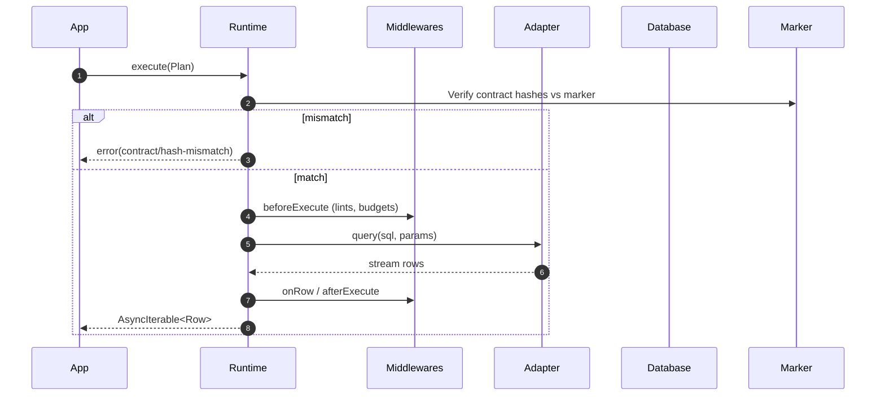

# Runtime & Middleware Framework

The runtime is the executable core of Prisma Next. Its job is to execute queries and deliver tight feedback loops as it does so. Like the other subsystems, the runtime is simply an orchestrator of composable, primitive components responsible for execution, verification and the middleware system.

Every query is compiled into a Plan, and every Plan passes through verification and a deterministic middleware pipeline before execution. This makes behavior explicit and problems easy to diagnose.

The one query, one statement rule simplifies both verification and debugging. When a Plan fails verification or a middleware raises a violation, the surface area is small and the cause is clear.

Results stream as `AsyncIterable<Row>` so applications can start processing immediately without buffering entire result sets. For typical small queries, consumers can opt into simple collection; the streaming model is the default, not a requirement.

The middleware system keeps logic out of the core and makes behavior composable. First‑party and community middleware can implement lints, budgets, and telemetry. Every Plan is presented to middleware before execution so policies and checks run consistently.

The runtime also verifies the contract against the database marker before it executes, and it executes Plans via database drivers while composing codecs from adapters and packs to decode rows precisely.

The runtime does not orchestrate migrations or unit‑of‑work semantics, does not contain dialect lowering logic (which lives in adapters), does not parse arbitrary SQL beyond the structure provided by lanes, and does not allow disabling contract verification in production. This separation of concerns reflects a thin‑core, fat‑targets philosophy that keeps the core predictable and extensions explicit.

## Cross-Family Runtime SPIs

The runtime system defines framework-level SPIs in `@prisma-next/framework-components/runtime` that both SQL and Mongo (and future) families implement:

### RuntimeExecutor

The common shape all family runtimes satisfy:

```typescript
interface RuntimeExecutor<TPlan extends { readonly meta: PlanMeta }> {
  execute<Row>(plan: TPlan): AsyncIterable<Row>;
  close(): Promise<void>;
}
```

Family runtimes narrow `TPlan`: SQL uses `ExecutionPlan` (with `sql: string`), Mongo uses `MongoQueryPlan` (with `collection`, `command`). Both share `meta: PlanMeta`.

### RuntimeMiddleware

The middleware lifecycle interface, with optional family/target binding:

```typescript
interface RuntimeMiddleware {
  readonly name: string;
  readonly familyId?: string;   // if set, restricts to a family (e.g. 'sql', 'mongo')
  readonly targetId?: string;   // if set, restricts to a target (e.g. 'postgres')
  beforeExecute?(plan: { readonly meta: PlanMeta }, ctx: RuntimeMiddlewareContext): Promise<void>;
  onRow?(row: Record<string, unknown>, plan: { readonly meta: PlanMeta }, ctx: RuntimeMiddlewareContext): Promise<void>;
  afterExecute?(plan: { readonly meta: PlanMeta }, result: AfterExecuteResult, ctx: RuntimeMiddlewareContext): Promise<void>;
}
```

- **Generic middleware** (no `familyId`): works across all families. Example: telemetry, rate limiting.
- **Family-specific middleware** (`familyId: 'sql'`): uses narrowed plan/context types. Example: SQL lints, budgets.
- **Compatibility validation**: `checkMiddlewareCompatibility()` validates at runtime construction; mismatched middleware produces a clear error.

### Family-Specific Middleware Interfaces

- `SqlMiddleware` (in `@prisma-next/sql-runtime`): extends `RuntimeMiddleware` with `familyId: 'sql'`, `ExecutionPlan`, `SqlMiddlewareContext`
- `MongoMiddleware` (in `@prisma-next/mongo-runtime`): extends `RuntimeMiddleware` with `familyId: 'mongo'`, `MongoQueryPlan`, `MongoMiddlewareContext`

## Example

```typescript
import { instantiateExecutionStack } from '@prisma-next/framework-components/execution'
import { createExecutionContext, createRuntime, createSqlExecutionStack } from '@prisma-next/sql-runtime'
import { sql } from '@prisma-next/sql-lane/sql'
import { schema } from '@prisma-next/sql-relational-core/schema'
import { validateContract } from '@prisma-next/sql-contract/validate'
import postgresAdapter from '@prisma-next/adapter-postgres/runtime'
import postgresTarget from '@prisma-next/target-postgres/runtime'
import postgresDriver from '@prisma-next/driver-postgres/runtime'
import type { Contract } from './contract.d'
import contractJson from './contract.json' with { type: 'json' }

// Validate contract first (caller is responsible for validation)
const contract = validateContract<Contract>(contractJson)

// Phase 1: Static context (no instantiation)
const stack = createSqlExecutionStack({
  target: postgresTarget,
  adapter: postgresAdapter,
  driver: postgresDriver,
  extensionPacks: [],
})
const context = createExecutionContext({ contract, stack })

// Get tables from schema (types extracted automatically from contract)
const tables = schema(context).tables

const plan = sql({ context })
  .from(tables.user)
  .where(tables.user.columns.active.eq(true))
  .select({ id: tables.user.columns.id, email: tables.user.columns.email })
  .build()

// Phase 2: Dynamic runtime (instantiate stack with driver → connect at boundary → create runtime)
const stackInstance = instantiateExecutionStack(stack)
const driver = stackInstance.driver!
await driver.connect({ kind: 'url', url: process.env.DATABASE_URL })
const rt = createRuntime({
  stackInstance,
  context,
  driver,
  verify: {
    mode: process.env.NODE_ENV === 'production' ? 'startup' : 'onFirstUse',
    requireMarker: true
  },
  middleware: []
})

for await (const row of rt.execute(plan)) {
  console.log(row.id, row.email)
}
```

### Sequence (high level)

This sequence shows the runtime's tight feedback loop at execution time: the runtime verifies its loaded contract against the database marker before any work, middleware apply policy and budgets deterministically, and the driver streams rows back while middleware observe per‑row and aggregate outcomes.



## Plans, Identity, and Verification

Plans are immutable execution units produced by lanes. A Plan carries SQL, parameters, and metadata used for verification and guardrails. Treating Plans as the product—rather than executing intent directly—keeps behavior explicit, hashable, and auditable across environments. Plans may also embed a lane‑supplied AST; the runtime treats the Plan as immutable regardless of origin. See the unified Plan model in Query Lanes and [ADR 011 — Unified Plan model across lanes](../adrs/ADR%20011%20-%20Unified%20Plan%20model%20across%20lanes.md).

```typescript
type Plan = {
  sql: string
  params: unknown[]
  ast?: QueryAST       // Optional: present for DSL/ORM lanes to enable adapter lowering, structured guardrails, and better caching
  meta: {
    target: string
    storageHash: string
    profileHash?: string
    lane?: string
    refs?: { tables: string[]; columns: Array<{ table: string; column: string }> }
    projection?: Record<string, string>
    annotations?: Record<string, unknown>
  }
}
```

AST is optional and present only for lanes that build one (DSL/ORM). Raw and TypedSQL lanes omit it and rely on annotations and refs.

Verification compares the runtime's loaded contract to the database marker. Both `storageHash` and `profileHash` are enforced:
- The runtime reads marker `{ storageHash, profileHash }` and compares them to the loaded contract's hashes.
- Optionally, the runtime or middleware may check that `plan.meta.storageHash` matches the loaded contract for diagnostic clarity.
- A mismatch results in `contract/hash-mismatch` or `contract/marker-missing`, depending on configuration. See [ADR 021](../adrs/ADR%20021%20-%20Contract%20marker%20storage%20&%20verification%20modes.md).
- `profileHash` is derived solely from the contract and written by the migration runner; the runtime does not compute a new profile or "negotiate" a new hash. See [ADR 004 — Storage Hash vs Profile Hash](../adrs/ADR%20004%20-%20Storage%20Hash%20vs%20Profile%20Hash.md).

## Execution Pipeline

The runtime executes Plans through a small set of well‑defined stages. AST‑backed lanes may perform adapter lowering first; all Plans then pass a contract verification gate, optional middleware guardrails, and driver execution. This structure keeps behavior explicit (1q1s for AST lanes), enables early failure with actionable errors, and minimizes overhead.

```
SqlQueryPlan (AST + meta, no SQL yet)
  └─▶ beforeCompile         // SQL-family middlewares may rewrite the AST
       └─ adapter.lower     // single, deterministic lowering on final draft
           └─ ▶ lowered SQL + params
  └─▶ contract verification // compare storageHash/profileHash to marker
  └─▶ beforeExecute         // middleware: lints, budgets, annotations checks
       └─▶ driver.query     // begins streaming rows
  └─▶ onRow (optional)      // per-row observation
  └─▶ afterExecute          // aggregate telemetry
     ↘ onError              // any failure path
```

- AST lanes lower to a single SQL statement (1q1s) for predictability and guardrails; multi‑step behavior is expressed explicitly outside the runtime. See [ADR 016 — Adapter SPI for lowering](../adrs/ADR%20016%20-%20Adapter%20SPI%20for%20lowering%20relational%20AST.md) and the Architecture Overview's "Plans are the product".
- Results are `AsyncIterable<Row>` by default; a `.toArray()` helper can collect.
- Budgets (row/latency) enforce incrementally and can terminate streaming early ([ADR 023](../adrs/ADR%20023%20-%20Budget%20evaluation%20&%20EXPLAIN%20policy.md)).
- Prefer reading lane/adapter refs and annotations over parsing SQL text; behavior is explicit, not inferred.

## Connection Lifecycle

The runtime does not own pooling or sockets; it delegates to a target driver. This thin‑core approach keeps the executor simple and stable while adapters and packs carry dialect and capability logic.

**Lifecycle:** instantiate stack with driver → connect at boundary → create runtime ([ADR 159](../adrs/ADR%20159%20-%20Driver%20Terminology%20and%20Lifecycle.md)).

1. Create
   - `createSqlExecutionStack({ target, adapter, driver, extensionPacks })` - Creates SQL descriptor stack
   - `createExecutionContext({ contract, stack })` - Creates context from contract and descriptors-only stack. Context creation uses descriptor `SqlStaticContributions` (codecs, operation signatures, parameterized codecs) — no instantiation required.
   - `instantiateExecutionStack(stack)` - Instantiates all components including driver (unbound). Stack instance includes `driver` when stack has driver descriptor.
   - Caller resolves binding from options and calls `stackInstance.driver.connect(binding)` at the boundary where env is available.
   - `createRuntime({ stackInstance, context, driver: stackInstance.driver, verify, middleware })` - Creates runtime with now-bound driver.
   - Validates `contract.json` and caches `storageHash`/`profileHash` (contract is already validated before being passed to context).
   - Discovers environment capabilities to validate against the contract's pinned capability profile; does not compute a new `profileHash` ([ADR 065 — Adapter capability schema & negotiation](../adrs/ADR%20065%20-%20Adapter%20capability%20schema%20&%20negotiation%20v1.md)).
   - Uses `ExecutionContext` for contract, codec and operations registries (decoupled from runtime).
   - Validates middleware compatibility (familyId/targetId) and registers middleware in order.
2. Warmup
   - Optional `driver.warmup()` and built‑in contract verification if configured.
   - Codecs and operations are composed in `ExecutionContext` from adapter and extensions programmatically ([ADR 030](../adrs/ADR%20030%20-%20Result%20decoding%20&%20codecs%20registry.md), [ADR 114](../adrs/ADR%20114%20-%20Extension%20codecs%20&%20branded%20types.md)).
3. Acquire
   - On first execute, the driver acquires a pooled connection/session.
4. Execute
   - The runtime executes a single Plan through hooks and `driver.query(sql, params)`.
5. Release
   - The driver returns the connection to the pool.
6. Shutdown
   - `runtime.end()` flushes telemetry, closes the driver, and disposes middleware resources.

## Middleware API

Middlewares are async and run in registration order. Any middleware may block execution by throwing a structured error. See [ADR 014 — Runtime hook API](../adrs/ADR%20014%20-%20Runtime%20hook%20API%20v1%20(lane-neutral).md) and [ADR 027 — Error envelope & stable codes](../adrs/ADR%20027%20-%20Error%20envelope%20&%20stable%20codes.md).

```typescript
interface RuntimeMiddleware {
  name: string
  familyId?: string    // restrict to a family ('sql', 'mongo')
  targetId?: string    // restrict to a target ('postgres', 'sqlite')

  beforeExecute?(
    plan: { readonly meta: PlanMeta },
    ctx: RuntimeMiddlewareContext
  ): Promise<void>

  onRow?(row: Record<string, unknown>, plan: { readonly meta: PlanMeta }, ctx: RuntimeMiddlewareContext): Promise<void>

  afterExecute?(
    plan: { readonly meta: PlanMeta },
    result: { rowCount: number; latencyMs: number; completed: boolean },
    ctx: RuntimeMiddlewareContext
  ): Promise<void>
}
```

Notes:
- Plans are immutable; middleware must not mutate in place. See [ADR 011](../adrs/ADR%20011%20-%20Unified%20Plan%20model%20across%20lanes.md).
- Behavior is composed, not configured: middleware make policy explicit and testable; the only global tuning is a transparent `mode` (`strict`/`permissive`).
- `beforeExecute` always runs and is where verification and guardrails live.
- `onRow` is optional and called for each streamed row; `afterExecute` receives aggregates.
- Generic middleware (no `familyId`) work across all families. Family-specific middleware (`SqlMiddleware`, `MongoMiddleware`) use narrowed plan/context types.

## Rewriting ASTs (SQL family)

`SqlMiddleware` offers one hook beyond the generic lifecycle: `beforeCompile`. It runs on the pre-lowering `SqlQueryPlan` so middleware can inspect and rewrite the query AST before the adapter turns it into SQL. This is the mechanism behind cross-cutting concerns like soft-delete, tenant isolation, and audit-row scoping — each expressed as a composable middleware rather than a bespoke wrapper around the lane.

```typescript
interface DraftPlan {
  readonly ast: AnyQueryAst   // typed SQL AST from sql-relational-core
  readonly meta: PlanMeta
}

interface SqlMiddleware extends RuntimeMiddleware {
  beforeCompile?(draft: DraftPlan, ctx: SqlMiddlewareContext): Promise<DraftPlan | undefined>
  // ... plus beforeExecute / onRow / afterExecute inherited semantics
}
```

**Chained composition.** Middleware run in registration order; each sees the output of the previous. A soft-delete middleware registered before a tenant-isolation middleware means tenant isolation sees the already-soft-deleted draft and can combine its predicate with the existing `WHERE`. The runtime registers no ordering metadata — the array order is the source of truth.

**Passthrough is free.** Returning `undefined` (or a draft whose `ast` reference equals the input's) signals no rewrite: the chain continues with the same draft, no log event, no state change. `adapter.lower()` runs exactly once after the chain completes, regardless of how many middleware participated.

**Traceability.** When a middleware returns a draft with a new `ast` reference, the runtime emits a `middleware.rewrite` event via `ctx.log.debug` naming the middleware. No annotation is attached to the plan — logs are the audit trail.

**Working example — soft-delete.**

```typescript
import { BinaryExpr, ColumnRef, LiteralExpr } from '@prisma-next/sql-relational-core/ast'
import type { SqlMiddleware } from '@prisma-next/sql-runtime'

export const softDelete: SqlMiddleware = {
  name: 'softDelete',
  familyId: 'sql',
  async beforeCompile(draft) {
    if (draft.ast.kind !== 'select') return
    const notDeleted = BinaryExpr.eq(
      ColumnRef.of('users', 'deleted_at'),
      LiteralExpr.of(null),
    )
    const nextWhere = draft.ast.where
      ? AndExpr.of([draft.ast.where, notDeleted])
      : notDeleted
    return { ...draft, ast: draft.ast.withWhere(nextWhere) }
  },
}
```

**AST toolkit.** Use `AstRewriter`, `SelectAst.withWhere` / `.withJoins` / `.withLimit`, and the frozen-node factories (`BinaryExpr.eq`, `AndExpr.of`, `ColumnRef.of`) from `@prisma-next/sql-relational-core/ast`. Every node is immutable; `with*` methods return new instances.

**Security note.** Predicates built via `BinaryExpr` / `AndExpr` and literals via `LiteralExpr.of` are lowered through the adapter's parameterization — no SQL-injection surface is introduced by the hook itself. The one risk to flag in authoring guides: constructing `LiteralExpr.of(userInput)` from untrusted input bypasses parameterization. Use `ParamRef.of(userInput, ...)` for any value originating from user input.

**Error handling.** A middleware that throws inside `beforeCompile` surfaces via the standard `runtimeError` envelope — no silent swallow. Invalid ASTs (e.g. tables not in the contract) are caught downstream at lowering or contract verification time; the spec does not add a pre-lowering validation layer — middleware authors are responsible for producing structurally valid AST.

**Raw SQL lanes.** `beforeCompile` only runs when the lane produces a `SqlQueryPlan` (AST present). Raw SQL plans — which arrive as fully-lowered `ExecutionPlan` — bypass the hook entirely.

**Scope.** `beforeCompile` is the current rewriting surface. Short-circuiting the query with a static result (caching) and user-authored query annotations are deferred to later TML-2143 milestones; their API is not yet defined.

## Guardrails via Middleware

Guardrails are applied by a deterministic middleware pipeline that runs before, during (per‑row), and after execution. With zero middleware, the runtime only verifies the contract and executes the Plan. When middleware are present, lints and budgets enforce policy while telemetry records outcomes. This keeps behavior composable and explicit, with middleware executing in registration order and clear failure semantics.

The **lints middleware** is implemented in the SQL domain (`packages/2-sql/5-runtime/src/middleware/lints.ts`) and exported from `@prisma-next/sql-runtime`. It inspects `plan.ast` when present (AST-first), applying structural rules rather than SQL string parsing. When `plan.ast` is missing, it falls back to raw heuristic guardrails or skips linting, configurable via `fallbackWhenAstMissing`. Kysely-authored plans (which attach PN AST via the transformer) are linted the same way as DSL/ORM plans.

- Lints (defaults depend on mode)
- `no-select-star` (selectAll intent)
- `mutation-requires-where`
  - `no-missing-limit` for unbounded reads
- `no-unindexed-predicate` using `meta.refs` and contract indexes when available
  - See [ADR 022](../adrs/ADR%20022%20-%20Lint%20rule%20taxonomy%20&%20configuration%20model.md)

- Budgets
  - Row budget and latency budget enforced incrementally during streaming ([ADR 023](../adrs/ADR%20023%20-%20Budget%20evaluation%20&%20EXPLAIN%20policy.md))

- Telemetry
  - Emits `planId`, `sqlFingerprint`, `latencyMs`, `rowCount`, `errorCode` to configured sinks ([ADR 024 — Telemetry schema & privacy](../adrs/ADR%20024%20-%20Telemetry%20schema%20&%20privacy.md))

## Capabilities, Packs, and Codecs

Adapters report capabilities at connect time; the contract only declares requirements. Packs contribute capability manifests and codecs; adapters implement lowering and driver integration. Descriptor-level `SqlStaticContributions` (codecs, operation signatures, parameterized codecs) are the source of truth for codec and operation composition during context creation. At runtime, the adapter's reported capabilities are validated against the contract's declared requirements; capabilities are adapter-reported/negotiated, not target-defined. Shared adapter capability keys use the `sql.*` namespace. Codecs from adapters and packs are composed to decode branded values per row without bloating core logic.

- Adapters report/negotiate capabilities at connect time; the contract declares requirements. Missing required capabilities fail fast with `adapter/capability-missing`. The runtime does not recompute `profileHash` ([ADR 065](../adrs/ADR%20065%20-%20Adapter%20capability%20schema%20&%20negotiation%20v1.md), [ADR 004](../adrs/ADR%20004%20-%20Storage%20Hash%20vs%20Profile%20Hash.md)).
- Codecs are composed from app, packs, and the adapter for per-row decode/encode ([ADR 030](../adrs/ADR%20030%20-%20Result%20decoding%20&%20codecs%20registry.md), [ADR 114](../adrs/ADR%20114%20-%20Extension%20codecs%20&%20branded%20types.md)).
- Extension guardrails consult adapter-negotiated capability flags to avoid false positives and enforce pack‑specific policies ([ADR 115](../adrs/ADR%20115%20-%20Extension%20guardrails%20&%20EXPLAIN%20policies.md)).

## Error Taxonomy

Errors are structured and machine‑readable ([ADR 027](../adrs/ADR%20027%20-%20Error%20envelope%20&%20stable%20codes.md)):

```
category/code
  contract/hash-mismatch
  contract/target-mismatch
  contract/marker-missing
  policy/annotations-missing
  lint/no-select-star
  lint/mutation-missing-where
  budget/rows-exceeded
  budget/latency-exceeded
  adapter/capability-missing
  compile/lowering-failed
  driver/query-failed
  runtime/unexpected
```

Policy determines whether a violation blocks (`error`) or logs (`warn`). A global `mode` can tune defaults (e.g., `strict` vs `permissive`).

## Performance and Caching

The runtime aims to keep guardrails on by default without noticeable overhead. We cache where identity is stable (e.g., per‑adapter lowering and per‑pool verification), stop work on the first blocking violation, and prefer lane‑supplied metadata over SQL parsing to keep checks O(1) or near‑constant.

Targets:
- < 5% overhead on p95 latency for CRUD‑class Plans with lints and budgets enabled.
- < 1 ms median overhead for the hook pipeline with first‑party middleware enabled and no EXPLAIN is issued.
- Zero‑middleware runtime adds ~0.2–0.4 ms median on a local driver baseline.

Strategies:
- Keep contract verification O(1) via a single hash comparison and cache the result per pool.
- Cache adapter lowering by `(sqlFingerprint, adapter.version)` for AST lanes.
- Short‑circuit the hook chain on first blocking violation.
- Prefer precomputed `meta.refs` from lanes for lints; avoid SQL parsing.
- See [ADR 025 — Plan caching & memoization](../adrs/ADR%20025%20-%20Plan%20caching%20&%20memoization%20in%20runtime.md).


## Testing Strategy

Tests ensure the middleware contract remains stable, plan identity is preserved, and guardrails produce deterministic outcomes under different modes and capability sets. Benchmarks validate that feedback remains tight without sacrificing performance.

- Middleware API contract tests with mock middleware and error injection.
- Cross-family proof: same generic middleware observes queries from both SQL and Mongo runtimes.
- Golden SQL and hash stability tests to ensure Plan immutability and identity do not drift.
- Violation matrix ensuring built‑in rules behave consistently under `strict` and `permissive` modes.
- Benchmarks to validate overhead budgets.
