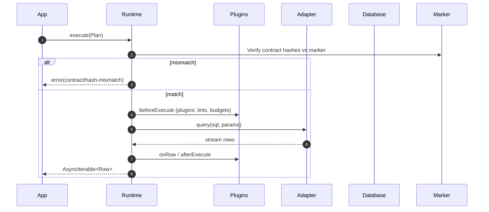

# Runtime & Plugin Framework

The runtime is the executable core of Prisma Next. Its job is to deliver tight feedback loops at query time. Every query is compiled into a Plan, and every Plan passes through verification and a deterministic plugin pipeline before execution. This makes behavior explicit and problems easy to diagnose.

The one query, one statement rule simplifies both verification and debugging. When a Plan fails verification or a plugin raises a violation, the surface area is small and the cause is clear.

Results stream as `AsyncIterable<Row>` so applications can start processing immediately without buffering entire result sets. For typical small queries, consumers can opt into simple collection; the streaming model is the default, not a requirement.

A minimal plugin system keeps logic out of the core and makes behavior composable. First‑party and community plugins can implement lints, budgets, and telemetry. Every Plan is presented to plugins before execution so policies and checks run consistently.

The runtime also verifies the contract against the database marker before it executes, and it executes Plans via database drivers while composing codecs from adapters and packs to decode rows precisely.

The runtime does not orchestrate migrations or unit‑of‑work semantics, does not contain dialect lowering logic (which lives in adapters), does not parse arbitrary SQL beyond the structure provided by lanes, and does not allow disabling contract verification in production. This separation of concerns reflects a thin‑core, fat‑targets philosophy that keeps the core predictable and extensions explicit.

## Example

```typescript
import { createRuntime } from '@prisma/runtime'
import { postgresAdapter } from '@prisma/adapter-postgres'
import { sql, makeT } from '@prisma/sql'
import contract from './contract.json'
import driver from './pg-driver'

const t = makeT(contract)

const rt = createRuntime({
  contract,           // loaded contract.json
  adapter: postgresAdapter,
  driver,             // target driver
  verify: {           // built-in contract verification
    mode: process.env.NODE_ENV === 'production' ? 'startup' : 'onFirstUse',
    onMismatch: 'throw',
    requireMarker: true
  },
  plugins: []         // compose lints, budgets, telemetry as needed
})

const plan = sql()
  .from(t.user)
  .where(t.user.active.eq(true))
  .select({ id: t.user.id, email: t.user.email })
  .build()

for await (const row of rt.execute(plan)) {
  console.log(row.id, row.email)
}
```

### Sequence (high level)

This sequence shows the runtime’s tight feedback loop at execution time: the runtime verifies its loaded contract against the database marker before any work, plugins apply policy and budgets deterministically, and the driver streams rows back while plugins observe per‑row and aggregate outcomes.



## Plans, Identity, and Verification

Plans are immutable execution units produced by lanes. A Plan carries SQL, parameters, and metadata used for verification and guardrails. Treating Plans as the product—rather than executing intent directly—keeps behavior explicit, hashable, and auditable across environments. Plans may also embed a lane‑supplied AST; the runtime treats the Plan as immutable regardless of origin. See the unified Plan model in Query Lanes and [ADR 011 — Unified Plan model across lanes](../adrs/ADR%20011%20-%20Unified%20Plan%20model%20across%20lanes.md).

```typescript
type Plan = {
  sql: string
  params: unknown[]
  ast?: QueryAST       // Optional: present for DSL/ORM lanes to enable adapter lowering, structured guardrails, and better caching
  meta: {
    target: string
    coreHash: string
    profileHash?: string
    lane?: string
    refs?: { tables: string[]; columns: Array<{ table: string; column: string }> }
    projection?: Record<string, string>
    annotations?: Record<string, unknown>
  }
}
```

AST is optional and present only for lanes that build one (DSL/ORM). Raw and TypedSQL lanes omit it and rely on annotations and refs.

Verification compares the runtime’s loaded contract to the database marker. Both `coreHash` and `profileHash` are enforced:
- The runtime reads marker `{ coreHash, profileHash }` and compares them to the loaded contract’s hashes.
- Optionally, the runtime or plugins may check that `plan.meta.coreHash` matches the loaded contract for diagnostic clarity.
- A mismatch results in `contract/hash-mismatch` or `contract/marker-missing`, depending on configuration. See [ADR 021](../adrs/ADR%20021%20-%20Contract%20marker%20storage%20&%20verification%20modes.md).
- `profileHash` is derived solely from the contract and written by the migration runner; the runtime does not compute a new profile or “negotiate” a new hash. See [ADR 004 — Core Hash vs Profile Hash](../adrs/ADR%20004%20-%20Core%20Hash%20vs%20Profile%20Hash.md).

## Execution Pipeline

The runtime executes Plans through a small set of well‑defined stages. AST‑backed lanes may perform adapter lowering first; all Plans then pass a contract verification gate, optional plugin guardrails, and driver execution. This structure keeps behavior explicit (1q1s for AST lanes), enables early failure with actionable errors, and minimizes overhead.

```
Plan (immutable)
  └─▶ beforeCompile        // lanes with AST only; adapter may lower
       └─ adapter.lower    // deterministic lowering based on capabilities
           └─ ▶ lowered SQL + params
  └─▶ contract verification // compare coreHash/profileHash to marker
  └─▶ beforeExecute         // plugins: lints, budgets, annotations checks
       └─▶ driver.query     // begins streaming rows
  └─▶ onRow (optional)      // per-row observation
  └─▶ afterExecute          // aggregate telemetry
     ↘ onError              // any failure path
```

- AST lanes lower to a single SQL statement (1q1s) for predictability and guardrails; multi‑step behavior is expressed explicitly outside the runtime. See [ADR 016 — Adapter SPI for lowering](../adrs/ADR%20016%20-%20Adapter%20SPI%20for%20lowering%20relational%20AST.md) and the Architecture Overview’s “Plans are the product”.
- Results are `AsyncIterable<Row>` by default; a `.toArray()` helper can collect.
- Budgets (row/latency) enforce incrementally and can terminate streaming early ([ADR 023](../adrs/ADR%20023%20-%20Budget%20evaluation%20&%20EXPLAIN%20policy.md)).
- Prefer reading lane/adapter refs and annotations over parsing SQL text; behavior is explicit, not inferred.

## Connection Lifecycle

The runtime does not own pooling or sockets; it delegates to a target driver. This thin‑core approach keeps the executor simple and stable while adapters and packs carry dialect and capability logic.

1. Create
   - `createRuntime({ contract, adapter, driver, verify, plugins, mode })`
   - Validates `contract.json` and caches `coreHash`/`profileHash`.
   - Loads adapter profile and driver.
   - Discovers environment capabilities to validate against the contract’s pinned capability profile; does not compute a new `profileHash` ([ADR 065 — Adapter capability schema & negotiation](../adrs/ADR%20065%20-%20Adapter%20capability%20schema%20&%20negotiation%20v1.md)).
   - Registers plugins in order.
2. Warmup
   - Optional `driver.warmup()` and built‑in contract verification if configured.
   - Loads and composes codecs from adapter and packs ([ADR 030](../adrs/ADR%20030%20-%20Result%20decoding%20&%20codecs%20registry.md), [ADR 114](../adrs/ADR%20114%20-%20Extension%20codecs%20&%20branded%20types.md)).
3. Acquire
   - On first execute, the driver acquires a pooled connection/session.
4. Execute
   - The runtime executes a single Plan through hooks and `driver.query(sql, params)`.
5. Release
   - The driver returns the connection to the pool.
6. Shutdown
   - `runtime.end()` flushes telemetry, closes the driver, and disposes plugin resources.

## Hook API

Hooks are async and run in registration order. Any hook may block execution by throwing a structured error. See [ADR 014 — Runtime hook API](../adrs/ADR%20014%20-%20Runtime%20hook%20API%20v1%20(lane-neutral).md) and [ADR 027 — Error envelope & stable codes](../adrs/ADR%20027%20-%20Error%20envelope%20&%20stable%20codes.md).

```typescript
interface Plugin {
  name: string

  beforeCompile?(
    plan: Plan,
    ctx: { contract: unknown; adapter: unknown }
  ): Promise<{ plan?: Plan } | void>

  beforeExecute?(
    plan: Plan,
    ctx: { contract: unknown; adapter: unknown; driver: unknown; mode: 'strict' | 'permissive'; now: () => number }
  ): Promise<{ plan?: Plan } | void>

  onRow?(row: unknown, plan: Plan, ctx: unknown): Promise<void>

  afterExecute?(
    plan: Plan,
    result: { rowCount: number; latencyMs: number; completed: boolean },
    ctx: unknown
  ): Promise<void>

  onError?(plan: Plan, err: { code: string; message: string; details?: unknown; phase: 'beforeCompile' | 'beforeExecute' | 'execute' | 'afterExecute'; cause?: unknown }, ctx: unknown): Promise<void>
}
```

Notes:
- Plans are immutable; plugins may return a derived Plan but must not mutate in place. See [ADR 011](../adrs/ADR%20011%20-%20Unified%20Plan%20model%20across%20lanes.md).
- Behavior is composed, not configured: plugins make policy explicit and testable; the only global tuning is a transparent `mode` (`strict`/`permissive`).
- `beforeCompile` runs only when a lane supplies an AST and defers lowering to the adapter.
- `beforeExecute` always runs and is where verification and guardrails live.
- `onRow` is optional and called for each streamed row; `afterExecute` receives aggregates.

## Guardrails via Plugins

Guardrails are applied by a deterministic plugin pipeline that runs before, during (per‑row), and after execution. With zero plugins, the runtime only verifies the contract and executes the Plan. When plugins are present, lints and budgets enforce policy while telemetry records outcomes. This keeps behavior composable and explicit, with plugins executing in registration order and clear failure semantics.

- Lints (defaults depend on mode)
- `no-select-star`
- `mutation-requires-where`
  - `no-missing-limit` for unbounded reads
- `no-unindexed-predicate` using `meta.refs` and contract indexes when available
  - See [ADR 022](../adrs/ADR%20022%20-%20Lint%20rule%20taxonomy%20&%20configuration%20model.md)

- Budgets
  - Row budget and latency budget enforced incrementally during streaming ([ADR 023](../adrs/ADR%20023%20-%20Budget%20evaluation%20&%20EXPLAIN%20policy.md))

- Telemetry
  - Emits `planId`, `sqlFingerprint`, `latencyMs`, `rowCount`, `errorCode` to configured sinks ([ADR 024 — Telemetry schema & privacy](../adrs/ADR%20024%20-%20Telemetry%20schema%20&%20privacy.md))

## Capabilities, Packs, and Codecs

Capabilities make target features explicit; packs contribute capability manifests and codecs; adapters implement lowering and driver integration. The runtime discovers environment capabilities only to validate that they satisfy the contract’s pinned profile and to branch plugin behavior safely. Codecs from adapters and packs are composed to decode branded values per row without bloating core logic.

- Capability discovery validates that the environment satisfies the contract’s declared requirements; missing required capabilities fail fast with `adapter/capability-missing`. The runtime does not recompute `profileHash` ([ADR 065](../adrs/ADR%20065%20-%20Adapter%20capability%20schema%20&%20negotiation%20v1.md), [ADR 004](../adrs/ADR%20004%20-%20Core%20Hash%20vs%20Profile%20Hash.md)).
- Codecs are composed from app, packs, and the adapter for per-row decode/encode ([ADR 030](../adrs/ADR%20030%20-%20Result%20decoding%20&%20codecs%20registry.md), [ADR 114](../adrs/ADR%20114%20-%20Extension%20codecs%20&%20branded%20types.md)).
- Extension guardrails consult negotiated capability flags to avoid false positives and enforce pack‑specific policies ([ADR 115](../adrs/ADR%20115%20-%20Extension%20guardrails%20&%20EXPLAIN%20policies.md)).

## Error Taxonomy

Errors are structured and machine‑readable ([ADR 027](../adrs/ADR%20027%20-%20Error%20envelope%20&%20stable%20codes.md)):

```
category/code
  contract/hash-mismatch
  contract/target-mismatch
  contract/marker-missing
  policy/annotations-missing
  lint/no-select-star
  lint/mutation-missing-where
  budget/rows-exceeded
  budget/latency-exceeded
  adapter/capability-missing
  compile/lowering-failed
  driver/query-failed
  runtime/unexpected
```

Policy determines whether a violation blocks (`error`) or logs (`warn`). A global `mode` can tune defaults (e.g., `strict` vs `permissive`).

## Performance and Caching

The runtime aims to keep guardrails on by default without noticeable overhead. We cache where identity is stable (e.g., per‑adapter lowering and per‑pool verification), stop work on the first blocking violation, and prefer lane‑supplied metadata over SQL parsing to keep checks O(1) or near‑constant.

Targets:
- < 5% overhead on p95 latency for CRUD‑class Plans with lints and budgets enabled.
- < 1 ms median overhead for the hook pipeline with first‑party plugins enabled and no EXPLAIN is issued.
- Zero‑plugin runtime adds ~0.2–0.4 ms median on a local driver baseline.

Strategies:
- Keep contract verification O(1) via a single hash comparison and cache the result per pool.
- Cache adapter lowering by `(sqlFingerprint, adapter.version)` for AST lanes.
- Short‑circuit the hook chain on first blocking violation.
- Prefer precomputed `meta.refs` from lanes for lints; avoid SQL parsing.
- See [ADR 025 — Plan caching & memoization](../adrs/ADR%20025%20-%20Plan%20caching%20&%20memoization%20in%20runtime.md).


## Testing Strategy

Tests ensure the hook contract remains stable, plan identity is preserved, and guardrails produce deterministic outcomes under different modes and capability sets. Benchmarks validate that feedback remains tight without sacrificing performance.

- Hook API contract tests with fake plugins and error injection.
- Golden SQL and hash stability tests to ensure Plan immutability and identity do not drift.
- Violation matrix ensuring built‑in rules behave consistently under `strict` and `permissive` modes.
- Benchmarks to validate overhead budgets.
