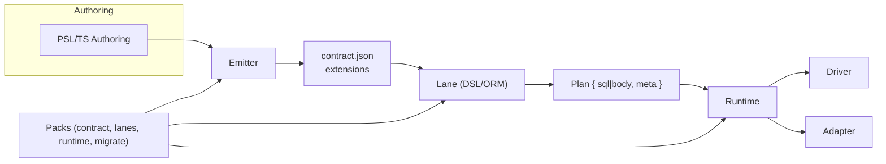

# Ecosystem Extensions & Packs

## Overview

Extensions and packs provide a disciplined way to add domain capabilities (for example, vector search or geospatial) without bloating core. Packs contribute deterministic data to the contract, type-safe query surfaces, codecs for values, migration operations, and optional guardrails. The contract stays code‑free and portable; packs supply the runtime and tooling code at the edges where it is needed.

Responsibilities:
- Encode extension data deterministically into `contract.extensions.<namespace>` during emission, with schemas and canonicalization
- Provide lane helpers/operators and deterministic lowerers gated by declared capabilities
- Supply codecs and optional guardrails at runtime as composable plugins
- Define migration operations with pre/post checks and clear idempotency

Non‑goals:
- Define every possible extension capability
- Ship a global registry service
- Allow arbitrary network access or repo cloning in hosted environments

### Architecture overview



## External contracts

Packs integrate at well‑defined boundaries. They consume core artifacts and produce lane/runtime/migration functionality in a way that preserves determinism and contract isolation.

### Consumes

- `contract.json` with `extensions.<namespace>` payloads and capabilities declared by packs
- Plan objects produced by any lane that may reference pack-provided types, operators, or annotations
- Migration edges that may reference pack-provided operations

### Produces

- Lane functions and lowerers bound to capability IDs
- Codecs for parameters and results
- Migration operations with pre/post checks
- Manifests declaring capability support and security policies for bundling and hosted preflight

## Model

Packs are modular and optionally provide slices for the authoring, lane, runtime, and migration phases. Each slice has a single responsibility and is governed by schemas and canonicalization rules where it touches the contract.

A pack is a TS/JS package that may provide any subset of four slices:

1. **PSL/contract slice (compile-time)**
   - PSL attributes, blocks, and validators that contribute deterministic data to `contract.extensions.<ns>`
   - Canonicalization rules so the emitted JSON is stable
   - Purely data producing, no runtime code required to read the resulting JSON

2. **Query-lane slice (build-time)**
   - Relational DSL builders or helpers and deterministic lowerers for their AST nodes
   - Capability IDs used to gate features at build time
   - No side effects or environment dependence

3. **Runtime slice (execute-time)**
   - Codecs for parameters/results and optional guardrails or lints
   - Registered by the application or by the runtime host

4. **Migration slice (plan/apply-time)**
   - Custom operations and their pre/post checks
   - Deterministic JSON op schema plus implementation code

**The data contract travels code-free** - any context that needs to build, lower, or execute features provided by a pack must have the relevant pack code present.

## Pack publishing and versioning

Extension packs follow a standardized publishing and versioning flow (see [ADR 112](../adrs/ADR%20112%20-%20Target%20Extension%20Packs.md)):

### Pack Structure
- **npm Package**: Packs are published as npm packages with `@prisma/pack-` prefix
- **Pure ESM**: Packs must be pure ESM modules with no CommonJS dependencies
- **Side-Effect Free**: Packs must be side-effect free at import time
- **Manifest Required**: Each pack must include a `packs/manifest.json` file

### Versioning Strategy
- **Semantic Versioning**: Packs follow semantic versioning (major.minor.patch)
- **Compatibility Matrix**: Packs declare compatibility with adapter versions
- **Deprecation Policy**: Packs provide migration paths for deprecated features
- **Breaking Changes**: Major version bumps for breaking changes

### Publishing Process
1. **Pack Development**: Develop pack with proper manifest and tests
2. **Conformance Testing**: Run conformance tests against target adapters
3. **Security Scanning**: Automated security scanning of pack code
4. **npm Publishing**: Publish to npm with proper metadata
5. **Registry Indexing**: Pack indexed in Prisma registry for discovery

## Pack anatomy

Packs are npm packages organized into clear slices corresponding to the compile-time, build-time, and execution phases:

### Directory structure

```
pack-postgres/
├── package.json                      # npm metadata
├── packs/
│   ├── manifest.json                # Capabilities, versions, integrity
│   ├── blocks/                       # Top-level block registration (see [ADR 126](../adrs/ADR%20126%20-%20PSL%20top-level%20block%20SPI.md))
│   │   ├── view.js                   # pg.view, pg.materializedView
│   │   ├── enumType.js               # pg.enumType
│   │   └── index.js                  # Exports and registration
│   ├── decorators/                   # Attribute/decorator registration (see [ADR 104](../adrs/ADR%20104%20-%20PSL%20extension%20namespacing%20&%20syntax.md))
│   │   ├── pgType.js                 # @pg.type(...)
│   │   ├── pgPredicate.js            # @@pg.predicate(...)
│   │   └── index.js
│   ├── operators.js                  # Function and operator registry (see [ADR 113](../adrs/ADR%20113%20-%20Extension%20function%20&%20operator%20registry.md))
│   ├── codecs.js                     # Branded types and encode/decode (see [ADR 114](../adrs/ADR%20114%20-%20Extension%20codecs%20&%20branded%20types.md))
│   ├── guardrails.js                 # Lint rules and budgets (see [ADR 115](../adrs/ADR%20115%20-%20Extension%20guardrails%20&%20EXPLAIN%20policies.md))
│   ├── migrations.js                 # Operations and pre/post checks (see [ADR 116](../adrs/ADR%20116%20-%20Extension-aware%20migration%20ops.md))
│   └── capabilities.json             # Declared capability keys (see [ADR 117](../adrs/ADR%20117%20-%20Extension%20capability%20keys.md))
├── src/
│   ├── contract/                     # PSL contract slice
│   │   ├── blocks/                   # Block parsers and validators
│   │   ├── decorators/               # Decorator validators
│   │   └── index.ts
│   ├── lanes/                        # Query lane slice
│   │   ├── operators/                # Function and operator lowerers
│   │   ├── ast-visitors.ts
│   │   └── index.ts
│   ├── runtime/                      # Runtime slice
│   │   ├── codecs/
│   │   ├── guardrails/
│   │   └── index.ts
│   ├── migrations/                   # Migration slice
│   │   ├── operations/               # Operation implementations
│   │   ├── checks/                   # Pre/post check implementations
│   │   └── index.ts
│   ├── index.ts                      # Main entry point
│   └── __tests__/                    # Integration tests
└── README.md                         # Pack documentation
```

### Slice Descriptions

**PSL Contract Slice** (`src/contract/`)
- Registers top-level blocks (views, enums, etc.) via the top-level block SPI (see [ADR 126](../adrs/ADR%20126%20-%20PSL%20top-level%20block%20SPI.md))
- Registers decorators/attributes (e.g., `@pg.type`, `@@pg.predicate`) (see [ADR 104](../adrs/ADR%20104%20-%20PSL%20extension%20namespacing%20&%20syntax.md))
- Provides JSON Schemas for validation
- Exports pure, side-effect-free parsers and validators
- No database access or file I/O

**Query Lane Slice** (`src/lanes/`)
- Registers functions and operators with signatures and lowerers
- Provides AST visitors for lowering pack-specific nodes
- Exports capability flags and their requirements
- All lowering is deterministic and testable

**Runtime Slice** (`src/runtime/`)
- Exports codecs for branded types (encode/decode)
- Implements guardrails and lint rules
- Provides optional runtime plugins for telemetry or policy enforcement
- Code is optional and only loaded if the application registers it

**Migration Slice** (`src/migrations/`)
- Exports migration operations (DDL, data tasks)
- Implements pre/post checks (see [ADR 044](../adrs/ADR%20044%20-%20Pre%20&%20post%20check%20vocabulary%20v1.md))
- Declares idempotency classification
- All operations are deterministic and reversible

### manifest.json Structure

```json
{
  "id": "postgres",
  "version": "15.0.0",
  "spiVersion": "1.0.0",
  "capabilities": {
    "postgres.view.base": true,
    "postgres.view.materialized": true,
    "postgres.view.refresh": true,
    "postgres.enumType.storage": true,
    "postgres.index.partial": true
  },
  "slices": {
    "contract": true,
    "lanes": true,
    "runtime": true,
    "migrate": true
  },
  "targets": {
    "postgres": {
      "minVersion": "12"
    }
  },
  "integrity": {
    "index.js": "sha256:abc123...",
    "codecs.js": "sha256:def456...",
    "operators.js": "sha256:ghi789..."
  },
  "policy": {
    "noNetwork": true,
    "noDynamicImport": true,
    "noWasm": true,
    "noShell": true
  }
}
```

### Pack Initialization

Packs export a factory function that the emitter calls at startup:

```typescript
// @prisma/pack-postgres/src/index.ts
import { registerBlocks } from './contract/blocks'
import { registerDecorators } from './contract/decorators'
import { registerOperators } from './lanes/operators'
import { registerCodecs } from './runtime/codecs'
import { registerMigrations } from './migrations'

export function registerPostgresPack(context: PackContext) {
  registerBlocks(context.blockRegistry)
  registerDecorators(context.attributeRegistry)
  registerOperators(context.operatorRegistry)
  registerCodecs(context.codecRegistry)
  registerMigrations(context.migrationRegistry)
}

// Emitter calls this automatically
export default { register: registerPostgresPack }
```

### Testing Anatomy

Each pack includes comprehensive tests:

```
src/__tests__/
├── contract/
│   ├── blocks.test.ts              # View/enum block parsing and emission
│   ├── decorators.test.ts          # Decorator validation
│   └── canonicalization.test.ts    # Extension data hashing
├── lanes/
│   ├── operators.test.ts           # Operator lowering and type inference
│   ├── lowering.golden.ts          # Golden tests for SQL output
│   └── capability-branching.test.ts
├── runtime/
│   ├── codecs.test.ts              # Encode/decode round-trip
│   └── guardrails.test.ts          # Lint rule application
├── migrations/
│   ├── operations.test.ts          # DDL and data ops
│   ├── idempotency.test.ts         # IF NOT EXISTS patterns
│   └── pre-post-checks.test.ts
└── integration.test.ts             # End-to-end workflows
```

## Function and operator registry

Extension packs populate a function and operator registry (see [ADR 113](../adrs/ADR%20113%20-%20Extension%20function%20&%20operator%20registry.md)):

### Registry assembly
- **Pack Registration**: Packs register functions and operators at load time
- **Signature Validation**: Function signatures validated against pack schemas
- **Type Inference**: Registry provides type inference for extension functions
- **Rendering Hooks**: Packs provide rendering hooks for adapter-specific SQL

### Registry integration
- **DSL Integration**: Registry integrates with query DSL for type-safe usage
- **Capability Gating**: Functions/operators gated by adapter capabilities
- **Plan Annotations**: Registry functions/operators included in Plan annotations
- **Error Handling**: Stable error codes for registry-related failures

## Codecs and branded types

Extension packs provide codecs and branded types (see [ADR 114](../adrs/ADR%20114%20-%20Extension%20codecs%20&%20branded%20types.md)):

### Codec interface
- **Encode/Decode**: Codecs provide bidirectional conversion between JS and DB formats
- **Validation**: Codecs validate extension values at runtime
- **Losslessness**: Codecs support configurable losslessness policies
- **Performance**: Codecs optimized for performance with caching

### Branded types
- **TypeScript Integration**: Branded types provide compile-time type safety
- **Runtime Validation**: Branded types validated at runtime
- **Extension Values**: Branded types prevent mixing incompatible extension values
- **Type Inference**: Branded types integrate with query DSL type inference

### Per‑column typeId decorations and pack type exports

Packs may enable explicit per‑column type selection by attaching a `typeId` in an extension decoration. The contract remains code‑free; the decoration references a namespaced identifier. Example:

```json
{
  "extensions": {
    "postgres": {
      "decorations": {
        "columns": [
          {
            "ref": { "kind": "column", "table": "public.user", "column": "createdAt" },
            "payload": { "typeId": "core/iso-datetime@1" }
          }
        ]
      }
    }
  }
}
```

Packs export TS types for codec IO mapping that the emitter references from `contract.d.ts`:

```ts
// @prisma-next/adapter-postgres/codec-types
export type CodecTypes = {
  readonly 'core/string@1': { readonly input: string; readonly output: string };
  readonly 'core/int@1': { readonly input: number; readonly output: number };
  readonly 'core/iso-datetime@1': { readonly input: Date | string; readonly output: string };
};
```

At emit time, only the IDs actually used by the contract are included in `contract.d.ts` via imports (types‑only). Runtime codec implementations are registered by the adapter/packs and validated at execution (see Architecture Overview and Query Lanes).

## Guardrails and EXPLAIN policies

Extension packs implement guardrails and EXPLAIN policies (see [ADR 115](../adrs/ADR%20115%20-%20Extension%20guardrails%20&%20EXPLAIN%20policies.md)):

### Guardrails implementation
- **Capability Gating**: Guardrails enforce capability requirements
- **Budget Enforcement**: Guardrails apply extension-specific budgets
- **Policy Rules**: Guardrails implement pack-specific policy rules
- **Error Reporting**: Guardrails provide clear error messages and remediation

### EXPLAIN policies
- **Cost Estimation**: Extension operators provide normalized cost estimates
- **Row Estimation**: Extension operators provide normalized row estimates
- **Execution Time**: Extension operators provide normalized execution time estimates
- **Resource Usage**: Extension operators report normalized resource usage

## Extension-aware migration operations

Extension packs provide migration operations (see [ADR 116](../adrs/ADR%20116%20-%20Extension-aware%20migration%20ops.md)):

### Migration operations
- **DDL Operations**: Extension-specific DDL operations (e.g., CREATE INDEX with extension options)
- **Data Operations**: Extension-specific data operations (e.g., vector index population)
- **Validation**: Pre/post checks for extension operations
- **Rollback**: Rollback strategies for extension operations

### Capability gating
- **Operation Requirements**: Operations declare required capabilities
- **Capability Checks**: Operations check capabilities before execution
- **Graceful Degradation**: Operations provide fallback behavior for missing capabilities
- **Error Handling**: Clear error messages for capability-related failures

## Capability key definitions

Extension packs define capability keys (see [ADR 117](../adrs/ADR%20117%20-%20Extension%20capability%20keys.md)):

### Capability schema
- **Namespace Rules**: Capability keys follow namespace rules and stability contract
- **Type Definitions**: Capability keys define types (boolean, string, object, array)
- **Documentation**: Capability keys include documentation and examples
- **Compatibility**: Capability keys maintain backward compatibility

### Reserved namespaces
- **Core Capabilities**: Core capabilities reserved and immutable
- **Extension Capabilities**: Extension capabilities prefixed by pack namespace
- **Reserved Names**: Reserved namespaces cannot be used by packs
- **Collision Prevention**: Namespace collision prevention and resolution

## Stability and governance (no core feature flags)

The system branches on declared capability keys, not on targets or adapters. Packs carry stability metadata and expose capability keys explicitly; runtimes discover capabilities at connect and validate against the contract’s declared requirements. The contract remains code‑free and isolates runtime configuration (adapter/driver/transport).

- **No core feature flags.** Unstable or experimental features are shipped as extension packs, not as toggles in core.
- **Stability metadata in packs.** Each capability declared by a pack carries a stability level `experimental | preview | stable` in the pack manifest. This stability is surfaced in `contract.extensions.<ns>` for auditability and policy.
- **Capability gating over flags.** Runtimes negotiate capabilities at connect; lanes and plugins branch on capabilities. Experimental features are not enabled implicitly—apps must install the pack and use its namespaced surface.
- **Default policy by environment.**
  - Development: allow experimental, emit warnings.
  - CI/Preflight: warn or error per repo policy.
  - Production: block experimental by default (overridable via explicit runtime policy config, not per-feature flags).
- **Diagnostics and drift.** The contract records pack usage and capabilities; `profileHash` changes when the capability set changes. Preflight and runtime verification catch mismatches deterministically.

### Manifest stability metadata

Packs declare capability stability in their manifest and the emitter includes stability in the contract for verification and policy:

```json
{
  "namespace": "pgvector",
  "version": "1.2.0",
  "capabilities": {
    "pgvector.ivfflat": { "stability": "stable" },
    "pgvector.hnsw": { "stability": "experimental" }
  }
}
```

### Lints and policies

- A built-in lint `experimental-capability-in-prod` errors when Plans use experimental capabilities in production.
- Policy can downgrade/upgrade levels per environment; see Runtime policy configuration.

## Bundle Inclusion Policy

Extension packs follow bundle inclusion policy (see [ADR 118](../adrs/ADR%20118%20-%20Bundle%20inclusion%20policy%20for%20packs.md)):

### Bundle Requirements
- **Pack Code**: Pack code included in bundles as ESM files
- **Manifest**: Pack manifests included in bundles for capability negotiation
- **Integrity**: Pack code integrity verified via SHA-256 hashes
- **Security**: Pack code runs under sandbox constraints

### Bundle Validation
- **Signature Verification**: Bundles verified via cryptographic signatures
- **Policy Compliance**: Bundles checked for policy compliance
- **Security Scanning**: Bundles scanned for security vulnerabilities
- **Execution Constraints**: Bundles enforce execution constraints

## Distribution modes

Two supported ways to make pack code available outside the local dev environment:

1. **Certified catalog mode**
   - Hosted platforms like PPg preinstall vetted pack versions (e.g. `@prisma/pack-pgvector@1.2.0`)
   - Your artifacts refer to packs by ID and version in a manifest
   - The host resolves from its catalog and verifies integrity

2. **Bring-your-own bundle mode**
   - CLI produces a deterministic preflight bundle containing:
     - `contract.json`, migration edges, and Plan diagnostics if needed
     - Pack code for the slices you used as ESM files
     - Pack manifests with capability IDs, versions, integrity digests, and security declarations
   - Hosted runner executes in a sandbox with no network, no dynamic imports, no shell, no WASM, and resource caps

Both modes yield the same outcomes and error taxonomy.

## Template-Tagged Literals

Extensions accept rich textual payloads via template-tagged string literals.

- Syntax: `<pack>[.<flavor>]` followed by a backtick string, no interpolation
- Core canonicalizes the body and routes it to the owning pack
- Packs validate and normalize, returning deterministic JSON to embed in the contract

Example:

```psl
pg.view MyView {
  definition: pg.sql`
    select u.id, count(p.id) as post_count
    from "User" u
    left join "Post" p on p.author_id = u.id
    group by u.id
  `
  materialized: true
}

@@index([status], where: pg.predicate`status <> 'archived'`)
```

Canonicalization rules and contract encoding are defined for packs; see [ADR 104](../adrs/ADR%20104%20-%20PSL%20extension%20namespacing%20&%20syntax.md), [ADR 105](../adrs/ADR%20105%20-%20Contract%20extension%20encoding.md), [ADR 106](../adrs/ADR%20106%20-%20Canonicalization%20for%20extensions.md) and [ADR 129](../adrs/ADR%20129%20-%20Template-Tagged%20Literals%20for%20Extensions.md) for details.

## Hub for extensions guidance

This document is the hub for all extension guidance across contract, lanes, runtime, migrate, and preflight.

- Pack anatomy: capabilities declared, contract `ext` schema it owns, optional codecs/functions/operators, optional migration ops and guardrails.
- Publishing and compatibility: versioning, namespaces, and semantic guarantees.
- Examples: PostGIS, PGVector, Citus distribution (capabilities, contract `ext`, operators, codecs, migration ops, guardrails).

Cross-references
- ADR 112 target extension packs
- ADR 113 operator registry
- ADR 114 codecs and branded types
- ADR 115 guardrails
- ADR 116 migration ops
- ADR 117 capability keys
 - ADR 118 bundle inclusion policy
 - ADR 129 template-tagged literals for extensions

## Capabilities and discovery

- Packs declare canonical capability keys in their manifest and at registration time
- Adapters and runtimes expose `supports(capabilityId)` and surface capability sets during connect
- Lanes and plugins branch on capabilities rather than target strings
- If a required capability is missing:
  - At build time, DSL compilation fails with a precise capability error
  - At run time, execution is blocked with a `ERR_CAPABILITY_MISSING` error
- See [ADR 065](../adrs/ADR%20065%20-%20Adapter%20capability%20schema%20&%20negotiation%20v1.md) for the capability schema and discovery

## Key flows

### Local authoring and execution

1. Developer installs a pack via npm or vendors it
2. Emitter reads PSL and invokes pack contract slice to produce deterministic JSON under `extensions.<ns>`
3. DSL uses pack lane slice to build AST nodes and lower to SQL when needed
4. Runtime registers pack codecs and optional lints
5. Plans execute with guardrails and decoding in place

### Hosted preflight

1. CI invokes CLI to create a preflight bundle
2. Bundle includes `contract.json`, migration edges, and either:
   - Catalog references for packs, or
   - Embedded pack code and manifests
3. The host validates signatures, integrity, and policy
4. The host runs preflight in a sandbox with no network and enforced limits
5. Results are returned with the same diagnostics schema used locally

## Public API

### Registration

- `registerPack({ id, version, capabilities, codecs, lowerers, ops })`
- `registerCodec(typeId, codec)`
- `registerLowerer(nodeKind, lowerer)`
- `registerOp(name, impl, { pre, post, idempotent, requiresTx })`

### Manifests

- `pack.manifest.json`
- `id`, `version`, `capabilities[]`
- `slices: { contract?: true, lane?: true, runtime?: true, migrate?: true }`
- `integrity: { file: sha256 }`
- `policy: { noNetwork: true, noDynamicImport: true, noWasm: true }`
- `targets: { postgres?: { minVersion: "14" } }`

### Errors

- `ERR_CAPABILITY_MISSING`, `ERR_LOWERING_UNSUPPORTED`, `ERR_CODEC_MISSING`, `ERR_PACK_POLICY_VIOLATION`
- Stable codes (see [ADR 027](../adrs/ADR%20027%20-%20Error%20envelope%20&%20stable%20codes.md)) and mapping (see [ADR 068](../adrs/ADR%20068%20-%20Error%20mapping%20to%20RuntimeError.md))

### Stability level

- Registration APIs stable once published
- Contract JSON remains code-free (see [ADR 010](../adrs/ADR%20010%20-%20Canonicalization%20Rules.md))

### Extensibility points

- Contract extensions namespace reserved per pack ID
- Codec registry (see [ADR 030](../adrs/ADR%20030%20-%20Result%20decoding%20&%20codecs%20registry.md))
- Lowering SPI (see [ADR 016](../adrs/ADR%20016%20-%20Adapter%20SPI%20for%20Lowering.md))
- Custom operations loaded (see [ADR 041](../adrs/ADR%20041%20-%20Custom%20operation%20loading%20via%20local%20packages%20+%20preflight%20bundles.md)) with the same sandbox rules
- Advisors can be delivered as packs that implement the advisor SPI and hook into preflight (see [ADR 101](../adrs/ADR%20101%20-%20Advisor%20framework%20and%20squash%20advisor%20as%20a%20pack.md))

## Performance & limits

- Contract emission must remain O(n) on schema size, independent of pack code size
- Lowering must be deterministic and linear in AST size
- Runtime codec and lint overhead must keep p95 impact under the runtime overhead budget
- Hosted sandboxes enforce CPU, memory, and wall clock limits per op

## Security and privacy

- Data contract contains no code and no secrets
- Hosted preflight forbids network, dynamic imports, shells, and WASM in pack code
- Artifacts and logs follow redaction policy (see [ADR 024](../adrs/ADR%20024%20-%20Telemetry%20schema%20&%20privacy.md) and [ADR 050](../adrs/ADR%20050%20-%20Redaction%20policy%20&%20sinks.md))
- Manifests enumerate integrity hashes for all shipped files

## Failure modes

- Missing pack code at build or run time → explicit capability error with remediation hint
- Version mismatch in hosted catalog mode → fail with `ERR_PACK_VERSION_UNAVAILABLE`
- Policy violation in bundle mode → reject with `ERR_PACK_POLICY_VIOLATION`
- Codec not found for a pack type at execution → block with `ERR_CODEC_MISSING`

## Open questions & risks

- Catalog governance for PPg scale and update cadence
- Compatibility matrix as packs evolve capabilities
- Testing strategy for cross-version lowering determinism and golden SQL

## Test strategy

- Golden tests for contract emission with pack extensions
- Golden SQL for lowering with capability flags toggled
- Conformance suite for codecs and operations (see [ADR 026](../adrs/ADR%20026%20-%20Conformance%20kit%20and%20levels.md))
- Bundle parity tests to assert local vs hosted outcomes match on the same artifacts
