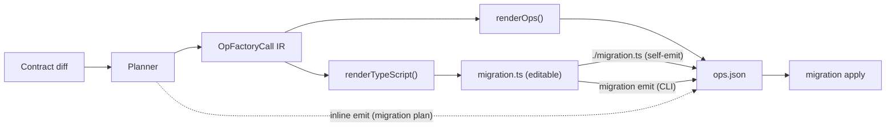
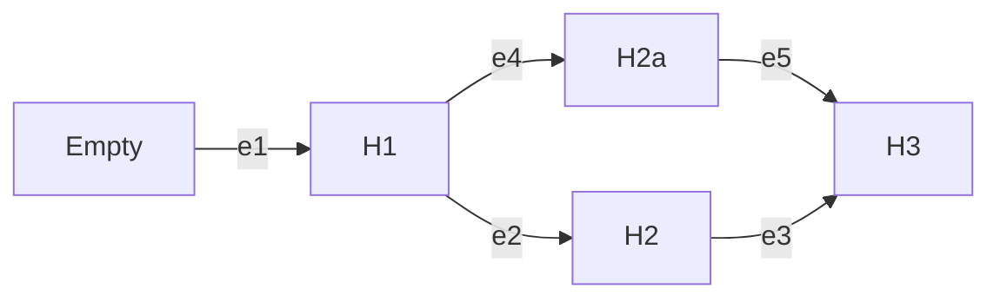

# Migration System

## Overview

The migration subsystem turns data contract changes into deterministic, verifiable state transitions in a database. Each migration is an edge from one contract state to another. Safety comes from explicit preconditions and postconditions, idempotent operations, and a verifiable contract marker in the database.

**Constitutional principle:** `ops.json` is the migration contract — the authoritative artifact that gets attested, hash-verified, and replayed by the runner. `migration.ts` is authoring sugar — a TypeScript file that the developer edits and that *emits* `ops.json` when evaluated. No TypeScript runs at apply time. See [ADR 192 — ops.json is the migration contract](../adrs/ADR%20192%20-%20ops.json%20is%20the%20migration%20contract.md).

The system is designed for tight feedback loops between authoring and verification. The planner makes it cheap to produce an edge from an origin contract to a destination contract. Pre- and post-operation checks make migrations self-verifying. When verification fails, errors direct agents toward concrete remedies — never "drop database" — and the graph model prevents typical catastrophic operations.


## Example

Consider adding a `user` collection to an empty MongoDB database. The planner computes a single edge from `H∅` to `H1` with one operation `createCollection(users, ...)`. The runner verifies the database marker equals `H∅`, acquires a lock (via CAS for MongoDB), applies the op with pre/post checks, and updates the marker to `H1`.


The migration directory on disk:

```
migrations/
  20260118T1205_add_users/
    migration.ts            # authoring surface — the developer edits this
    migration.json          # manifest: from/to hashes, migrationId
    ops.json                # the actual operations as JSON
    contract.json           # destination contract snapshot
    contract.d.ts           # TypeScript types for the contract
```

`migration apply` reads `migration.json` and `ops.json`. It never loads `migration.ts`.

References: [ADR 001 — Migrations as Edges](../adrs/ADR%20001%20-%20Migrations%20as%20Edges.md); [ADR 021 — Contract Marker Storage](../adrs/ADR%20021%20-%20Contract%20Marker%20Storage.md); [ADR 039 — Migration graph path resolution & integrity](../adrs/ADR%20039%20-%20Migration%20graph%20path%20resolution%20&%20integrity.md); [ADR 169 — On-disk migration persistence](../adrs/ADR%20169%20-%20On-disk%20migration%20persistence.md); [ADR 190 — CAS-based concurrency and migration state storage for MongoDB](../adrs/ADR%20190%20-%20CAS-based%20concurrency%20and%20migration%20state%20storage%20for%20MongoDB.md).


## Authoring Pipeline

The canonical pipeline from contract change to applied migration:



1. **Plan.** The planner diffs origin and destination contracts and produces an `OpFactoryCall[]` IR — a discriminated union of frozen AST classes, one per factory function. See [ADR 195 — Planner IR with two renderers](../adrs/ADR%20195%20-%20Planner%20IR%20with%20two%20renderers.md).

2. **Render.** The IR renders to a `PlannerProducedMigration` — a `Migration` subclass that also implements `MigrationPlanWithAuthoringSurface`. Two renderers consume the IR: one materializes runnable operations (`renderOps`), the other emits TypeScript source (`renderTypeScript`). The plan carries its own authoring surface; no separate scaffolding SPI is needed. See [ADR 194 — Plans carry their own authoring surface](../adrs/ADR%20194%20-%20Plans%20carry%20their%20own%20authoring%20surface.md).

3. **Scaffold.** The CLI calls `plan.renderTypeScript()` and writes the result to `migration.ts`. The destination contract is snapshotted into the migration directory so queries are typed against the schema at planning time. See [ADR 197 — Migration packages snapshot their own contract](../adrs/ADR%20197%20-%20Migration%20packages%20snapshot%20their%20own%20contract.md). Unfilled slots (data-transform bodies the planner can't derive) use `placeholder(slot)` — a `never`-returning function that throws a structured `PN-MIG-2001` error at emit time. See [ADR 200 — Placeholder utility for scaffolded migration slots](../adrs/ADR%20200%20-%20Placeholder%20utility%20for%20scaffolded%20migration%20slots.md).

4. **Edit.** The developer opens `migration.ts`, replaces placeholders with real queries, and iterates by running the file directly (`./migration.ts` or `node migration.ts`) thanks to the shebang and `Migration.run(...)`.

5. **Emit.** Three paths produce `ops.json` from `migration.ts`: (a) **inline emit** at the end of `migration plan`, which renders ops directly from the planner IR; (b) **self-emit** via `./migration.ts` (shebang) or `node migration.ts`, where `MongoMigration.run(...)` detects it is the main module and writes artifacts in-process; (c) **CLI emit** via `migration emit`, which dynamically imports `migration.ts` and drives emit through the target's `emit` capability. All three produce byte-identical `ops.json`. The framework then computes and persists the content-addressed `migrationId`. See [ADR 196 — In-process emit for class-flow targets](../adrs/ADR%20196%20-%20In-process%20emit%20for%20class-flow%20targets.md).

6. **Apply.** `migration apply` reads `ops.json` and `migration.json`, verifies the `migrationId` hash, and executes via the runner's three-phase loop — dispatching DDL through visitor SPIs and DML through the standard adapter+driver transport. See [ADR 198 — Runner decoupled from driver via visitor SPIs](../adrs/ADR%20198%20-%20Runner%20decoupled%20from%20driver%20via%20visitor%20SPIs.md).

Class-flow is the canonical authoring strategy. A transitional descriptor-flow coexists for Postgres until it adopts class-flow. See [ADR 193 — Class-flow as the canonical migration authoring strategy](../adrs/ADR%20193%20-%20Class-flow%20as%20the%20canonical%20migration%20authoring%20strategy.md) for the full pipeline, the deletion catalog of descriptor-flow symbols, and the transitional state.


## Model

### Edges, Node Tasks, and Marker

An edge is a state transition from one contract storage hash (`from`) to another (`to`). Each edge embeds the full `fromContract` and `toContract` IR, making migration directories self-contained. The contract marker is a singleton record in the database that stores the current `storageHash`; the runner compares it against the edge's `from` hash before apply. See [ADR 021 — Contract Marker Storage](../adrs/ADR%20021%20-%20Contract%20Marker%20Storage.md).

Edges on disk form a directed graph from the empty contract to the current one. The graph tolerates cycles (e.g., rollback migrations like C1→C2→C1) — the pathfinder uses BFS with visited-node tracking to select the shortest path. When multiple shortest paths exist, tie-breaking is deterministic (label priority → `createdAt` → `to` → `edgeId`). Named refs (`migrations/refs.json`) allow commands to target specific contract hashes for multi-environment workflows (e.g., staging at C2 while production stays at C1). See [ADR 039 — Migration graph path resolution & integrity](../adrs/ADR%20039%20-%20Migration%20graph%20path%20resolution%20&%20integrity.md) and [ADR 169 — On-disk migration persistence](../adrs/ADR%20169%20-%20On-disk%20migration%20persistence.md).



## Planner

The planner diffs two canonical contracts and produces an IR (intermediate representation) that can be rendered into both runnable operations and an editable TypeScript file.

### Planner IR

The planner produces `OpFactoryCall[]` — a discriminated union of frozen AST classes, one per migration factory function (`CreateIndexCall`, `DropIndexCall`, `CreateCollectionCall`, `DropCollectionCall`, `CollModCall`). Each call carries the factory name, arguments, `operationClass`, and `label`. A visitor interface provides exhaustive dispatch. See [ADR 195 — Planner IR with two renderers](../adrs/ADR%20195%20-%20Planner%20IR%20with%20two%20renderers.md).

Two renderers consume the IR:
- **Operation renderer** (`renderOps`): calls the factory functions to produce `MigrationPlanOperation[]` — runnable, serializable to `ops.json`.
- **TypeScript renderer** (`renderTypeScript`): produces a complete, runnable `migration.ts` file that imports and calls the same factories.

Planner-derived semantics (`operationClass`, `label`) ride on the IR because only the planner has the origin context needed for classification (e.g., whether a `collMod` is `widening` vs `destructive`). The renderers read these values; they don't re-derive them.

### Offline planning via contract-to-schema

`migration plan` is fully offline (no database connection). Each target's migrations capability provides `contractToSchema(contract, options): TSchema` that converts the "from" contract to that target's structural schema IR (`SqlSchemaIR` for Postgres, `MongoSchemaIR` for MongoDB), then feeds it into the target's planner. This reuses the same planner that `db init` and `db update` use — no second diff engine is required.

The conversion is intentionally lossy (for example drops runtime codec details), but the planner only needs structural information.

For Postgres the schema covers tables, columns, indexes, and the dependency IDs from active `frameworkComponents` (`databaseDependencies.init[].id`). For MongoDB the same role is played by collections, indexes, JSON Schema validators and collection options. See [ADR 169](../adrs/ADR%20169%20-%20On-disk%20migration%20persistence.md), [ADR 154](../adrs/ADR%20154%20-%20Component-owned%20database%20dependencies.md), and [ADR 187](../adrs/ADR%20187%20-%20MongoDB%20schema%20representation%20for%20migration%20diffing.md).

Planner hints come from the **authoring layer** (for example, PSL/TS annotations such as `@hint(was: "old_name")` or equivalent configuration), not from `contract.json` itself. The canonical contract IR stays planner-agnostic and hash-stable; it only encodes application expectations as described in the Data Contract subsystem.

Additive structure is covered by core operations: create table, add nullable column, add index/unique, add foreign key, set column default (SQL); create collection, create index, set validation (Mongo). Renames, drops, and other destructive changes require explicit hints and policies; the planner will fail fast without them. See [ADR 028 — Migration Structure & Operations](../adrs/ADR%20028%20-%20Migration%20Structure%20&%20Operations.md) and [ADR 161 — Explicit FK constraint and index configuration](../adrs/ADR%20161%20-%20Explicit%20foreign%20key%20constraint%20and%20index%20configuration.md).

## Authoring Surface

`migration.ts` is the user-editable authoring surface for a migration package. Class-flow is the canonical strategy; descriptor-flow is the legacy design being replaced. See [ADR 193 — Class-flow as the canonical migration authoring strategy](../adrs/ADR%20193%20-%20Class-flow%20as%20the%20canonical%20migration%20authoring%20strategy.md).

### Class-flow (canonical)

`migration.ts` is a class that extends `Migration` (a framework base class that `implements MigrationPlan`). The class overrides `get operations()` to return an array of migration operations, and `describe()` to return manifest metadata (`from`, `to` hashes). The plan *is* the class — no separate data structure.

```ts
#!/usr/bin/env -S node
import { createIndex, dataTransform } from '@prisma-next/target-mongo/migration'
import { MongoMigration } from '@prisma-next/family-mongo/migration'

class M extends MongoMigration {
  override describe() {
    return { from: 'sha256:abc', to: 'sha256:def' }
  }

  override get operations() {
    return [
      createIndex('users', [{ field: 'email', direction: 1 }], { unique: true }),
    ]
  }
}

export default M
MongoMigration.run(import.meta.url, M)
```

The file is itself runnable (shebang + `Migration.run(...)` at the bottom). Running it directly produces `ops.json` and `migration.json`. The `Migration.run(...)` side-effect is guarded to fire only when the file is the main module — when the CLI imports it, the guard doesn't fire. See [ADR 196 — In-process emit for class-flow targets](../adrs/ADR%20196%20-%20In-process%20emit%20for%20class-flow%20targets.md).

### Data transforms

Data transforms are migration operations that modify data alongside structural DDL. They use the same three-phase envelope as DDL operations (`precheck[]`, `run[]`, `postcheck[]`) but carry `operationClass: 'data'`. The `run` array contains `MongoQueryPlan` objects (aggregations, updateMany, etc.) instead of DDL commands.

Both DDL and data-transform checks share a unified shape: `{ description, source, filter, expect }`. DDL checks use inspection commands (`ListIndexesCommand`, `ListCollectionsCommand`) as the source; data-transform checks use `MongoQueryPlan` objects. Both are evaluated by the same `FilterEvaluator` path. See [ADR 188 — MongoDB migration operation model](../adrs/ADR%20188%20-%20MongoDB%20migration%20operation%20model.md) (amended for unified checks).

A `dataTransform` factory derives both precheck and postcheck from a single `check` configuration — the user specifies `{ source, filter?, expect? }` and the factory flips `expect` for the postcheck. This gives idempotency and verification from one check specification.

### Contract snapshot

When a migration is scaffolded (`migration plan` / `migration new`), `contract.json` and `contract.d.ts` are copied into the migration directory. This makes the migration self-contained — it doesn't break if the source schema evolves after the migration is written.

For complex data transforms that need queries typed against an intermediate schema state, the user can create additional contracts within the migration directory. See [ADR 197 — Migration packages snapshot their own contract](../adrs/ADR%20197%20-%20Migration%20packages%20snapshot%20their%20own%20contract.md).

### Placeholder safety

Scaffolded `dataTransform` operations use `placeholder(slot)` for slots the planner can't fill (e.g., `check.source` and `run`). `placeholder()` is a `never`-returning function that throws a structured `PN-MIG-2001` error when called at emit time. This makes the scaffold-then-emit handoff safe — evaluating an unfilled scaffold produces a precise diagnostic rather than silent nonsense. See [ADR 200 — Placeholder utility for scaffolded migration slots](../adrs/ADR%20200%20-%20Placeholder%20utility%20for%20scaffolded%20migration%20slots.md).


## Runner

### Responsibilities

The runner computes a path in the migration graph, acquires a lock, validates each edge against the marker, executes operations idempotently with postcondition checks, and updates the marker and ledger on success. This enables tight feedback loops: drift is detected before apply, safety is enforced during apply, and audit is written after apply.

### Decoupled from the driver

The runner depends on abstract visitor interfaces and a `MarkerOperations` interface — not on the concrete database driver (`Db`, `pg.Client`, etc.). Concrete executors stay in the adapter package; composition happens at the family descriptor. DDL commands dispatch via `command.accept(executor)`. DML execution (data transforms) goes through `Adapter.lower()` → `Driver.execute()` — the same transport used by runtime queries. See [ADR 198 — Runner decoupled from driver via visitor SPIs](../adrs/ADR%20198%20-%20Runner%20decoupled%20from%20driver%20via%20visitor%20SPIs.md).

### Three-phase execution

Each operation follows the same three-phase loop: evaluate prechecks → execute → evaluate postchecks. DDL and data-transform operations use the same loop; only the command dispatch differs. See [ADR 191 — Generic three-phase migration operation envelope](../adrs/ADR%20191%20-%20Generic%20three-phase%20migration%20operation%20envelope.md).

### Hash verification

Per [ADR 192 — Apply-time verification](../adrs/ADR%20192%20-%20ops.json%20is%20the%20migration%20contract.md), `migration apply` performs two checks before executing operations:

1. **On-disk consistency.** Recompute `migrationId` from the on-disk manifest + `ops.json`; compare against the stored `migrationId`. *(Architecturally required; not yet implemented.)*
2. **Emit-drift detection.** When `migration.ts` is present, re-emit in-memory and compare against `ops.json`. *(Architecturally required; not yet implemented.)*

### Advisory Locks and Concurrency

For Postgres, the runner uses `pg_advisory_lock` with deterministic keys to prevent concurrent applies. See [ADR 043 — Advisory lock domain & key strategy](../adrs/ADR%20043%20-%20Advisory%20lock%20domain%20&%20key%20strategy.md). For MongoDB, concurrency is handled via compare-and-swap (CAS) on the marker document. See [ADR 190 — CAS-based concurrency and migration state storage for MongoDB](../adrs/ADR%20190%20-%20CAS-based%20concurrency%20and%20migration%20state%20storage%20for%20MongoDB.md).

### Idempotency

Every operation declares its idempotency class with explicit pre/post invariants. Replays that find postconditions already satisfied are treated as already-applied and skipped; true conflicts halt with a structured error. Destructive changes require explicit guards. See [ADR 038 — Operation idempotency classification & enforcement](../adrs/ADR%20038%20-%20Operation%20idempotency%20classification%20&%20enforcement.md) and transactional DDL fallback in [ADR 037 — Transactional DDL Fallback](../adrs/ADR%20037%20-%20Transactional%20DDL%20Fallback.md).

### Runner Phases

1. Resolve: read marker; reconstruct graph; compute path
2. Preflight (optional): dry-run in shadow; emit report
3. Apply: lock; verify `from`; apply ops with three-phase loop; update marker and ledger
4. Report: emit telemetry and diagnostics


## File Layout

```
migrations/
  20260118T1205_add_users/
    migration.ts            # authoring surface — TypeScript the developer edits
    migration.json          # from/to hashes, migrationId, embedded contracts
    ops.json                # serialized operations (the contract)
    contract.json           # destination contract snapshot
    contract.d.ts           # TypeScript types for the contract
  20260119T0830_add_email_index/
    migration.ts
    migration.json
    ops.json
    contract.json
    contract.d.ts
  refs.json                 # named environment targets (e.g., staging, production)
```

The folder name is human-friendly; identity lives in `migration.json`. The optional `graph.index.json` is a lockfile-style cache and can be regenerated deterministically (see ADR 039). Most teams won't need it with squash-first hygiene (ADR 102).

### Graph-based ordering

Migrations form a directed graph (not necessarily acyclic) via their `from` / `to` edges. Cycles are valid — a rollback path like `C1 -> C2 -> C1` is a legal graph shape. Ordering is determined by BFS shortest-path traversal from a source hash to a target hash, with deterministic tie-breaking when multiple shortest paths exist (label priority → `createdAt` ascending → `to` lexicographic → `edgeId` lexicographic). The pathfinder uses visited-node tracking to terminate in cyclic graphs. Branch detection: when the set of reachable branch tips from the current marker contains more than one node and no explicit target is specified, the system reports `MIGRATION.AMBIGUOUS_TARGET` and requires explicit resolution. See [ADR 169 — On-disk migration persistence](../adrs/ADR%20169%20-%20On-disk%20migration%20persistence.md).

### Refs (environment targets)

Refs map logical environment names to contract hashes in `migrations/refs.json` (e.g., `{ "staging": "sha256:...", "production": "sha256:..." }`). They are version-controlled alongside migration artifacts. `migration apply --ref production` uses the ref hash as the target instead of the current contract. `migration status --ref staging` reports state relative to that ref. Refs are not mutated by migration commands — they are set by the developer or CI via `migration ref set/delete` to declare intent. See [ADR 169 — On-disk migration persistence](../adrs/ADR%20169%20-%20On-disk%20migration%20persistence.md).


## Edge Attestation and Migration Identity

Edited migrations must be content-addressed so tools and services can verify exactly what will run. Each edge includes a deterministic hash (`migrationId`), and may include a signature for provenance.

### Storage-only identity

`migrationId` is computed from `(strippedManifest, ops)` only. The canonicalized `fromContract`, `toContract`, and `hints` are excluded from the hash. This means non-storage contract changes (operation renames, docstring edits, codec metadata changes) don't invalidate the `migrationId` — only changes to the `from`/`to` storage hashes or the operations themselves do.

`strippedManifest` contains: `from`, `to`, `kind`, `labels`, `authorship?`, `createdAt`. These plus `ops` are the full input to the hash. The `from`/`to` strings carry the storage-projection commitment.

See [ADR 199 — Storage-only migration identity](../adrs/ADR%20199%20-%20Storage-only%20migration%20identity.md).

### Signatures

Optional signature: `signature = sign(edgeId, keyId)` attached under `migration.json.signature` for environments that require provenance (e.g., PPg). Does not alter ops or hashes; proves authorship/approval. Required by PPg, optional locally. See [ADR 051 — PPg preflight-as-a-service contract](../adrs/ADR%20051%20-%20PPg%20preflight-as-a-service%20contract.md).


## Operation Model

Each migration operation is a data envelope with three phases — `precheck[]`, `execute[]`, `postcheck[]`. The phases are composed from existing AST primitives (DDL commands, inspection commands, filter expressions for Mongo; SQL statements for Postgres) that serialize naturally to JSON. The envelope carries no behavior of its own; the semantic richness lives in the commands and expressions inside it.

### DDL operations

DDL operations carry commands like `CreateIndexCommand`, `CreateCollectionCommand`, etc. Checks use inspection commands (`ListIndexesCommand`, `ListCollectionsCommand`) as the source, with `MongoFilterExpr` for client-side filtering and `'exists' | 'notExists'` for expectation. See [ADR 188 — MongoDB migration operation model](../adrs/ADR%20188%20-%20MongoDB%20migration%20operation%20model.md).

### Data transform operations

Data transforms carry `operationClass: 'data'` and use `MongoQueryPlan` objects in the `run` array. Checks use the same `{ description, source, filter, expect }` shape as DDL checks, with `MongoQueryPlan` as the source type. Both are evaluated by the same `FilterEvaluator` path. DML commands execute through `Adapter.lower()` → `Driver.execute()` — the same transport as runtime queries.

### Serialization

All AST nodes are frozen plain-property objects. `JSON.stringify` produces the persisted format directly. Deserialization walks the JSON, matches `kind` discriminants, validates structure with arktype schemas, and reconstructs live class instances. See [ADR 188](../adrs/ADR%20188%20-%20MongoDB%20migration%20operation%20model.md) and [ADR 191 — Generic three-phase migration operation envelope](../adrs/ADR%20191%20-%20Generic%20three-phase%20migration%20operation%20envelope.md).


## Extensions and Capability-Gated Ops

Custom, namespaced operations extend core behavior. They are validated against pack schemas, gated by declared capabilities, and use the same pre/post and idempotency semantics. See [ADR 116 — Extension-aware migration ops](../adrs/ADR%20116%20-%20Extension-aware%20migration%20ops.md) and [ADR 037 — Transactional DDL Fallback](../adrs/ADR%20037%20-%20Transactional%20DDL%20Fallback.md).

### Component-owned database dependencies

Some components require database-side prerequisites (for example, enabling a Postgres extension). These prerequisites are modeled as **component-owned database dependencies**:

- Components declare `databaseDependencies.init` with:
  - dependency identity (`id`, `label`)
  - install operations (migration operations with pre/post checks)
- Callers pass the configured `frameworkComponents` list (target, adapter, extension packs) into planning and verification
- Planner and schema verification use structural dependency-ID presence checks against `schemaIR.dependencies` (`requiredId ∈ schemaIR.dependencies`)

This prevents targets and verifiers from inferring prerequisites from `contract.extensionPacks` or from using fuzzy matching between component IDs and database facts.

See [ADR 154 — Component-owned database dependencies](../adrs/ADR%20154%20-%20Component-owned%20database%20dependencies.md) for the current v1 compromise and accepted limitations.


## Migration Lifecycle

Migrations progress through clear states. This lifecycle separates attestation (content addressing) from execution (preflight/apply) and supports tight, fast feedback loops.

### States

- Draft: Edge exists; `migrationId` missing or stale after edits
- Attested: `migrationId` matches current content; optional signature present
- Preflighted: Shadow/PPg execution succeeded; proofs recorded in edge metadata
- Applied: Ledger shows edge applied; DB marker equals `to` hash

### Planner-led flow (default)

1. Edit contract
2. Plan: `prisma-next migration plan` → scaffolds `migration.ts`, runs inline emit to write `ops.json` and attest `migrationId` (Attested). If placeholders remain, the CLI reports `PN-MIG-2001` and the developer fills them in.
3. Emit (if needed): `prisma-next migration emit` → re-evaluates `migration.ts` and writes `ops.json` (Attested)
4. Preflight: `prisma-next preflight --mode=shadow` (or PPg bundle/submit) → proofs (Preflighted)
5. Commit/PR

### Custom flow (from scratch or heavy edits)

1. Scaffold: `prisma-next migration new [--from <hash> --to <hash>]` → scaffolds an empty `migration.ts` via `planner.emptyMigration(context)` (Draft)
2. Edit: author operations in `migration.ts` using factory functions and query builders (Draft)
3. Emit: `prisma-next migration emit <dir>` or run `./migration.ts` directly → writes `ops.json`, computes `migrationId` (Attested)
4. Preflight: `prisma-next preflight --mode=shadow` (Preflighted)
5. Commit/PR; CI may require a green preflight


## Helpful Commands (synopsis)

- `prisma-next migration plan [--from <hash>] --name <slug>` — diff contracts, scaffold `migration.ts`, emit `ops.json`, and attest (offline)
- `prisma-next migration new [--from <hash> --to <hash>] --name <slug>` — scaffold an empty `migration.ts` for hand-authoring
- `prisma-next migration emit [--dir <path>]` — evaluate `migration.ts` and write `ops.json` + attest `migrationId`
- `prisma-next migration apply --db <url> [--ref <name>]` — execute pending migrations against a live database
- `prisma-next migration status [--db <url>] [--ref <name>]` — show migration history and applied/pending status
- `prisma-next migration show [<dir-or-hash>]` — inspect a migration's operations and metadata
- `prisma-next migration ref set <name> <hash>` — set a named ref to a contract hash
- `prisma-next migration ref get <name>` — print the hash for a ref
- `prisma-next migration ref delete <name>` — remove a ref
- `prisma-next migration ref list` — list all refs
- `prisma-next migration sign <dir> --key <keyId>` — attach provenance signature without changing content (future)
- `prisma-next preflight --mode=shadow` — sandbox apply for validation (Preflighted, future)
- `prisma-next preflight bundle` / `submit` — hosted preflight with attested+signed edge (Preflighted, future)


## Database Schema

The system uses target-native storage for migration metadata:

### Postgres

Two tables per [ADR 021 — Contract Marker Storage](../adrs/ADR%20021%20-%20Contract%20Marker%20Storage.md):

**Contract Marker (singleton)**

- `prisma_contract.marker(id smallint primary key default 1, core_hash text not null, profile_hash text not null, contract_json jsonb, canonical_version int, updated_at timestamptz not null default now(), app_tag text, meta jsonb not null default '{}')`
- Always one row (`id=1`), updated via UPSERT
- Authoritative for `{ core_hash, profile_hash }`; JSON is optional and diagnostic

**Migration Ledger (historical record)**

An append-only table that records applied edges for audit and visualization. Not required for pathfinding or apply.

### MongoDB

A single `_prisma_migrations` collection with a marker document (`_id: "marker"`) and append-only ledger documents (`type: "ledger"`). Concurrency is handled via compare-and-swap (CAS) on the marker document using MongoDB's document-level atomicity. See [ADR 190 — CAS-based concurrency and migration state storage for MongoDB](../adrs/ADR%20190%20-%20CAS-based%20concurrency%20and%20migration%20state%20storage%20for%20MongoDB.md).


## Squash and Baselines

To keep migration graphs manageable, teams can squash ranges or create baselines. The default hygiene is "squash-first": suggest squashing when the graph grows or ages; verify that a squashed edge produces the same result; preserve originals as archived for history. See [ADR 101 — Advisors Framework](../adrs/ADR%20101%20-%20Advisors%20Framework.md) and [ADR 102 — Squash-first policy & squash advisor](../adrs/ADR%20102%20-%20Squash-first%20policy%20&%20squash%20advisor.md). Optional committed graph index guidance is in [ADR 039 — Migration graph path resolution & integrity](../adrs/ADR%20039%20-%20Migration%20graph%20path%20resolution%20&%20integrity.md).


## Preflight and Drift Detection

Before apply, preflight validates edges in a shadow environment, runs checks, and surfaces diagnostics suitable for CI and PPg. During apply, the runner enforces marker equality and idempotency. After apply, postconditions and the updated marker confirm success. Recovery strategies for different drift types are documented in [ADR 123 — Drift Detection, Recovery & Reconciliation](../adrs/ADR%20123%20-%20Drift%20Detection,%20Recovery%20&%20Reconciliation.md). Shadow preflight semantics are defined in [ADR 029 — Shadow DB preflight semantics](../adrs/ADR%20029%20-%20Shadow%20DB%20preflight%20semantics.md).

### Migration Bundle (hosted preflight)

Provide:

- bundle.json — `{ target, storageHash, profileHash, edges[] }`
- contract.json — canonical data contract
- edges/<edgeId>/migration.json — manifests with ops and checks; optional tasks modules
- graph.index.json (optional) — committed graph index when enabled
- digests — content hashes for integrity

See [ADR 051 — PPg preflight-as-a-service contract](../adrs/ADR%20051%20-%20PPg%20preflight-as-a-service%20contract.md).


## Initialization & Adoption

### `db init`

`prisma-next db init` is the **bootstrap** entrypoint for bringing a database under contract control using **additive-only** operations. It plans missing schema objects and component-owned database dependencies, applies them, then verifies the post-state and writes the contract marker (and a ledger entry via the target runner).

`db init` is intentionally conservative:

- If the database already has a marker that matches the destination contract, it succeeds as a noop.
- If the database has a marker that does **not** match the destination contract, it fails rather than overwriting an incompatible state. Use your migration workflow to reconcile the database and marker.

For CLI usage, output formats, and common failure modes, see the canonical command reference in [`@prisma-next/cli` README](../../../packages/1-framework/3-tooling/cli/README.md).

Greenfield, brownfield-conservative, and brownfield-incremental paths are supported. Baselines help bootstrap fresh environments; incremental adoption expands contract coverage safely over time. See [ADR 122 — Database Initialization & Adoption](../adrs/ADR%20122%20-%20Database%20Initialization%20&%20Adoption.md).

### `db update` (live reconciliation)

`prisma-next db update` is the **reconciliation** entrypoint. It introspects the live database schema, diffs it against the destination contract, and applies the resulting operations.

Unlike `migration apply`, which replays serialized edges, `db update` always works from a live introspection. Plans produced by the planner carry `origin: null` (no prior-state assertion). The runner treats this as "trust the planner": operations are always applied regardless of marker state. This ensures `db update` can recover from schema drift — for example, when a DBA manually drops a column, the planner detects the missing column and re-adds it even though the contract marker already matches the destination hash.

By contrast, `migration apply` constructs plans with `origin: { storageHash }` from the migration chain. When the marker matches the destination, the runner skips operations (the migration was already applied). This provides safe idempotent replays.

**NOT NULL columns without defaults.** The planner first resolves a temporary default by consulting codec hooks (for parameterized or extension-owned types) and then built-in fallbacks (`''` for text, `0` for integers, `false` for booleans, `'{}'` for arrays, `''::tsvector` for `tsvector`, length-aware zero literals for `bit(n)`, etc.). When a safe literal is available, it emits a reusable 2-step recipe: add the column with the temporary default, then drop the default immediately after. Existing rows permanently retain the backfilled value; future inserts must provide an explicit value. When no safe temporary default is known, the planner falls back to the empty-table precheck path.


## Multi-Service Namespacing

Per-service markers allow independent contracts within a single physical database (e.g., Postgres schemas). Each service has its own `prisma_contract.marker`; permissions and verification remain isolated. For engines without schemas, use separate databases. See namespacing notes in [ADR 021 — Contract Marker Storage](../adrs/ADR%20021%20-%20Contract%20Marker%20Storage.md).


## Profile-Only Updates (no DDL)

When the contract changes only capability declarations (no schema changes), the runner verifies the environment satisfies the contract and updates `profile_hash` in the marker without applying DDL. The `core_hash` remains the same. See the profile-only flow in the Data Contract subsystem and [ADR 021 — Contract Marker Storage](../adrs/ADR%20021%20-%20Contract%20Marker%20Storage.md).


## Error Taxonomy

Errors use the stable category/code envelope (see [ADR 027 — Error Envelope & Stable Codes](../adrs/ADR%20027%20-%20Error%20Envelope%20Stable%20Codes.md)):

**Runner errors** (`MIGRATION.*`):
- `MIGRATION.PRECHECK_FAILED` — preconditions not met
- `MIGRATION.POSTCHECK_FAILED` — postconditions not satisfied
- `MIGRATION.IDEMPOTENT_ALREADY_APPLIED` — safe no-op replay
- `MIGRATION.CONFLICT` — state differs in conflicting ways
- `MIGRATION.NON_TRANSACTIONAL_STEP` — requires compensation plan
- `MIGRATION.DIR_EXISTS` — migration directory already exists
- `MIGRATION.FILE_MISSING` — expected migration file (`migration.json` or `ops.json`) not found
- `MIGRATION.INVALID_JSON` — migration file contains malformed JSON
- `MIGRATION.INVALID_MANIFEST` — migration manifest missing required fields or has invalid values
- `MIGRATION.INVALID_NAME` — migration name/slug empty after sanitization
- `MIGRATION.SAME_SOURCE_AND_TARGET` — migration edge has `from === to` (graph invariant violation)
- `MIGRATION.AMBIGUOUS_TARGET` — multiple branch tips in migration graph (diverged branches)

**Authoring errors** (`PN-MIG-*`):
- `PN-MIG-2001` — unfilled placeholder in scaffolded migration
- `PN-MIG-2002` — `migration.ts` not found
- `PN-MIG-2003` — invalid default export (not a `Migration` subclass)
- `PN-MIG-2004` — `Migration.operations` is not an array
- `PN-MIG-2010` — plan does not support TypeScript authoring surface
- `PN-MIG-2011` — target has incomplete migration capabilities

**Infrastructure errors:**
- `CONTRACT.MARKER_MISSING` — DB not stamped with contract marker
- `CONTRACT.MARKER_MISMATCH` — DB marker hash differs from app


## Policy Knobs (CI/org)

- Require hash verification in all preflight runs; optionally require a valid signature
- Require PPg hosted preflight before promotion to staging/production
- Reject parallel edges (same `from`/`to`, different `edgeId`) unless a policy label is present
- Enforce advisory locks and idempotency class constraints per adapter


## Notes and Guardrails

- Any edit to `ops` changes `migrationId`; run `migration emit` to re-attest. Non-storage contract edits do not change `migrationId`. See [ADR 199](../adrs/ADR%20199%20-%20Storage-only%20migration%20identity.md).
- Preflight proofs should persist adapter profile, check outcomes, and timings; hosted runs enforce no-network/no-WASM constraints
- Runner halts if DB marker != `from`; after apply, it updates the marker atomically
