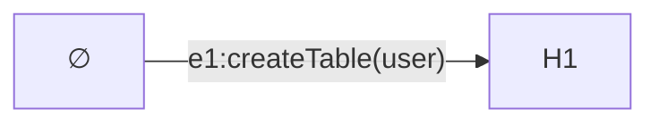
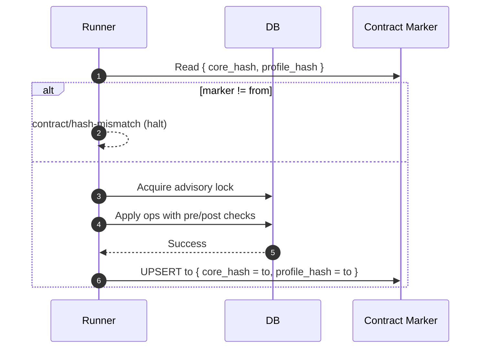
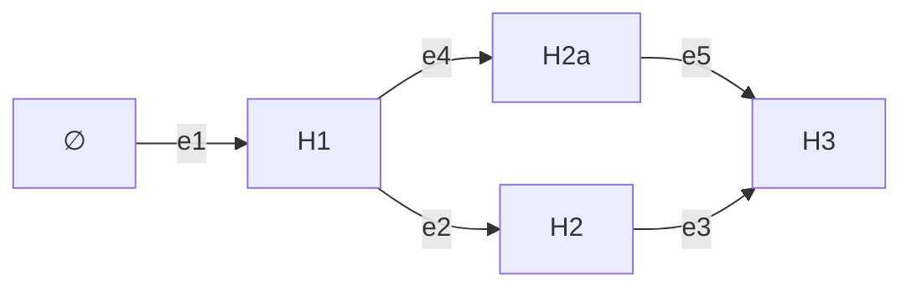

# Migration System

## Overview

The migration subsystem turns data contract changes into deterministic, verifiable state transitions in a database. Each migration is an edge from one contract state to another. Safety comes from explicit preconditions and postconditions, idempotent operations, and a verifiable contract marker in the database.

The system is designed for tight feedback loops between authoring and verification. The planner makes it cheap to produce an edge from an origin contract to a destination contract. Pre- and post-operation checks make migrations self‑verifying. When verification fails, errors direct agents toward concrete remedies—never "drop database"—and the DAG model prevents typical catastrophic operations.


## Example

Consider adding a `user` table to an empty database. The planner computes a single edge from `H∅` to `H1` with one operation `createTable(user, ...)`. The runner verifies the database marker equals `H∅`, acquires a lock, applies the op with pre/post checks, and updates the marker to `H1`.



Minimal edge (excerpt):

```json
{
  "id": "2025-10-18T1205_add-users-table",
  "fromCoreHash": "sha256:empty",
  "toCoreHash": "sha256:h1",
  "fromProfileHash": "sha256:pg-profile",
  "toProfileHash": "sha256:pg-profile",
  "ops": [
    {
      "op": "createTable",
      "table": "user",
      "pre": [{ "check": "tableNotExists", "table": "user" }],
      "post": [{ "check": "tableExists", "table": "user" }]
    }
  ]
}
```

Sequence at apply time:



References: [ADR 001 — Migrations as Edges](../adrs/ADR%20001%20-%20Migrations%20as%20Edges.md); [ADR 021 — Contract Marker Storage](../adrs/ADR%20021%20-%20Contract%20Marker%20Storage.md); [ADR 039 — DAG path resolution & integrity](../adrs/ADR%20039%20-%20DAG%20path%20resolution%20&%20integrity.md).

## Model

### Edges, Node Tasks, and Marker

An edge is a state transition from `fromCoreHash` to `toCoreHash` and carries the contract-pinned capability hashes `fromProfileHash` and `toProfileHash` as well. Node tasks may accompany an edge for data backfills or validations with their own pre/post checks. The contract marker is a singleton row in the database that stores the current `{ core_hash, profile_hash }`; the runner compares it against the edge’s `from*` before apply. See [ADR 021 — Contract Marker Storage](../adrs/ADR%20021%20-%20Contract%20Marker%20Storage.md).

Edges on disk form a DAG from the empty contract to the current one. The runner finds a path from the DB’s marker to the desired hash and applies edges in order. See [ADR 039 — DAG path resolution & integrity](../adrs/ADR%20039%20-%20DAG%20path%20resolution%20&%20integrity.md).



## Planner

The planner diffs two canonical contracts and emits an edge with operations plus pre/post conditions. Additive structure is covered by core operations: create table, add nullable column, add index/unique, add foreign key, set column default. Renames, drops, and other destructive changes require explicit hints and policies; the planner will fail fast without them. See [ADR 028 — Migration Structure & Operations](../adrs/ADR%20028%20-%20Migration%20Structure%20&%20Operations.md) and the pre/post vocabulary in [ADR 044 — Pre & post check vocabulary v1](../adrs/ADR%20044%20-%20Pre%20&%20post%20check%20vocabulary%20v1.md).

Planner hints come from the **authoring layer** (for example, PSL/TS annotations such as `@hint(was: "old_name")` or equivalent configuration), not from `contract.json` itself. The canonical contract IR stays planner‑agnostic and hash‑stable; it only encodes application expectations as described in the Data Contract subsystem.

The planner records which hints were consumed and the chosen planning strategy in the edge metadata for reproducibility. This keeps planning decisions inspectable by humans and agents without polluting the canonical contract.

## Runner

### Responsibilities

The runner computes a path in the migration DAG, acquires an advisory lock, validates each edge against the marker, executes operations idempotently with postcondition checks, and updates the marker and ledger on success. This enables tight feedback loops: drift is detected before apply, safety is enforced during apply, and audit is written after apply.

### Advisory Locks

The runner uses target-native advisory locks with deterministic keys to prevent concurrent applies (e.g., Postgres `pg_advisory_lock`). See [ADR 043 — Advisory lock domain & key strategy](../adrs/ADR%20043%20-%20Advisory%20lock%20domain%20&%20key%20strategy.md). Locks are reentrant per session and released on commit or connection close.

### Idempotency

Every operation declares its idempotency class with explicit pre/post invariants. Replays that find postconditions already satisfied are treated as already-applied and skipped; true conflicts halt with a structured error. Destructive changes require explicit guards. See [ADR 038 — Operation idempotency classification & enforcement](../adrs/ADR%20038%20-%20Operation%20idempotency%20classification%20&%20enforcement.md) and transactional DDL fallback in [ADR 037 — Transactional DDL Fallback](../adrs/ADR%20037%20-%20Transactional%20DDL%20Fallback.md).

## Database Schema

The system uses two tables with different purposes, per [ADR 021 — Contract Marker Storage](../adrs/ADR%20021%20-%20Contract%20Marker%20Storage.md):

### Contract Marker (singleton)

- `prisma_contract.marker(id smallint primary key default 1, core_hash text not null, profile_hash text not null, contract_json jsonb, canonical_version int, updated_at timestamptz not null default now(), app_tag text, meta jsonb not null default '{}')`
- Always one row (`id=1`), updated via UPSERT
- Authoritative for `{ core_hash, profile_hash }`; JSON is optional and diagnostic

UPSERT pattern:

```sql
insert into prisma_contract.marker (id, core_hash, profile_hash)
values (1, 'sha256:abc123', 'sha256:pg-profile')
on conflict (id) do update set
  core_hash = excluded.core_hash,
  profile_hash = excluded.profile_hash,
  updated_at = now();
```

### Migration Ledger (historical record)

An append-only table that records applied edges for audit and visualization. Not required for pathfinding or apply.

## Squash and Baselines

To keep DAGs manageable, teams can squash ranges or create baselines. The default hygiene is “squash-first”: suggest squashing when the DAG grows or ages; verify that a squashed edge produces the same result; preserve originals as archived for history. See [ADR 101 — Advisors Framework](../adrs/ADR%20101%20-%20Advisors%20Framework.md) and [ADR 102 — Squash-first policy & squash advisor](../adrs/ADR%20102%20-%20Squash-first%20policy%20&%20squash%20advisor.md). Optional committed graph index guidance is in [ADR 039 — DAG path resolution & integrity](../adrs/ADR%20039%20-%20DAG%20path%20resolution%20&%20integrity.md).

## Preflight and Drift Detection

Before apply, preflight validates edges in a shadow environment, runs checks, and surfaces diagnostics suitable for CI and PPg. During apply, the runner enforces marker equality and idempotency. After apply, postconditions and the updated marker confirm success. Recovery strategies for different drift types are documented in [ADR 123 — Drift Detection, Recovery & Reconciliation](../adrs/ADR%20123%20-%20Drift%20Detection,%20Recovery%20&%20Reconciliation.md). Shadow preflight semantics are defined in [ADR 029 — Shadow DB preflight semantics](../adrs/ADR%20029%20-%20Shadow%20DB%20preflight%20semantics.md).

## File Layout

```
migrations/
  2025-10-18T1205_add-users-table/
    migration.json            # from/to hashes, ops, checks, hints
    tasks.pre.ts              # optional node tasks
    tasks.post.ts             # optional node tasks
  2025-10-19T0830_add-email-index/
    migration.json
  graph.index.json            # optional performance cache
```

The folder name is human-friendly; identity lives in `migration.json`. The optional `graph.index.json` is a lockfile-style cache and can be regenerated deterministically (see ADR 039). Most teams won’t need it with squash-first hygiene (ADR 102).

## Operation Spec (shape)

Edges are JSON with stable headers, optional `fromContract`/`toContract` excerpts, a list of `ops` with pre/post checks, optional tasks, and metadata. The example above shows the shape; full vocabulary and checks are specified in [ADR 028 — Migration Structure & Operations](../adrs/ADR%20028%20-%20Migration%20Structure%20&%20Operations.md) and [ADR 044 — Pre & post check vocabulary v1](../adrs/ADR%20044%20-%20Pre%20&%20post%20check%20vocabulary%20v1.md).

## Extensions and Capability-Gated Ops

Custom, namespaced operations extend core behavior. They are validated against pack schemas, gated by declared capabilities, and use the same pre/post and idempotency semantics. See [ADR 116 — Extension-aware migration ops](../adrs/ADR%20116%20-%20Extension-aware%20migration%20ops.md), [ADR 044 — Pre & post check vocabulary v1](../adrs/ADR%20044%20-%20Pre%20&%20post%20check%20vocabulary%20v1.md), and [ADR 037 — Transactional DDL Fallback](../adrs/ADR%20037%20-%20Transactional%20DDL%20Fallback.md).

### Component-owned database dependencies

Some components require database-side prerequisites (for example, enabling a Postgres extension). These prerequisites are modeled as **component-owned database dependencies**:

- Components declare `databaseDependencies.init` with:
  - install operations (migration operations with pre/post checks)
  - a pure verification hook evaluated against schema IR (no DB I/O)
- Callers pass the configured `frameworkComponents` list (target, adapter, extension packs) into planning and verification
- Planners verify each dependency against the schema IR before emitting install operations

This prevents targets and verifiers from inferring prerequisites from `contract.extensionPacks` or from using fuzzy matching between component IDs and database facts.

See [ADR 154 — Component-owned database dependencies](../adrs/ADR%20154%20-%20Component-owned%20database%20dependencies.md).

## Op Resolution Pipeline

This section summarizes how a serialized operation is resolved to an executor and applied safely. The pipeline is identical for core and extension ops; extension ops add a pack lookup and capability gate.

1. Pre-checks: Evaluate op `pre` checks from [ADR 044](../adrs/ADR%20044%20-%20Pre%20&%20post%20check%20vocabulary%20v1.md). Fail fast on violations.
2. Capability gate: Verify adapter and (for extension ops) the pack declare the required capability keys. Fail with `adapter/capability-missing` on mismatch.
3. Executor selection:
   - Core ops are executed by the target adapter’s built-in runners.
   - Extension ops (`kind: "ext.op"`) are resolved by `extId` to a registered pack that provides the op runner (see [ADR 116](../adrs/ADR%20116%20-%20Extension-aware%20migration%20ops.md)).
4. Transactional apply: Run within a transaction when supported or as bounded groups per [ADR 037](../adrs/ADR%20037%20-%20Transactional%20DDL%20Fallback.md).
5. Post-checks: Evaluate `post` checks to assert the target state.
6. Idempotency outcome: Map results to idempotency class per [ADR 038](../adrs/ADR%20038%20-%20Operation%20idempotency%20classification%20&%20enforcement.md). Already-satisfied postconditions are treated as applied.

Deterministic naming and canonicalized JSON ensure reproducible behavior and hashing (see [ADR 010](../adrs/ADR%20010%20-%20Canonicalization%20Rules.md), [ADR 009](../adrs/ADR%20009%20-%20Deterministic%20naming.md), and [ADR 106](../adrs/ADR%20106%20-%20Canonicalization%20for%20extensions.md)).

## Edge Attestation (hash and optional signature)

Edited migrations must be content-addressed so tools and services can verify exactly what will run. Each edge includes a deterministic hash, and may include a signature for provenance.

- Edge hash: `edgeId = sha256(canonicalize(migration.json without edgeId/signature) + canonicalize(ops.json) + canonicalize(fromContract) + canonicalize(toContract))` (see [ADR 028](../adrs/ADR%20028%20-%20Migration%20Structure%20&%20Operations.md)).
- Optional signature: `signature = sign(edgeId, keyId)` attached under `migration.json.signature` for environments that require provenance (e.g., PPg).
- Verification:
  - Local/shadow preflight recomputes `edgeId` and, with `--strict`, requires it to match; signature optional by policy.
  - PPg hosted preflight requires a verified `edgeId` and a valid signature in the submitted bundle (see [ADR 051](../adrs/ADR%20051%20-%20PPg%20preflight-as-a-service%20contract.md)).

This attestation cleanly separates intent (contract `from`/`to`) from implementation (the exact ops), enabling safe customization of migrations while preserving determinism.

## Runner Phases

1. Resolve: read marker; reconstruct graph; compute path
2. Preflight (optional): dry-run in shadow; emit report
3. Apply: lock; verify `from*`; run tasks.pre; apply ops with pre/post; run tasks.post; update marker and ledger
4. Report: emit telemetry and diagnostics

## Migration Lifecycle

Migrations progress through clear states. This lifecycle separates attestation (content addressing) from execution (preflight/apply) and supports tight, fast feedback loops.

### States

- Draft: Edge exists; `edgeId` missing or stale after edits
- Attested: `edgeId` matches current content; optional signature present
- Preflighted: Shadow/PPg execution succeeded; proofs recorded in edge metadata
- Applied: Ledger shows edge applied; DB marker equals `toCoreHash`

### Planner-led flow (default)

1. Edit contract
2. Plan: `prisma-next migration plan` → writes `migration.json`/`ops.json` (Attested)
3. Preflight: `prisma-next preflight --mode=shadow` (or PPg bundle/submit) → proofs (Preflighted)
4. Commit/PR

### Custom flow (from scratch or heavy edits)

1. Scaffold: `prisma-next migration new [--from <hash> --to <hash>]` (Draft)
2. Edit: modify `ops.json`, `migration.json` (Draft)
3. Verify (attest only): `prisma-next migration verify <dir> [--sign --key <keyId>]` → computes `edgeId`, optional signature (Attested)
4. Preflight: `prisma-next preflight --mode=shadow --verify-edge` (Preflighted)
5. Final tweak without run: `prisma-next migration verify <dir>` (Attested)
6. Commit/PR; CI may require a green preflight

### Verify vs Sign

- Verify (attest): Recompute canonical edge hash (`edgeId`) from `migration.json`/`ops.json` and referenced contracts; update `edgeId`; optionally validate existing signature. No DB access.
- Sign (provenance): Produce `{ keyId, value } = sign(edgeId, keyId)` and attach as `signature`. Does not alter ops or hashes; proves authorship/approval. Required by PPg, optional locally.

Preflight `--verify-edge` runs verify before sandboxing. Hosted preflight requires both a valid `edgeId` and signature.

## Helpful Commands (synopsis)

- `prisma-next migration plan [--from <hash> --to <hash>]` — diff contracts and write an attested edge
- `prisma-next migration new [--from <hash> --to <hash>]` — scaffold an empty edge (Draft)
- `prisma-next migration verify <dir> [--sign --key <keyId>]` — compute `edgeId`, validate signature (if present), optionally sign (Attested)
- `prisma-next migration sign <dir> --key <keyId>` — attach provenance signature without changing content
- `prisma-next preflight --mode=shadow --verify-edge` — verify then sandbox apply (Preflighted)
- `prisma-next preflight bundle` / `submit` — hosted preflight with attested+signed edge (Preflighted)

## Policy Knobs (CI/org)

- Require `--verify-edge` in all preflight runs; optionally require a valid signature
- Require PPg hosted preflight before promotion to staging/production
- Reject parallel edges (same `from`/`to`, different `edgeId`) unless a policy label is present
- Enforce advisory locks and idempotency class constraints per adapter

## Notes and Guardrails

- Any edit to `ops`, checks, or referenced contracts changes `edgeId`; run `migration verify` to update deterministically
- Preflight proofs should persist adapter profile, check outcomes, and timings; hosted runs enforce no-network/no-WASM constraints
- Runner halts if DB marker != `from`; after apply, it writes `{ core_hash = to, profile_hash }` atomically

## Initialization & Adoption

### `db init`

`prisma-next db init` is the **bootstrap** entrypoint for bringing a database under contract control using **additive-only** operations. It plans missing schema objects and component-owned database dependencies, applies them, then verifies the post-state and writes the contract marker (and a ledger entry via the target runner).

`db init` is intentionally conservative:

- If the database already has a marker that matches the destination contract, it succeeds as a noop.
- If the database has a marker that does **not** match the destination contract, it fails rather than overwriting an incompatible state. Use your migration workflow to reconcile the database and marker.

For CLI usage, output formats, and common failure modes, see the canonical command reference in [`@prisma-next/cli` README](../../../packages/1-framework/3-tooling/cli/README.md).

Greenfield, brownfield-conservative, and brownfield-incremental paths are supported. Baselines help bootstrap fresh environments; incremental adoption expands contract coverage safely over time. See [ADR 122 — Database Initialization & Adoption](../adrs/ADR%20122%20-%20Database%20Initialization%20&%20Adoption.md).

## Multi-Service Namespacing

Per-service markers allow independent contracts within a single physical database (e.g., Postgres schemas). Each service has its own `prisma_contract.marker`; permissions and verification remain isolated. For engines without schemas, use separate databases. See namespacing notes in [ADR 021 — Contract Marker Storage](../adrs/ADR%20021%20-%20Contract%20Marker%20Storage.md).

## Profile‑Only Updates (no DDL)

When the contract changes only capability declarations (no schema changes), the runner verifies the environment satisfies the contract and updates `profile_hash` in the marker without applying DDL. The `core_hash` remains the same. See the profile-only flow in the Data Contract subsystem and [ADR 021 — Contract Marker Storage](../adrs/ADR%20021%20-%20Contract%20Marker%20Storage.md).

## Error Taxonomy

Errors use the stable category/code envelope (see [ADR 027 — Error Envelope & Stable Codes](../adrs/ADR%20027%20-%20Error%20Envelope%20Stable%20Codes.md)):

- contract/hash-mismatch
- contract/marker-missing
- adapter/transaction-unsupported
- adapter/capability-missing
- precondition/failed
- postcondition/failed
- lock/acquire-failed
- op/unsupported
- task/error

## Preflight in CI and PPg

Shadow databases or EXPLAIN-only modes answer “Will this migration do what I expect?” Reports include path, edges, checks, timings, and violations. The hosted preflight bundle format is defined in [ADR 051 — PPg preflight-as-a-service contract](../adrs/ADR%20051%20-%20PPg%20preflight-as-a-service%20contract.md).

### Migration Bundle (hosted preflight)

Provide:

- bundle.json — `{ target, coreHash, profileHash, edges[] }`
- contract.json — canonical data contract
- edges/<edgeId>/migration.json — manifests with ops and checks; optional tasks modules
- graph.index.json (optional) — committed DAG index when enabled
- digests — content hashes for integrity


