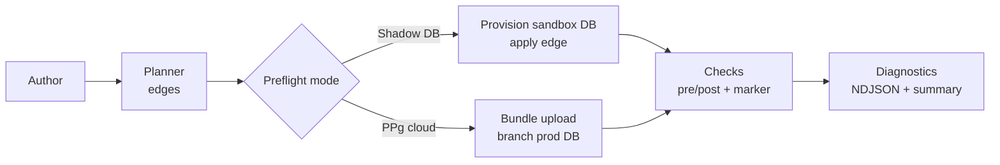

# Preflight (Migrations) & CI Integration

Preflight is the operation of checking whether a proposed migration will have the intended effect on a target database. It verifies contract edges (from `from.storageHash` → `to.storageHash`) by applying them in a sandboxed environment and asserting preconditions, postconditions, and marker writes. This aligns with our architecture goals: explicit, deterministic artifacts and tight feedback loops that surface actionable issues for humans and agents before any production change.

**Responsibilities:**
- Accept a migration edge `{ from, to, ops, pre, post }` (see [ADR 028 — Migration Structure & Operations](../adrs/ADR%20028%20-%20Migration%20Structure%20%26%20Operations.md))
- Apply the edge in a sandbox environment and verify pre/post checks
- Validate capability parity against the contract’s profile
- Write and verify the marker `{ storageHash, profileHash }` (see [ADR 021 — Contract Marker Storage](../adrs/ADR%20021%20-%20Contract%20Marker%20Storage.md))
- Emit deterministic diagnostics suitable for CI and agents

**Non‑goals:** query plan analysis (covered elsewhere), production execution, or long‑lived environment provisioning.

### Terminology

- **Edge:** Deterministic migration artifact `{ from, to, ops, pre, post }`
- **Marker:** Database record of `{ storageHash, profileHash }`
- **Preflight modes:** Shadow DB (local/dev CI) and PPg cloud preflight service (hosted)

### Diagram — Preflight paths



## Shadow DB Preflight (developer workflow)

Shadow preflight is the default developer and CI workflow for teams that do not use PPg or use a different engine (e.g., MySQL). It runs locally or in CI with a database connection you provide.

### Requirements

- A connection string with privileges to create and drop a shadow database, or an explicit shadow database URL
- Access to run DDL statements required by the migration ops
- Optional: deterministic seed data if your pre/post checks depend on content

### Flow

1. Provision an empty sandbox matching the target engine/version
2. Verify capability parity against the contract’s `profileHash`
3. Apply the edge’s operations to reach `to.storageHash`
4. Evaluate pre/post checks and any policy gates
5. Write the contract marker to `{ storageHash: to.storageHash, profileHash }` and verify it
6. Emit diagnostics and tear down the sandbox

Shadow mode provides the highest confidence you can achieve locally without using real production data.

### Trade‑offs and privacy

- Requires DDL privileges and orchestration of ephemeral databases
- Slightly slower than static checks, but deterministic and reproducible
- Uses synthetic or developer-provided seed data; no production data is required or accessed

## PPg Cloud Preflight (hosted)

PPg’s hosted preflight service runs your migration edge remotely without executing your application code. To achieve that, you send a signed bundle with the minimal artifacts needed to evaluate the edge under strict security and privacy policies.

### Bundle strategy and constraints

Bundles contain:
- `contract.json` (`to.storageHash`, `profileHash`)
- Edge definitions and node tasks
- Pack manifests and, when required, pack code
- A bundle manifest with integrity hashes and policy constraints

Security constraints (see [ADR 118 — Bundle inclusion policy for packs](../adrs/ADR%20118%20-%20Bundle%20inclusion%20policy%20for%20packs.md)):
- No network egress, no WASM loading, no dynamic imports; side‑effect free at import
- Signed bundles for production, with resource limits (time, memory, CPU)

### Advantages

- Branch a copy of the production database (or a realistic subset) and run the migration on representative, redacted data (see [ADR 050 — Preflight redaction policy](../adrs/ADR%20050%20-%20Preflight%20redaction%20policy.md))
- Service‑side capability parity checks using the contract’s `profileHash`
- Consistent, audited environment for promotion gates (see [ADR 051 — PPg preflight-as-a-service contract](../adrs/ADR%20051%20-%20PPg%20preflight-as-a-service%20contract.md))

### Flow

1. Build and sign the bundle
2. Upload to PPg preflight service
3. PPg provisions a branch from the production DB (or a policy‑conformant dataset)
4. Apply the edge to reach `to.storageHash`
5. Evaluate pre/post checks and policy gates; write/verify marker
6. Emit diagnostics and retain the branch per retention policy

## Workflows we optimize

- **Developer loop:** plan a migration, run Shadow preflight, iterate until green
- **CI loop:** on a branch with a new migration, run preflight; prefer PPg when you want to test on realistic data
- **Promotion gates:** require a green PPg preflight before applying to staging/production
- **Hotfix rehearsal:** verify roll‑forward (and optional rollback/roll‑forward) sequences in a branch
- **Data‑heavy rehearsal:** run edges against a sample‑based or branched dataset to validate long‑running tasks

## Inputs, integrity, and determinism

**Inputs:** `contract.json` for the target (`to.storageHash`, `profileHash`), the current marker (`from`), and the edge ops with pre/post checks.

**Integrity:** hash alignment checks between artifacts, signed bundles for PPg, idempotent application semantics.

**Determinism:** identical inputs yield identical outcomes (timestamps aside). Diagnostics follow a stable schema for agents and CI.

## Diagnostics schema

Preflight emits newline‑delimited JSON (NDJSON) events and a summary JSON file. Events focus on migration milestones: `edge.apply`, `check.pre`, `check.post`, `marker.write`, and `outcome`.

### Example summary

```json
{
  "status": "pass",
  "edge": { "from": "sha256:ab12…", "to": "sha256:cd34…" },
  "checks": { "pre": { "errors": 0 }, "post": { "errors": 0 } },
  "marker": { "storageHash": "sha256:cd34…", "profileHash": "pg/default@1" },
  "mode": "shadow",
  "sandbox": { "created": true, "durationMs": 1832 }
}
```

### Example event

```json
{
  "type": "edge.apply",
  "status": "ok",
  "edgeId": "5e2f1c…",
  "from": "sha256:ab12…",
  "to": "sha256:cd34…",
  "ops": 12,
  "pre": { "errors": 0 },
  "post": { "errors": 0 },
  "marker": { "written": true }
}
```

Privacy defaults redact sensitive identifiers in CI outputs per [ADR 050](../adrs/ADR%20050%20-%20Preflight%20redaction%20policy.md).

## CLI and configuration

```bash
# Shadow DB preflight
prisma-next preflight \
  --mode=shadow \
  --shadow-url=postgres://... \
  --out=.artifacts/preflight \
  --timeoutMs=120000

# PPg cloud preflight (bundle then submit)
prisma-next preflight bundle --out=./preflight.bundle
prisma-next preflight submit --bundle=./preflight.bundle --out=.artifacts/preflight
```

Options include shadow connection URL, time budgets, policy levels, and output paths. Exit codes are stable: `0` pass, `1` failed checks, `2` infrastructure error, `3` policy violation.


## Open questions

- Result payload size limits for diagnostics in large migrations
- Minimal fixtures API for deterministic content‑dependent checks in shadow
- Policies for PPg branch retention and data sampling strategies
