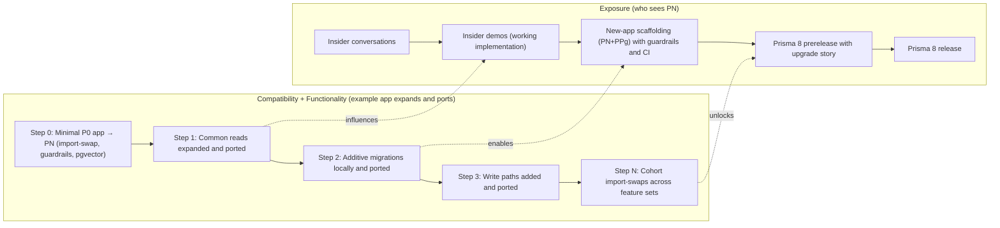

## Prisma Postgres polish today; Prisma Next de-risked in 2 weeks as the path to Prisma 8

This document proposes a focused two‑week spike that proves Prisma Next as the foundation for Prisma 8 while keeping Prisma Postgres momentum through targeted polish. It is intentionally pragmatic: we will show early, tangible value, protect near‑term commitments, and retain the ability to change course if the signal is not strong enough.

### Goals & Constraints

- Prisma Next will be Prisma 8, not a separate product
- There will be a smooth upgrade path from Prisma 7 to Prisma 8
- Deliver value early and often, not wait for the Prisma 8 launch
- We can back out of this at any point and return the Prisma ORM

### Executive summary
We are asking for approval to run a focused two‑week spike that de‑risks Prisma Next (PN) as the foundation of Prisma 8, while we continue Prisma Postgres (PPg) momentum with targeted polish. At the end of the spike, we will demonstrate a seamless upgrade path via a compatibility layer, visible safety and coaching value through guardrails, and extensibility by integrating `pgvector`. We will do this without disrupting near‑term Prisma ORM (P0) commitments.

### Decisions requested
- Approve a two‑week full‑team spike for the Terminal team, with a one‑person rotating on‑call for Prisma 7 bug fixes and `init` polish
- After the spike, the Terminal team returns to near‑term P0 priorities (Vector, DX, bugs). Prisma Next work continues led by Will with a dedicated hire and selective Terminal support
- Align the narrative to present PN as Prisma 8 foundations. This is a continuation, not a pivot, in both internal and external communications
- De‑prioritize non‑essential P0 initiatives for the next two to three months to focus on Vector, DX, and PN milestones
- Grant permission to engage two to three design partners or insiders under NDA for validation

### Why now
The current ORM codebase limits the polished, PPg‑integrated experience we want to deliver. Prisma Next’s contract and plan model unlocks that experience. The agent era also requires verifiability and guidance by default. PN provides a clear contract, structured plans, and runtime guardrails with actionable feedback. We need fast, tangible proof to align investment and maintain credibility with users and investors.

### Why a spike
We need a short, time‑boxed spike to answer the highest‑risk questions quickly and let us gauge the effort involved in subsequent steps of the plan. The spike allows us to:

- Prove the upgrade path with a real example application, so we can evaluate user‑visible friction rather than speculate
- Quantify technical cost in core areas (compatibility layer, plan model, runtime plugins) and establish baseline performance and overhead
- Validate the agent value proposition by demonstrating guardrails that block unsafe queries and provide actionable fixes
- Align the narrative around “Prisma 8 foundations” with a concrete demo, which strengthens internal and investor confidence
- Create objective exit criteria and a go/no‑go decision point that minimizes sunk cost if the signal is weak
- Produce better delivery estimates informed by an implemented baseline rather than abstract planning

### Two‑week spike — scope and exit criteria
The spike focuses on the query plane, runtime guardrails, and extensibility. We will deliberately de‑emphasize the migration plane, and we will not build PPg preflight as a service during this period.

Exit criteria for the spike are as follows:
- Seamless upgrade demo. We will run a simple Prisma ORM example app on PN via a compatibility layer with zero query edits
- Extensibility. We will add a `pgvector` pack (codec and operator) and use it in the demo without touching the core
- Safety and coaching value. PN will block an unbounded read and explain the fix. We will show this side‑by‑side with P0 and Drizzle, where they do not block. We will include an agent‑readable hint that explains how to correct the query

Items out of scope for the spike include PPg server‑side preflight, a rename/drop planner, and a migration escape hatch.

### Risk management
We have designed this plan to manage the specific risks leadership raised.

- Near‑term P0 delivery. We will protect Prisma 7 bug fixes and `init` polish via a rotating on‑call role. Vector work pauses only during the spike and resumes immediately afterward
- User retention and upgrade friction. A compatibility layer will enable an import‑swap upgrade for the demo app. We will generate compatible model types from the contract. A raw SQL escape hatch remains planned post‑spike
- Time to value within six to eight months. We will show visible demos in two weeks, follow quickly with new‑app scaffolding, and validate value with insiders while compatibility expands
- Investor perception and pivot fatigue. We will maintain a continuity message: “Prisma 8 foundations,” with contract‑first safety, compatible upgrades, and PPg as an amplifier

### Two‑axis plan (how we progress and deliver value)

To make progress visible and valuable, we will track the work on two axes.

#### Axis 1 — Compatibility and functionality (example‑app driven)
We will begin with a minimal Prisma ORM (P0) example app and prove we can port it to PN with an import‑swap. At each step, we will expand the example app’s feature set and prove we can port that expanded app to PN. Functionality and compatibility advance together to move along this axis.

Illustrative progression:
- Step 0. Minimal P0 example app → PN via a compatibility layer (zero query edits), with guardrails and `pgvector`
- Step 1. Expand common read paths (select/include nesting, filters, order/limit) and port
- Step 2. Add additive migrations locally and port
- Step 3. Add write paths for the example app and port
- Step 4. Add selected preview features used by cohorts and port
- Step N. Cohorts of PPg + P0 apps import‑swap with no query edits across their feature sets

This axis is intentionally not date‑bound. We will choose expansions that maximize cohort coverage and visible value.

#### Axis 2 — Exposure (who sees PN and when)
As capability and compatibility grow, we will deliberately widen the audience.

Illustrative progression:
- Conversations with insiders to validate direction and value framing
- Insider demos with a working implementation (compatibility demo app, guardrails, and `pgvector`)
- New‑app scaffolding for PN + PPg (CRUD + vector) with guardrails and CI checks
- Prisma 8 prerelease to our userbase with a documented upgrade story
- Prisma 8 release (or similar) once defined cohorts can switch with low friction

This axis is also not date‑bound. We will tune what we build to accelerate progress on either axis, deliver early value, and adjust based on feedback.

#### Two‑axis diagram

### Value delivery checkpoints (what users get)
We will make progress visible through checkpoints that deliver user‑facing value.

- T+2 weeks — Can port an example app. We can import‑swap a minimal Prisma ORM app to PN via a compatibility layer with zero query edits. Guardrails block unsafe queries. `pgvector` is available. This gives internal teams and insiders immediate safety and extensibility gains
- T+6–8 weeks — Can scaffold a new app. Developers can create new PN + PPg apps (CRUD + vector) with a no‑generate developer experience, guardrails on by default, and CI checks. This lets early adopters start new projects on PN confidently
- T+10–12 weeks — Cohort A can port. Defined PPg + P0 cohorts switch via import‑swap with no query edits across common read paths, with additive migrations locally. Design partners upgrade and report workflow and safety improvements
- T+12–16 weeks — Broader cohorts can port. The compatibility surface expands, migration coverage increases, and public trials begin. Adoption widens with documented upgrade playbooks
- T+12–20 weeks — External adapters. An external author adds a new SQL database target via the adapter SPI and conformance kit. A Mongo target is initiated by an external author (ideally the Mongo team) using the document‑family adapter path. The ecosystem accelerates without changes to core
- Prisma 8 GA — Most PPg + P0 users can port. There is a documented upgrade path, stable guardrails and packs, and a Prisma 8 announcement. This provides a broad, low‑friction upgrade with clear benefits

### Success metrics for the spike
- Seamless upgrade demo: 0 query edits to run the example app via the compat layer
- Extensibility: `pgvector` pack installed and used without core changes
- Safety/coach: PN blocks unbounded read and provides a clear, agent‑consumable fix; P0/Drizzle comparison captured

### Resourcing plan
- Spike (weeks 0–2): Entire Terminal team, minus 1 rotating on‑call for Prisma 7 bug fixes/`init` polish; pause Vector temporarily
- Post‑spike (weeks 3+):
  - Terminal team: resume Vector, DX, bug fixes; provide selective PN support
  - PN core: led by Will with a dedicated engineer (hire) to deepen compatibility and deliver new‑app scaffolding
  - De‑prioritize non‑essential P0 initiatives for 2–3 months to keep both tracks on schedule

### Narrative and positioning
We will communicate continuity: “Prisma 8 foundations” — contract‑first, verifiable plans, guardrails on by default, compatibility preserved, and PPg as the amplifier (with preflight later). For investors, this is a controlled evolution that improves safety and productivity, not a reset. We will show visible proof in two weeks and a clear graduation path after that.

### Expected outcomes and safeguards
We will deliver value often. Each step on the compatibility and functionality axis ships a tangible capability, such as porting the example app, scaffolding a new app, or expanding cohort coverage. If progress extends beyond six months, we will not spin our wheels; the exposure axis ensures continual learning and visible wins, and every compatibility increment is user‑visible. We can back out safely at any point if prototypes or early releases do not show user value or if technical cost is too high. Finally, we will improve estimates progressively. The spike establishes a baseline, and each checkpoint sharpens timelines and informs scope.

### Q&A (anticipated)
- Why not just polish P0? The codebase limits integrated PPg experiences; PN unlocks them while P0 polish continues via the on‑call and immediate post‑spike refocus
- Is this a pivot? It’s an evolution to Prisma 8 foundations with continuity: compatible upgrade and stronger PPg integration
- When can users try it? Insiders shortly after the spike; public “new‑app on PN” with scaffolding and guardrails; broader upgrade as compatibility expands

### Bonus Points

- Create a Prisma Next plugin which advises users how to convert queries on the compatibility layer into Prisma Next queries, which can be implemented by an agent
- Create a Drizzle compatibility layer in the same vein as the Prisma ORM compatibility layer, making it easy for users to switch to Prisma Next
