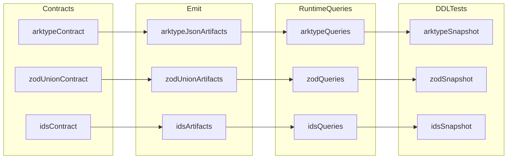

# Demo 2025-02-18

Prisma Next example package for three isolated scenarios:

- strict JSON typing with `arktype`
- strict JSON typing with `zod` discriminated unions (`_tag` literals)
- generated IDs via `@prisma-next/ids` (`nanoid` + `ulid`) with explicit override using `uniku`

## Responsibilities

- Demonstrate separate contracts and emitted artifacts per scenario.
- Show SQL queries against each scenario's tables.
- Show DDL SQL snapshot tests that are generated from each contract.
- Keep each scenario on an independent PostgreSQL database URL.

## Scenario layout

- `prisma/arktype-json/contract.ts` + `src/arktype-json/*`
- `prisma/zod-discriminated-union/contract.ts` + `src/zod-discriminated-union/*`
- `prisma/ids-generators/contract.ts` + `src/ids-generators/*`

Each scenario keeps all contract artifacts together under `prisma/<scenario>/`:

- `contract.ts` (source)
- `contract.json` (emitted)
- `contract.d.ts` (emitted)

## Dependencies

- Uses:
  - `@prisma-next/sql-contract-ts` for contract builders
  - `@prisma-next/adapter-postgres` and `@prisma-next/target-postgres` for Postgres types/target
  - `@prisma-next/postgres` for runtime
  - `@prisma-next/ids` for generated ID specs
  - `arktype` and `zod` for Standard Schema-compatible JSON typing
- Used by:
  - This is a standalone example package (no downstream package dependency contract).

## Architecture



## Setup

1. Set one base admin connection URL in `.env`:

```bash
BASE_DATABASE_URL=postgres://<user>:<password>@db.prisma.io:5432/postgres?sslmode=require
```

2. Create the three databases and print derived URLs:

```bash
pnpm db:create
```

3. Copy the output URLs into `.env`:

```bash
DATABASE_URL_ARKTYPE_JSON=...
DATABASE_URL_ZOD_UNION=...
DATABASE_URL_IDS=...
```

4. Emit all contracts:

```bash
pnpm emit
```

5. Initialize all three databases from their contracts:

```bash
pnpm db:init
```

## Commands

- `pnpm dev` - runs Vite with auto-emit for all three contract configs
- `pnpm emit` - emits all contracts
- `pnpm db:init` - initializes all three databases from their contracts
- `pnpm db:sign` - updates contract marker in all databases (run after modifying a contract)
- `pnpm emit:arktype` / `pnpm emit:zod` / `pnpm emit:ids` - emit one scenario
- `pnpm demo:arktype-json` - runs JSON + arktype scenario with Bun
- `pnpm demo:zod-discriminated-union` - runs JSON discriminated union scenario with Bun
- `pnpm demo:id-generators` - runs ID generators scenario with Bun
- `pnpm test` - runs DDL snapshot tests
- `pnpm typecheck` - TypeScript check
- `pnpm lint` - Biome check

## Live demo scripts (Bun)

Run one scenario at a time:

```bash
bun src/demo-arktype-json.ts
bun src/demo-zod-discriminated-union.ts
bun src/demo-id-generators.ts
```

Required environment variables by script:

- `demo-arktype-json.ts` uses `DATABASE_URL_ARKTYPE_JSON`
- `demo-zod-discriminated-union.ts` uses `DATABASE_URL_ZOD_UNION`
- `demo-id-generators.ts` uses `DATABASE_URL_IDS`

## Related docs

- [Architecture Overview](../../docs/Architecture%20Overview.md)
- [Testing Guide](../../docs/Testing%20Guide.md)
