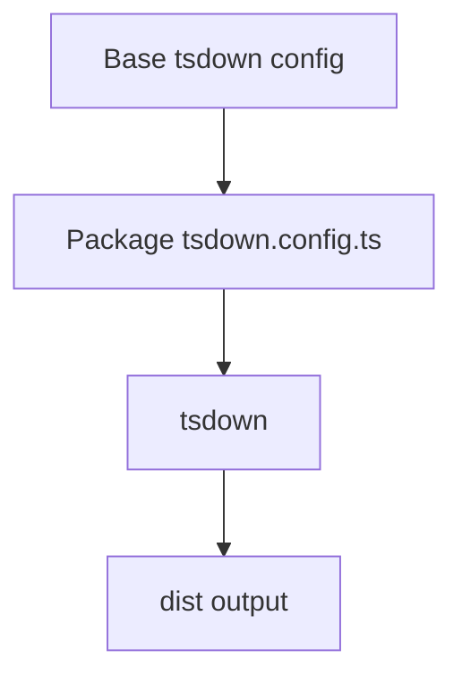

# @prisma-next/tsdown

Shared tsdown configuration helpers used across the monorepo to keep build setup consistent and fast to update.

We ship `esm` only by default. Bundle target is inferred from your package. Output goes to `dist`. We ship DTS files and DTS maps too - so "Go To Definition" jumps to the source files.

## Responsibilities

- **Base config**: Centralized `tsdown` options applied across packages
- **Exports alignment**: Normalizes export paths so package `exports` stay consistent
- **DX helpers**: Convenience `defineConfig` wrapper for simple configs

## Dependencies

- `tsdown` for bundling
- `typescript` for typechecking
- `@prisma-next/tsconfig` for shared TS config base

## Architecture



## Related Docs

- `docs/Architecture Overview.md`
- `docs/onboarding/Conventions.md`

## Prerequisites

Your package needs to have:

1. `tsconfig.prod.json` - a TypeScript configuration file specific for bundling.

2. `package.json#engines.node` - `tsdown` infers the bundling target based on this value. e.g. `{ "engines": { "node": ">=20" } }`

3. `"tsdown": "catalog:"` in your packages `devDependencies`.

4. `"build": "tsdown"` in your `package.json#scripts`.

5. `"src"` and `"dist"` in your `package.json#files`.

## Usage

Add `@prisma-next/tsdown` as a workspace devDependency in your package's `package.json`:

```bash
pnpm add -D --workspace @prisma-next/tsdown
```

Or add it manually to `package.json`:

```json
{
  "devDependencies": {
    "@prisma-next/tsdown": "workspace:*"
  }
}
```

### Extending the Base Configuration

For convenience, we provide a drop-in replacement for `defineConfig` that you can import and use in your `tsdown.config.ts` file:

```ts
import { defineConfig } from '@prisma-next/tsdown'

export default defineConfig({
  entry: ['src/index.ts', 'src/stuff.ts'],
})
```

Alternatively, you can import and use the base configuration object directly:

```ts
import { baseConfig } from '@prisma-next/tsdown'
import { defineConfig } from 'tsdown'

export default defineConfig({
  ...baseConfig,
  entry: ['src/index.ts', 'src/stuff.ts'],
})
```

### Migration from tsup

`tsup` is no longer actively maintained. Migrate a monorepo package by uninstalling `tsup` - `pnpm uninstall tsup`.

Rename `tsup.config.ts` to `tsdown.config.ts` - keep only `entry` property - should probably also transform it into an array of values.

Replace `package.json#scripts.build` value with `"tsdown"`.

Run `pnpm build` at least once for `package.json#exports` and similar to be generated. Don't forget to push those changes!
