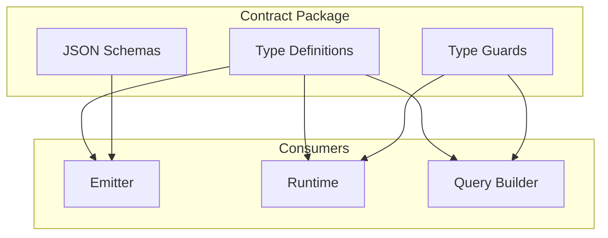

# @prisma-next/contract

Core contract types, framework component descriptors, and JSON schemas for Prisma Next.

## Overview

This package provides the foundational type definitions for Prisma Next, including:
- **Data contracts**: The canonical description of an application's data model and storage layout
- **Framework component descriptors**: Base interfaces for the modular component system (families, targets, adapters, drivers, extensions)
- **JSON Schemas**: Validation schemas for contract files

## Responsibilities

- **Core Contract Types**: Defines framework-level contract types (`ContractBase`, `Source`, `FamilyInstance`) that are shared across all target families
- **Framework Component Model**: Provides base descriptor interfaces (`FamilyDescriptor`, `TargetDescriptor`, `AdapterDescriptor`, `DriverDescriptor`, `ExtensionDescriptor`) and identity instance bases (`FamilyInstance`, `TargetInstance`, `AdapterInstance`, `DriverInstance`, `ExtensionInstance`) that plane-specific types extend
- **Document Family Types**: Provides TypeScript types for document target family contracts (`DocumentContract`)
- **Shared Column Defaults**: Defines `ColumnDefault` for db-agnostic defaults (literal and function) reused across family contracts and authoring builders
- **JSON Schema Validation**: Provides JSON Schemas for validating contract structure in IDEs and tooling
- **Type Guards**: Provides runtime type guards for narrowing contract types (`isDocumentContract`)
- **Emitter Types**: Defines emitter SPI types (`TargetFamilyHook`, `ValidationContext`, `TypesImportSpec`) that are shared between emitter and control plane

The contract supports document target families:
- **Document**: For document databases (MongoDB, Firestore, etc.)

## Package Contents

- **TypeScript Types**: Type definitions for `DocumentContract`, `ContractMarkerRecord`, and related types
- **Emitter Types**: SPI types for emitter hooks (`TargetFamilyHook`, `ValidationContext`, `TypesImportSpec`)
- **JSON Schemas**: Schema definitions for validating `contract.json` files in IDEs and tooling
  - `data-contract-document-v1.json` (Document family)

## Usage

### TypeScript Types

Import contract types in your TypeScript code:

```typescript
import type {
  ContractMarkerRecord,
  DocumentContract,
  TargetFamilyHook,
  TypesImportSpec,
  ValidationContext,
} from '@prisma-next/contract/types';
import { isDocumentContract } from '@prisma-next/contract/types';

// Use type guards to narrow the contract type
function processContract(contract: DocumentContract) {
  if (isDocumentContract(contract)) {
    // contract is DocumentContract
    console.log(contract.storage.document.collections);
  }
}

// Use ContractMarkerRecord for database marker operations
function processMarker(marker: ContractMarkerRecord) {
  console.log(marker.coreHash, marker.profileHash);
}

// Use emitter types for implementing family hooks
const myFamilyHook: TargetFamilyHook = {
  id: 'my-family',
  validateTypes: (ir, ctx: ValidationContext) => {
    // Validation logic
  },
  validateStructure: (ir) => {
    // Structure validation
  },
  generateContractTypes: (ir, codecTypeImports: TypesImportSpec[], operationTypeImports: TypesImportSpec[]) => {
    // Type generation
    return '// Generated types...';
  },
};
```

### Framework Component Model

Import base descriptor and instance interfaces to define or type-check framework components:

```typescript
import type {
  // Descriptors
  ComponentDescriptor,
  FamilyDescriptor,
  TargetDescriptor,
  AdapterDescriptor,
  DriverDescriptor,
  ExtensionDescriptor,
  // Instances
  FamilyInstance,
  TargetInstance,
  AdapterInstance,
  DriverInstance,
  ExtensionInstance,
} from '@prisma-next/contract/framework-components';

// Component descriptors share common properties
interface MyDescriptor extends ComponentDescriptor<'custom'> {
  readonly customField: string;
}

// Use FamilyDescriptor for family components
const sqlFamily: FamilyDescriptor<'sql'> = {
  kind: 'family',
  id: 'sql',
  familyId: 'sql',
  version: '0.0.1',
};

// Use TargetDescriptor for target components
const postgresTarget: TargetDescriptor<'sql', 'postgres'> = {
  kind: 'target',
  id: 'postgres',
  familyId: 'sql',
  targetId: 'postgres',
  version: '0.0.1',
  capabilities: { postgres: { returning: true } },
};

// Identity instance bases are extended by plane-specific instances
interface MySqlInstance extends FamilyInstance<'sql'> {
  // Plane-specific methods...
}
```

The component hierarchy is:

```
Family (e.g., 'sql', 'document')
  └── Target (e.g., 'postgres', 'mysql', 'mongodb')
        ├── Adapter (protocol/dialect implementation)
        ├── Driver (connection/execution layer)
        └── Extension (optional capabilities like pgvector)
```

Plane-specific descriptors (`ControlFamilyDescriptor`, `RuntimeTargetDescriptor`, etc.) extend these bases with plane-specific factory methods and capabilities.

### JSON Schema Validation

Reference the appropriate JSON schema in your `contract.json` files to enable IDE validation and autocomplete.

#### Document Family

For document targets (MongoDB, Firestore, etc.):

```json
{
  "$schema": "node_modules/@prisma-next/contract/schemas/data-contract-document-v1.json",
  "schemaVersion": "1",
  "target": "mongodb",
  "targetFamily": "document",
  "coreHash": "sha256:...",
  "storage": {
    "document": {
      "collections": {
        "users": {
          "name": "users",
          "fields": {
            "id": { "type": "objectId", "nullable": false },
            "email": { "type": "string", "nullable": false }
          }
        }
      }
    }
  }
}
```

**Note:** For SQL contracts, use `@prisma-next/sql-query/schema-sql` instead:

```json
{
  "$schema": "node_modules/@prisma-next/sql-query/schemas/data-contract-sql-v1.json",
  "schemaVersion": "1",
  "target": "postgres",
  "targetFamily": "sql",
  "coreHash": "sha256:...",
  "storage": {
    "tables": {
      "user": {
        "columns": {
          "id": { "type": "int4", "nullable": false },
          "email": { "type": "text", "nullable": false }
        },
        "primaryKey": {
          "columns": ["id"],
          "name": "user_pkey"
        }
      }
    }
  }
}
```

After installing this package, IDEs like VS Code will automatically:
- Validate your contract structure
- Provide autocomplete for properties
- Show descriptions and constraints in tooltips
- Highlight errors for invalid configurations

## Schema Reference

### Common Header Fields

All contracts share these common fields:

- **`schemaVersion`** (required): Contract schema version (currently `"1"`)
- **`target`** (required): Database target identifier (e.g., `"postgres"`, `"mongo"`, `"firestore"`)
- **`targetFamily`** (required): Target family classification (`"document"` for document contracts)
- **`coreHash`** (required): SHA-256 hash of the core schema structure
- **`profileHash`** (optional): SHA-256 hash of the capability profile
- **`capabilities`** (optional): Capability flags declared by the contract
- **`extensionPacks`** (optional): Extension packs and their configuration
- **`meta`** (optional): Non-semantic metadata (excluded from hashing)
- **`sources`** (optional): Read-only sources (views, etc.) available for querying

### Document Family Structure

- **`storage.document.collections`**: Object mapping collection names to collection definitions
  - Each collection includes:
    - **`name`**: Logical collection name
    - **`id`** (optional): ID generation strategy (`auto`, `client`, `uuid`, `objectId`)
    - **`fields`**: Field definitions using `FieldType` (supports nested objects and arrays)
    - **`indexes`** (optional): Array of index definitions with keys and optional predicates
    - **`readOnly`** (optional): Whether mutations are disallowed

## Column Defaults

### Key Points

- When adding column defaults, re-emit the contract and verify the emitted JSON includes the full default payload.
- Keep `nullable: false` explicit for columns with defaults in emitted contracts.
- Literal defaults must include a `value` in the emitted contract; avoid falsey literals unless the emitter preserves them.
- Add the corresponding `defaults.*` capability when using function defaults like `autoincrement()` or `now()`.

### CLI Output: Tree vs JSON

Column defaults are handled differently depending on output format:

- **Tree output** (`db introspect`): Labels show only type and nullability, e.g. `id: int4 (not nullable)`. Defaults are omitted from labels to keep tree output concise.
- **JSON output** (`db introspect --json`): Full default information is preserved in the schema IR.
- **Programmatic access**: Defaults are always available in `SchemaTreeNode.meta.default` for tooling that needs them.

This separation keeps human-readable tree output clean while preserving full data for automation.

## Type System

### Type Guards

Use type guards to narrow the contract type:

```typescript
import { isDocumentContract } from '@prisma-next/contract/types';

if (isDocumentContract(contract)) {
  // TypeScript knows contract is DocumentContract
  const collections = contract.storage.document.collections;
}
```

## Exports

- `./types`: Core contract type definitions, type guards, and emitter SPI types
- `./framework-components`: Framework component model (descriptors + identity instance bases)
- `./pack-manifest-types`: Extension pack manifest types
- `./ir`: Contract IR types
- `./schema-document`: Document family JSON Schema (`schemas/data-contract-document-v1.json`)

## Architecture



## Related Subsystems

- **[Data Contract](../../docs/architecture%20docs/subsystems/1.%20Data%20Contract.md)**: Detailed subsystem specification
- **[Contract Emitter & Types](../../docs/architecture%20docs/subsystems/2.%20Contract%20Emitter%20&%20Types.md)**: Contract emission

## Related ADRs

- [ADR 001 - Migrations as Edges](../../docs/architecture%20docs/adrs/ADR%20001%20-%20Migrations%20as%20Edges.md)
- [ADR 004 - Core Hash vs Profile Hash](../../docs/architecture%20docs/adrs/ADR%20004%20-%20Core%20Hash%20vs%20Profile%20Hash.md)
- [ADR 006 - Dual Authoring Modes](../../docs/architecture%20docs/adrs/ADR%20006%20-%20Dual%20Authoring%20Modes.md)
- [ADR 010 - Canonicalization Rules](../../docs/architecture%20docs/adrs/ADR%20010%20-%20Canonicalization%20Rules.md)
- [ADR 021 - Contract Marker Storage](../../docs/architecture%20docs/adrs/ADR%20021%20-%20Contract%20Marker%20Storage.md)

## Dependencies

- **`@prisma-next/operations`**: For `OperationRegistry` type used in `ValidationContext` and `TargetFamilyHook`
- **Note**: This package depends on `@prisma-next/operations`, but `@prisma-next/operations` does not depend on this package (no cycle). The `OperationRegistry` type is used in emitter SPI types that are shared between migration-plane and shared-plane packages.

**Dependents:**
- **`@prisma-next/contract-authoring`**: Uses core contract types for authoring
- **`@prisma-next/sql-contract`**: Extends core contract types for SQL family
- **`@prisma-next/emitter`**: Uses contract types for emission
- **`@prisma-next/runtime`**: Uses contract types for runtime execution
- **`@prisma-next/sql-query`**: Uses contract types for query building

## Related Packages

- `@prisma-next/sql-query`: SQL query builder and plan types
- `@prisma-next/runtime`: Runtime execution engine that consumes contracts
