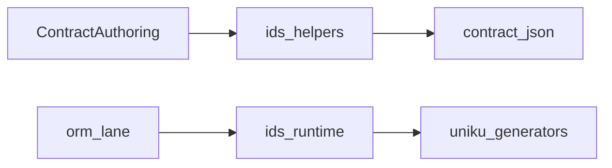

# @prisma-next/ids

ID generator helpers for Prisma Next contracts. This package provides ergonomic helpers that
produce contract-safe, JSON-serializable execution defaults for client-generated IDs, plus
runtime generation utilities that Prisma Next uses before sending data to adapters.

Each helper owns the column descriptor metadata associated with that generator, so callers only
pass options supported by the underlying `uniku` generator.

## Responsibilities

- Provide ID helper functions (`ulid`, `nanoid`, `uuidv7`, `uuidv4`, `cuid2`, `ksuid`) for contract authoring.
- Emit contract-safe execution defaults (no executable code stored in the contract).
- Generate values at runtime using `uniku` when mutation defaults require them.

## Dependencies

- `@prisma-next/contract` for shared contract types (`ExecutionMutationDefaultValue`).
- `uniku` for ID generator implementations.

## Architecture



## Usage

```ts
import { defineContract } from '@prisma-next/sql-contract-ts/contract-builder';
import { uuidv4 } from '@prisma-next/ids';

export const contract = defineContract()
  .table('user', (t) =>
    t.generated('id', uuidv4()).column('email', { type: { codecId: 'pg/text@1', nativeType: 'text' } }),
  )
  .build();
```

Pass generator options directly (for helpers whose `uniku` implementation supports them):

```ts
import { nanoid } from '@prisma-next/ids';

const idSpec = nanoid({ size: 12 });
```

## Generator-owned codec mapping

- Each helper binds its own descriptor internally (char-based SQL descriptors today).
- Different helpers can move to different codecs independently (for example `ulid` binary and `nanoid` char/varchar).
- `nanoid({ size })` also sets descriptor metadata to `character(size)` so contract shape matches generator output length.

Runtime usage:

```ts
import { generateId } from '@prisma-next/ids/runtime';

const value = generateId({ id: 'uuidv4' });
```

## Related docs

- [Data Contract](../../../docs/architecture%20docs/subsystems/1.%20Data%20Contract.md)
- [Query Lanes](../../../docs/architecture%20docs/subsystems/3.%20Query%20Lanes.md)
