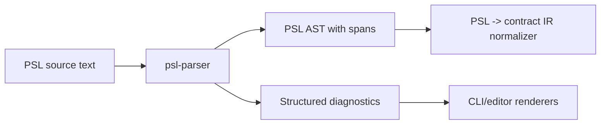

# @prisma-next/psl-parser

Reusable PSL parser for Prisma Next.

## Overview

`@prisma-next/psl-parser` parses Prisma Schema Language (PSL) source into a deterministic AST with source spans and stable machine-readable diagnostics. It is intentionally parser-only: normalization to contract IR and emit integration happen in downstream milestones/packages.

In the provider-based authoring model, PSL providers call this parser and then return `Result<ContractIR, ContractSourceDiagnostics>` to the framework emit pipeline.

## Responsibilities

- Parse PSL source text (`schema` + `sourceId`) with deterministic ordering.
- Return AST nodes with source spans for models, fields, enums, and `types { ... }`.
- Preserve raw PSL relation action tokens (for example `Cascade`) without semantic normalization.
- Return stable diagnostics (`code`, `message`, `span`, `sourceId`) for invalid and unsupported constructs.
- Enforce strict error behavior for unsupported syntax (no warning or best-effort mode).

## Public API

- `parsePslDocument(input)` in `src/parser.ts`
- Exported AST/diagnostic/span types in `src/types.ts`
- Subpath exports:
  - `@prisma-next/psl-parser/parser`
  - `@prisma-next/psl-parser/types`

## Dependencies

- **Depends on**
  - No cross-domain runtime dependencies.
- **Used by**
  - PSL normalization/emission tooling (next milestone)
  - Potential language tooling and external parsers that need spans + diagnostics

## Architecture

## Package Boundaries

- This package does not perform file I/O.
- This package does not normalize to contract IR.
- This package does not emit `contract.json` or `contract.d.ts`.

## Related Docs

- `docs/Architecture Overview.md`
- `docs/architecture docs/subsystems/2. Contract Emitter & Types.md`
- `docs/architecture docs/adrs/ADR 163 - Provider-invoked source interpretation packages.md`
- `projects/psl-contract-authoring/specs/Milestone 2 - PSL parser.spec.md`

