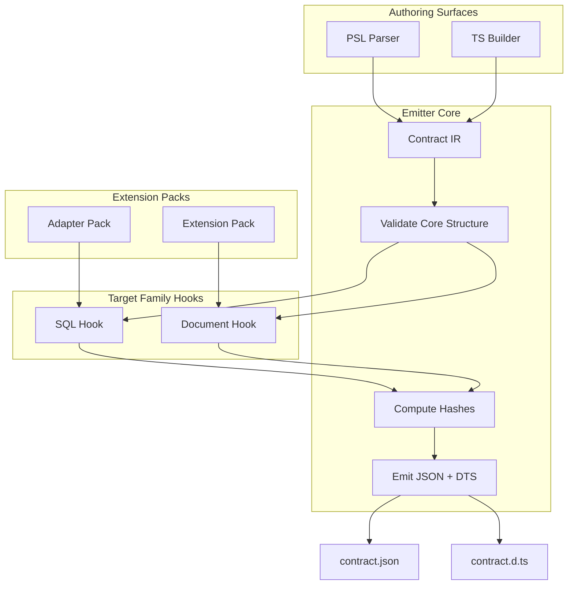

# @prisma-next/emitter

Contract emission engine that transforms authored data models into canonical JSON contracts and TypeScript type definitions.

## Overview

The emitter is the core of Prisma Next's contract-first architecture. It takes authored data models (from PSL or TypeScript builders) and produces two deterministic artifacts:

1. **`contract.json`** — Canonical JSON representation of the data contract with embedded `coreHash` and `profileHash`. Callers may add `_generated` metadata field to indicate it's a generated artifact (excluded from canonicalization/hashing).
2. **`contract.d.ts`** — TypeScript type definitions used by query builders and tooling (types-only, no runtime code). Includes warning header comments generated by target family hooks to indicate it's a generated file.

The emitter is target-family-agnostic and uses a pluggable hook system (`TargetFamilyHook`) to handle family-specific validation and type generation. This keeps the core thin while allowing SQL, Document, and other target families to extend emission behavior.

## Purpose

Provide a deterministic, verifiable representation of the application's data contract that downstream subsystems consume for planning, verification, and execution.

## Responsibilities

- **Parse**: Accept contract IR (Intermediate Representation) from authoring surfaces
- **Validate**: Core structure validation plus family-specific type and structure validation via hooks
- **Canonicalize**: Compute `coreHash` (schema meaning) and `profileHash` (capabilities/pins) from canonical JSON
- **Emit**: Generate `contract.json` and `contract.d.ts` with family-specific type generation
- **Manifest-Agnostic**: The emitter is completely manifest-agnostic. It receives pre-assembled `OperationRegistry`, `codecTypeImports`, `operationTypeImports`, and `extensionIds` from the CLI, not extension packs. Manifest parsing and assembly happens in family instances (e.g., `createSqlFamilyInstance` in `@prisma-next/family-sql`).

**Note**: The emitter does NOT normalize contracts. Normalization must happen in the contract builder when the contract is created. The emitter assumes contracts are already normalized (all required fields present, including `schemaVersion`, `models`, `relations`, `storage`, `extensions`, `capabilities`, `meta`, and `sources`). All fields can be empty objects/arrays, but they must be present.

**Non-goals:**
- Migration planning or execution
- Query compilation or execution
- Runtime capability discovery
- Policy enforcement

## Architecture



## Components

### Core Emitter (`emitter.ts`)
- Orchestrates validation, hashing, and type generation
- Returns contract JSON and TypeScript definitions as strings (no file I/O)
- Pure transformation function
- Accepts `targetFamily: TargetFamilyHook` as a required parameter (no global registry)

### Target Family Hook (`target-family.ts`)
- SPI interface (`TargetFamilyHook`) for extending emission with family-specific logic:
  - `validateTypes`: Validate type IDs against referenced extensions (receives `ValidationContext` with `operationRegistry` and `extensionIds`)
  - `validateStructure`: Family-specific structural validation
  - `generateContractTypes`: Generate `contract.d.ts` content (receives separate `codecTypeImports` and `operationTypeImports` arrays)
- Authoring surfaces determine which target family SPI to use based on the contract's `targetFamily` field and pass it directly to `emit()`
- No global registry or auto-registration - dependencies are explicit and passed directly
- **Manifest-Agnostic**: Hooks receive pre-assembled context (operation registry, type imports, extension IDs), not extension packs. Manifest parsing and assembly happens in the CLI layer.
- **Note**: `TargetFamilyHook`, `ValidationContext`, and `TypesImportSpec` types are defined in `@prisma-next/contract/types` (shared plane) and re-exported from this package for backward compatibility.

### Hashing (`hashing.ts`)
- `computeCoreHash`: SHA-256 of schema structure (models, storage, relations)
- `computeProfileHash`: SHA-256 of capabilities and adapter pins

### Canonicalization (`canonicalization.ts`)
- `canonicalizeContract`: Normalizes contract IR into stable JSON string for hashing
- Excludes `_generated` metadata field from canonicalization to ensure determinism
- Sorts object keys, omits default values, and orders top-level fields consistently

**Note**: Extension pack loading and manifest parsing are CLI-only responsibilities. The emitter does not export pack loading functions. Import `loadExtensionPacks` from `@prisma-next/cli` or use the CLI's `pack-loading.ts` module directly. Manifest types (`ExtensionPack`, `ExtensionPackManifest`, `OperationManifest`) are defined in `@prisma-next/control-plane/pack-manifest-types`.

**Note**: `TargetFamilyHook`, `ValidationContext`, and `TypesImportSpec` types are defined in `@prisma-next/contract/types` (shared plane) to allow both migration-plane (emitter) and shared-plane (control-plane) packages to import them without violating dependency rules. These types are re-exported from this package for backward compatibility.

## Dependencies

- **`arktype`**: Runtime type validation for manifests

## Package Location

This package is part of the **framework domain**, **tooling layer**, **migration plane**:
- **Domain**: framework (target-agnostic)
- **Layer**: tooling
- **Plane**: migration
- **Path**: `packages/framework/tooling/emitter`

## Related Subsystems

- **[Contract Emitter & Types](../../../../docs/architecture%20docs/subsystems/2.%20Contract%20Emitter%20&%20Types.md)**: Detailed subsystem specification
- **[Data Contract](../../../../docs/architecture%20docs/subsystems/1.%20Data%20Contract.md)**: Contract structure and hashing

## Related ADRs

- [ADR 004 - Core Hash vs Profile Hash](../../../../docs/architecture%20docs/adrs/ADR%20004%20-%20Core%20Hash%20vs%20Profile%20Hash.md)
- [ADR 006 - Dual Authoring Modes](../../../../docs/architecture%20docs/adrs/ADR%20006%20-%20Dual%20Authoring%20Modes.md)
- [ADR 007 - Types Only Emission](../../../../docs/architecture%20docs/adrs/ADR%20007%20-%20Types%20Only%20Emission.md)
- [ADR 010 - Canonicalization Rules](../../../../docs/architecture%20docs/adrs/ADR%20010%20-%20Canonicalization%20Rules.md)
- [ADR 097 - Tooling runs on canonical JSON only](../../../../docs/architecture%20docs/adrs/ADR%20097%20-%20Tooling%20runs%20on%20canonical%20JSON%20only.md)

## Usage

```typescript
import { emit } from '@prisma-next/emitter';
import type { ContractIR, EmitOptions } from '@prisma-next/emitter';
import { createOperationRegistry } from '@prisma-next/operations';

// Determine target family SPI based on target family
import { sqlTargetFamilyHook } from '@prisma-next/sql-contract-emitter';

// Emit contract
const ir: ContractIR = {
  schemaVersion: '1',
  targetFamily: 'sql',
  target: 'postgres',
  // ... contract structure
};

// Pass pre-assembled context to emit() (pack loading happens in CLI layer)
const result = await emit(ir, {
  outputDir: './dist',
  operationRegistry: createOperationRegistry(), // Pre-assembled from packs
  codecTypeImports: [], // Extracted from packs (codec types)
  operationTypeImports: [], // Extracted from packs (operation types)
  extensionIds: ['postgres', 'pg'], // Extracted from packs
}, sqlTargetFamilyHook);

// result.contractJson: string (JSON) - canonical JSON without _generated metadata
// result.contractDts: string (TypeScript definitions) - includes warning header
// result.coreHash: string
// result.profileHash?: string
```

**Note**: The emitter returns canonical JSON without `_generated` metadata. Callers (e.g., CLI) may add `_generated` metadata to the JSON before writing to disk. The `_generated` field is excluded from canonicalization/hashing to ensure determinism.

## Test Utilities

When writing tests that create `ContractIR` objects, use the factory function from test utilities:

```typescript
import { createContractIR } from './test/utils';

const ir = createContractIR({
  storage: {
    tables: {
      user: {
        columns: {
          id: { codecId: 'pg/int4@1', nativeType: 'int4', nullable: false },
        },
      },
    },
  },
});
```

This ensures all required fields are present with sensible defaults. See `.cursor/rules/use-contract-ir-factories.mdc` for guidelines.

## Exports

- `.`: Main emitter API (`emit`, types)
- **Note**: Pack loading functions (`loadExtensionPacks`, `loadExtensionPackManifest`) are CLI-only and not exported from the emitter. Import them from `@prisma-next/cli` or use the CLI's `pack-loading.ts` module directly.

