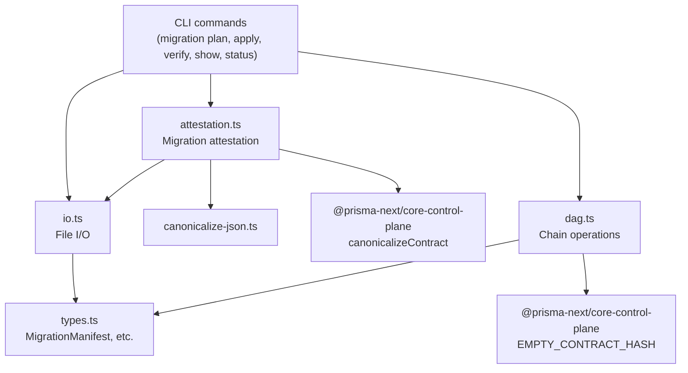

# @prisma-next/migration-tools

On-disk migration persistence, attestation, and chain reconstruction for Prisma Next.

## Responsibilities

- **Types**: Define the on-disk migration format (`MigrationManifest`, `MigrationOps`, `MigrationPackage`, `MigrationGraph`)
- **I/O**: Read and write migration packages to/from disk (`migration.json` + `ops.json`)
- **Attestation**: Compute and verify content-addressed migration IDs for tamper detection
- **Chain reconstruction**: Reconstruct and navigate migration history (path finding, latest migration detection, cycle/orphan detection)

## Attestation framing

`computeMigrationId` in `attestation.ts` uses explicit framing:

1. Canonicalize migration manifest metadata, ops, and embedded contracts.
2. Hash each canonical part independently with SHA-256.
3. Hash the canonical JSON tuple of those part hashes.

This avoids delimiter-ambiguity and ensures `migrationId` commits to the exact 4-part tuple.

## Ops validation boundary

`readMigrationPackage` performs intentionally shallow `ops.json` validation in `io.ts`:

- validates envelope fields (`id`, `label`, `operationClass`)
- does not fully validate operation-specific payload shape

Full semantic validation happens in target/family migration planners and runners at execution/planning time.

## Architecture



## Dependencies

| Package | Why |
|---|---|
| `@prisma-next/contract` | `ContractIR` type for embedded contracts in manifests |
| `@prisma-next/core-control-plane` | `MigrationPlanOperation` types, `EMPTY_CONTRACT_HASH`, `canonicalizeContract` |
| `arktype` | Runtime shape validation for `migration.json` and `ops.json` |
| `@prisma-next/utils` | Workspace utility dependency (currently no direct runtime imports in this package) |
| `pathe` | Cross-platform path manipulation |

### Dependents

- `@prisma-next/cli` (M3) — CLI commands consume these functions

## Export Subpaths

| Subpath | Contents |
|---|---|
| `./types` | `MigrationManifest`, `MigrationOps`, `MigrationPackage`, `MigrationGraph`, `MigrationChainEntry`, `MigrationHints` |
| `./io` | `writeMigrationPackage`, `readMigrationPackage`, `readMigrationsDir`, `formatMigrationDirName` |
| `./attestation` | `computeMigrationId`, `attestMigration`, `verifyMigration` |
| `./dag` | `reconstructGraph`, `findLeaf`, `findPath`, `detectCycles`, `detectOrphans` |

## On-Disk Format

Each migration is a directory containing two files:

```
migrations/
  20260225T1430_add_users/
    migration.json    # MigrationManifest
    ops.json          # MigrationPlanOperation[]
```

See [ADR 028](../../../docs/architecture%20docs/adrs/ADR%20028%20-%20Migration%20Structure%20%26%20Operations.md) and [ADR 001](../../../docs/architecture%20docs/adrs/ADR%20001%20-%20Migrations%20as%20Edges.md) for design rationale.

## Commands

```bash
pnpm build       # Build with tsdown
pnpm test        # Run tests
pnpm typecheck   # Type-check
```
