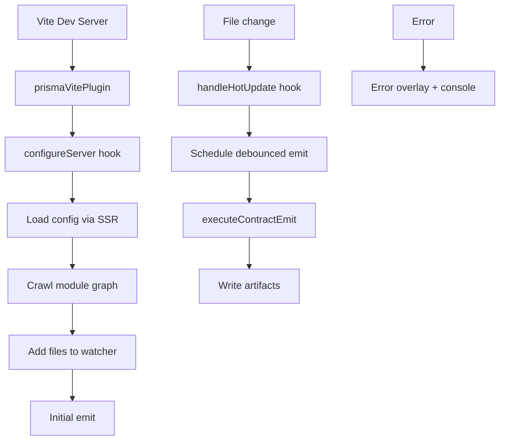

# @prisma-next/vite-plugin-contract-emit

Vite plugin for automatic Prisma Next contract artifact emission during development.

## Overview

This plugin integrates with Vite's dev server to automatically emit contract artifacts (`contract.json` and `contract.d.ts`) when you start the server and whenever your contract authoring files change.

## Features

- **Emit on startup**: Emits contract artifacts when the Vite dev server starts
- **Watch mode**: Re-emits on changes to the config file and its transitive imports
- **Debounce**: Configurable debounce prevents rapid re-emission during rapid edits
- **Last-change-wins**: Overlapping emit requests are cancelled to avoid stale results
- **Error overlay**: Emission failures are surfaced via Vite's error overlay
- **Console logging**: Compact success/error messages with optional debug output

## Installation

```bash
pnpm add -D @prisma-next/vite-plugin-contract-emit vite
```

## Usage

```ts
// vite.config.ts
import { defineConfig } from 'vite';
import { prismaVitePlugin } from '@prisma-next/vite-plugin-contract-emit';

export default defineConfig({
  plugins: [prismaVitePlugin('prisma-next.config.ts')],
});
```

## API

### `prismaVitePlugin(configPath, options?)`

Creates a Vite plugin configured to emit contract artifacts.

#### Parameters

- `configPath: string` — Path to your `prisma-next.config.ts` file (relative to Vite root)
- `options?: PrismaVitePluginOptions` — Optional configuration

#### Options

```ts
interface PrismaVitePluginOptions {
  debounceMs?: number;  // Debounce delay in ms (default: 150)
  logLevel?: 'silent' | 'info' | 'debug';  // Log verbosity (default: 'info')
}
```

| Option | Default | Description |
|--------|---------|-------------|
| `debounceMs` | `150` | Delay before re-emitting after file changes |
| `logLevel` | `'info'` | `'silent'`: no output, `'info'`: success/errors, `'debug'`: verbose |

## How It Works

1. **On server start**: The plugin loads your config module through Vite's SSR loader
2. **Module graph crawling**: It crawls the module graph to find all transitive imports
3. **Watch setup**: All discovered files are added to Vite's watcher
4. **Initial emit**: The contract is emitted immediately on server start
5. **Hot updates**: When any watched file changes, a debounced re-emit is triggered

## Architecture



## Dependencies

- **@prisma-next/cli**: Uses the control-api `executeContractEmit` operation
- **vite**: Peer dependency (>=5.0.0)

## Example

See `examples/prisma-next-demo` for a working example with:
- `vite.config.ts` configured with the plugin
- `pnpm dev` script to start Vite
- `prisma/contract.ts` as the contract authoring source

Run `pnpm dev` in the demo, edit `prisma/contract.ts`, and watch the artifacts regenerate.

## Related

- [ADR 032 — Dev Auto-Emit Integration](../../../docs/architecture%20docs/adrs/)
- [ADR 008 — Dev Auto-Emit, CI Explicit Emit](../../../docs/architecture%20docs/adrs/)
- [Subsystem: Contract Emitter & Types](../../../docs/architecture%20docs/subsystems/)
