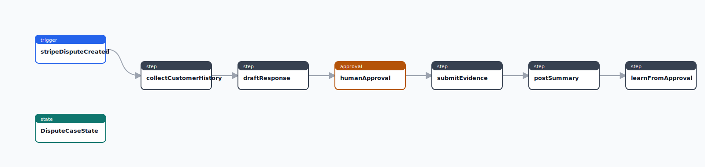
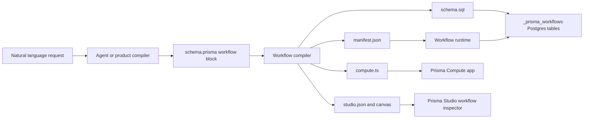
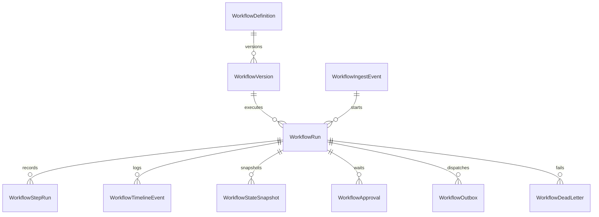
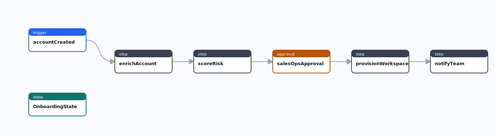

# Prisma Workflows

Prisma Workflows is the durable automation layer for Prisma Next. It gives AI builders and product teams a typed target for workflows that look like n8n or Zapier automations, but run as code with Prisma's contract-first model, Postgres-backed state, Studio inspection, and Prisma Compute deployment.

The target experience is:

> Monitor new Stripe disputes. For each dispute, collect customer history from HubSpot, order history from Shopify, prior tickets from Zendesk, and payment metadata from Stripe. Draft a response, ask a human for approval if dispute value exceeds $500, then submit evidence and post a summary to Slack. Keep a dispute_cases table and learn from approved responses.

An app builder can translate that natural-language request into a native Prisma `workflow` block, generate a typed manifest, deploy a Compute app, and inspect every run in Studio.



## What This Ships

- Native `workflow` blocks in `schema.prisma`.
- Compatibility with ordinary Prisma `generator`, `datasource`, and `model` blocks in the same schema file.
- Parser and printer support for `trigger`, `state`, `step`, `approval`, `condition`, and `timer` workflow members. `parallel` is parsed for forward compatibility but rejected by the compiler until branch/join runtime semantics are executable.
- `@prisma-next/workflows` compiler, runtime, generated-client helpers, connector SDK, testing helpers, mock connectors, and Studio model/rendering.
- Content-addressed workflow versions plus durable Postgres DDL and `PostgresWorkflowStore` for the `_prisma_workflows` runtime schema.
- `prisma-next workflow` CLI commands for init, compile, generate, dev, test, ingest, inspect, replay, backfill, DDL, and Compute deploy artifact generation.
- `generator workflows` support so output paths and the runtime table schema can live in `schema.prisma`.
- Static Studio support through generated `studio.json`, `studio.html`, SVG canvas files, execution overlays, and timeline frames.
- Two complete mocked examples:
  - [`examples/workflow-stripe-disputes`](../../../../examples/workflow-stripe-disputes)
  - [`examples/workflow-customer-onboarding`](../../../../examples/workflow-customer-onboarding)

## Architecture



The workflow definition is source-of-truth. Generated artifacts are build outputs:

- `manifest.json` is the durable workflow graph.
- `index.ts` exposes `manifest`, `workflowRuntime()`, `workflowClient()`, and a `workflows()` Prisma Client extension shape.
- `schema.sql` creates runtime tables.
- `compute.ts` exposes a Compute HTTP app.
- `studio.json`, `studio.html`, and SVG files drive Studio inspection.

## Native Schema Syntax

```prisma
generator client {
  provider = "prisma-client-js"
}

datasource db {
  provider = "postgresql"
  url = env("DATABASE_URL")
}

generator workflows {
  provider = "prisma-workflows"
  output = "./generated/workflows"
  schema = "_prisma_workflows"
}

model DisputeCase {
  id String @id
  stripeDisputeId String
  amountCents Int
  status String
}

workflow DisputeEvidence {
  trigger stripeDisputeCreated {
    source = "stripe"
    event = "charge.dispute.created"
    dedupeBy = "event.data.object.id"
  }

  state DisputeCaseState {
    disputeId String @id
    customerId String
    amount Int
    currency String
    reason String
    hubspotHistory Json?
    shopifyOrders Json?
    zendeskTickets Json?
    stripeMetadata Json?
    draftResponse String?
    evidenceId String?
  }

  step collectCustomerHistory {
    run = "./src/steps/collect-customer-history.ts"
    checkpoint = true
    retry = { maxAttempts: 3, backoff: "exponential" }
  }

  step draftResponse {
    run = "./src/steps/draft-response.ts"
    checkpoint = true
    budget = { maxUsd: 1.25, maxTokens: 2000, timeout: "45s" }
  }

  approval humanApproval {
    when = "state.amount > 50000"
    assignees = ["role:finance_ops"]
    timeout = "48h"
    onApprove = submitEvidence
  }

  step submitEvidence {
    run = "./src/steps/submit-evidence.ts"
    checkpoint = true
    sideEffects = "external"
    idempotency = "state.disputeId"
  }

  step postSummary {
    run = "./src/steps/post-summary.ts"
    sideEffects = "external"
    idempotency = "state.disputeId"
  }
}
```

Approval outcome targets are branch entry points in the current linear MVP. Declare each outcome branch as a uniquely targeted, equal-sized contiguous group of steps, then place the shared continuation after those groups; the runtime skips the unchosen groups after `onApprove`, `onReject`, or `onTimeout`. A skipped approval follows the `onApprove`/default continuation because no human decision is required. If a continuation must skip an unchosen branch, provide enough explicit outcome targets for the runtime to prove the equal branch span; single-target layouts and two-target layouts that would require guessing the tail branch fail closed instead of being guessed. Explicit join markers and unequal branch spans are future branch/join work, not part of this MVP.

Replay preserves that branch decision when the replay point is inside an approval outcome branch. Fork and resume replay append a replay-local approval outcome marker for the containing branch, so continuing from `approvedAudit` still skips `rejectedPath`, `rejectedAudit`, `timeoutPath`, and `timeoutAudit`. Forked replay runs are not queued until the marker is written, resume writes the marker before the replay-resume event, and unsafe external replay preflight ignores unchosen branch ranges that the marker will skip.

Schema design uses Option A from the PRD: `workflow` is a native top-level PSL block, not a sidecar DSL. That makes workflow definitions visible to the same agents, formatters, tests, and future Studio surfaces as the rest of the data contract. The parser preserves existing Prisma blocks and the printer keeps workflow member order stable, so a schema can mix data models and workflows without losing the author's layout.

The `generator workflows` block is optional, but recommended for applications. `output` controls where `manifest.json`, `index.ts`, `schema.sql`, `studio.json`, and `compute.ts` are written relative to the schema file. `schema` controls the Postgres schema used by the generated durable runtime DDL. CLI flags still override these defaults for one-off commands.

## Compile And Generate

Start from an empty project:

```bash
prisma-next workflow init --schema prisma/schema.prisma
prisma-next workflow generate --schema prisma/schema.prisma
prisma-next workflow test --schema prisma/schema.prisma --payload prisma/workflows/fixtures/stripe-dispute-created.json --mock
prisma-next workflow inspect --schema prisma/schema.prisma --studio .prisma-next/workflows/studio.html
```

`workflow init` is non-destructive by default: it creates `prisma/schema.prisma` when missing, appends the starter workflow to an existing schema that has no `workflow` blocks, keeps existing workflow schemas intact, and writes a matching Stripe dispute fixture for local tests. Use `--force` only when you want to overwrite the starter schema and fixture.

```bash
pnpm --filter @prisma-next/example-workflow-stripe-disputes workflow:generate
```

Equivalent direct CLI:

```bash
prisma-next workflow generate \
  --schema examples/workflow-stripe-disputes/src/schema.prisma \
  --studio examples/workflow-stripe-disputes/studio/workflows.html \
  --svg examples/workflow-stripe-disputes/studio/dispute-evidence.svg
```

Generated files:

```text
src/generated/workflows/
  manifest.json
  index.ts
  index.d.ts
  schema.sql
  studio.json
  compute.ts
studio/
  workflows.html
  dispute-evidence.svg
```

The generated `index.ts` includes workflow-specific types and a Prisma Client extension shape:

```ts
import { workflowClient, workflows } from './generated/workflows';

type WorkflowName = 'DisputeEvidence';

const extension = workflows({ steps, store });
// prisma.$extends(extension) exposes prisma.workflow.*

const client = workflowClient({ steps, store });
await client.enqueue('DisputeEvidence', { disputeId: 'du_123' });
await client.workflows.DisputeEvidence.enqueue({ disputeId: 'du_456' });
const run = await client.workflows.DisputeEvidence.inspect('run_123', {
  include: {
    steps: true,
    timeline: true,
    approvals: true,
    outbox: true,
    deadLetters: true,
  },
});
await client.workflows.DisputeEvidence.replay('run_123', { mode: 'recorded' });
```

The generated manifest literal in `index.ts` is stable and pretty-printed so code review can inspect workflow graph changes without opening `manifest.json`.

## Local Development

`workflow test`, `workflow ingest`, and `workflow replay` load the modules referenced by each step's `run` path by default. Use `--mock` only when testing a scaffold before step modules exist.

```bash
prisma-next workflow test --schema prisma/schema.prisma --payload fixtures/dispute.json
prisma-next workflow test --schema prisma/schema.prisma --payload fixtures/dispute.json --mock
```

`workflow dev` compiles the schema, writes generated artifacts, loads step modules, and starts a local HTTP app backed by the in-memory runtime. It exposes the same routes as the generated Compute app, plus a worker tick that drains queued runs and due timers.

```bash
prisma-next workflow dev --schema prisma/schema.prisma --port 5555
curl -X POST http://127.0.0.1:5555/api/prisma-workflows/ingest/stripe \
  -H 'content-type: application/json' \
  -d '{"type":"charge.dispute.created","payload":{"id":"evt_123"}}'
curl -X POST http://127.0.0.1:5555/api/prisma-workflows/run
curl http://127.0.0.1:5555/api/prisma-workflows/studio
```

Use `--once` for CI or docs generation when you want dev artifacts without starting the server:

```bash
prisma-next workflow dev --schema prisma/schema.prisma --once --json
```

## Runtime

The runtime is intentionally small and embeddable. Production stores implement `WorkflowStore`; tests and examples can use `InMemoryWorkflowStore`.

```ts
import { createWorkflowRuntime, InMemoryWorkflowStore } from '@prisma-next/workflows/runtime';
import { manifest } from './generated/workflows';
import { createDisputeWorkflowHandlers } from './handlers';
import { createMockDisputeProviders } from './mock-providers';

const runtime = createWorkflowRuntime({
  manifest,
  store: new InMemoryWorkflowStore(),
  steps: createDisputeWorkflowHandlers(createMockDisputeProviders()),
});

await runtime.ingest({
  source: 'stripe',
  eventType: 'charge.dispute.created',
  payload: stripeWebhookPayload,
});

const [run] = await runtime.runUntilIdle();

if (run?.status === 'waiting_for_approval') {
  const approval = (await runtime.snapshot()).approvals[0]!;
  await runtime.approve(approval.id, {
    approvedBy: 'agent@example.com',
    reason: 'Evidence matches fulfillment history.',
  });
}
```

The runtime persists these concepts:



Execution is intentionally at-least-once, with token-fenced durable writes. Ingest and run creation happen in one store operation so concurrent webhooks with the same dedupe key create one durable event and one run; if multiple workflows match the same event without an explicit ingest dedupe key, their `dedupeBy` expressions must agree. Workers claim queued, paused, waiting, or crashed `running` runs through leases; each lease acquisition gets a fresh token, handlers heartbeat that exact token while they run, and every worker-owned write checks the active token before mutating run, step, timeline, snapshot, timer, approval, outbox, or dead-letter rows. Completed step outputs are restored before a handler is invoked again only within the current replay epoch, so a crash after a successful step does not repeat that step by default while replay-resume can still re-execute the requested portion of history. The `$prismaWorkflow` state key is reserved for runtime metadata and is stripped from user input/output before state merges, and handlers receive cloned user-visible `state`/`input` objects, so application code cannot accidentally mutate the runtime's canonical replay epoch metadata. Retry budgets are also evaluated within the current replay epoch while attempt numbers remain globally increasing for auditability. Replay seed lookup fails closed when a non-first node has no step, timer, approval, or snapshot state in the current replay epoch; it never falls back to final run state for an earlier replay point.

External effects run through `WorkflowOutbox`. A `sideEffects = "external"` step first records a pending intent, pauses the run, and lets the worker loop claim and dispatch that outbox entry under its own lease. The runtime advances the owning run before marking the outbox `dispatched`, so an interrupted success leaves a claimable pending intent that can be reconciled from the completed step. Failed dispatches retry from `retry.maxAttempts` and reconcile pending intents from terminal runs before dead-lettering. Duplicate runs waiting on the same destination plus idempotency key are resumed from the dispatched output, including after a crash between outbox dispatch and waiter resume. Replay-resume from an idempotent external step can also reuse an earlier-epoch dispatched outbox only when that outbox is tied to a completed prior step; older pending or unverifiable rows fail closed instead of dispatching the same effect again. Malformed or manual outbox rows are dead-lettered without advancing the wrong run; if such a row is the only thing parking a run, the run is requeued so it can create a fresh valid intent. Replay refuses any unsafe external step reachable from the replay point unless the step has an idempotency key or the caller passes explicit confirmation. Approval `timeout`, `onTimeout`, timer waits, approval reconciliation, and outbox waiters are scoped to the current replay epoch, and runs replay against the immutable workflow version they were created with.

## Durable Tables

Print the runtime schema:

```bash
prisma-next workflow ddl --schema prisma/schema.prisma > workflows.sql
```

`workflow ddl` reads the `generator workflows` block when a schema is supplied. `--schema-name` overrides the generator value:

```bash
prisma-next workflow ddl --schema prisma/schema.prisma --schema-name workflow_runtime > workflows.sql
```

The DDL creates `_prisma_workflows` with:

- `WorkflowDefinition`
- `WorkflowVersion`
- `WorkflowIngestEvent`
- `WorkflowRun`
- `WorkflowStepRun`
- `WorkflowTimelineEvent`
- `WorkflowStateSnapshot`
- `WorkflowTriggerMatch`
- `WorkflowLease`
- `WorkflowTimer`
- `WorkflowApproval`
- `WorkflowOutbox`
- `WorkflowDeadLetter`
- `WorkflowConnectorAccount`
- `WorkflowConnectorCursor`
- `WorkflowCanvasLayout`
- `WorkflowArtifact`

The package test suite applies this DDL to a local `@prisma/dev` Postgres database.

Use `PostgresWorkflowStore` in a real app:

```ts
import { PostgresWorkflowStore, createWorkflowRuntime } from '@prisma-next/workflows/runtime';
import { manifest } from './generated/workflows';

const connectionString = process.env['DATABASE_URL'];
if (!connectionString) {
  throw new Error('DATABASE_URL is required for the workflow store.');
}

const store = new PostgresWorkflowStore({
  connectionString,
  // Optional. Generated Compute apps set this automatically from generator workflows { schema = ... }.
  schemaName: 'workflow_runtime',
  autoMigrate: true,
});

const runtime = createWorkflowRuntime({ manifest, store, steps });
```

Durable CLI commands use the same store when `--database-url` or `DATABASE_URL` is present:

```bash
prisma-next workflow inspect run_123 --schema prisma/schema.prisma --database-url "$DATABASE_URL" --json
prisma-next workflow replay run_123 --schema prisma/schema.prisma --database-url "$DATABASE_URL" --mode recorded
prisma-next workflow replay run_123 --schema prisma/schema.prisma --database-url "$DATABASE_URL" --mode reexecute --confirm-side-effects
prisma-next workflow backfill --schema prisma/schema.prisma --database-url "$DATABASE_URL" --payload fixtures/dispute.json --run
```

Without a run id, `workflow inspect` still opens or writes the static generated Studio inspector. `workflow backfill` prints a plan by default, including when `--payload` is supplied. Add `--run` with `--database-url` or `DATABASE_URL` to persist the payload through durable ingest and drain the worker loop.

## Connector SDK

Prisma Workflows owns connector contracts, not a hosted marketplace. The SDK captures events, actions, syncs, auth metadata, fixtures, idempotency hints, and MCP-friendly tool descriptors.

```ts
import {
  connectorManifest,
  defineAction,
  defineConnector,
  defineEvent,
  defineSync,
} from '@prisma-next/workflows/connector-sdk';

export const stripe = defineConnector({
  id: 'stripe',
  displayName: 'Stripe',
  auth: { type: 'apiKey', secretRef: 'STRIPE_SECRET_KEY' },
  events: {
    'charge.dispute.created': defineEvent({
      verify: async ({ rawBody, headers, secrets }) => {
        const signature = headers['stripe-signature'];
        return Boolean(rawBody && signature && secrets['STRIPE_WEBHOOK_SECRET']);
      },
      dedupeKey: ({ event, account }) => `stripe:${account?.id ?? 'default'}:${event.id}`,
      normalize: ({ event }) => ({
        type: event.type,
        externalId: event.id,
        subject: event.data.object.id,
        payload: event,
      }),
    }),
  },
  actions: {
    submitDisputeEvidence: defineAction({
      idempotency: 'input.idempotencyKey',
      run: async ({ input }) => input,
    }),
  },
  syncs: {
    disputes: defineSync({
      cursor: 'updated',
      run: async ({ cursor }) => ({ cursor }),
    }),
  },
});

const manifest = connectorManifest(stripe);
```

The generated HTTP app preserves the raw request body for connector verification, then calls connector `dedupeKey` and `normalize` before durable ingest. Durable ingest stores `rawPayload` as `{ rawBody, parsedBody }`, so Stripe-style signature debugging and audit trails can compare the exact byte string that was verified while still exposing parsed JSON to Studio. Generated `compute.ts` auto-imports local connector modules from `connectors/<id>.ts` or `src/connectors/<id>.ts` when present, and exports `createApp({ connectors, secrets })` so deployment code can provide hosted connector bindings. A failed connector `verify` returns `401` and no ingest event is written. A successful verified webhook records `signatureVerified = true`, persists the normalized payload while preserving the raw payload for audit, and returns after durable ingest. Execution happens through `POST /api/prisma-workflows/run`, so webhook providers get a fast acknowledgement and slow work runs through the worker path.

## Studio

Studio support is implemented as a data model plus generated static inspector today. It gives the future Prisma Studio project a stable shape to consume while making the feature visually testable immediately.

```ts
import { buildWorkflowStudioModel, renderWorkflowStudioHtml } from '@prisma-next/workflows/studio';
import { manifest } from './generated/workflows';

const model = buildWorkflowStudioModel(manifest, await runtime.snapshot());
const html = renderWorkflowStudioHtml(manifest, await runtime.snapshot());
```

The Studio model includes:

- definition canvas from the immutable workflow version;
- live execution overlays for node status, attempts, durations, errors, input/output refs, and state diffs;
- timeline frames for time-travel inspection;
- ingest events, approvals, outbox entries, and dead letters.
- a generated runtime contract in `studio.json` with datasets (`ingestEvents`, `runs`, `steps`, `timeline`, `stateSnapshots`, `approvals`, `outbox`, `deadLetters`) and endpoint names (`snapshot`, `inspectRun`, `approve`, `reject`, `replay`, `worker`).

Second example canvas:



## Prisma Compute

`workflow generate` writes a Compute entrypoint that imports the step modules from the schema, uses `PostgresWorkflowStore` when `DATABASE_URL` is present, passes the generator's custom workflow schema name when configured, and exposes runtime-backed HTTP routes:

```ts
import {
  createWorkflowHttpApp,
  PostgresWorkflowStore,
  type WorkflowStepHandler,
} from '@prisma-next/workflows/runtime';
import * as collectCustomerHistory from '../../steps/collect-customer-history';
import { manifest } from './index';

const steps: Record<string, WorkflowStepHandler> = {
  collectCustomerHistory: collectCustomerHistory.default,
};
const connectionString = process.env['DATABASE_URL'];
const store = connectionString
  ? new PostgresWorkflowStore({ connectionString, schemaName: 'workflow_runtime' })
  : undefined;

export const app = createWorkflowHttpApp({
  manifest,
  steps,
  ...(store ? { store } : {}),
});
export default app;
```

The HTTP app handles:

- `GET /api/prisma-workflows/studio`
- `GET /api/prisma-workflows/inspect/:runId?include=steps,timeline,stateSnapshots,approvals,outbox,deadLetters`
- `POST /api/prisma-workflows/ingest/:source/:accountId?`
- `POST /api/prisma-workflows/approve/:approvalId`
- `POST /api/prisma-workflows/reject/:approvalId`
- `POST /api/prisma-workflows/replay/:runId`
- `POST /api/prisma-workflows/run`

`POST /api/prisma-workflows/ingest/:source/:accountId?` returns `202` for newly queued runs and `200` for duplicate events. It does not execute steps inline. `POST /api/prisma-workflows/run` drains queued runs, due timers, expired approvals, and pending outbox dispatches for worker and local-dev loops.

Use:

```bash
prisma-next workflow deploy --schema prisma/schema.prisma
```

That command writes `compute.ts` and prints the deployment command shape expected by a Prisma Compute app:

```bash
prisma app deploy src/generated/workflows/compute.ts
```

## CLI Reference

```bash
prisma-next workflow init --schema prisma/schema.prisma
prisma-next workflow compile --schema prisma/schema.prisma
prisma-next workflow generate --schema prisma/schema.prisma
prisma-next workflow ddl --schema prisma/schema.prisma
prisma-next workflow dev --schema prisma/schema.prisma
prisma-next workflow test --schema prisma/schema.prisma --payload fixtures/event.json
prisma-next workflow ingest --schema prisma/schema.prisma --payload fixtures/event.json
prisma-next workflow inspect --schema prisma/schema.prisma --studio .prisma-next/workflows/studio.html
prisma-next workflow inspect run_123 --schema prisma/schema.prisma --database-url "$DATABASE_URL" --json
prisma-next workflow replay --schema prisma/schema.prisma --payload fixtures/event.json
prisma-next workflow replay run_123 --schema prisma/schema.prisma --database-url "$DATABASE_URL" --mode recorded
prisma-next workflow backfill --schema prisma/schema.prisma --workflow DisputeEvidence --since 2026-01-01
prisma-next workflow backfill --schema prisma/schema.prisma --database-url "$DATABASE_URL" --payload fixtures/event.json --run
prisma-next workflow deploy --schema prisma/schema.prisma
```

Replay modes are explicit in the runtime API:

```ts
await runtime.replay('run_123', { mode: 'recorded', fromStep: 'draftResponse' });
await runtime.replay('run_123', { mode: 'resume', fromStep: 'submitEvidence' });
await runtime.replay('run_123', {
  mode: 'reexecute',
  fromStep: 'submitEvidence',
  confirmSideEffects: true,
});
```

## Testing

Package tests:

```bash
pnpm --filter @prisma-next/workflows test
pnpm --filter @prisma-next/workflows typecheck
pnpm --filter @prisma-next/workflows build
```

Parser and printer tests:

```bash
pnpm --filter @prisma-next/psl-parser test
pnpm --filter @prisma-next/psl-printer test
```

Example tests:

```bash
pnpm --filter @prisma-next/example-workflow-stripe-disputes test
pnpm --filter @prisma-next/example-workflow-stripe-disputes workflow:test
pnpm --filter @prisma-next/example-workflow-customer-onboarding test
pnpm --filter @prisma-next/example-workflow-customer-onboarding workflow:test
```

Local database test:

```bash
pnpm --filter @prisma-next/workflows test -- test/dev-database.test.ts
```

That test starts `@prisma/dev`, connects with `pg`, applies `renderWorkflowSqlDdl()`, and verifies the runtime tables exist.

## Product Positioning

Prisma Workflows is not trying to clone the n8n editor. It provides the durable app layer an n8n competitor needs:

- workflows are typed code and schema, not opaque JSON blobs;
- state and run history are queryable Postgres data;
- connector state, fenced leases, timers, approvals with timeouts, outbox dispatch, and dead letters are first-class runtime tables;
- Studio can inspect definitions, runs, steps, approvals, events, and failures;
- generated Compute apps can receive webhook events and run workers close to the data.

That lets a product build a natural-language automation UI on top without giving up the operational properties expected from a production data layer.
